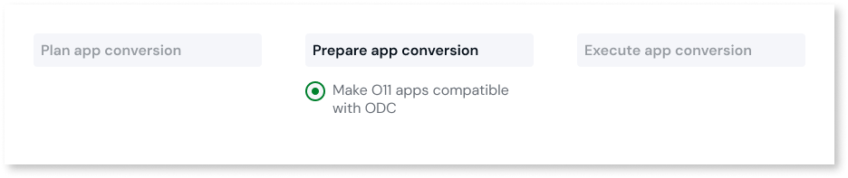
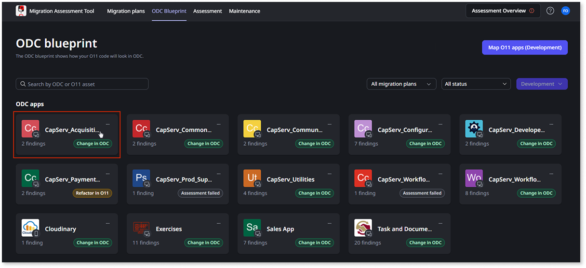
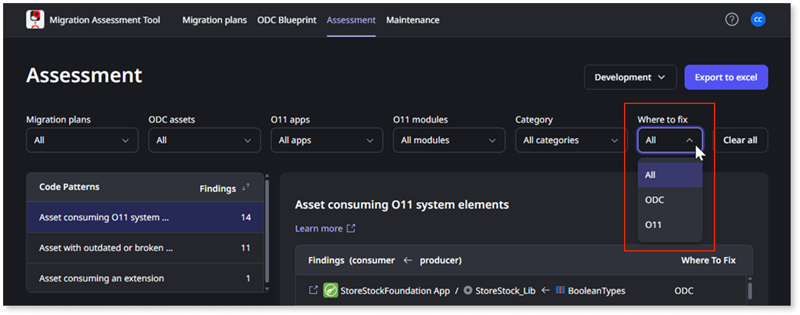
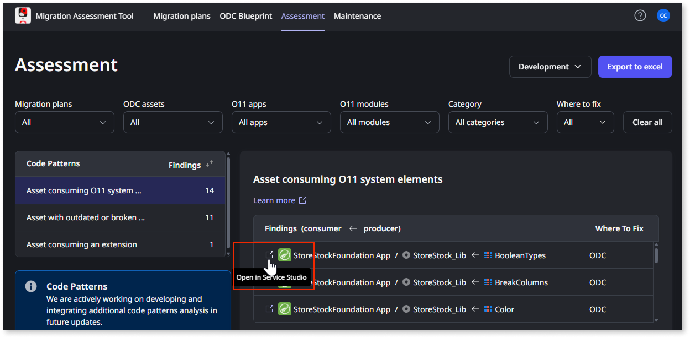

# Make O11 apps compatible with ODC

Once you've mapped your O11 apps into your future ODC architecture, you can use the Conversion Assessment Tool to understand which code adjustments are required to make them ready for ODC.

Grouping small sets of apps in [conversion plans](../plan/plan-define-migration-plans.md) enables development teams of different app domains to focus only on the adjustments of their apps.

## Prerequisites

Before you start, ensure the following:

* The Conversion Assessment Tool [is set up](../setup-assessement-tool.md).

* The O11 to ODC architecture [is mapped](../plan/plan-map-apps.md) in the Conversion Assessment Tool.

* The mapping of your O11 apps [has been adjusted](../plan/plan-assess-refactor.md) to ODC architecture.

## Adjust O11 apps for ODC conversion

Your [LifeTime permissions for the Development environment](../plan/mat-permissions.md#assessment-findings) determine which patterns and findings are available to you in the Conversion Assessment Tool.

To adjust your O11 apps and make them ODC-compatible, follow these steps:

1. Log into the Conversion Assessment Tool console (`https://<cat_console_environment>/ConversionAssessment/`) using your IT User credentials.

1. Open the assessment for all assets or for a specific asset.

    To open the assessment for all assets, select the **Assessment** tab.

    To open the assessment for a specific asset, select the **ODC Blueprint** tab and select the asset for which you want to open the assessment.

    

1. Select the environment where you want to make changes to the apps.

    For example, to ensure you follow the usual development cycle, select the **Development** environment.

1. From the **Where to fix** dropdown, select **O11**.

    

1. For each pattern:

    1. Select the pattern you want to resolve.

        The tool displays a list of the findings for that pattern.

    1. To open the pattern documentation,  select **Learn more**.

    1. Go back to the Conversion Assessment Tool console. For each finding:

        1. Click the **Open in Service Studio** icon.

            

            You are brought to the relevant modules in Service Studio.

        1. In Service Studio, adapt the code and publish the changes.

            

            To ensure you've solved the issue, republish your app and rerun the assessment. If you don’t run a new assessment manually, the Conversion Assessment Tool automatically queues a new assessment to check for changes based on the defined [code assessment cycle](../setup-assessement-tool.md#cycles).

            

## Next steps

* Tag and deploy the updated O11 apps to the QA environment

* Perform acceptance tests for the updated O11 apps in QA

After deploying and testing your O11 apps, you can validate if the apps in your conversion plan [have dependencies on apps in other plans](../plan/plan-define-migration-plans.md#dependencies).

The capabilities to convert your O11 apps and migrate their data and end users to ODC will be released at a future date.

