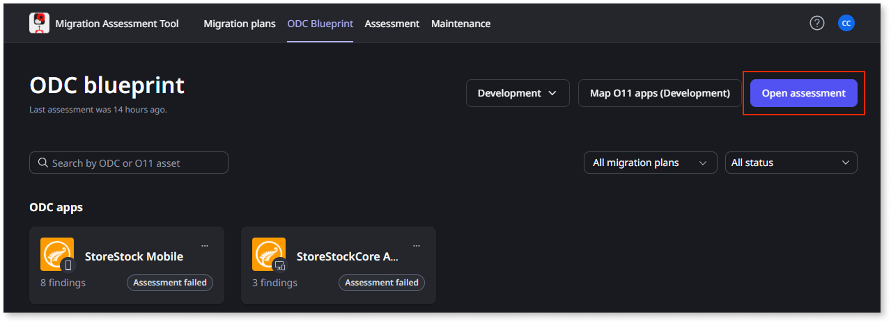
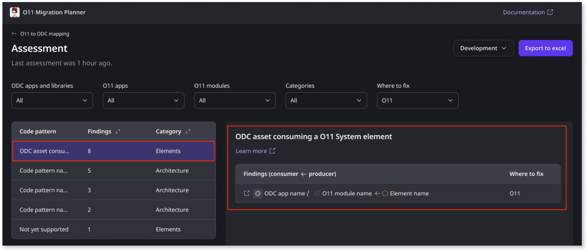

---
summary:
locale: en-us
guid: 99ad22b2-8292-4f3a-8d71-0d8ddc11402a
app_type: traditional web apps, mobile apps, reactive web apps
platform-version: o11
figma: https://www.figma.com/design/daglmSUESdKw9J3HdT87a8/O11-to-ODC-migration?m=auto&node-id=2041-594&t=yE9BxgtAPjxhELHt-1
---

# Make O11 apps compatible with ODC

This article only applies to customers with access to the Migration Kit.

Once the existing O11 app architecture to migrate to ODC has been prepared, you must ensure your O11 apps are ODC-compatible. The Migration Assessment Tool enables you to identify the inconsistent code patterns in your O11 apps, and is a key step before migrating your code to ODC.

## Prerequisites

Before starting, ensure the following:

* [The Migration Assessment Tool is set up](../setup-assessement-tool.md).

* [The O11 to ODC architecture mapping has been defined in the tool](../plan/plan-map-apps.md).

* [The O11 to ODC architecture has been validated](../plan/plan-assess-refactor.md).

## Adapt O11 apps for ODC migration

To adapt your O11 apps and make them ODC-compatible, follow these steps:

1. Log into the Migration Assessment Tool. Your team has installed the Migration Assessment Tool in your infrastructure, so you need to get the URL of the tool from them.

    **Note**: You must use your IT user credentials to log in.

1. In the **O11 to ODC mapping** screen, from the dropdown select the Environment where you are going to do the changes to the apps. For example, to ensure you follow the usual development cycle, select the **Development** environment.

1. Click **Open assessment**.

    

1. From the **Where to fix** dropdown, select **O11**.

    

1. Select the code pattern you want to resolve.

    The tool displays a link to the code pattern documentation and a list of the findings.

   

1. Click the **Learn more** link, to open the documentation for the code pattern that explains the code pattern and how you can solve the issue.

1. Go back to the Assessment tool, select a finding, and click the **Open in Service Studio** icon.

    

    You are brought to the relevant modules in Service Studio.

1. In Service Studio, adapt the code, and publish the changes.

    

    To ensure you've solved the issue, republish your app and check the assessment again. A new assessment report is available every 5 minutes.

    

1. Repeat steps 6 and 7 for each finding.

1. Repeat steps 4 to 8 for each code pattern.

## Next steps

* Deploy the updated O11 apps to the OA environment

* Perform acceptance tests for the updated O11 apps in QA

After deploying and testing your O11 apps, you are ready to start executing the app migration.
