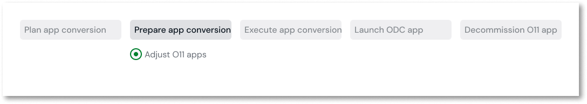

# Make O11 apps compatible with ODC

This article only applies to customers with access to the Migration Kit.

Once the mapping of your O11 apps into your future ODC architecture is done, now it’s time to use the Migration Assessment Tool to understand which are the required code adjustments to make those apps ready for ODC.

Grouping small sets of apps in [migration plans](../plan/plan-define-migration-plans.md) enables development teams of different app domains to focus only on the adjustments of their apps.

## Prerequisites

Before you start, ensure the following:

* The Migration Assessment Tool [is set up](../setup-assessement-tool.md).

* The O11 to ODC architecture [is mapped](../plan/plan-map-apps.md) in the Migration Assessment Tool.

* The mapping of your O11 apps [has been adjusted](../plan/plan-assess-refactor.md) to ODC architecture.

## Adjust O11 apps for ODC migration

To adjust your O11 apps and make them ODC-compatible, follow these steps:

1. Log into the Migration Assessment Tool console (`https://<mat_console_environment>/MigrationAssessment/`) using your IT User credentials.

1. In the **ODC Blueprint** tab, select from the dropdown the Environment where you are going to make the changes to the apps.

    For example, to ensure you follow the usual development cycle, select the **Development** environment.

1. Click **Open assessment**.

    

1. From the **Where to fix** dropdown, select **O11**.

    

1. Select the code pattern you want to resolve.

    The tool displays a **Learn more** link to the code pattern documentation that guides you on how to solve it, and a list of the findings.

1. Select **Learn more** to open the code pattern documentation.

1. Go back to the Migration Assessment Tool console, and select a finding.

1. Click the **Open in Service Studio** icon.

    

    You are brought to the relevant modules in Service Studio.

1. In Service Studio, adapt the code, and publish the changes.

    

    To ensure you've solved the issue, republish your app and rerun the assessment. If you don’t run a new assessment manually, the Migration Assessment Tool automatically queues a new assessment every 15 minutes to check for changes.

    

1. Repeat steps 7 to 9 for each finding.

1. Repeat steps 5 to 10 for each code pattern.

## Next steps

* Tag and deploy the updated O11 apps to the QA environment

* Perform acceptance tests for the updated O11 apps in QA

After deploying and testing your O11 apps, you can validate if the apps in your migration plan [have dependencies on apps in other plans](../plan/plan-define-migration-plans.md#dependencies), so you can better coordinate their [migration to ODC](../execute/execute-intro.md).

Make sure all O11 End Users have their email address field set with an unique email address. This is needed to unblock the user migration to ODC. In Users, set the email addresses for all the [End Users](../../user-management/end-user-manage/add-delete-users.md).

