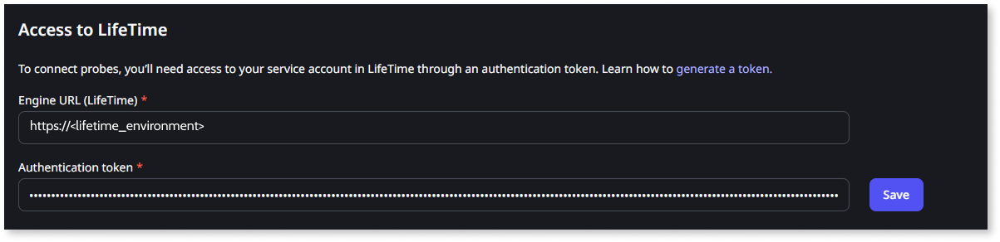
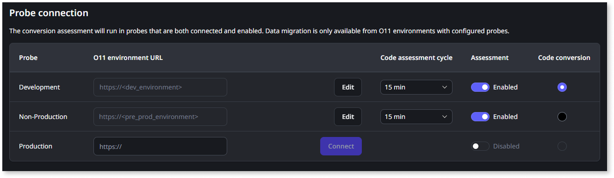

# Set up the Migration Assessment Tool

This article only applies to customers with access to the Migration Kit.

The Migration Assessment Tool helps you evaluate the readiness of O11 apps for the ODC migration and guides you through the necessary code adjustments to ensure that your apps can be migrated.

In the Migration Assessment Tool you can:

* Design your ODC architecture blueprint by [mapping your O11 apps to ODC assets](plan/plan-map-apps.md) - Use your O11 apps as building blocks for future ODC apps, where an ODC app can be composed of one or multiple existing O11 apps.

* [Define migration plans](plan/plan-define-migration-plans.md) for small sets of apps based on your different app domains and your teams' development lifecycle.

* [Assess your apps’ architecture and ODC readiness](plan/plan-assess-refactor.md) - The Migration Assessment Tool assesses your O11 apps and identifies any technical challenges that may occur during the migration process, for example, O11-specific features that need to be implemented differently in ODC, or adapting the app architecture. These technical challenges are outlined in findings that guide you through the steps on how to adjust your apps for a smooth migration to ODC's modern cloud-native framework.

## Tool components

The Migration Assessment Tool consists of the following components:

* Console
* Engine
* Probe

### Console

The **Console** is the user interface app for the Migration Assessment Tool. It’s where you map your O11 apps to ODC architecture, create migration plans, and see the assessment reports. It’s also where you configure the connections between the several components of the tool.

The console must be **installed in the Development environment** of your O11 infrastructure.

### Probe

The first **Probe** to install is the development probe, which must be **installed in the Development environment** of your O11 infrastructure. Optionally, you can install additional probes in other environments to check the ODC-readiness of the apps, except the LifeTime environment. For example, you may want to install a probe in the QA environment, so you can run the assessment on apps during the app testing phase.

Each probe runs the assessment of the apps in the environment where it's installed and returns the findings to the engine. The assessments run sequentially, only one at a time while the remaining are queued.

At a later phase, when you [execute the migration](execute/execute-intro.md) of your apps to ODC, the O11 environments running a probe can be selected as the source for code or data migration.

### Engine

The **Engine** is the communication entry point between your O11 infrastructure and your ODC tenant. It must be **installed in the LifeTime environment** of your O11 infrastructure.

The engine manages the assessment queues of the probes installed in the O11 environments, and keeps a record of all the findings. By default, the engine queues new assessments for each probe every 15 minutes to check for app changes in the environment.

## Prerequisites

Before setting up the Migration Assessment Tool, make sure the following requirements are met:

* You are part of the early access program and have access to the Migration Kit.

* Your O11 infrastructure uses SQL Server databases.

* Your O11 environments use Platform Server 11.18.1 or later.

* One of your non-LifeTime environments, where you publish the Migration Assessment Tool Console, has [Single Sign-On Between App Types enabled](../security/configure-authentication.md). Please note that to enable this setting, you must also [toggle the Enable HTTP Strict Transport Security (HSTS)](../security/enforce-https-security.md) and [enable secure session cookies](../security/secure-cookies-enable-secure-session.md) in that environment.

* Your IT User has the **Administrator** [role](../manage-platform-app-lifecycle/manage-it-teams/about-permission-levels.md#roles).

## Set up the tool

To set up the Migration Assessment Tool, follow these steps:

* [Step 1. Install the Engine in the LifeTime environment](#engine)

* [Step 2. Install the Console in the Development environment](#console)

* [Step 3. Install the development Probe in the Development environment](#probe-dev)

* [Step 4. Install the Probe in other environments](#probe-other-env)

* [Step 5. Configure the Migration Assessment Tool](#configure)

### Step 1. Install the Engine in the LifeTime environment { #engine }

1. Download the [Migration Assessment Tool Engine solution pack](resources/Migration_Assessment_Engine_v1_5_11_5.osp).

1. Go to the Service Center console of your LifeTime environment (`https://<lifetime_environment>/ServiceCenter`).

1. [Upload and publish the Migration Assessment Engine solution pack](https://success.outsystems.com/support/troubleshooting/application_lifecycle/deploy_applications_through_service_center/#step-2.upload-and-publish-the-solution-in-the-target-environment).

### Step 2. Install the Console in the Development environment { #console }

1. Download the [Migration Assessment Tool Console solution pack](resources/Migration_Assessment_Console_v1_5_11_5.osp).

1. Go to the Service Center console of your Development environment (`https://<dev_environment>/ServiceCenter`).

1. [Upload and publish](https://success.outsystems.com/support/troubleshooting/application_lifecycle/deploy_applications_through_service_center/#step-2.upload-and-publish-the-solution-in-the-target-environment) the Migration Assessment Console solution pack.

1. Still in the Service Center console, ensure [Single Sign-On Between App Types](../security/configure-authentication.md) is enabled.

### Step 3. Install the development Probe in the Development environment { #probe-dev }

1. Download the [Migration Assessment Tool Probe solution pack](resources/Migration_Assessment_Probe_v1_5_11_5.osp).

1. Go to the Service Center console of your Development environment (`https://<dev_environment>/ServiceCenter`).

1. [Upload and publish](https://success.outsystems.com/support/troubleshooting/application_lifecycle/deploy_applications_through_service_center/#step-2.upload-and-publish-the-solution-in-the-target-environment) the Migration Assessment Probe solution pack.

### Step 4. Install the Probe in other environments { #probe-other-env }

Optionally, you can install additional probes in the environments where you also want to assess the ODC-readiness of your apps (for example, the QA environment), or the environments that you will later select as the source for code or data migration (for example, the Production environment).

Don’t install the Probe in the LifeTime environment.

1. Go to the Service Center console of the environment where you want to install an additional probe (`https://<environment>/ServiceCenter`).

1. [Upload and publish](https://success.outsystems.com/support/troubleshooting/application_lifecycle/deploy_applications_through_service_center/#step-2.upload-and-publish-the-solution-in-the-target-environment) the Migration Assessment Probe solution pack you downloaded in the previous step.

Installing extra probes is important not only for assessing ODC readiness but also for migrating code and data from those environments.

### Step 5. Configure the Migration Assessment Tool { #configure }

1. Go to the LifeTime management console (`https://<lifetime_environment>/lifetime`).

1. [Create a service account](../ref/apis/lifetime-deployment/rest-api-authentication.md) with the [Administrator role](../manage-platform-app-lifecycle/manage-it-teams/about-permission-levels.md#roles).

1. Copy the authentication token.

1. Go to the Migration Assessment console (`https://<mat_console_environment>/MigrationAssessment/`).

1. Log in using your IT User credentials.

1. Go to the **Maintenance** tab.

1. Configure the **Access to LifeTime**, where the Engine component is installed:

   * Set the **Engine URL (LifeTime)** field to the LifeTime address.
   * Paste the authentication token for the LifeTime Service Account into the **Authentication token** field.

1. Click **Save** to save and test the connection to LifeTime.

    

9. To configure access to the development probe, in the **Probe connection** area, set the **Analysis environment URL** to your Development environment address, and click **Connect**.

    

    It's mandatory to configure access to the **Development** probe.

    

    

10. If you installed the Probe component in other environments, configure the connection to those environment probes.

    

    Later, when you [execute the migration](execute/execute-intro.md) of your apps to ODC, you will select which O11 environment probes will be the source for code and data migration.

    

After configuring the Migration Assessment Tool, you can start [mapping your O11 apps to ODC assets](plan/plan-map-apps.md).
