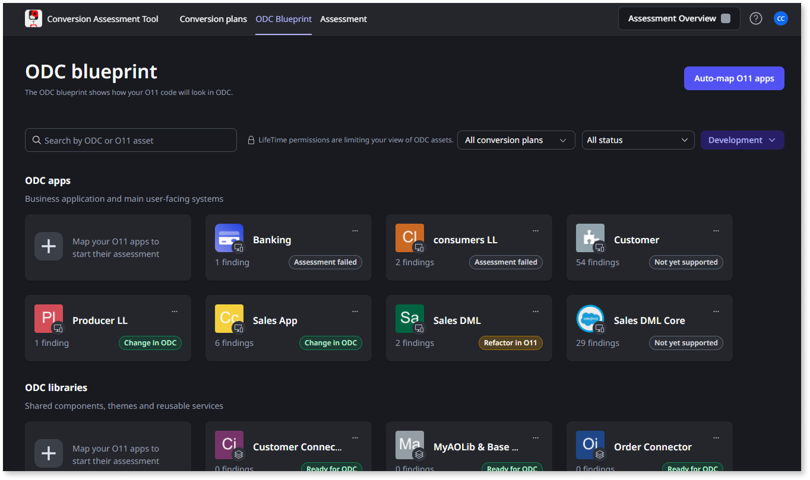
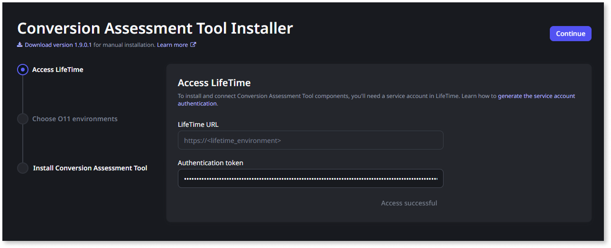
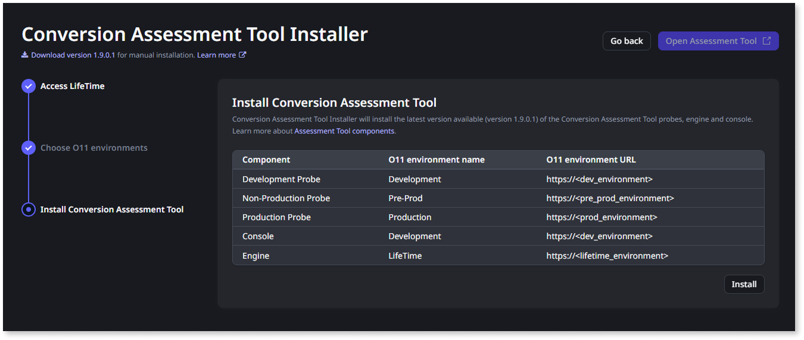
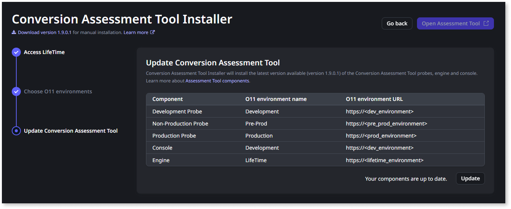
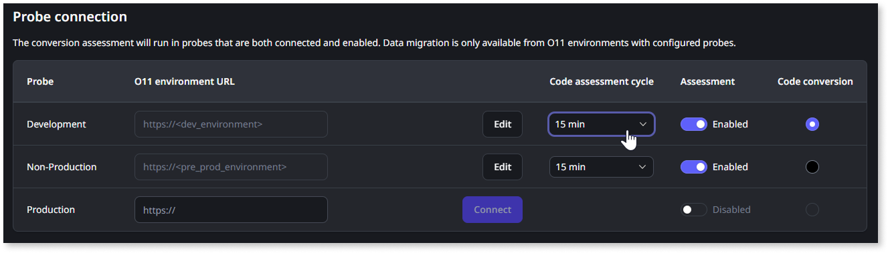

# Set up the Conversion Assessment Tool

This article only applies to customers with access to the App Conversion Kit.

The Conversion Assessment Tool helps you evaluate the readiness of O11 apps for the ODC conversion and guides you through the necessary code adjustments to ensure that your apps can be converted.

In the Conversion Assessment Tool you can:

* Design your ODC architecture blueprint by [mapping your O11 apps to ODC assets](plan/plan-map-apps.md) - Use your O11 apps as building blocks for future ODC apps, where an ODC app can be composed of one or multiple existing O11 apps.

* [Define conversion plans](plan/plan-define-migration-plans.md) - Group a set of O11 apps that you want to convert independently.

* [Assess your apps’ architecture and ODC readiness](plan/plan-assess-refactor.md) - The Conversion Assessment Tool assesses your O11 apps and identifies any technical challenges that may occur during the conversion process, for example, O11-specific features that need to be implemented differently in ODC, or adapting the app architecture. These technical challenges are outlined in findings that guide you through the steps on how to adjust your apps for a smooth conversion to ODC's modern cloud-native framework.

As you navigate the Conversion Assessment Tool, the apps and details available to you are based on your O11 permissions. For a complete overview of permissions by tool operation, refer to the [Conversion Assessment Tool permission model](plan/mat-permissions.md).

## Tool components

The Conversion Assessment Tool consists of the following components:

* Installer  
* Console  
* Engine  
* Probe

### Installer { #installer }

The **Installer** enables you to do the initial set up of the Conversion Assessment Tool, [update it to the latest version](#update), and [install additional probes](#additional-probes), if needed.

During the setup process, the installer gets the O11 environments’ details from LifeTime, and connects to each environment to install the several tool components. When all the components are installed, the installer passes the configuration information to the engine.

The installer component is typically **installed in the Development environment** of your O11 infrastructure.

### Console

The **Console** is the user interface app for the Conversion Assessment Tool. It’s where you map your O11 apps to ODC architecture, create conversion plans, and see the assessment reports. It’s also where you configure the connections between the several components of the tool.

The console must be **installed in the Development environment** of your O11 infrastructure.

### Probe

The first **Probe** to install is the development probe, which must be **installed in the Development environment** of your O11 infrastructure. Optionally, you can install an additional non-production probe to check the ODC-readiness of the apps. For example, you may want to install a probe in the QA environment, so you can run the assessment on apps during the app testing phase.

Each probe runs the assessment of the apps in the environment where it's installed and returns the findings to the engine. The assessments run sequentially, only one ODC Asset at a time while the remaining are queued.

### Engine

The **Engine** is the communication entry point between your O11 infrastructure and your ODC tenant. It must be **installed in the LifeTime environment** of your O11 infrastructure.

The engine manages the assessment queues of the probes installed in the O11 environments, and keeps a record of all the findings. The engine [queues new assessments periodically](#cycles) for each probe to check for app and environment changes.

## Assessment cycles { #cycles }

The Conversion Assessment Tool runs different types of assessments, each with its own frequency:

* By default, a **code assessment** runs every 15 minutes for the O11 apps mapped to ODC assets in an environment with a probe installed, but you can [change this interval per environment](#change-cycle). Possible values are 15 minutes, 1 hour, 8 hours, or 24 hours. A code assessment also runs for the mapped O11 apps when an ODC asset is created or updated.

* A **data assessment** runs daily for the O11 apps mapped to ODC assets in all environments with a probe installed. This interval is not configurable. It also runs every time an ODC asset is created or updated.

* An **infrastructure assessment** runs daily in all environments with a probe installed. This interval is not configurable.

Additionally, you can trigger an assessment at any time in the Conversion Assessment Tool console.

## Prerequisites

Before setting up the Conversion Assessment Tool, make sure the following requirements are met:

* You are part of the early access program and have access to the App Conversion Kit.

* Your O11 environments use Platform Server 11.18.1 or later.

## Set up the tool

To set up the Conversion Assessment Tool, follow these steps:

* [Step 1. Install the Conversion Assessment Tool Installer app](#cat-installer)

* [Step 2. Follow the installation wizard](#install-wizard)

### Step 1. Install the Conversion Assessment Tool Installer app { #cat-installer }

This step [requires **Create Applications** and **Change and Deploy Applications** permissions](plan/mat-permissions.md#setup-update) for the O11 environment where you install the installer app, typically the Development environment.

Follow these instructions to install the Conversion Assessment Tool Installer in your Development environment:

1. Download the [Conversion Assessment Tool Installer app file](resources/Conversion_Assessment_Tool_Installer_v1_1_4_2.oap).

1. Go to the Service Center console of your Development environment (`https://<dev_environment>/ServiceCenter`).

1. Under **Factory > Applications**, select **Publish an Application**.

1. Upload and publish the Conversion Assessment Tool Installer app file.

If your IT users [authenticate with external IdP](../manage-platform-app-lifecycle/manage-it-teams/external-idp/intro.md), add the following redirect URI to your IdP configuration:

* `https://<dev_environment>/ConversionAssessmentInstaller/OIDC_Callback`

### Step 2. Follow the installation wizard { #install-wizard }

This step requires:

* The [**Administrator** role](plan/mat-permissions.md#setup-update).
* A [service account in LifeTime](../ref/apis/lifetime-deployment/rest-api-authentication.md) with the [**Administrator** role](../manage-platform-app-lifecycle/manage-it-teams/about-permission-levels.md#roles), and the corresponding authentication token.

Follow the installer wizard to set up the Conversion Assessment Tool components:

1. Open the Conversion Assessment Tool Installer app (`https://<dev_environment>/ConversionAssessmentInstaller/`).

1. Log in using your IT User credentials.

1. Set the **Authentication token** of the [service account](../ref/apis/lifetime-deployment/rest-api-authentication.md) you’ll use to access the LifeTime environment.

    

1. Click **Access LifeTime** to validate the connection.

    You can only proceed if the provided service account can successfully access LifeTime.

1. Click **Continue**.

1. Choose the O11 environments where you want to install the [probes](#probe) and the [console](#console) components.

    The installer provides you the list of environments registered in LifeTime. If you want to use an alternative URL for a specific environment, choose the environment from the list and click the pencil icon to edit the environment URL.

    

    * The installation of the **Development probe** and the **Conversion Assessment Tool console** is mandatory. Outsystems recommends the installation of these components in your O11 Development environment.

    * Optionally, you can install additional probes in the environments where you also want to assess the ODC-readiness of your apps, for example, the QA environment. You can opt to [install additional probes](#additional-probes) at a later phase. Code conversion and data migration are only available from O11 environments with installed probes.

    

    

1. Click **Validate URLs** to validate the connection with the chosen environments.

    You can only proceed if the installer can successfully connect with the chosen environments.

1. Click **Continue**.

1. The last step of the wizard shows a summary of the Conversion Assessment Tool components that will be installed in each environment. Click **Install**.

    

If your IT users [authenticate with external IdP](../manage-platform-app-lifecycle/manage-it-teams/external-idp/intro.md), add the following redirect URI to your IdP configuration:

* `https://<cat_console_environment>/ConversionAssessment/OIDC_Callback`, where `<cat_console_environment>` is the environment where you installed the [Conversion Assessment Tool console](#console)

After setting up the Conversion Assessment Tool, you can start [mapping your O11 apps to ODC assets](plan/plan-map-apps.md).

## Update to the latest Conversion Assessment Tool version { #update }

This operation [requires the **Administrator** role](plan/mat-permissions.md#setup-update).

The Conversion Assessment Tool will show a notification when a new version is available.

Follow these steps to update the Conversion Assessment Tool:

1. Click **Open Conversion Assessment Tool Installer** to open the installer.

    The installer takes you to the last step of the setup wizard.

1. Click **Update** to install the latest version of the Conversion Assessment Tool in each component.

    

## Install an additional probe { #additional-probes }

This operation [requires the **Administrator** role](plan/mat-permissions.md#setup-update).

After the initial setup, you can always install an additional probe in another O11 environment of your infrastructure. For example, when you are ready to execute the conversion of your apps to ODC, you need to have a probe running in the O11 environment that will be the source for code conversion or data migration (for example, the Production environment).

Follow these steps to install an additional probe using the Conversion Assessment Tool Installer:

1. Open the Conversion Assessment Tool Installer app (`https://<dev_environment>/ConversionAssessmentInstaller/`).

1. Log in using your IT User credentials.

    As you already set up the Conversion Assessment Tool, the installer takes you to the last step of the setup wizard.

1. Click **Go back** to go to the **Choose O11 environments** step.

1. Select the O11 environment for the additional probe.

1. Click **Continue**.

1. Click **Update** to install an additional probe in the new environment.

    The Conversion Assessment Tool Installer uses the latest version available to install the new probe and updates all the remaining components if they are not up to date.

## Change the code assessment cycle { #change-cycle }

This operation [requires **Full Control** permission](plan/mat-permissions.md#maintenance) for the O11 environment running the [development probe](#probe).

You can adjust how frequently the Conversion Assessment Tool assesses your O11 apps in a specific environment by changing the code assessment cycle for the environment probe. By default, the code assessment cycle is 15 minutes.

Follow these steps to change the code assessment cycle for an environment:

1. Log into the Conversion Assessment Tool console (`https://<cat_console_environment>/ConversionAssessment/`) using your IT User credentials.

1. Go to the **Maintenance** tab.

1. In the **Probe connection** area, identify the probe installed in the environment you want to configure.

1. Change the **Code assessment cycle** value for that probe using the dropdown.

    The change is automatically saved.

    

## Troubleshooting

This section describes some common issues you may encounter during the setup of the Conversion Assessment Tool, and how to solve them.

If you encounter any other limitation or issue using the Conversion Assessment Tool Installer, try the [manual setup process](manual-setup-assessement-tool.md).

Please also tell us about the issue you faced using the **Give feedback** option. This will help us improve the installer tool and support more scenarios.

### Can't log in to the Conversion Assessment tools { #cannot-login }

You are not able to log in to the Conversion Assessment Tool Installer app or to the Conversion Assessment Tool Console.

#### Recommended action

Validate the following:

* You are using your IT user credentials to log in.

* If you are trying to log in to the Conversion Assessment Tool Installer app, make sure your IT user [has the **Administrator** role](plan/mat-permissions.md#setup-update).

* If your IT users [authenticate with external IdP](../manage-platform-app-lifecycle/manage-it-teams/external-idp/intro.md), make sure you added the following redirect URIs to your IdP configuration:

    * `https://<cati_environment>/ConversionAssessmentInstaller/OIDC_Callback`, where `<cati_environment>` is the environment running the [Conversion Assessment Tool Installer](#installer)

    * `https://<cat_console_environment>/ConversionAssessment/OIDC_Callback`, where `<cat_console_environment>` is the environment running the [Conversion Assessment Tool Console](#console)

### Setup process fails

<!--TODO: Add screenshot of the setup process error-->

In some scenarios, the Conversion Assessment Tool Installer is not able to connect to one or more of the remaining O11 environments and the setup fails. Possible reasons are:

* There’s no communication between the Conversion Assessment Tool Installer environment and another O11 environment.

* The O11 environment URL returned by LifeTime doesn’t match the URL where the environment accepts the connection.

#### Recommended action

Make sure your O11 infrastructure follows the [OutSystems 11 network requirements](../setup-infra-platform/setup/network-requirements.md).

In case the O11 environment URL returned by LifeTime doesn’t match the URL where the environment accepts the connection, you can edit the environment URL to the alternative URL when choosing the O11 environments in the [setup wizard](#install-wizard).

If you have other communication restrictions applied to your O11 environments, [install the Conversion Assessment Tool Installer](#cat-installer) in your LifeTime environment instead, and repeat the [setup wizard](#install-wizard).

If the problem persists, try the [manual setup process](manual-setup-assessement-tool.md).
