# Advanced Mobile App Troubleshooting Using Chrome

Applies only to Mobile Apps.

This topic describes an **advanced mobile app troubleshooting scenario** where you can't use the debugging features of OutSystems (for example, in a Production environment). Check [Debugging Applications](<../debugging-apps/intro.md>) for more information on using OutSystems debugging features to debug your web and mobile apps.

You can troubleshoot issues in your mobile app using [Google Chrome's Developer Tools](<https://developers.google.com/web/tools/chrome-devtools/>). These tools provide you with a set of features to analyze what's happening under the hood of your application. They also allow you to debug the JavaScript code generated by the platform. You can do this troubleshooting either using a preview of your mobile app on the desktop browser (if possible), or by connecting the desktop browser first to a mobile device running your mobile app.

There are a few tips that can streamline your troubleshooting process while using Chrome Developer Tools. Check the  [Troubleshooting tips](#tips) section for more information.

## Troubleshoot using Chrome

You can troubleshoot mobile app issues in your Chrome desktop browser if you're not using native plugins or if all native plugins have fallbacks in place that allow your mobile app to work properly outside a real mobile device.

### What can I troubleshoot?

Since the client code is running on the browser, you can use the development tools of the browser to debug it. You can debug:

* Client Screen Actions
* Client Actions
* Event Handlers
* On Exception Handlers

Check the [Generated JavaScript code architecture](#generated-javascript-code-architecture) section to learn more about the JavaScript code generated by the platform.

### Start troubleshooting

You can troubleshoot your mobile app as soon as you publish it, checking its logic, screens, and viewing the local storage. To do it:

1. Open the Chrome browser on the desktop (use the latest version).
1. Open Chrome Developer Tools (for example, by pressing `F12`) and start debugging or troubleshooting.

Check the [Developer Tools JavaScript Debugging Reference](<https://developer.chrome.com/docs/devtools/javascript/reference>) from Google for more information on the debugging features provided by Chrome Developer Tools.

To debug a client action you can hold down the `Ctrl` key while using the application to trigger that action; this automatically sets a breakpoint and holds execution at the start of any client action. Check below for other useful tips while using Chrome Developer Tools.

### Viewing local storage data

You can view data in the local storage while troubleshooting your app in the desktop Chrome browser.

To view the data of a local entity:

1. While previewing your mobile app in the (desktop) Chrome browser, open Chrome Developer Tools (for example, by pressing `F12`).
1. Go to the **Application** tab and navigate to your app's module **WebSQL/&lt;YourModuleName&gt;**.
1. Expand this tree node to show a list local entities defined in the application.
1. Select one to view its data.

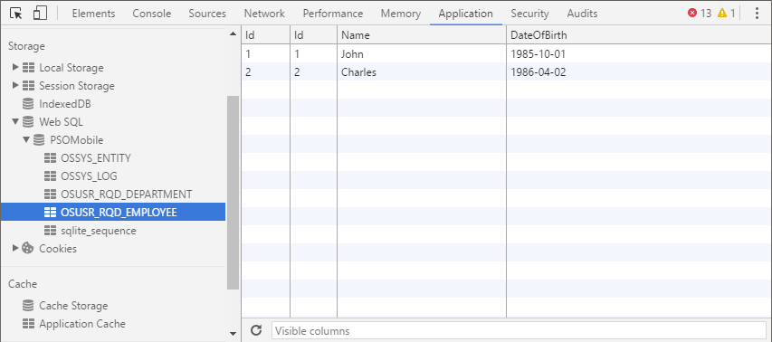

The tables for the local entities of the application have a `OSUSR_` prefix, while OutSystems tables have a `OSSYS_` prefix.

The `OSSYS_ENTITY` table stores internal information about each one of the application tables and the `OSSYS_LOG` is used to store logs locally when no network connection is available.  

#### Running queries

To run queries over local entities:

1. Select **&lt;YourModuleName&gt;** in the tree on the left.
1. Write your SQL queries in the console available on the right.  
  
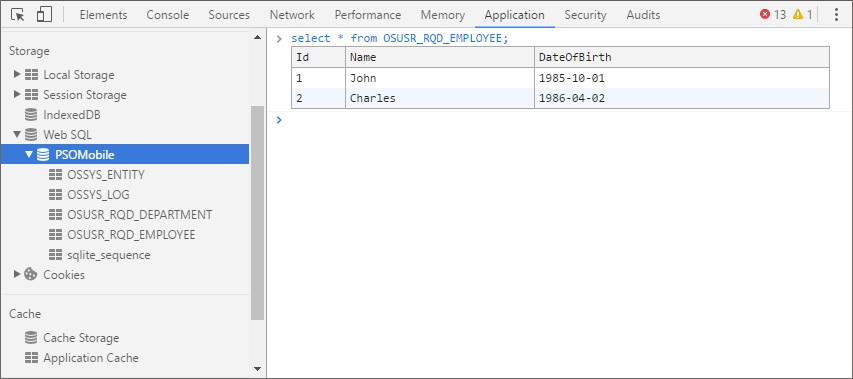

## Troubleshooting on your device connected to the desktop browser

You can troubleshoot your mobile app while running it on a mobile device by installing it previously through an application package. This is useful to troubleshoot plugin behavior in your mobile app.

This kind of troubleshooting on mobile devices is only possible for Android apps.

### Connecting the desktop browser to your device

Pre-requisites:

* Your mobile device has Android version 4.0 or higher.
* You have Google Chrome version 32 or higher installed in the PC.
* The desktop Chrome version is higher than the Chrome version in the mobile device.
* If the mobile app was installed in the mobile device through an application package, it must have been generated with a `Debug` build type.

To enable debugging on your device:

1. Open **Settings** and find the option **Developer Options**.

    _Note:_ If you don't see this option listed, take the following steps:  
    1\. In the device, go to **Settings** and select **About**.  
    2\. Tap seven times on top of the build number.

1. After that, the device displays the **Developer Settings** option. If this doesn't work, check [how to do it in the documentation](<https://developers.google.com/web/tools/chrome-devtools/debug/remote-debugging/remote-debugging>).

1. Select the **Settings** > **Developer Options**.

1. Slide the enable slider to `On`.

1. Enable the `USB Debugging` option.

1. Accept the security popups.

To connect your device to the desktop Chrome browser:

1. Connect the device to your PC through USB.

1. If there an option in the device to set the USB mode, make sure it's set to `PTP` (or `Camera mode`).

1. Open the desktop Chrome browser and type the following URL:

    `chrome://inspect/#devices`
  
    _Note:_ If there are no devices listed, you are probably missing the USB drivers on your computer.  

1. Click on the **inspect** link next to the URL of the WebView.  
  
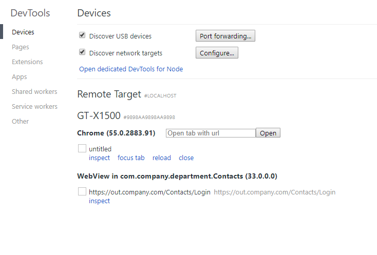

You can now inspect and debug the contents of the WebView displaying your app in the device.

Check the [Developer Tools JavaScript Debugging Reference](<https://developer.chrome.com/docs/devtools/javascript/reference>) from Google for more information on the debugging features provided by Chrome Developer Tools.

## Troubleshooting tips { #tips }

You can find below a series of tips that may improve your troubleshooting steps:

* To debug a client action, hold down the `Ctrl` key while using the application to call that action. This automatically sets a breakpoint and holds execution at the beginning of any executed client action.

* To make JavaScript code more perceivable and simple to read, click on the **Pretty Print** button available in the Sources tab.  

    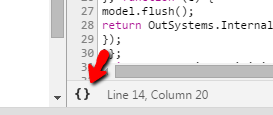  

* To obtain more readable stack traces for asynchronous actions check the **Async** checkbox available in the **Sources** tab.

    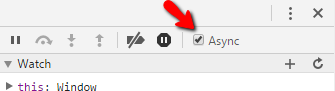  

* Keep a look for the errors in the **Console** tab. You can click on the link on the right side to navigate to the JavaScript location where the error is happening.

    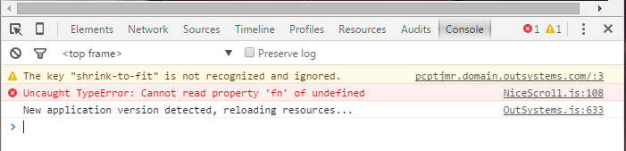

* When the application redirects you to an error page the logs in the **Console** tab disappear. To preserve them, check the **Preserve log** option.

* Use the **Performance** tab in Chrome's Developer Tools for doing performance troubleshooting. If you detect long wait times without any CPU or network usage, this means that your app is probably waiting for data (aggregate or data action results) or waiting for a native plugin operation to complete.

* To simulate poor network conditions you can enable the throttling feature available in the **Network** tab. Be aware that you might get unexpected results when using throttling in Chrome and testing with a real device connected to the browser. Alternatively, you can test your mobile app on a device with its mobile network settings configured for 2G mode only.

## Generated JavaScript code architecture { #generated-javascript-code-architecture }

A mobile app generates code and assets that run on the server and on the client (mobile device). At the client side, this code is JavaScript and has a specific architecture. This document explains what are the files, their roles, and the generated code for each flow element defined for an action in the Service Studio. This content is useful to know when you're troubleshooting or checking the generated code at the client side.

### Generated JavaScript files

To locate the JavaScript files generated for client, expand the scripts folder in Chrome DevTools:  

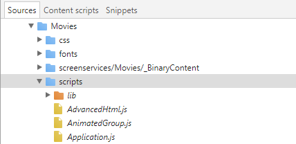

The explanation about the highlighted sections is in the table below. Please note that the number of generated JavaScript files may change and that the information provided may not be up to date.  

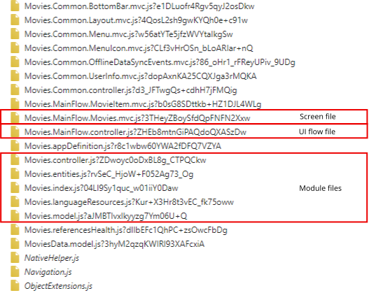

### JavaScript files roles

| File | Description |
| ---|--- |
| **Module files** | |
| `<ModuleName>.controller.js` | Global client actions of the `<ModuleName>` module. |
| `<ModuleName>.entities.js` | SQL code to manipulate the local entities of the `<ModuleName>` module. |
| `<ModuleName>.model.js` | Definitions for the `<ModuleName>` module's local entities (including referenced entities). |
| `<ModuleName>.languageResources.js` | Validation messages defined in the `<ModuleName>` module. |
| **UI Flow files** | |
| `<ModuleName>.<UIFlowName>.controller.js` | Exception handler of the `<UIFlowName>` flow. |
| **Screen file, Block file** | |
| `<ModuleName>.<UIFlowName>.<ScreenName>.mvc.js` `<ModuleName>.<UIFlowName>.<BlockName>.mvc.js` | Contains the actions and events, definition of variables and widget rendering code for the screen/block element. |
  
### How are flow nodes represented in JavaScript

#### Aggregate

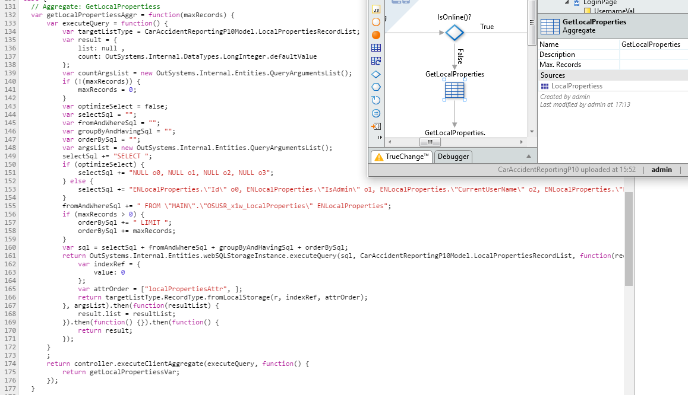

#### Refresh Data

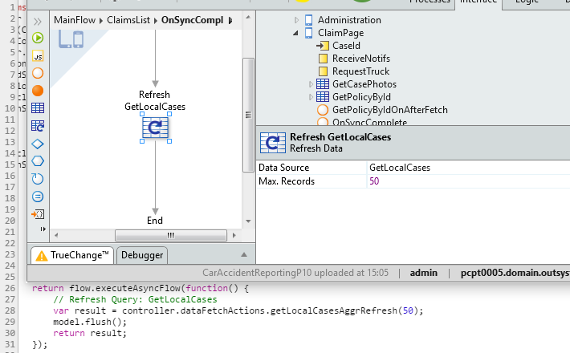

#### Run Client Action

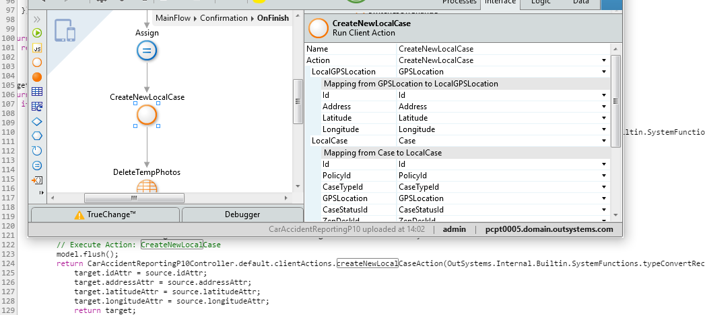

#### Run Server Action

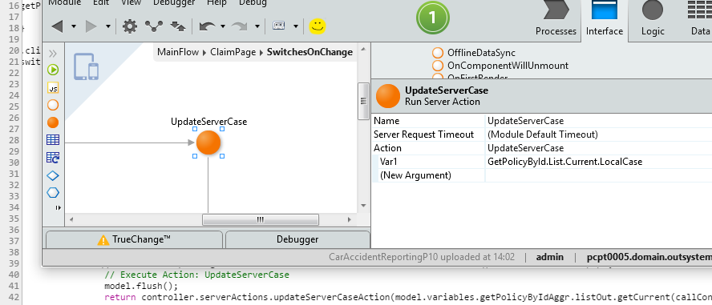

#### JavaScript

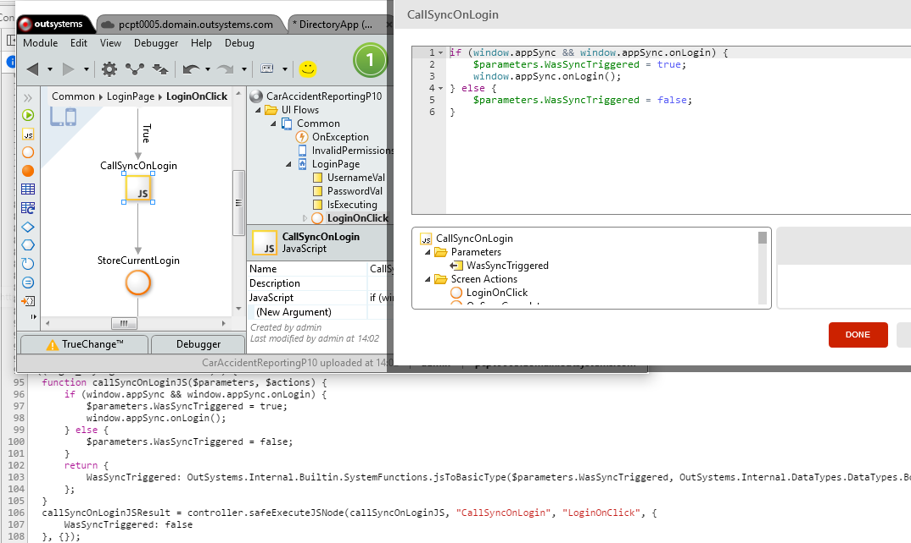

#### Assign

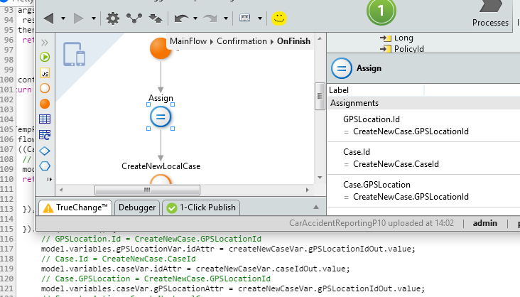

#### If

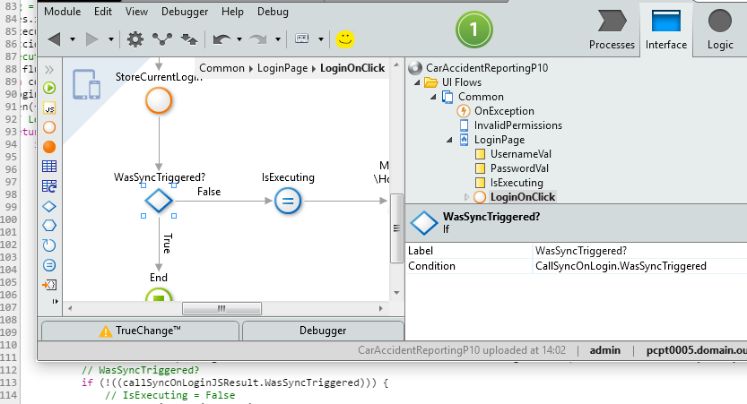

#### Switch

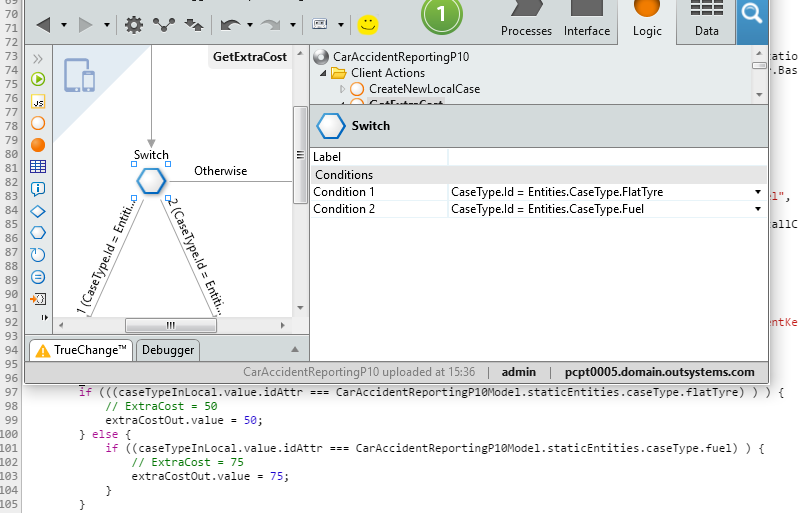

#### For Each

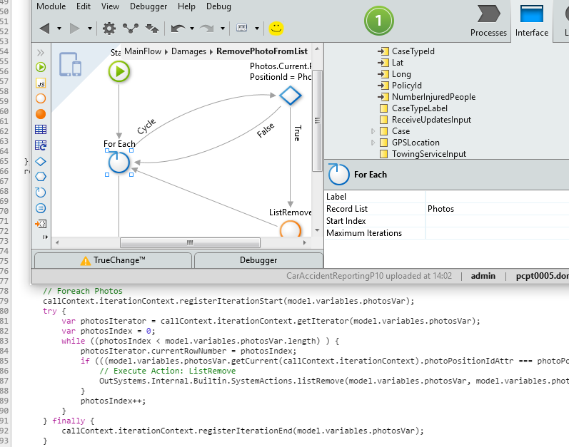

#### Destination

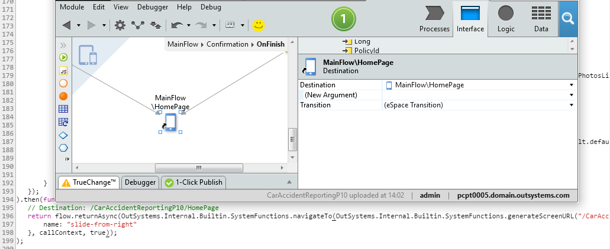

#### Raise Exception

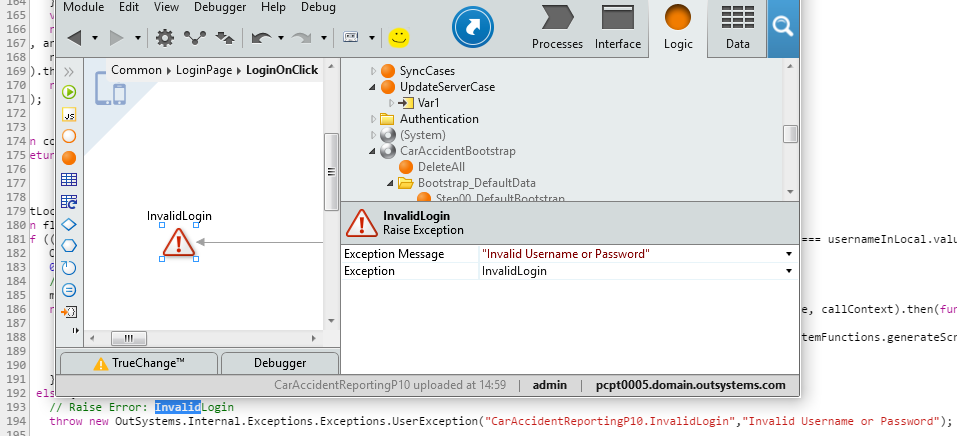

#### Exception Handler

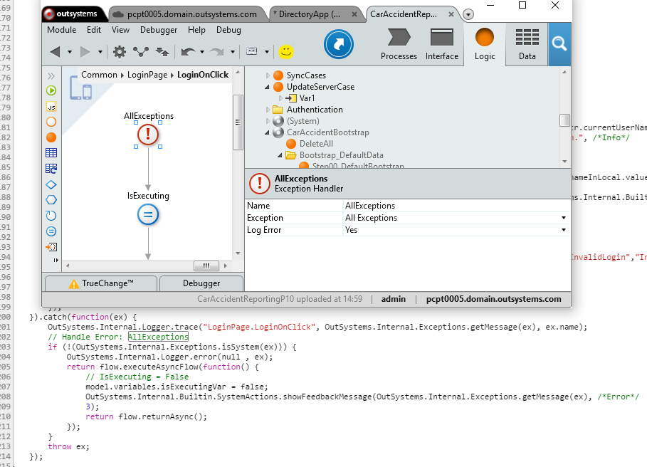

#### JSON Serialize

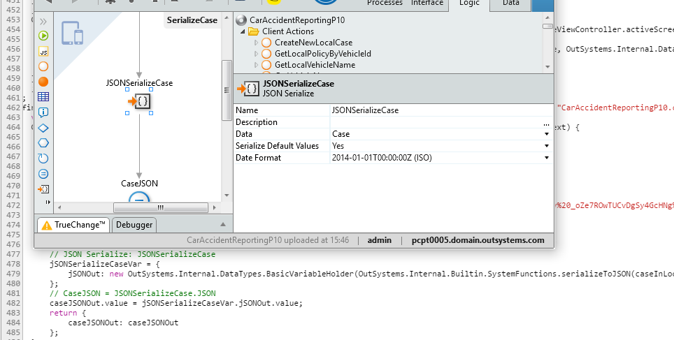

#### JSON Deserialize

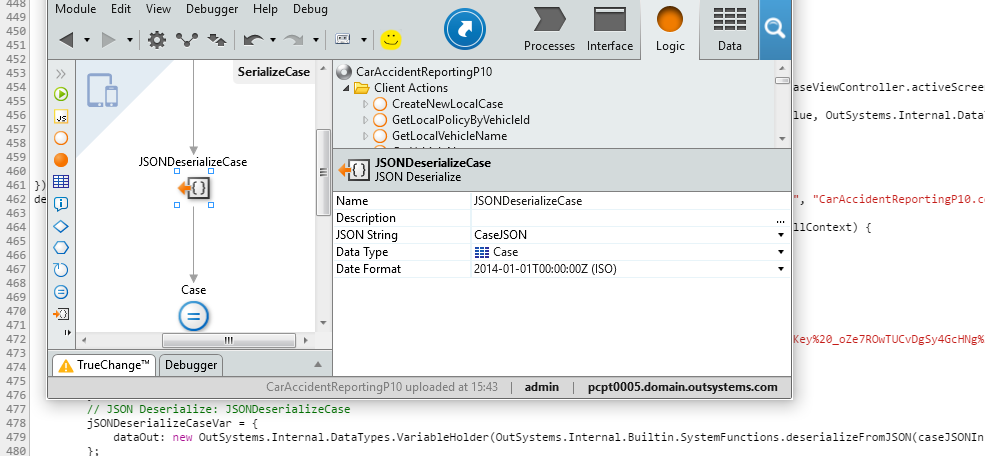

#### Message

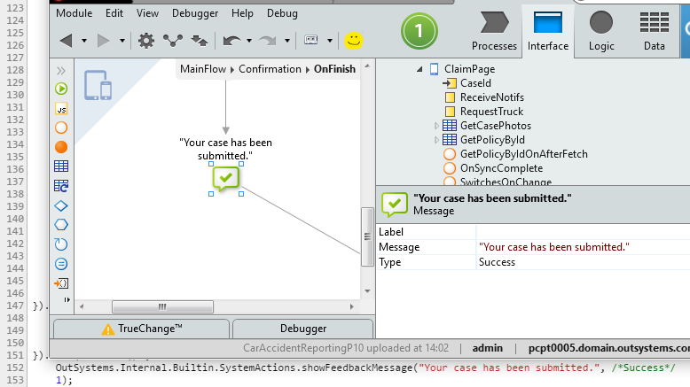
