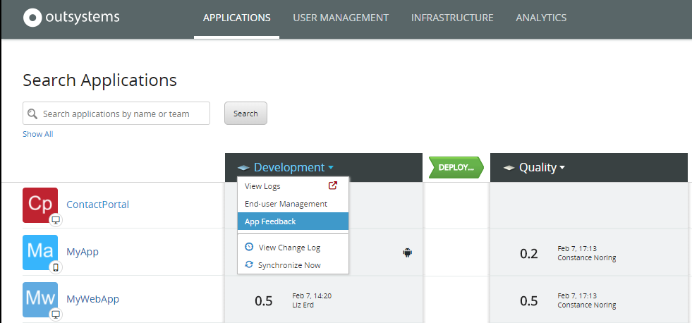
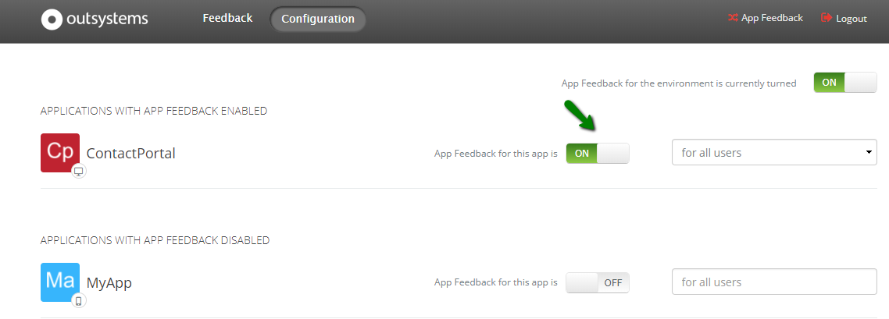
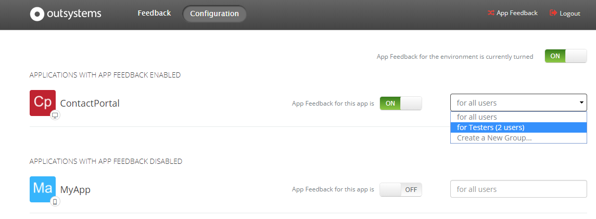

# Enable user feedback for apps

You can let your users send feedback while they're using an app in a specific environment. For example, you can enable QA teams or the key users to send suggestions or report problems in an app running in the QA environment. The app feedback feature is available in all OutSystems apps.

## Let users send feedback from an app

Use the App Feedback system app to configure the user feedback feature. You can access App Feedback through LifeTime or by visiting the URL `https://<your environment>/ECT_Provider`.

1. Open the LifeTime console.

1. In the **Applications** section, select the **App Feedback** option in the drop-down menu next to the environment where you want to enable user feedback. This opens the App Feedback application in the environment.

    

1. In the App Feedback, go to the **Configuration** section.

1. Activate the functionality of sending feedback through an app by toggling the switch to on.

    

1. If you're enabling user feedback for a **mobile app**, you must **regenerate the app**. Only the next generated app includes the feedback feature.

You can deactivate user feedback for an app the same way, this time turning the feedback switch off. Again. If you're deactivating user feedback for a **mobile app**, you must **regenerate the app to remove the feedback feature**.

## Restrict who can submit feedback

When you enable user feedback for an app, by default all users can submit feedback. If you want to restrict the feedback to a specific group of users, select the name of the group in the drop-down list next to the feedback switch.

If the group of users for which you want to enable feedback doesn't exist, do the following:

1. Select **Create a New Group** in the drop-down list next to the feedback switch. The browser opens a new tab with the Users application.
1. Go to the **Groups** section and create the new group of users you want to get feedback from.
1. Go back to the App Feedback configuration screen, refresh the page, and select the newly created group.
