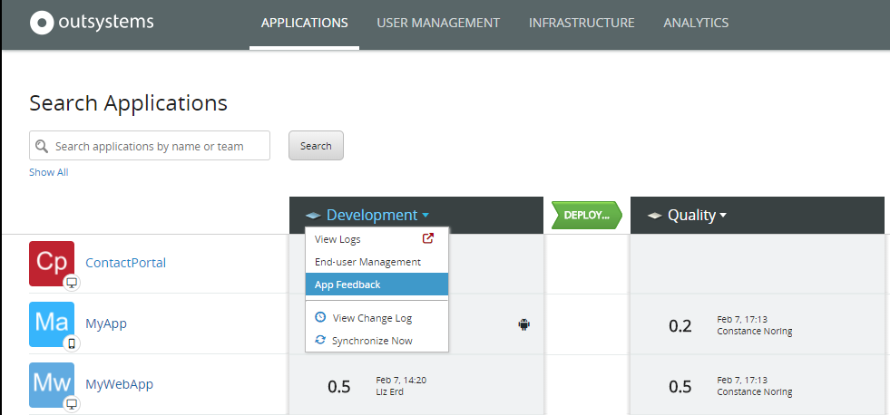
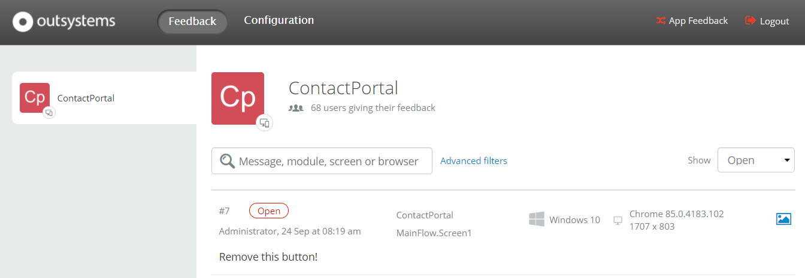
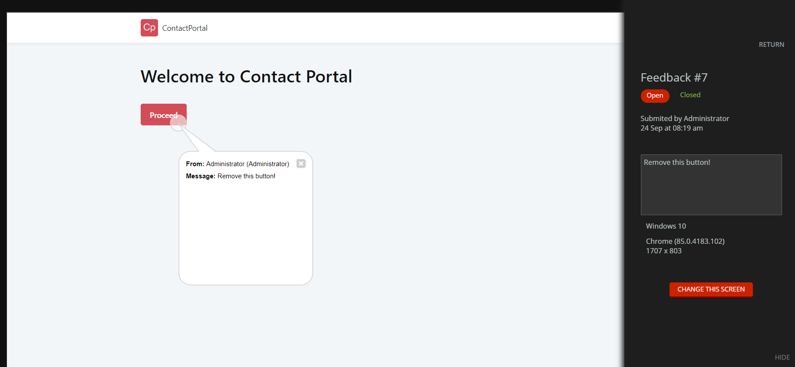
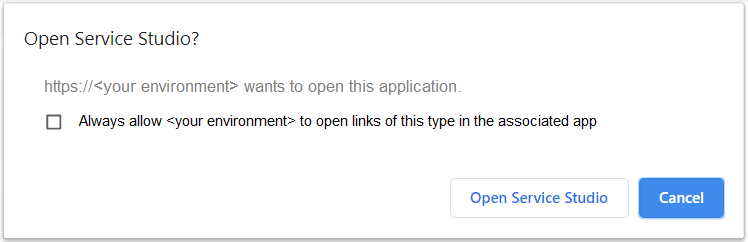
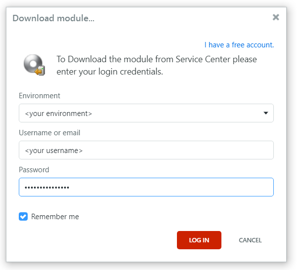

# Handle the submitted feedback

When you [enable user feedback for your apps](user-feedback-enable.md), the App Feedback application collects all the feedback your users send for each app. To act upon the feedback received, follow the steps below.

1. Open the LifeTime console at `https://<your environment>/Lifetime`.

    

    If you don't have LifeTime installed, access the App Feedback application of your environment by visiting the URL `https://<your environment>/ECT_Provider`.

    

1. In the Applications section, select the **App Feedback** option in the drop-down menu next to the environment for which you want to see the feedback items.

    

1. Sign in with the credentials of a user account defined in the Users app (`https://<your environment>/Users`), that has Administrator or FeedbackManager permissions.

1. Click the **Feedback** section, to see a list of all the feedback submitted by users. 

1. On the right side of the screen, ensure the selection of the drop-down menu is **Open**. This option allows you to display open requests, closed ones, or both.

    

1. Select one of the listed feedbacks to check the information provided by the user, and click **Open**.

    A window with the details opens, providing the feedback from the user and screenshot of the app screen.
    
    

1. To open the screen directly in Service Studio for acting upon the users' feedback, click **CHANGE THIS SCREEN**.

    1. Confirm this operation by clicking **Open Service Studio**. If you don't want to see this message again, click on the checkbox to automatically allow this operation.

        

    1. Enter your environment address and login credentials to allow downloading the app module from Service Center to Service Studio, and click **LOG IN**.

        

    1. Implement the requested change or suggestion, publish your app, and test it.

1. To mark the feedback as closed, click **Close**. The request moves to the closed list.

    
