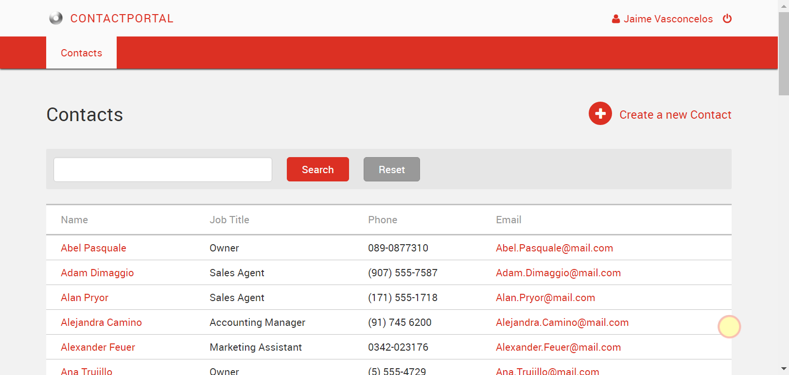
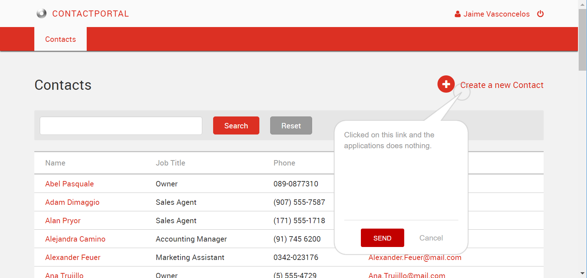

# Send feedback in web apps

Applies only to Traditional Web Apps and Reactive Web Apps.

When sending feedback is active for a Reactive Web App or Traditional Web App, a glowing circle shows on the app screens, close to the bottom-right corner. Note that you first need to [activate the feedback feature in the environment](user-feedback-enable.md).

To send feedback do the following:

1. Click the glowing circle to open the feedback pop-up window.
1. In the feedback window, type the feedback text.
1. If the feedback is about a specific area or element on the screen, click that area or element. Pointing to the portion of a screen helps developers to understand the issue better.
1. Press **SEND** to submit the feedback.

