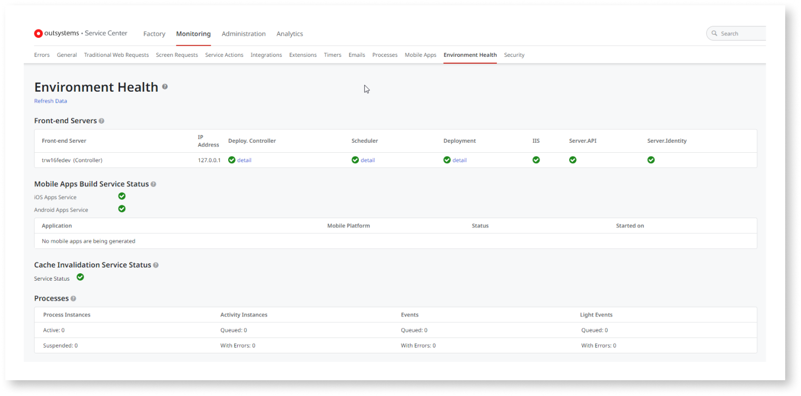
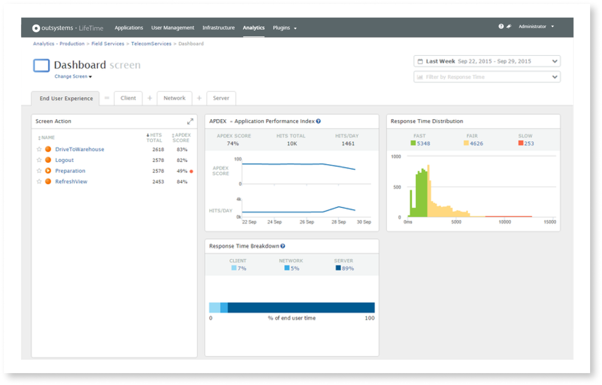
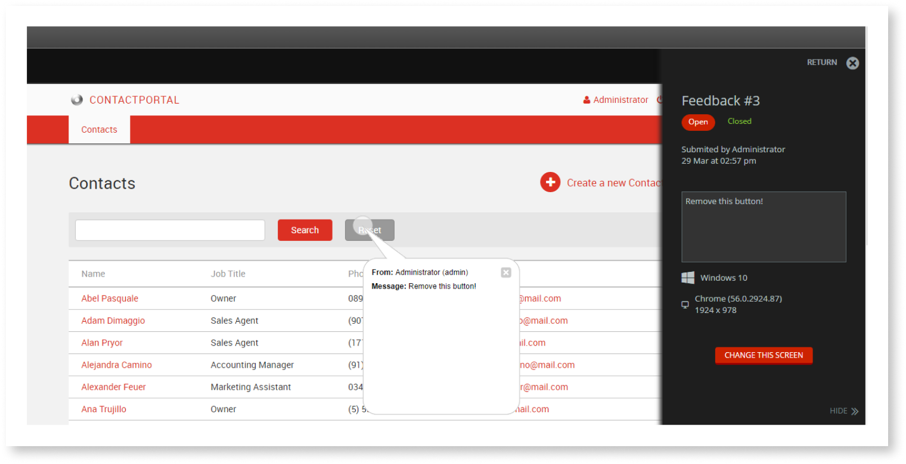
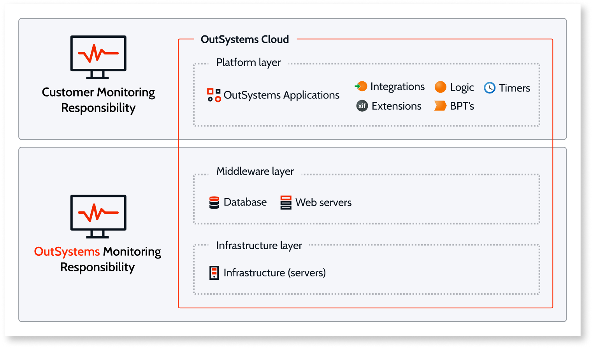
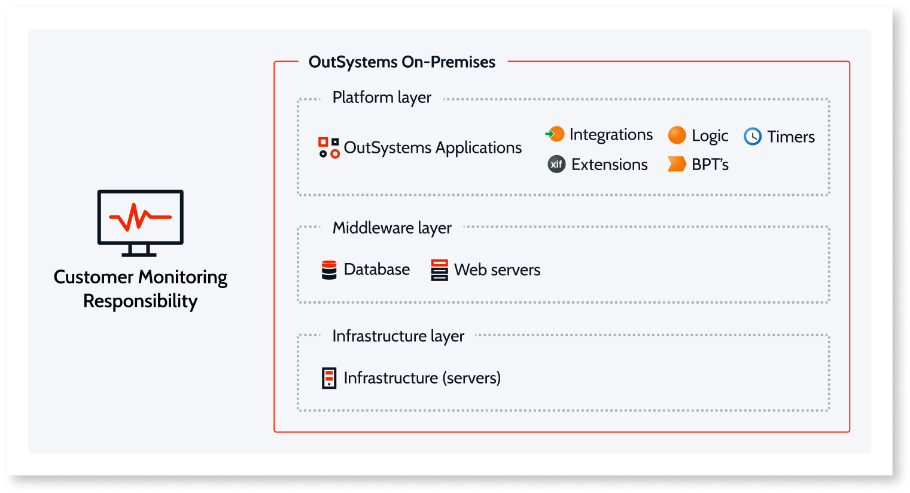

# Monitoring and troubleshooting apps

OutSystems provides built-in monitoring and analytics tools that enable proactive management of application performance to make it easier to detect, identify, and troubleshoot issues in real time.

These tools are automatically available through the platform, and all OutSystems applications are instrumented to collect logs and performance events and store them in a standard relational database. These metrics are collected by default, requiring no extra work on the part of developers and adding no overhead to the runtime environment.

OutSystems makes more than a dozen monitoring logs available for analysis and troubleshooting. Aside from providing comprehensive reports by type and time window, developers can also use analytics dashboards to spot bottlenecks on the client, network, and server that negatively impact [APDEX](https://success.outsystems.com/Documentation/11/Managing_the_Applications_Lifecycle/Monitor_and_Troubleshoot/The_APDEX_Performance_Score) values. Once these issues are identified they can be followed up for resolution. 

A great number of monitoring and troubleshooting use cases can be served by the out-of-the-box tools. However, OutSystems demonstrates its strength as a development platform by making it easy to integrate this wealth of logged data with leading industry-strength monitoring and analysis platforms provided by third-party vendors.

To understand the current state of an environment and monitor problems impacting end users, OutSystems allows you to:

* [View analytics](troubleshoot-the-performance-of-an-application.md) about the user experience of your applications.
* [See the logs](monitoring-an-environment.md) of your OutSystems applications and the environment status.
* [Manage the feedback](app-feedback/intro.md) submitted by end users.
* [Audit the tasks](monitor-usage-with-audit-logs.md) performed by IT users.

## Built-in Tools

OutSystems provides built-in tools that collect and present data about the platform and the applications running on it.

Service Center Console
:   [Service Center](monitoring-an-environment.md) provides a set of metrics regarding a specific environment. It provides access to application logs and errors, web and mobile requests, integration calls, business processes, and security audits. Additionally, it displays the current status of environment servers and services and allows the creation of aggregation reports over the available data.

 

LifeTime Analytics
:   [LifeTime Analytics](troubleshoot-the-performance-of-an-application.md) provides immediate insight into the performance and end user experience of your Traditional Web Applications. It measures the end user experience based on industry-standard indicators. Here, you can further drill down to identify bottlenecks on different levels: [client](how-application-performance-is-measured.md#client-metrics) (eg. operating systems), [network](how-application-performance-is-measured.md#network-metrics) (eg. network types), and [server](how-application-performance-is-measured.md#server-metrics) (eg. business logic elements).

 

App Feedback
:   [App Feedback](app-feedback/intro.md) application lets you manage the feedback from your business users. It allows you to streamline the feedback gathering process and defect tracking.

## Extending OutSystems Monitoring Capabilities

OutSystems allows you to extend the built-in monitoring capabilities, as you can:

* Instrument your OutSystems applications for more advanced monitoring using the [Asynchronous Logging API](../ref/apis/auto/asynchronous-logging-api.final.md) to collect custom logs.

* Create your own OutSystems applications to extend the built-in monitoring capabilities, or reuse the existing components developed by the OutSystems community, available at [OutSystems Forge](https://www.outsystems.com/forge/). For example, [MonitorProbe](https://www.outsystems.com/forge/component-overview/4559/monitorprobe) enables you to expose the platform monitoring data as an API, while [New Relic RUM](https://www.outsystems.com/forge/component-overview/6848/new-relic-rum-for-react) or [Dynatrace RUM](https://www.outsystems.com/forge/component-overview/6850/dynatrace-rum-for-react) enable you to monitor your OutSystems Reactive Web and Mobile applications .

Also, OutSystems exposes the collected data and shares monitoring points that enable you to:

* Use the [PerformanceMonitoring API](../ref/apis/performancemonitoring-api.md) to integrate with custom or third-party monitoring tools that you may already be using.

* Use your custom-built APIs in your integrations.

### OutSystems-supported components

OutSystems supports quick and easy integration with monitoring and analysis dashboards available through [Firebase plugins](https://www.outsystems.com/forge/Component_Documentation.aspx?ProjectId=4991&ProjectName=firebase-mobile) for the following services:

* [Firebase Crashlytics](https://firebase.google.com/products/crashlytics), a real-time crash reporting tool for prioritizing and fixing crashes based on the impact on real users.
* [Google Analytics for Firebase](https://firebase.google.com/products/analytics) provides free, unlimited reporting on key events and user properties.
* [Firebase Performance Monitoring](https://firebase.google.com/products/performance) gives insight into app performance from the user point of view with detailed trace and network data.

## Monitoring Responsibilities

The scope of your monitoring responsibility depends on the [setup of your OutSystems infrastructure](../setup-infra-platform/setup/possible-setups/intro.md) - **cloud** or **on-premises**.

OutSystems Cloud
:   OutSystems guarantees the monitoring of the infrastructure layer components (servers and networking) and the platform main services in the middleware layer (web servers, deployment controllers, database). The customer is responsible for monitoring application usage (errors and performance), external integrations, end user experience, and business outcomes.

OutSystems on-premises
:   Monitoring should focus on the whole stack across the different layers: infrastructure, middleware, and platform.

