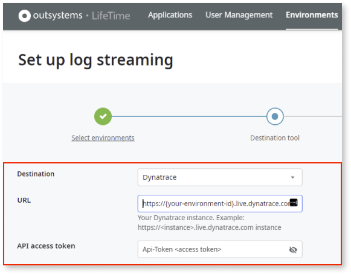
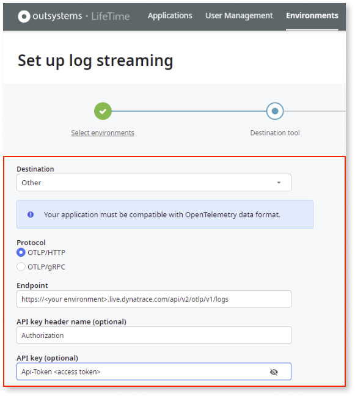

# Stream logs to Dynatrace

This article explains how you can set up log streaming from OutSystems applications to the **Dynatrace** APM tool.

## Prerequisites

For a complete list of prerequisites, refer to [Introduction to log streaming](intro.md#prerequisites).

## Set up log streaming

To configure the OutSystems log streaming service, using **Dynatrace** as the destination tool, follow these steps:

1. Get the Dynatrace SaaS endpoint.

1. Get the Dynatrace API token (must have the ingest logs permissions).

Once you've completed these steps, go to LifeTime and [configure the log streaming service](lifetime-streaming.md). Based on your Lifetime version, you can use one of the following options to configure the log streaming service.

* **For LifeTime version 11.22.0 and higher**

    You can select ``Dynatrace`` as the **Destination** with following paramaters:

    * **Destination**: ``Dynatrace``
    * **URL**: Dynatrace SaaS Endpoint  ``https://{your-environment-id}.live.dynatrace.com/api/v2/otlp/v1/logs``
    * **API access token**: ``Api-Token <access token>``

        

        

        Note: The new configuration format does not automatically update existing configurations. However, they remain functional without interruption.
        

* **For LifeTime version lower than 11.22.0**

    You can select ``Other`` as the **Destination** with the following parameters:

    * **Destination**: ``Other``
    * **Protocol**: ``OTLP/HTTP`` (**Note**: gRPC is not supported)
    * **Endpoint**: Dynatrace SaaS Endpoint  ``https://{your-environment-id}.live.dynatrace.com/api/v2/otlp/v1/logs``
    * **API key header name**: ``Authorization``
    * **API key**: ``Api-Token <access token>``

        

Large 'content' and 'exception.stacktrace' attribute values are truncated to 4,000 characters before streaming. For more information regarding limits followed while streaming to Dynatrace's ingestion API, refer to Dynatrace's documentation on [Ingest OpenTelemetry logs](https://docs.dynatrace.com/docs/extend-dynatrace/opentelemetry/getting-started/logs/ingest#ingestion-limits).

## Additional resources

[Export with OLTP.](https://www.dynatrace.com/support/help/extend-dynatrace/opentelemetry/getting-started/otlp-export)
