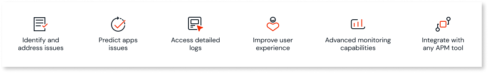
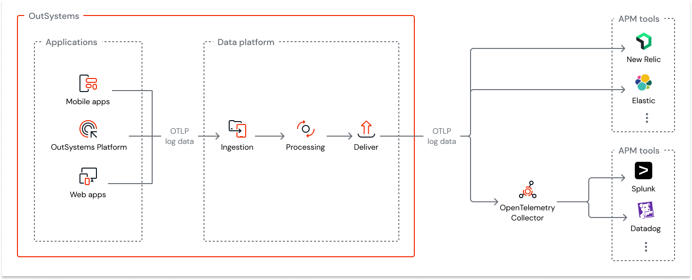

# Introduction to log streaming

## Log streaming

Log streaming support is only available for OutSystems Cloud deployments.

Log streaming is the process of continuously collecting and streaming log data to your Application Performance Monitoring (APM) or analytics tools in near real-time. With log streaming enabled, you can send a permanent stream of application and platform logs from applications developed with the OutSystems platform to various third-party APM tools and custom/data store tools, typically for analysis, monitoring, storage, and alerting purposes. Some examples of such tools that support the ingestion of OpenTelemetry log data are Elastic Cloud, Datadog, Dynatrace, Splunk, New Relic, and Amazon S3.

OutSystems adopts the [OpenTelemetry](https://opentelemetry.io/) standard to stream log data to various APM tools. OpenTelemetry is an [open-source](https://github.com/open-telemetry) observability framework comprising a collection of tools, APIs, and SDKs that you can use to instrument, generate, collect, and export log data to help analyze your applications' performance and behavior. OpenTelemetry is tool-agnostic, meaning it can be used with various commercial and open-source APM tools without significant configuration changes.

## Benefits of log streaming

One of the main purpose of implementing log streaming support for OutSystems apps is to improve the usability and availability of application and platform log data. Here are some key benefits of this feature:

* You can proactively identify and address issues before they impact your end users, minimizing downtime, improving system reliability, and enhancing user experience.

* You can detect anomalous application behavior and forecast future problems, enabling maximum availability with optimal performance of your applications.

* Your DevOps team can access detailed logs to trace the events leading to an issue, enabling them to troubleshoot, resolve problems quickly, and restore the system to optimal performance. The near real-time performance insights can also help reduce the mean resolution time.

* You can optimize your user experience and improve satisfaction ratings by closely monitoring when and where users' journeys are affected and why the problem occurred.

* You can build advanced application monitoring capabilities with easy application and platform log data availability.

* You can easily integrate your application with any APM tool, as most monitoring tools support data ingestion in OpenTelemetry format.

## Streaming log data

OutSystems uses [OpenTelemetry Protocol (OTLP)](https://opentelemetry.io/docs/specs/otel/protocol/) that defines the encoding, transport, and delivery mechanism of log data generated by OutSystems apps and platform. Here's an overview of the process of collecting and streaming log data.

1. The apps and platform generate log data.

2. The log messages are converted to OTLP format and are then processed further.

3. The OTLP messages are then exported in the binary format [Protobuf](https://protobuf.dev/) over HTTP or gRPC, depending on the transport protocol supported by the APM tool. The messages are sent to the APM tools in batches with multiple records every 100 ms and aren't compressed. The size of these messages varies between 1100 bytes and 1700 bytes.

* For a scenario of temporary unavailability from the APM tool destination, failed batches are queued and retried for up to 48 hours in order to avoid data loss during this period. Such scenarios may delay the delivery of logs.
* HTTP 500/gRPC Internal Error and HTTP 413 Payload Too Large responses from the APM tool ingestion will cause the current batch to be dropped.
* APM tools may implement rules and limits to the ingestion, which are followed by OutSystems Log Streaming when adherent to the OpenTelemetry protocol, but unexpected changes and other restrictive limits may impact the streaming service and prevent data from being ingested in the APM tool.

## Requirements for use

Before you start streaming logs, ensure you have:

* Enabled [Log separation](../../setup-infra-platform/setup/logging-db/logs-separation-cloud/intro.md). 

* Installed Platform Server version 11.23.1 or higher.

* Installed LifeTime version 11.19.0 or higher.

## Supported tools

OutSystems supports the following tools:

* Elastic Cloud

* New Relic

* Splunk

* Datadog

* Dynatrace

* Amazon S3

Note that any other tool compatible with the OpenTelemetry protocol and OTLP logs format should typically be capable of interpreting the OutSystems logs.

For tools that don't support native ingestion of OTLP log data such as **Datadog**, **Splunk**, **Amazon S3**, you must [set up an OpenTelemetry collector](configure-collector.md).

IP whitelisting is not supported as OutSystems origin IPs might change.

## Supported log data

The APM tool receives application logs, platform logs, and all logs that are available in the OutSystems management console (Service Center), such as:

* Errors

* General

* Traditional Web Requests

* Screen Requests

* Service Actions

* Integrations

* Extensions 

* Timers

For detailed information about logged data, refer to [log data formats](detailed-log-map.md).

## What's next

For detailed information on streaming logs to different APM tools, refer to:

* [High-level process for streaming log data](process.md)

* [Stream log data to Elastic Cloud](elastic.md)

* [Stream log data to Splunk](splunk.md)

* [Stream log data to New Relic](new-relic.md)

* [Stream log data to Dynatrace](dynatrace.md)

* [Stream log data to Datadog](datadog.md)

* [Stream log data to Amazon S3](amazon-s3.md)

## Further reading

Here are some additional helpful documentation, links, and articles: 

* [OpenTelemetry](https://opentelemetry.io/)

* [OpenTelemetry protocol](https://opentelemetry.io/docs/specs/otel/protocol/)

* [OpenTelemetry collector](https://opentelemetry.io/docs/collector/)

