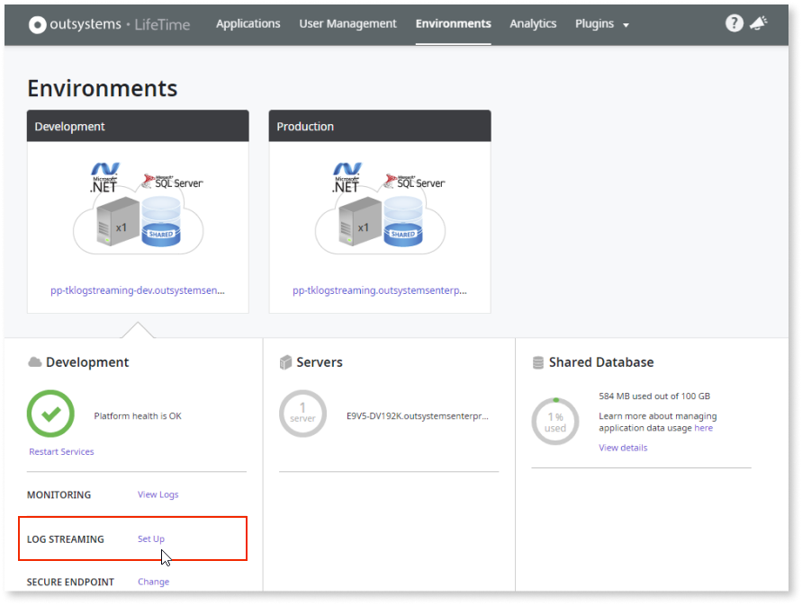
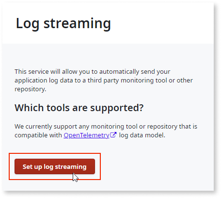
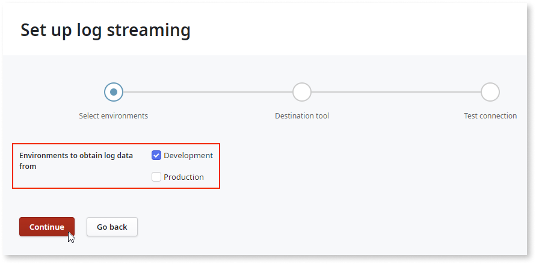
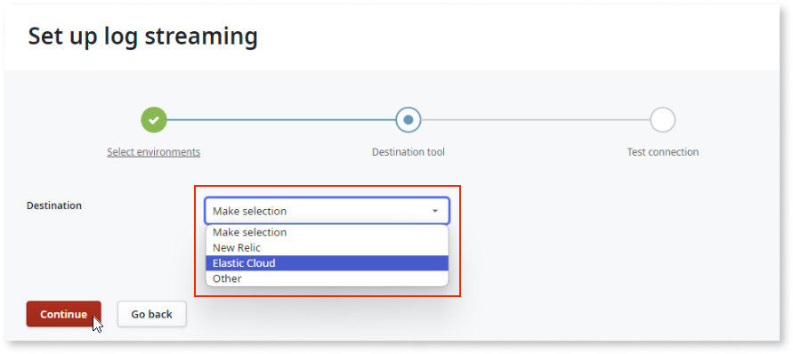
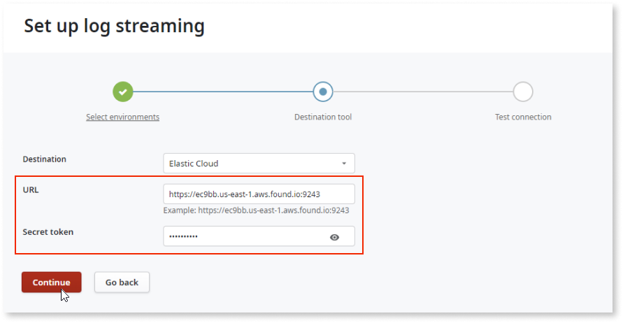
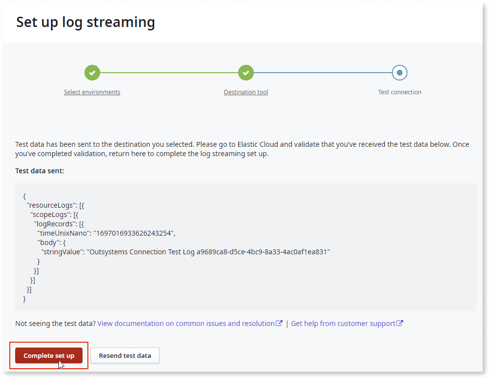
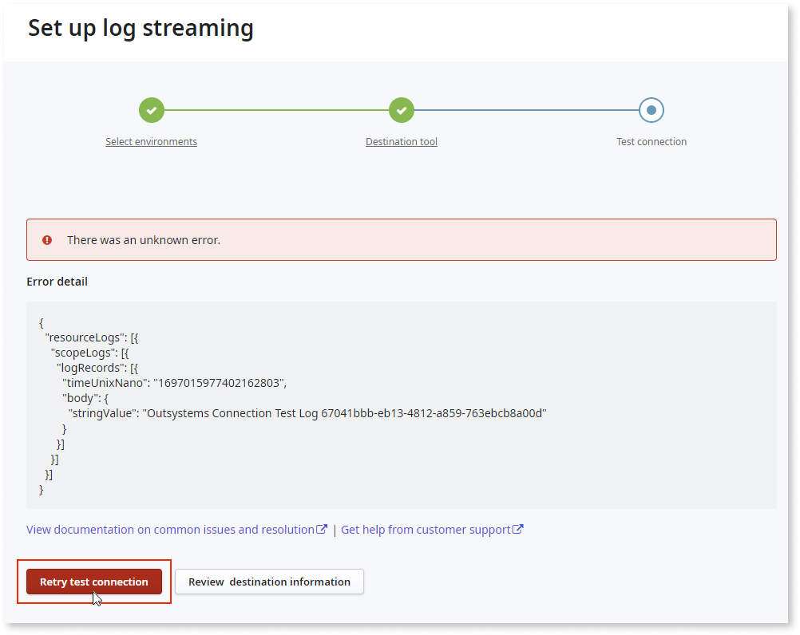

# Configuring the log streaming service in LifeTime

To enable log streaming from the O11 app to the corresponding APM tool,you must configure the APM server details and the authentication credentials. This article explains how you can configure the log streaming service in LifeTime for a specific APM tool.

## Prerequisites

* Before configuring log streaming service in LifeTime, refer to [Requirements for use](./intro.md#requirements-for-use).

* Ensure that user have **Admin** built-in role.

## Configure LifeTime

This example uses **Elastic Cloud** as the destination tool.

1. Go to **LifeTime** > **Environments**.

1. Click **Log Streaming** - **Set up**.

    

1. Click **Set up log streaming**.

    

1. Select the environment and click **Continue**.

    

1. Select the destination tool and click **Continue**. 

    

1. Enter the URL and the secret token and click **Continue**.
    
    The connection is tested, and the test data is sent to the destination tool.
    
    

1. If the connection is successful, click **Complete set up**.

    **Note**: Before you complete the setup, validate that the test data has arrived at the destination tool.  For Elastic Cloud, see [View Logs](elastic.md#view-logs)

    
       
    If the connection is not successful, you can retry the test connection or review the destination information to ensure it’s correct.

    

## Next steps

For detailed information on streaming logs to different APM tools, refer to:

* [Stream log data to Elastic Cloud](elastic.md)

* [Stream log data to Splunk](splunk.md)

* [Stream log data to New Relic](new-relic.md)

* [Stream log data to Dynatrace](dynatrace.md)

* [Stream log data to Datadog](datadog.md)

* [Stream log data to Amazon S3](amazon-s3.md)
