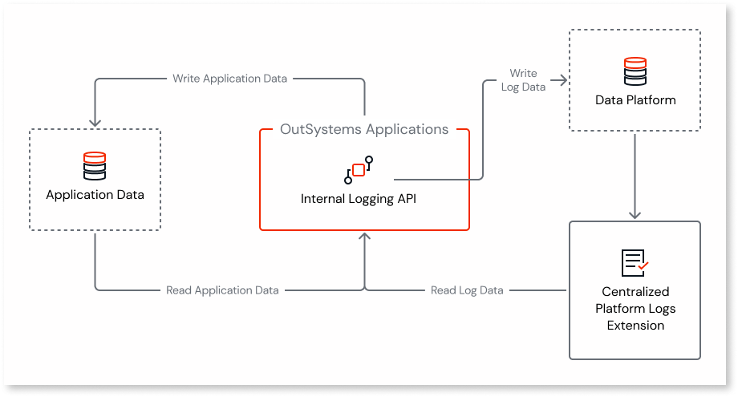
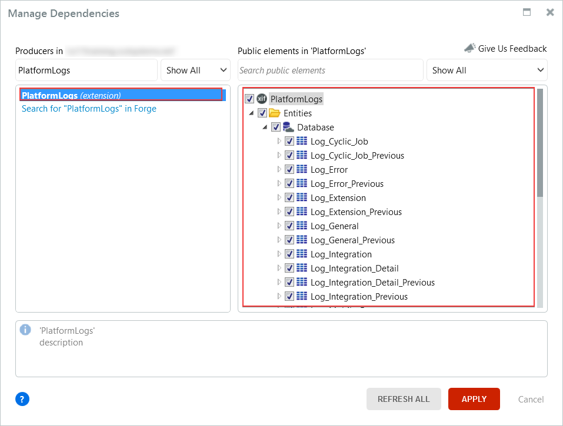

# Logging database and architecture

The logs enable you to monitor the performance and availability of the platform and your applications. Use the logs to troubleshoot the issues and to make decisions about maintenance tasks.

The OutSystems logging mechanism is highly scalable. It separates logs by types into multiple database tables, rotates logic that enables retention while preventing indefinite growth. OutSystems optimizes the tables for the quick logging and simple consultations.

The logs in the OutSystems platform flow from the apps to the database through an asynchronous mechanism. Bulk writing is used to optimize performance and minimize disruption of the application logic. This enables the platform to automatically generate detailed logging information and efficiently save it.

OutSystems 11 enables you to store the log data in a separate database, reducing the impact that log-writing operations could have on running applications while application data is being accessed. This also enables applicable database maintenance tasks to address the business concerns in terms of data criticality and security for the two types of data.

Each OutSystems 11 application writes its own log entries using an internal logging API, making sure that user requests aren't blocked while these logs are being written. This logging API collects log information produced by the application and sends it to the log database.

It's important to note that the Deployment Controller Service writes directly to the database tables, but Service Center consults only the database views.

This section of the documentation is an overview of the log architecture and provides the reference for the log database views. If you need information about the tables in the database, you should inspect the database manually.

You can consult the logs in Service Studio. Reference the **PlatformLogs Extension** in the **Manage Dependencies** window, then load the data from the Entities in **Data** > **Entities** > **PlatformLogs**.

