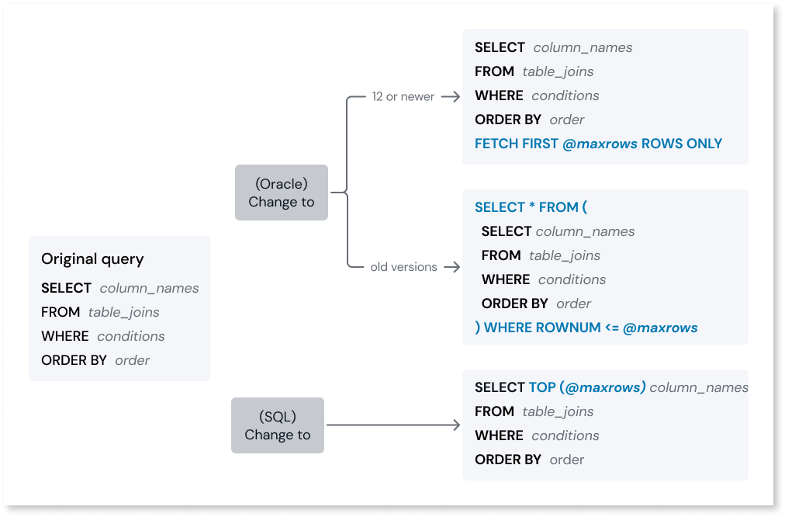

---
tags:
summary: The article explains how to limit the number of records fetched from a database to optimize resource usage
locale: en-us
guid: 1aecc52f-daef-42a3-ab1b-12e31f086dcb
app_type: traditional web apps, mobile apps, reactive web apps
platform-version: o11
figma: https://www.figma.com/file/rEgQrcpdEWiKIORddoVydX/Managing%20the%20Applications%20Lifecycle?node-id=928:599
---
# Control the number of records fetched from the DB

In an app usually only a fixed set of rows is returned when listing information. Additional records are fetched with the use of pagination or infinite scroll mechanism. Your Aggregates or SQL queries should always take into account the required number of records. 

## Impact

Not limiting the number of rows in a query results in unnecessary CPU use, IO consumptions on the database, and unwanted memory take on the Web Server - just to hold the result of the entire query. Imagine fetching 1K records in every call when all you need is the first 10 records.

## Best practices

With Aggregates:

* Set the **Max. Records** property of the aggregate to the required usage.

* If required, the **&lt;Aggregate&gt;.Count** contains the total count of records, without the **Max. Records** limitation.

With SQL queries:

To limit the number of rows, to the rows required in a SQL query, it isn't enough to set the **Max. Records**. This doesn't change the query itself to limit the number of rows (it limits the number of rows that are copied to the output record list, so there is still an unnecessary load on the database).

The solution is to control the number of rows inside the query:

By changing your queries to limit the number of retrieved rows, you no longer rely on the **&lt;Query&gt;.Count** property to get the correct count of rows complying with the original query conditions and joins. If you need the total number of rows, you must make a separate query to do that count.
