# Handling technical debt with OutSystems

Since Ward Cunningham coined the phrase "technical debt" in 1992, it has sometimes been taken as an excuse for releasing quick-and-dirty code in the interests of development speed. Instead, it's better understood as an explanation for why it's sometimes OK to get a workable solution out the door — with a commitment to find an optimal one as soon as possible, and, in this way, repay a technical debt.

However it's defined, taking on technical debt plays an important part in achieving excellence — as long as it's redeemed by bringing everything up to spec before it leads to a cascade of future problems. Like the financial world, from which this metaphor is drawn, ignoring long-term debt ultimately leads to overburdened, bankrupt enterprise software.

Even the best code has room for improvement — but, before enhancements can be tackled for the next release, disruptive technology may mature, markets may pivot, and additional user needs may be identified. Paying down a large backlog of technical debt at the beginning of a development cycle may block the quick response required to deal with new opportunities and challenges.

## OutSystems versus technical debt

Applications built with OutSystems rely on standard architectures and frameworks. They don’t require proprietary components, runtime engines, or interpreters — so technical debt is effectively limited before development even begins.

Software deployment using classical programming methods typically comprises modifying database files, pre-processing code, compiling it, assembling it, and then linking the result to all of its function calls. Bugs in any step may only be revealed as the result of a failed compilation, which triggers a manual code review for troubleshooting.

OutSystems orchestrates the entire deployment process using a combination of automation, AI, and analytics to identify architecture errors, faulty logic, and broken dependencies — during development, in real time. OutSystems preempts failed compilations by either applying corrective measures automatically or directing the developer to the source of the error — along with a suggestion about how to fix it. Modules can only be published when it will function correctly.

Correct functioning, however, doesn't necessarily mean efficient functioning. While a short-term solution may solve the immediate problem, it may also leave a technical debt, in the form of an app that's difficult to maintain and costly to change. The OutSystems AI Mentor Studio provides a high-level analysis of your app, marks areas for improvement, and facilitates unhindered growth.

This paper discusses how OutSystems helps reduce technical debt during development and assists in building a best-practices architecture to efficiently deal with it in the future.

## OutSystems from development to deployment

OutSystems promotes and encourages the use of Agile methodologies, so it's extremely important to allow developers to be highly productive and efficient — not only when creating applications but also when changing them to adapt to new business needs.

[Service Studio](https://success.outsystems.com/Documentation/11/Getting_started/Service_Studio_Overview), the Outsystems visual development environment, gives developers the tools they need to achieve these goals.

### TrueChange™

When a developer makes changes to a model, the TrueChange™ engine provides immediate feedback on its impact. By inspecting the model for consistency — a method similar to syntactic and semantic analysis used in classical coding — TrueChange checks if the model is well-formed and well-typed, and, at the same time, detects many other problems, including those that may lead to performance issues, marking them accordingly for followup.

In the image below TrueChange has identified two errors, noted three unused arguments and given a warning about a security concern. Clicking links in the TrueChange tab brings the developer to the issue to be corrected. **1-Click Publish** remains disabled until all errors have been resolved.

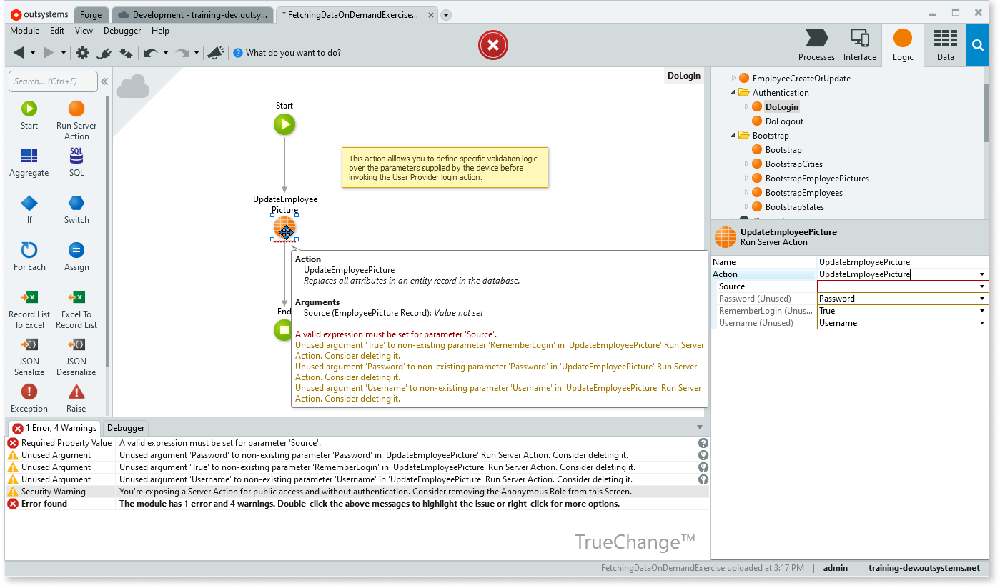

Developers may also [debug applications](https://success.outsystems.com/Documentation/11/Developing_an_Application/Troubleshooting_Applications/Debugging_Applications) by setting [breakpoints](https://success.outsystems.com/Documentation/11/Developing_an_Application/Troubleshooting_Applications/Debugging_Applications/Breakpoints) at specific points in a module and then running the logic step-by-step to find any issues in logic design.

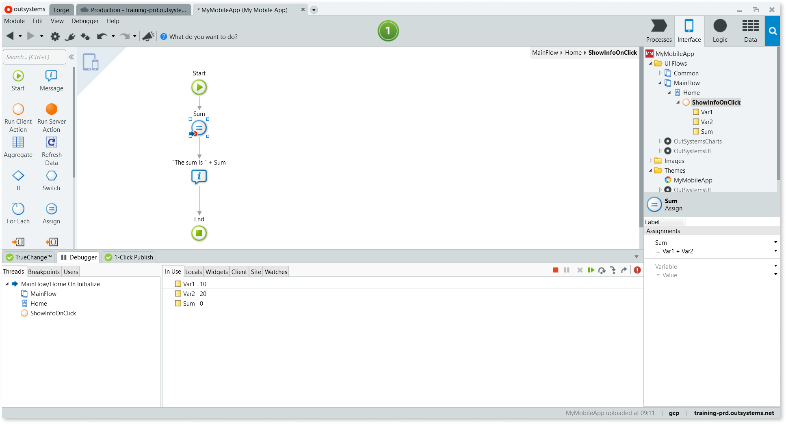

The **Debugger** tab shows app information, including variable and runtime values, along with current debugging context (current thread, event name, UI flow, screen and action). The developer can use the **Debugger Toolbar** and the menu to track down and correct the problems.

### Compare and Merge

OutSystems uses a versioning system that labels modules with an incremental version number upon each successful publish. In environments where many developers work on the same module at the same time, **1-Click Publish** first initiates a comparison of the new code with the existing code before going forward.

[Compare and Merge](https://success.outsystems.com/Documentation/11/Developing_an_Application/Merge_the_Work) first tries to merge new code with the changes that other developers published in the meantime. If automatic integration isn´t possible, the developer can review the results in the **Compare and Merge** window, as seen in the image below. Drilling down into conflicts, shown in red, displays the changes between the versions. Once the conflicts have been reconciled and all the merges approved, the app can then be published.

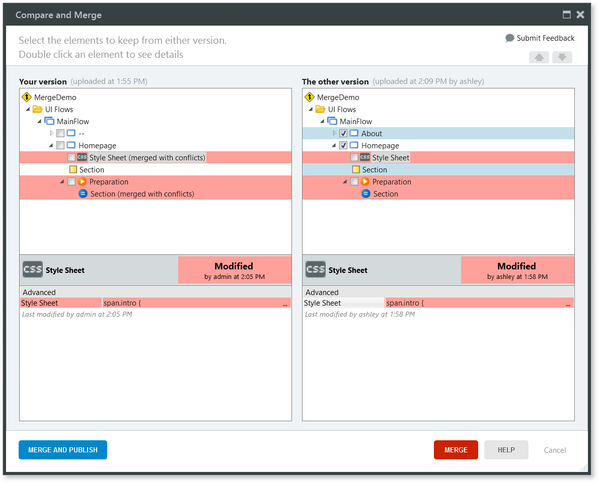

## AI Mentor Studio

Enterprises have moved away from legacy monolith systems — where a single stack contains all of the functionality of an application — so they can more quickly answer customer needs, respond to changing operational requirements, and meet business goals and objectives.

Breaking the monolith means breaking out functionality and services so they can be modified independently. This allows for the frequent release of new features and the ability to roll out updates as soon as vulnerabilities are discovered.

This is only one part of the task. These services must continue to work together, and some pieces broken off from the original monolith may require ever greater effort as time goes on to keep the app running, turning into mini-monoliths themselves. This is technical debt _par excellence_: in down-to-earth developer lingo, spaghetti architecture.

Among the main issues of this technical debt include the following:

* **Poor service abstraction**: Services for core business concepts aren't correctly isolated and abstracted. Business rules are spread over different systems, making them hard to reuse, and code reuse has very little structure.
* **Unmanageable dependencies**: Components of the system aren't correctly isolated from each other, so updating or replacing a system has a snowball effect on other systems.
* **Inflexible, slow-moving legacy components**: Legacy systems can be complex and inflexible, and may include obsolete technology. Adapting such systems to business changes is slow and difficult. And the accumulation of core information and system dependencies over time can hinder any replacement.

A well-considered application architecture provides patterns and techniques for design and development: a roadmap and best practices for building a well-structured app. Beyond that, application architecture helps drive consensus among all players, supports planning, facilitates change, and manages complexity, all of which reduces risks and successfully manages technical debt.

It's fundamental to align architecture with business goals: to translate business needs and concepts into an architecture that allows developers to evolve and scale up with business, while ensuring independent life cycles between different lines of business.

While developing a conceptual design for application architecture is beyond the scope of the article, information about this subject can be found in the links below:

* [Designing the Architecture of Your OutSystems Applications](https://success.outsystems.com/Support/Enterprise_Customers/Maintenance_and_Operations/Designing_the_Architecture_of_Your_OutSystems_Applications)
* [Web and Mobile Architecture with AI Mentor Studio (presentation)](https://www.outsystems.com/events/tech-talks/architecture-dashboard/)
* [Integration Patterns for Core Services Abstraction](https://success.outsystems.com/Support/Enterprise_Customers/Maintenance_and_Operations/Designing_the_architecture_of_your_OutSystems_applications/05_Integration_Patterns_for_Core_Services_Abstraction)
* [Domains and Services Architecture](https://www.outsystems.com/learn/lesson/1696/domains-and-services-architecture)

### The architecture canvas

The architecture canvas, as used by the OutSystems [AI Mentor Studio](https://success.outsystems.com/Documentation/Architecture_Dashboard/Introduction_to_Architecture_Dashboard), is a multi-layer framework that provides a systematic approach to speed up architecture design. It promotes the correct abstraction of reusable services and components, maximizes independent life cycles among all the parts of your architecture by setting the correct mutual dependencies, and minimizes the impact of changes, making it much easier to maintain and evolve your apps.

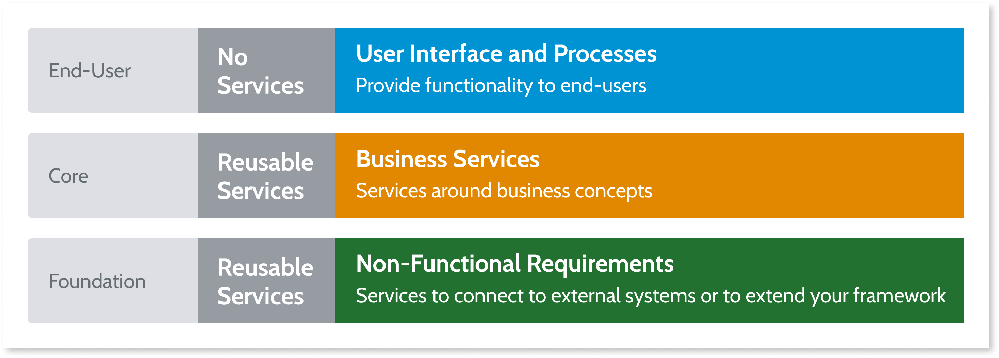

All modules are sorted into layers as follows:

* Foundation layer
    * Business agnostic, reusable, non-functional modules
    * Connections to external systems, such as SAP and external databases
    * Framework extensions, such as libraries, reusable UI patterns and themes
    * Non functional requirements, such as auditing
* Core layer
    * Systems agnostic (modules on the foundation layer abstract integration details)
    * Reusable services around business concepts
    * Business entities, business rules, business transactions, business widgets
    * Recommendations for architects:
        * No front-end screens
        * Read-only entities (write via APIs)
* End-user layer (to support user interaction)
    * User interfaces and processes, reusing core and library services to implement the user journey
    * Independent end-user applications (to ensure lifecycle independence)
    * Recommendations for architects:
        * No business logic
        * No core entities

The figure below illustrates how an OutSystems app with a well-formed architecture integrates with a typical enterprise IT ecosystem.

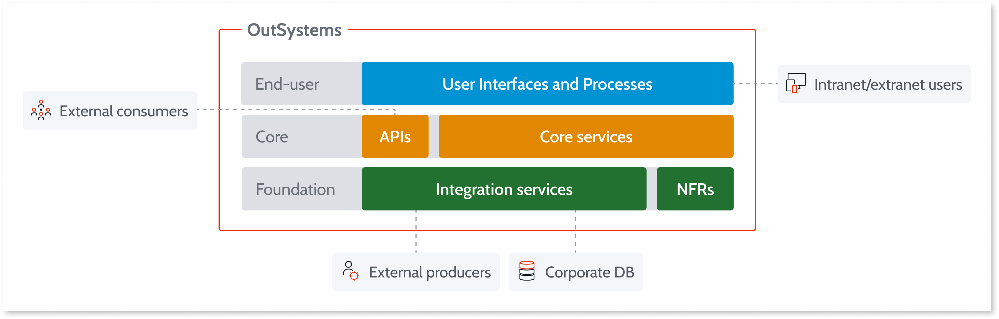

### Architecture canvas validation

[AI Mentor Studio](https://success.outsystems.com/Documentation/Architecture_Dashboard/Introduction_to_Architecture_Dashboard) is the OutSystems technical debt monitoring tool. Powered by [AIFusion™](https://www.outsystems.com/evaluation-guide/what-is-aifusion/) and [CodeDNA](https://www.outsystems.com/blog/posts/ai-software-development/), it automatically performs code and runtime analysis before recommending solutions for improving the performance, security, architecture, and user experience of applications.

A guided refactoring capability powered by the CodeDNA engine identifies the opportunities for refactoring and code duplication across the factory, pointing architects and teams to the right points to make these improvements. Code duplication is one of the top technical debt issues. The guided refactoring capability is unique in our industry. It uses AI to detect, with incredible accuracy, where teams should focus on refactoring and ranks them by importance.

AI Mentor Studio uses the following validation rules to evaluate the architecture of your applications:

* No upward references
* No side references among end users
* No circular references between the foundation and core layers

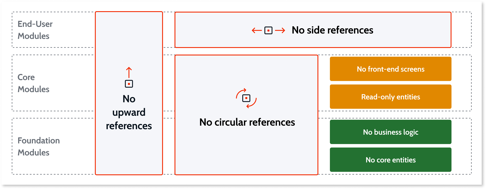

For an in-depth discussion of these rules for architecture design see the Architecture design [appendix](#architecture-design-for-drchitecture-dashboard) below.

### Using the AI Mentor Studio

The AI Mentor Studio is designed for:

* [Architects](https://success.outsystems.com/Documentation/Architecture_Dashboard/Getting_started_with_Architecture_Dashboard/Getting_started_as_an_architect) who need an overview of the portfolio so they can focus on keeping technical debt under control  
* [Team leads](https://success.outsystems.com/Documentation/Architecture_Dashboard/Getting_started_with_Architecture_Dashboard/Getting_started_as_a_team_lead) who need an overview of the teams work so they can focus on ensuring the delivery of quality apps  
* [Developers](https://success.outsystems.com/Documentation/Architecture_Dashboard/Getting_started_with_Architecture_Dashboard/Getting_started_as_a_developer) who need to make sure their code adheres to best practices and doesn’t introduce any performance or security issues  

AI Mentor Studio provides an integrated, bird’s eye view of technical debt across an entire portfolio of applications and the interdependencies between modules in the developers’ environment. The OutSystems AI engine classifies every architecture module into its correct class, automating architecture discovery. A heat map visualization of mild-to-severe problem areas helps IT leaders identify problem areas quickly and to prioritize them accordingly.

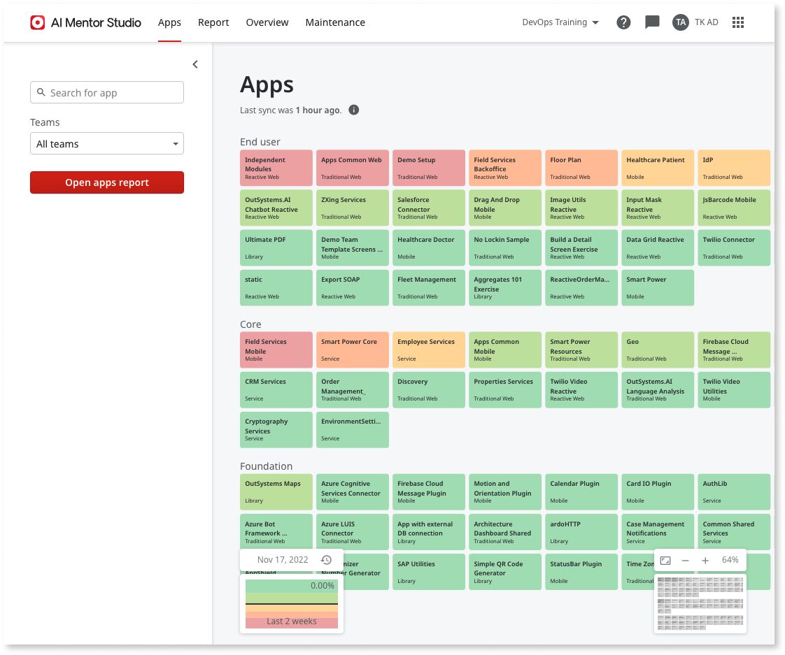

Clicking an app shows its dependencies and technical debt with other applications.

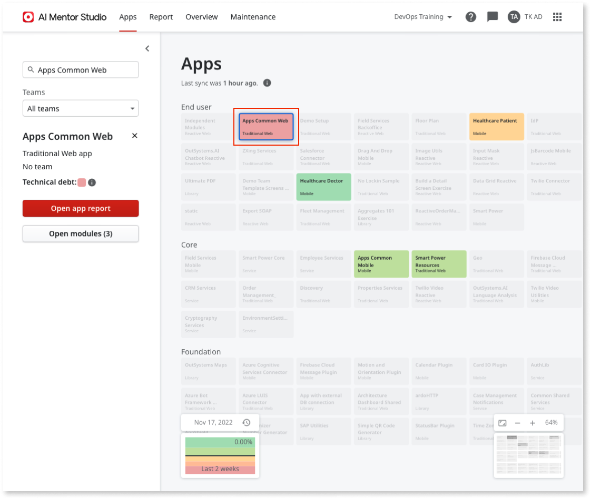

Double-clicking one of the modules allows you to drill down into any identified issues, which are grouped by **Architecture**, **Performance**, **Maintainability** and **Security**, so you can quickly understand what's going on in that particular area.

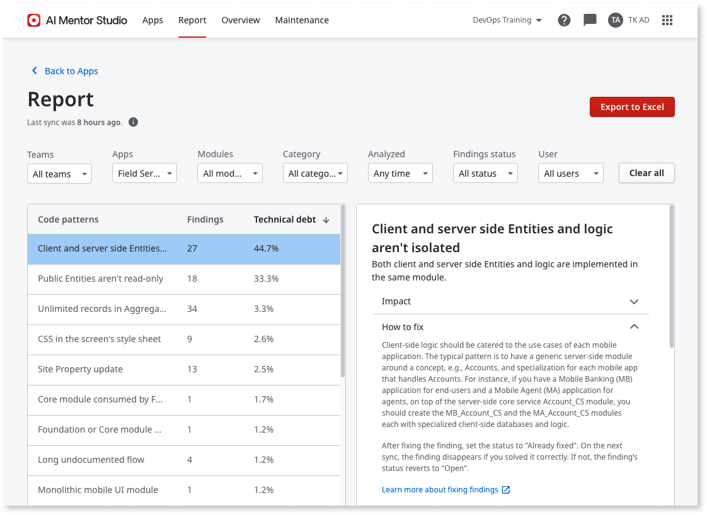

AI Mentor Studio explains the impact of this finding and gives a recommendation about how to fix it.  

## Architecture design for AI Mentor Studio

This appendix contains a detailed discussion of rules for canvas validation and application composition. For more information on AI Mentor Studio’s analysis patterns, check [Code Analysis Patterns](https://success.outsystems.com/Documentation/11/Managing_the_Applications_Lifecycle/Manage_technical_debt/Code_Analysis_Patterns).

### Validation rules

The following validation rules are used for correct architecture design of all of the modules in your development environment.

#### No upward references

An upward reference tends to create a cluster where any two modules, directly or indirectly, have a circular dependency.

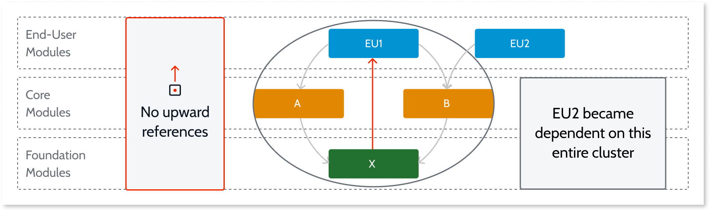

In the example above, foundation module X — by definition non-functional — shouldn't depend on functional or end-user modules.

Another unexpected effect of this upward reference from foundation module X is that end-user 2 (EU2), by consuming core module B, makes it dependent on EU1’s cluster. Aside from giving ER2’s runtime an unnecessarily large footprint, it will also be impacted by changes made in modules which have no relevance to its function.

#### No side references between end users

End-user modules shouldn't provide reusable services, as seen in the figure below. The side reference between EU1 and EU2 means that their lifecycles are linked and they can only be released at the same time.

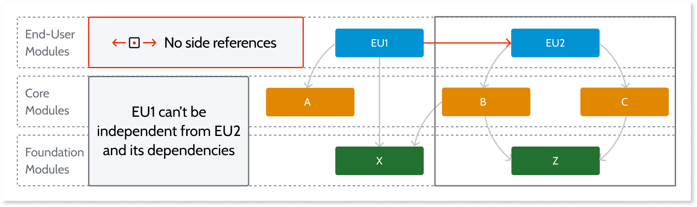

Maintaining correct isolation between end-user modules give them independent lifecycles with a versioning pace set by their different sponsors or project teams.

#### No circular references

A cycle is always undesirable, since it brings unexpected impacts and hard-to-manage code. A cycle between modules indicates that the concepts aren't correctly abstracted.

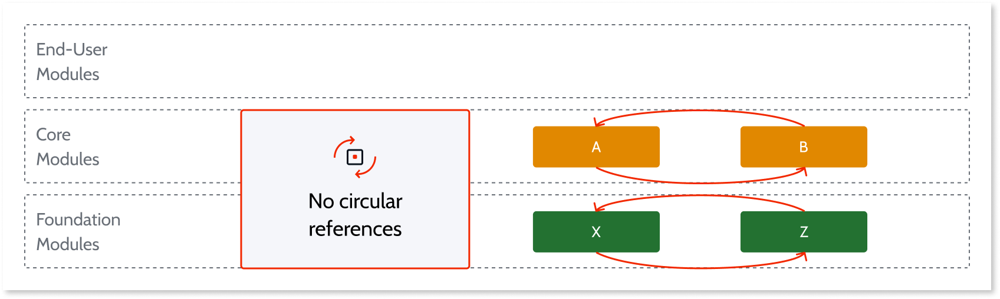

### Application composition rules

A business application is generally understood as a computer program used to  perform one or more business functions. In the context of architecture design in OutSystems, however, an application is considered a set of modules that constitutes a minimal deployment unit.

So, in addition to an end-user application, which fits the common definition for a business app, developers also deploy foundation applications, composed of a set of modules other apps can use for foundation services, and, in a like manner, core apps to supply core services.

The type of application is defined by the modules in the topmost row, as can be seen in the figure below,

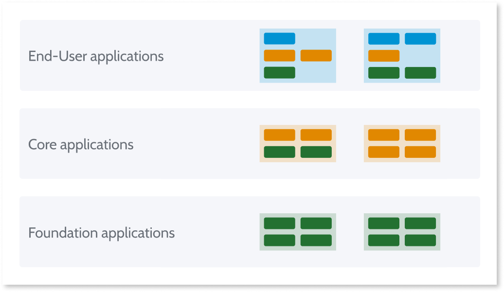

Just as modules must be designed using the validation rules, so composing applications from these well-formed modules must be layered in the same way.

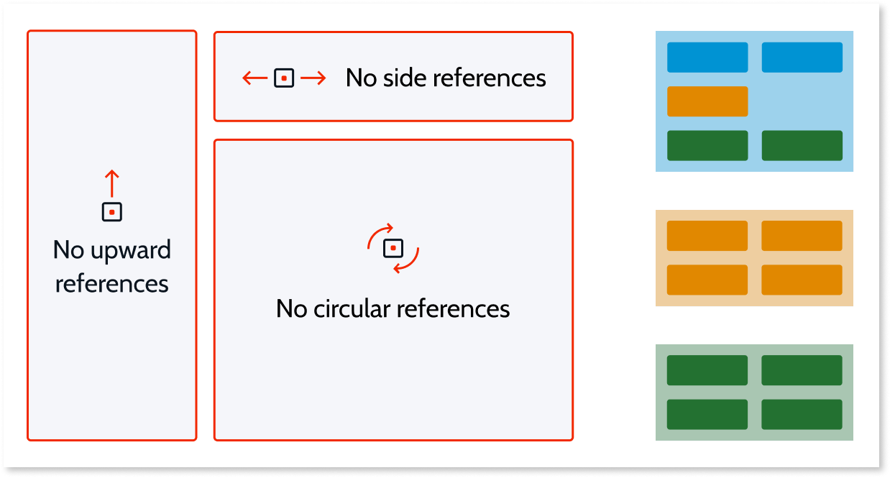

* No upward references
* No side references between end users
* No circular references

#### No upward references in applications

The example below shows two end-user applications. Both the first and second project are well formed. However, the third project, which combines both of them together, has an unacceptable upward reference in its design.

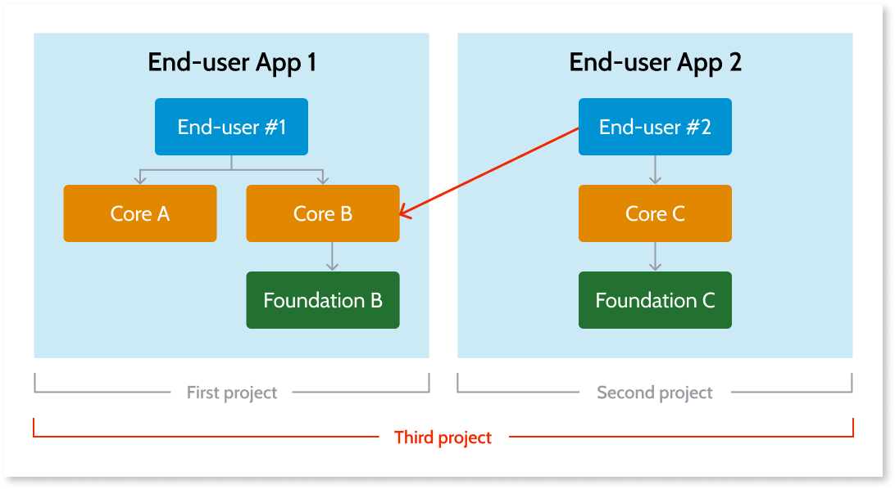

Because end-user applications shouldn't provide services to other applications, this validation error is corrected by creating a new core application that isolates the common service to which Application 1 and Application 2 connect, as seen in the figure below:

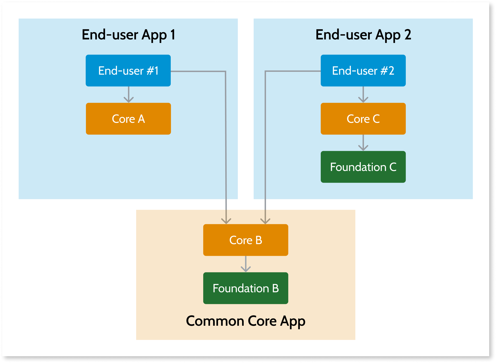

#### Clarify ownership

Having more than one owner for an application results in complex deployment management, as accountability for what has been changed becomes unclear, as can be seen in the left side of the figure below.

A solution, seen on the right side of the figure, splits the app so ownership is clearly defined.

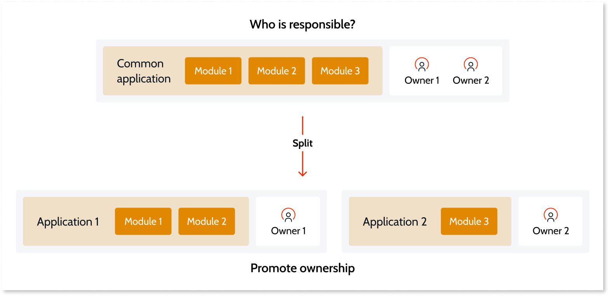

#### Avoid mixing sponsors

For the same reason, avoid mixing sponsors. As an example, consider a portal that allows executing simulations over different insurance lines of business. If all LOBs are under the same application, none of them can be released independently, meaning that the slowest LOB dictates the release cycle.

The right side of the figure shows that creating independent applications per line of business — and a portal application with a fourth sponsor — allows each LOB to determine its own pace of delivery.

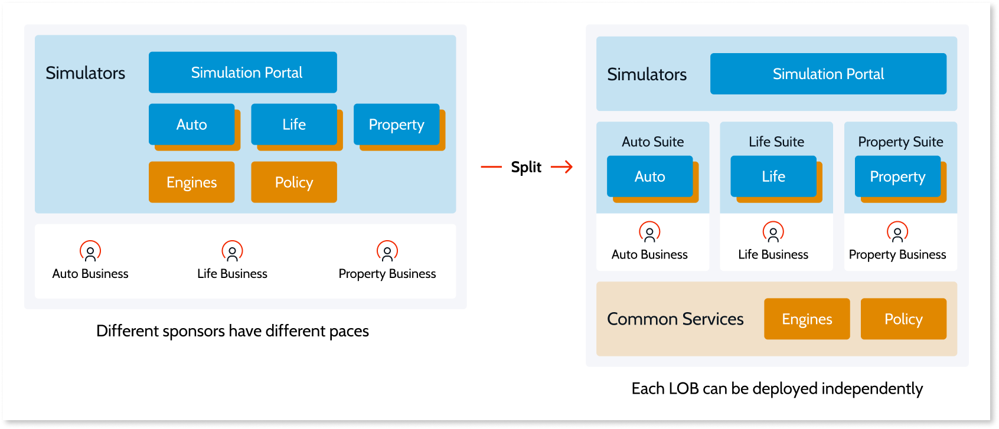

## Summary

OutSystems applications rely only on standard architectures and frameworks and require no proprietary components, runtime engines, or interpreters. For these reasons technical debt is effectively limited before development even begins.

When developers write new code, or make changes to existing code, OutSystems provides immediate feedback on its impact. Corrective measures are applied automatically if possible. Otherwise the source of the error is linked, along with suggestions about how to fix it. This eliminates compilation errors, since an OutSystems app can't be published unless they function correctly.

Correct functioning, however, doesn't necessarily mean efficient functioning. While a short-term solution may solve the immediate problem, it may also leave a technical debt, in the form of an app that's difficult to maintain and costly to change. The OutSystems AI Mentor Studio provides a high level analysis of your app, highlighting areas for improvement, and facilitates unhindered growth.
