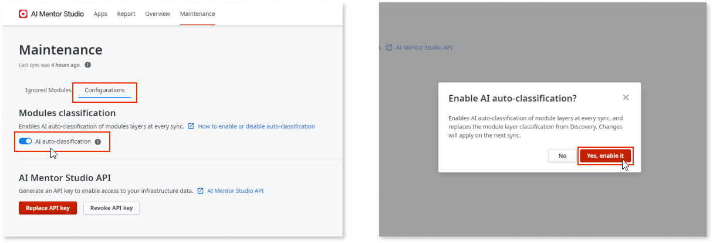
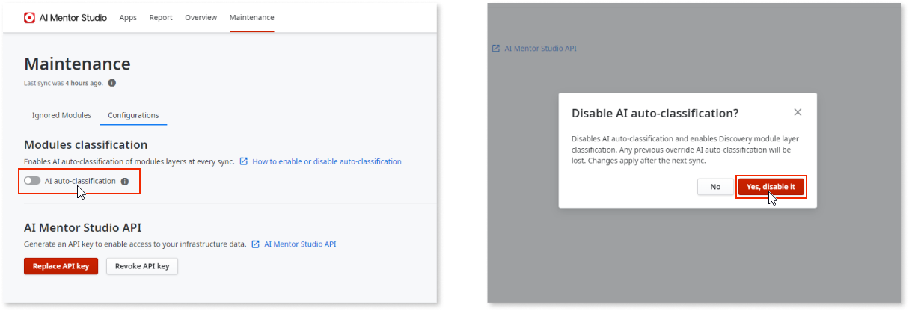

# How to enable or disable auto-classification

Architecture Dashboard is now AI Mentor Studio.

AI auto-classification allows you to onboard infrastructures into the AI Mentor Studio and classify each module so that it fits into the right architecture layer.

## Prerequisites

Before enabling or disabling auto-classification in AI Mentor Studio, make sure that the following requirements are met:

* Your infrastructure uses version 3.0 (or higher) of the AI Mentor Studio probes.

* You have [full control permissions assigned as a default role](how-works.md#maintenance-and-operations-permissions)

## Enable or disable auto-classification

To enable or disable auto-classification, follow these steps:

1. Click the **Maintenance** tab.

    

1. On the **Maintenance** screen click **Configurations** and, do one of the following: 

    * To enable the AI auto-classification, turn the **AI auto-classification** toggle on, and in the **Enable AI auto-classification** popup, click **Yes, enable it**. 

        

    * To disable AI auto-classification, turn the **AI auto-classification** toggle off, and in the **Disable AI auto-classification** popup, click **Yes, disable it**.

        
