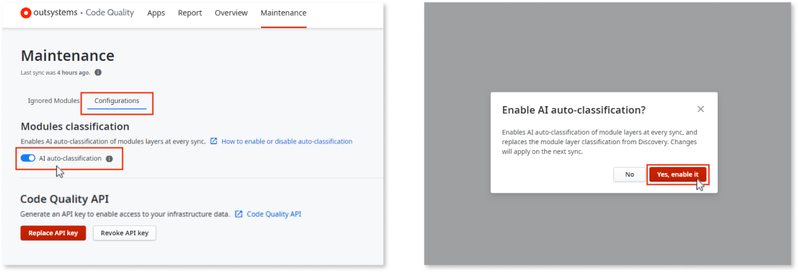

---
tags:
  - AI
  - Architecture
  - Infrastructure
  - Mentor
  - Mentor Studio
  - Settings
  - Technical Debt
summary: 'AI auto-classification in Code Quality OutSystems 11 (O11): enable or disable it via Maintenance > Configurations with probe v3.0+ and full control permissions.'
locale: en-us
guid: 1b423f33-a40a-4659-a633-dad0d32c6432
app_type: traditional web apps, mobile apps, reactive web apps
platform-version: o11
figma: https://www.figma.com/file/rEgQrcpdEWiKIORddoVydX/Managing%20the%20Applications%20Lifecycle?node-id=2076:6304
audience:
  - Platform administrator
outsystems-tools:
  - code quality
coverage-type:
  - apply
isautopublish: true
---

# How to enable or disable auto-classification

AI Mentor Studio is now Code Quality.

AI auto-classification allows you to onboard infrastructures into the Code Quality and classify each module so that it fits into the right architecture layer.

## Prerequisites

Before enabling or disabling auto-classification in Code Quality, make sure that the following requirements are met:

* Your infrastructure uses version 3.0 (or higher) of the Code Quality probes.

* You have [full control permissions assigned as a default role](how-works.md#maintenance-and-operations-permissions)

## Enable or disable auto-classification

To enable or disable auto-classification, follow these steps:

1. Click the **Maintenance** tab.

    

1. On the **Maintenance** screen click **Configurations** and, do one of the following:

    * To enable the AI auto-classification, turn the **AI auto-classification** toggle on, and in the **Enable AI auto-classification** popup, click **Yes, enable it**.

        

    * To disable AI auto-classification, turn the **AI auto-classification** toggle off, and in the **Disable AI auto-classification** popup, click **Yes, disable it**.
