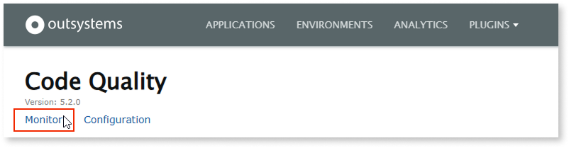
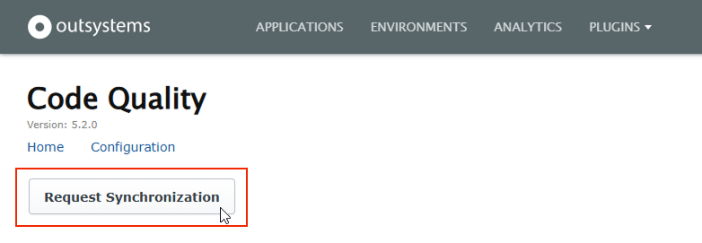

---
tags:
  - Data Synchronization
  - Infrastructure
  - Lifecycle
  - Monitoring
  - Technical Debt
  - Troubleshooting
summary: Explore how to request unscheduled data synchronizations in OutSystems 11 using Code Quality.
locale: en-us
guid: b67d9ffc-b28f-4e00-8ffc-6544f9d66812
app_type: traditional web apps, mobile apps, reactive web apps
platform-version: o11
figma: https://www.figma.com/file/rEgQrcpdEWiKIORddoVydX/Managing%20the%20Applications%20Lifecycle?node-id=929:744
audience:
  - Platform administrator
outsystems-tools:
  - code quality
  - lifetime
coverage-type:
  - apply
isautopublish: true
---

# How to request a synchronization

AI Mentor Studio is now Code Quality.

Synchronization of data between the Code Quality LifeTime probe and the Code Quality SaaS occurs every 12 hours, but you may also request unscheduled synchronizations.

There's a daily limit to the number of unscheduled synchronization requests that Code Quality can process for each infrastructure. You can request up to 5 unscheduled synchronizations after each scheduled synchronization.

To request an unscheduled synchronization, follow these steps:

1. Go to the Code Quality LifeTime plugin (`https://<lifetime_environment>/CodeQualityProbe/`) and select **Monitor**.

    

1. Select **Request Synchronization**.

    

After these steps, the synchronization request enters the **Outbound Queue** as **SyncRequest**.

Select **Refresh** to update the queues and check changes to the status of **SyncRequest**.

