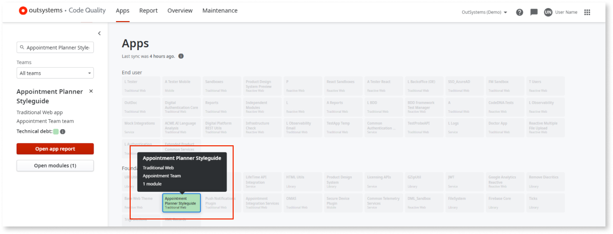
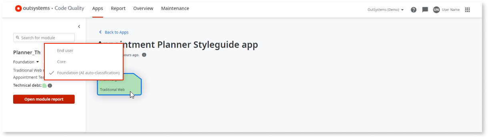

# How to change module classifications

AI Mentor Studio is now Code Quality.

You can change a module's classification in the canvas. However, by changing the classification of a module, the classification of the app may be affected. OutSystems AI model receives this reclassification.

## Prerequisites

Before changing a module’s classification in Code Quality, make sure that the following requirements are met:

* You have [enabled AI auto-classification](how-enable-autoclass.md).

* You have [full control permissions assigned as a default role](how-works.md#maintenance-and-operations-permissions)

## Change module classifications

To change a module’s classification, follow these steps:

1. In the Code Quality canvas, double-click the app that contains the module you want to reclassify.

    

1. Select the module, then in the module details area, choose the new architecture layer from the dropdown.

    

1. Click **Yes, change it** in the **Change module classification** popup to confirm the override.

When you reclassify a module, the technical debt score related to architecture code patterns is recalculated immediately.
