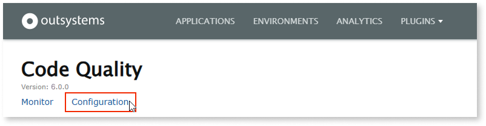
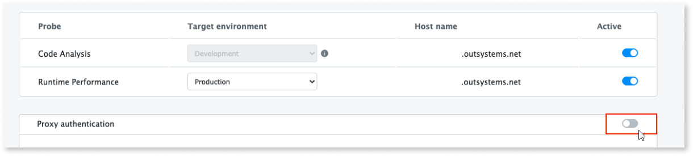
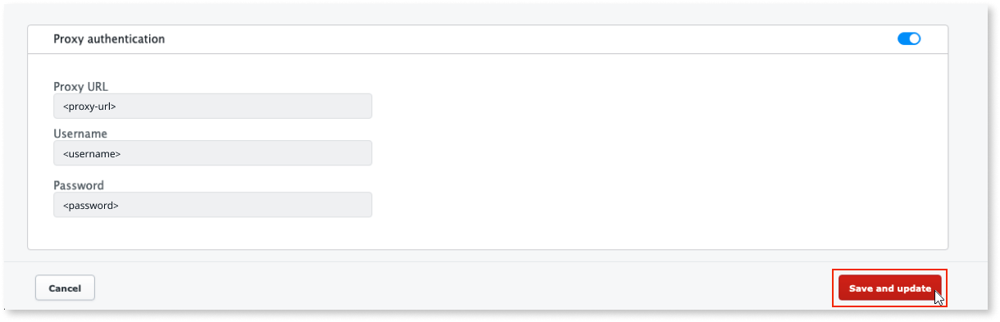

---
tags:
  - Infrastructure
  - Mentor
  - Mentor Studio
  - Plugins
  - Security
  - Settings
  - Technical Debt
summary: 'Code Quality forward proxy setup in OutSystems 11 (O11): enable proxy authentication and enter credentials in the LifeTime plugin.'
locale: en-us
guid: 06af3d66-f6c3-4827-aa17-36b1124f321b
app_type: traditional web apps, mobile apps, reactive web apps
platform-version: o11
figma: https://www.figma.com/file/rEgQrcpdEWiKIORddoVydX/Managing-the-Applications-Lifecycle?type=design&node-id=929%3A747&mode=design&t=rzWSTBJIapfhmERp-1
audience:
  - Platform administrator
outsystems-tools:
  - code quality
  - lifetime
coverage-type:
  - apply
isautopublish: true
---

# How to use a proxy to connect to Code Quality

AI Mentor Studio is now Code Quality.

The Code Quality plugin can use a forward proxy while connecting to the Code Quality Software as a Service (SaaS).

## Prerequisites

Before configuring the proxy in Code Quality, make sure that the following requirements are met:

* Your infrastructure uses **version 4.0 or higher** of the **Code Quality probes**.

## Configure the forward proxy

To configure the proxy, follow these steps:

1. Go to the Code Quality LifeTime plugin (`https://<lifetime_environment>/ArchitectureDashboardProbe/`) and select **Configuration**.

    

1. In the **Configuration** screen, turn on the **Proxy authentication** toggle.

    

1. In the **Proxy configuration** section, enter the proxy URL and the credentials.

1. Select **Save and update**.

    

After these steps the Code Quality plugin uses the proxy you configured when connecting to the Code Quality SaaS.
