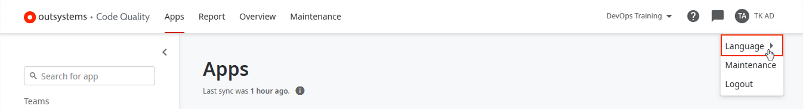
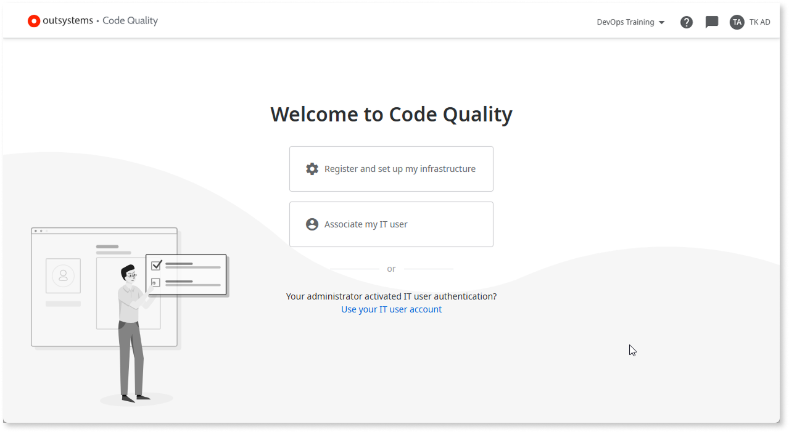
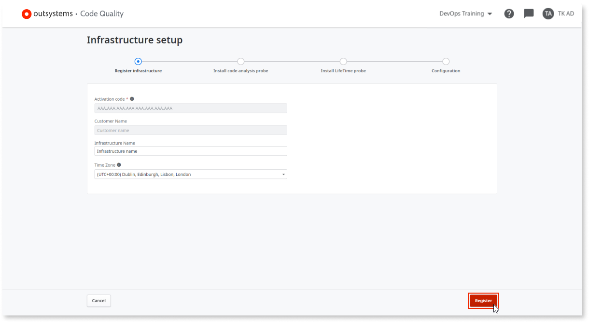
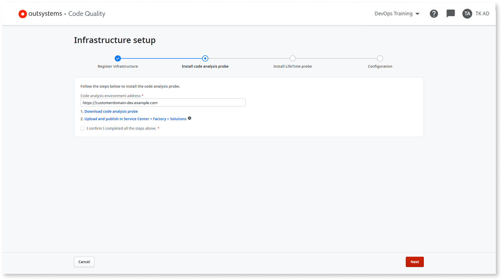
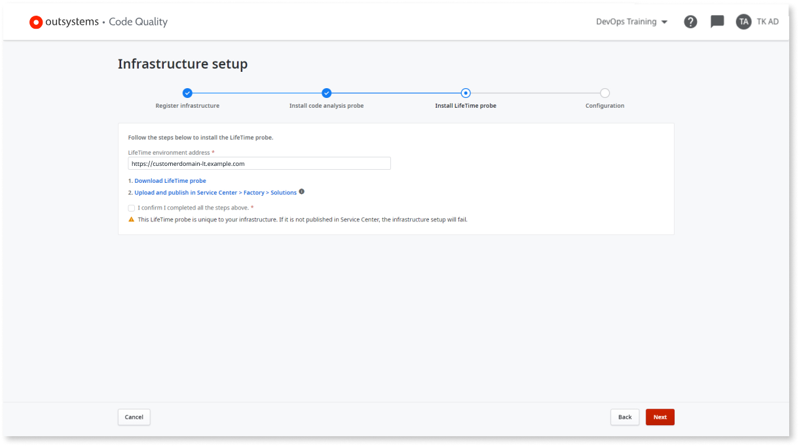
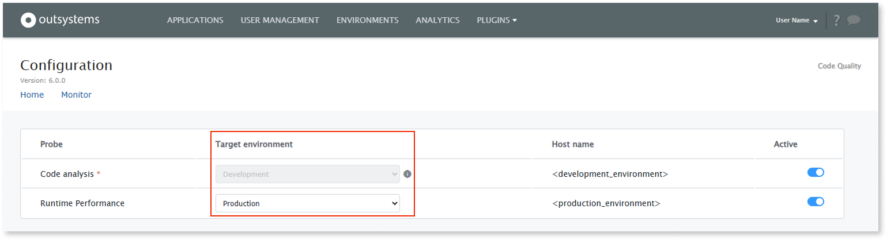
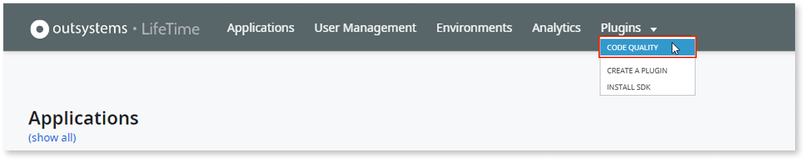
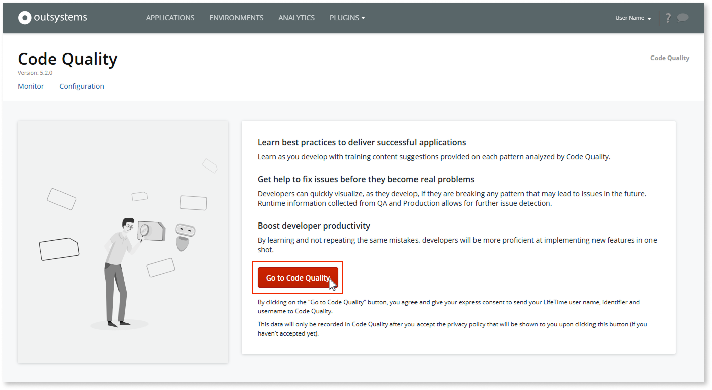

---
tags:
  - Authentication
  - Infrastructure
  - IT Users
  - Mentor Studio
  - Plugins
  - Technical Debt
  - Troubleshooting
summary: 'Code Quality setup in OutSystems 11 (O11): register your infrastructure, install code analysis and LifeTime probes, and associate your IT user.'
locale: en-us
guid: c9fd26ba-85ea-406d-834a-df6c0399d11a
app_type: traditional web apps, mobile apps, reactive web apps
platform-version: o11
figma: https://www.figma.com/file/rEgQrcpdEWiKIORddoVydX/Managing%20the%20Applications%20Lifecycle?node-id=928:604
audience:
  - Developer
  - Platform administrator
outsystems-tools:
  - code quality
  - lifetime
coverage-type:
  - apply
  - unblock
topic:
  - associate-code-quality-user
  - fix-code-quality-401
  - setup-code-quality
isautopublish: true
---

# How to set up Code Quality

AI Mentor Studio is now Code Quality.

This topic shows you how to add an infrastructure to Code Quality and how to associate your IT user with Code Quality.

To change the language of Code Quality, select your user name, then select a language under **Language**.

## Log in for the first time {#first-login}

You can log into [Code Quality](https://codequality.outsystems.com/) with your **OutSystems account** or with your **IT user account**.

IT administrators can enforce IT User authentication in a specific environment. If you’re logging into an environment with IT User authentication activated, you can only log in with your IT user account.

### Log in with OutSystems account {#os-login}

If you log in with your **OutSystems account**, Code Quality shows you the following welcome screen:

Select one of the options shown on the welcome screen:

[Register and set up my infrastructure](#register)
:   Choose this option if your infrastructure isn't registered in Code Quality. You must have a LifeTime administrator role. If you don't have a LifeTime administrator role, you won't have this option available and you must ask your administrator to complete the setup.

[Associate my IT user](#associate-os-login)
:   Choose this option if your infrastructure is already registered in Code Quality.  

[Use your IT user account](#it-user-login)
:   Choose this option if your administrator activated IT user authentication for your infrastructure.  

### Log in with IT user account {#it-user-login}

If you log in with your **IT user account** and your infrastructure isn’t registered yet, Code Quality shows only the [Register and set up my infrastructure](#register) option.  

If you log in with your **IT user account** and your infrastructure is already registered, you’ll have to [associate your IT user](#associate-it-user-login).

## Register and set up your infrastructure in Code Quality {#register}

### Prerequisites

Before registering and setting up your infrastructure in Code Quality, make sure that the following requirements are met:

* Your infrastructure is associated with an [OutSystems Edition](https://www.outsystems.com/pricing-and-editions/) that isn't the Free Edition. **You can't use a Personal Environment with Code Quality**.

* OutSystems Partners can use Code Quality with Cloud demos.

* For self-managed infrastructures, LifeTime must be deployed in a dedicated environment.

* You have the **Administrator** role in your infrastructure.

* Code Quality uses the environment's public DNS hostname to communicate. Check [Code Quality network requirements](../../setup-infra-platform/setup/network-requirements.md#ai-mentor-studio) for detailed information. In the OutSystems Cloud, these requirements are ensured.

* Your code analysis environment is on Platform Server version 11.0.542 or higher.

* Your LifeTime environment meets the minimum LifeTime Management Console version required by the Code Quality probes version, according to the following table:

    | Code Quality probes version | Minimum LifeTime Management Console version |
    | --- | --- |
    | 6.0.0 | 11.31.0 |
    | 5.0 | 11.16.1 |
    | 4.3 (Deprecated) | 11.5.0 |

    

    Code Quality probes older than 5.0 are deprecated. Update to the latest compatible probe version.

    

### Register and set up your infrastructure

To set up your infrastructure in Code Quality, follow these steps:

Depending on your authentication method, the interface might differ slightly from what you see in these screenshots.  

1. After logging into [Code Quality](https://codequality.outsystems.com/), select **Register and set up my infrastructure**.

1. Fill in your infrastructure information, or confirm it is correct in case it's already pre-filled. Then, select **Register**.

    

1. Read the **Code Quality disclaimer** with the terms and conditions. If you agree, select **Accept and continue**.

1. Fill in your code analysis environment address, or confirm it is correct in case it's already pre-filled. Follow the procedure shown in Code Quality to install the code analysis probe:

    

    The code analysis environment is the environment in which Code Quality performs the code analysis.

    

    

    1. Select **Download code analysis probe** to download the probe.

    1. In the Service Center of the **code analysis environment** (`https://<code_analysis_environment>/ServiceCenter`), go to **Factory** > **Solutions** and install the **code analysis probe**.

1. After completing the previous steps, select the **I confirm I completed all the steps above.** checkbox and select **Next**.

1. Fill in your LifeTime environment address, or confirm it is correct in case it's already pre-filled. Follow the procedure shown in Code Quality to install the LifeTime probe:

    

    1. Select **Download LifeTime probe** to download the probe.

    1. In the Service Center of the **LifeTime environment** (`https://<lifetime_environment>/ServiceCenter`), go to **Factory** > **Solutions** and install the **LifeTime probe**.

1. After completing the previous steps, select the **I confirm I completed all the steps above.** checkbox and select **Next**.

1. After being redirected to LifeTime, log in with your IT user.

1. Configure the **code analysis probe** by selecting the development environment as the **Target environment**.

    

    To change the target environment of a code analysis probe, contact [technical support](https://success.outsystems.com/Support/Enterprise_Customers/OutSystems_Support/01_Contact_OutSystems_technical_support) to delete existing data from Code Quality. Do this before installing probes in a new environment or deleting probes from an existing environment to avoid data inconsistencies. Once existing data is deleted from Code Quality, follow the setup procedure in this article to configure a new target environment.

    

1. Optionally, if you want Code Quality to collect and leverage metrics from LifeTime Analytics, configure the **runtime performance probe** by selecting the production environment as the **Target environment**.

    

1. Optionally, if you want the Code Quality plugin to use a forward proxy while connecting to the Code Quality SaaS, in the **Proxy configuration** section, select **show request information**, and enter the proxy URL and the credentials.

1. Select **Save and activate**.

1. After being redirected to Code Quality, check the **Installation details** and read the **privacy policy** carefully.

1. Select the checkbox to agree with the privacy policy, then select **Agree and continue**.

After completing these steps, you can see your infrastructure listed, but it may take up to 12 hours for your apps to appear in Code Quality.

## Associate your IT user with Code Quality {#associate}

The steps to associate your IT user with Code Quality are different depending on the authentication mode you use. This section explains how to associate your IT user for **OutSystems account** authentication and **IT user account** authentication.

### Log in with OutSystems account {#associate-os-login}

If you log in with your **OutSystems account**, follow these steps to associate your IT user with Code Quality:

1. After logging into [Code Quality](https://codequality.outsystems.com/), select **Associate my IT user** and select **Start**.

1. Go to **LifeTime** (`https://<lifetime_environment>/lifetime`) and log in using your IT user credentials.

    `<lifetime_environment>` is the address of the LifeTime Environment for the infrastructure that you are associating with your account.

1. Select **Plugins** \> **Code Quality**.

    

    

    If your LifeTime doesn't have a **Plugins** menu, select **More** \> **Code Quality**.

    

1. Select **Go to Code Quality**.

    

1. After being redirected to Code Quality, check the **Installation details** and read the **privacy policy** carefully.

1. Select the checkbox to agree with the privacy policy, then select **Agree and continue**.

### Log in with IT user account {#associate-it-user-login}

If you log in with your **IT user account**, follow these steps to associate your IT user with Code Quality:

1. After logging into Code Quality, check the **Installation details** and read the **privacy policy** carefully.

1. Select the checkbox to agree with the privacy policy, then select **Agree and continue**.

## Troubleshoot a 401 unauthorized error {#troubleshoot-401}

During setup or IT user association, you may get a `401 Unauthorized` error. The following sections help you identify and resolve the cause.

### Symptom

Code Quality returns a `401 Unauthorized` error when you try to log in, register your infrastructure, or associate your IT user.

### Cause

A 401 error occurs when Code Quality can't validate your credentials. Common causes, ordered from most to least likely:

* **Wrong authentication mode** — IT User authentication is activated for the environment, but you logged in with an OutSystems account (or the other way around).

* **IT user association not completed** — The infrastructure is already registered and you logged in with an OutSystems account, but you didn't complete the IT user association flow through LifeTime.

* **Invalid credentials** — The IT user username doesn't exist, the password is incorrect, or the account is blocked after too many failed attempts.

### Resolution

To resolve the error, follow these steps:

1. Verify which authentication mode is activated for your environment. If IT User authentication is activated, log in with your IT user account.

1. If the infrastructure is already registered and you're using an OutSystems account, complete the [IT user association flow](#associate-os-login).

1. If logging in with IT user credentials fails, verify the username and password are correct and that the account isn't blocked. Contact your IT administrator to reset the account if needed.
