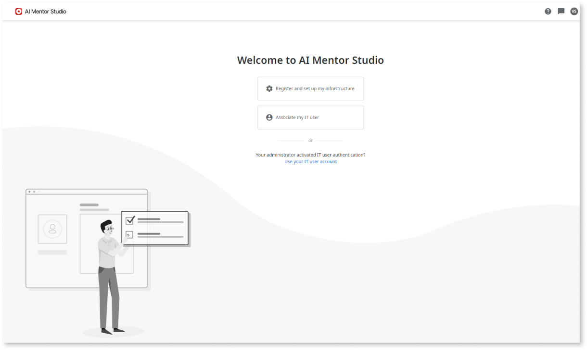
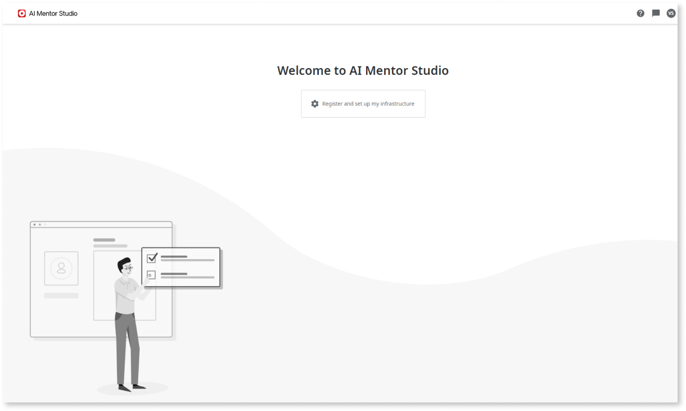
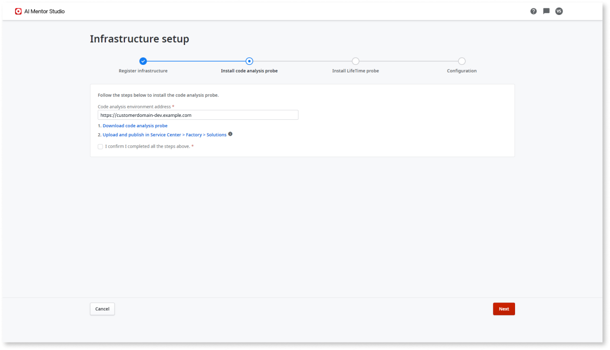

# How to set up AI Mentor Studio

Architecture Dashboard is now AI Mentor Studio.

This topic shows you how to add an infrastructure to AI Mentor Studio and how to associate your IT user with AI Mentor Studio.

To change the language of AI Mentor Studio, select your user name, then select a language under **Language**.

## Log in for the first time {#first-login}

You can log into [AI Mentor Studio](https://aimentorstudio.outsystems.com/) with your **OutSystems account** or with your **IT user account**.

IT administrators can enforce IT User authentication in a specific environment. If you’re logging into an environment with IT User authentication activated, you can only log in with your IT user account.

### Log in with OutSystems account {#os-login}

If you log in with your **OutSystems account**, AI Mentor Studio shows you the following welcome screen:

Select one of the options shown on the welcome screen:

[Register and set up my infrastructure](#register)
:   Choose this option if your infrastructure isn't registered in AI Mentor Studio. You must have a LifeTime administrator role. If you don't have a LifeTime administrator role, you won't have this option available and you must ask your administrator to complete the setup.

[Associate my IT user](#associate-os-login)
:   Choose this option if your infrastructure is already registered in AI Mentor Studio.  

[Use your IT user account](#it-user-login)
:   Choose this option if your administrator activated IT user authentication for your infrastructure.  

### Log in with IT user account {#it-user-login}

If you log in with your **IT user account** and your infrastructure isn’t registered yet, AI Mentor Studio shows you the following welcome screen:

AI Mentor Studio shows you the option:

[Register and set up my infrastructure](#register)
:   Choose this option if your infrastructure isn't registered in AI Mentor Studio. You must have a LifeTime administrator role. If you don't have a LifeTime administrator role, you won't have this option available and you must ask your administrator to complete the setup.  

If you log in with your **IT user account** and your infrastructure is already registered, you’ll have to [associate your IT user](#associate-it-user-login).

## Register and set up your infrastructure in AI Mentor Studio {#register}

### Prerequisites

Before registering and setting up your infrastructure in AI Mentor Studio, make sure that the following requirements are met:

* Your infrastructure is associated with an [OutSystems Edition](https://www.outsystems.com/pricing-and-editions/) that isn't the Free Edition. **You can't use a Personal Environment with AI Mentor Studio**.

* OutSystems Partners can use AI Mentor Studio with Cloud demos.

* For self-managed infrastructures, LifeTime must be deployed in a dedicated environment.

* Your code analysis environment uses **Platform Server 11.18.1** or later.

* Your LifeTime environment uses **LifeTime Management Console 11.16.1** or later.

* You have the **Administrator** role in your infrastructure.

* AI Mentor Studio will use the environment's public DNS hostname to communicate. Check [AI Mentor Studio network requirements](../../setup-infra-platform/setup/network-requirements.md#ai-mentor-studio) for detailed information. In the OutSystems Cloud, these requirements are ensured.

AI Mentor Studio probes prior to 5.0 require as minimum versions: Platform Server 11.7.2 and LifeTime Management Console Release Jul.2019.

### Register and set up your infrastructure

To set up your infrastructure in AI Mentor Studio, follow these steps:

Depending on your authentication method, the interface might differ slightly from what you see in these screenshots.  

1. After logging into [AI Mentor Studio](https://aimentorstudio.outsystems.com/), select **Register and set up my infrastructure**.

1. Fill in your infrastructure information, or confirm it is correct in case it's already pre-filled. Then, click **Register**.

    

1. Read the **AI Mentor Studio disclaimer** with the terms and conditions. If you agree, select **Accept and continue**.

1. Fill in your code analysis environment address, or confirm it is correct in case it's already pre-filled. Follow the procedure shown in AI Mentor Studio to install the code analysis probe:

    

    The code analysis environment is the environment in which AI Mentor Studio performs the code analysis.

    

    

    1. Select **Download code analysis probe** to download the probe.

    1. In the Service Center of the **code analysis environment** (`https://<code_analysis_environment>/ServiceCenter`), go to **Factory**>**Solutions** and install the **code analysis probe**.

1. After completing the previous steps, select the **I confirm I completed all the steps above.** checkbox and select **Next**.

1. Fill in your LifeTime environment address, or confirm it is correct in case it's already pre-filled. Follow the procedure shown in AI Mentor Studio to install the LifeTime probe:

    

    1. Select **Download LifeTime probe** to download the probe.

    1. In the Service Center of the **LifeTime environment** (`https://<lifetime_environment>/ServiceCenter`), go to **Factory**>**Solutions** and install the **LifeTime probe**.

1. After completing the previous steps, select the **I confirm I completed all the steps above.** checkbox and select **Next**.

1. After being redirected to LifeTime, log in with your IT user.

1. Configure the **code analysis probe** by selecting the development environment as the **Target environment**.

    

    

    To change the target environment of a code analysis probe, contact [technical support](https://success.outsystems.com/Support/Enterprise_Customers/OutSystems_Support/01_Contact_OutSystems_technical_support) to delete existing data from AI Mentor Studio. Do this before installing probes in a new environment or deleting probes from an existing environment to avoid data inconsistencies. Once existing data is deleted from AI Mentor Studio, follow the setup procedure in this article to configure a new target environment.

    

1. Optional: If you want the AI Mentor Studio plugin to use a forward proxy while connecting to the AI Mentor Studio SaaS, in the **Proxy configuration** section, select **show request information**, and enter the proxy URL and the credentials.

1. Select **Save and activate**.

1. After being redirected to AI Mentor Studio:

    1. Check the **Installation details** and read the **privacy policy** carefully.

    1. If you agree with the privacy policy, select the checkbox and then select **Agree and continue**.

    

After completing these steps, you can see your infrastructure listed, but it may take up to 12 hours for your apps to appear in AI Mentor Studio.

## Associate your IT user with AI Mentor Studio {#associate}

The steps to associate your IT user with AI Mentor Studio are different depending on the authentication mode you use. This section explains how to associate your IT user for **OutSystems account** authentication and **IT user account** authentication.

### Log in with OutSystems account {#associate-os-login}

If you log in with your **OutSystems account**, follow these steps to associate your IT user with AI Mentor Studio:

1. After logging into [AI Mentor Studio](https://aimentorstudio.outsystems.com/), select **Associate my IT user** and select **Start**.

1. Go to **LifeTime** (`https://<lifetime_environment>/lifetime`) and log in using your IT user credentials.

    `<lifetime_environment>` is the address of the LifeTime Environment for the infrastructure that you are associating with your account.

1. Select **Plugins** \> **AI Mentor Studio**.

    

    

    If your LifeTime doesn't have a **Plugins** menu, select **More** \> **AI Mentor Studio**.

    

1. Select **Go to AI Mentor Studio**.

    

1. After being redirected to AI Mentor Studio:

    1. Check the **Installation details** and read the **privacy policy** carefully.

    1. If you agree with the privacy policy, select the check box and then select **Agree and continue**.

### Log in with IT user account {#associate-it-user-login}

If you log in with your **IT user account**, follow these steps to associate your IT user with AI Mentor Studio:

1. After logging into AI Mentor Studio:

    

    1. Check the **Installation details** and read the **privacy policy** carefully.

    1. If you agree with the privacy policy, select the check box and then select **Agree and continue**.
