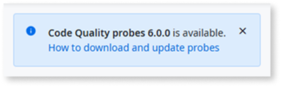
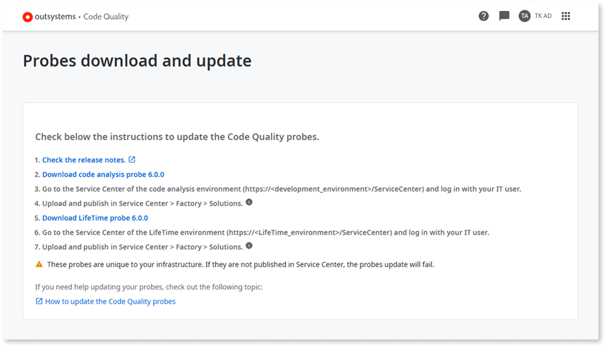
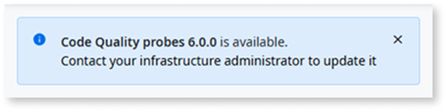
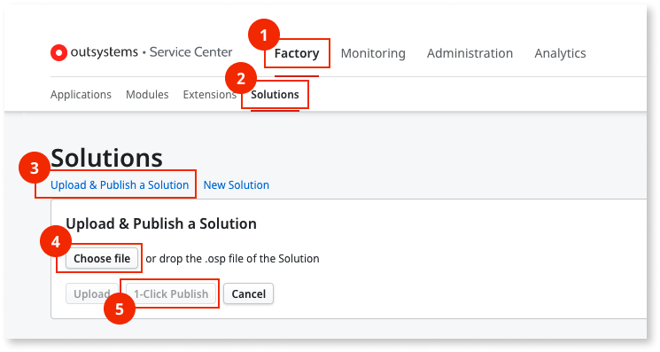

---
tags:
  - 1-Click Publish
  - Deploy
  - Infrastructure
  - Quality Assurance
  - Technical Debt
summary: 'OutSystems 11 (O11) Code Quality probes update: download Development and LifeTime probes and install them via Service Center.'
locale: en-us
guid: d11dd771-148b-49fd-8bfd-dfe0800620c5
app_type: traditional web apps, mobile apps, reactive web apps
platform-version: o11
figma: https://www.figma.com/file/rEgQrcpdEWiKIORddoVydX/Managing%20the%20Applications%20Lifecycle?node-id=929:738
audience:
  - Developer
  - Platform administrator
outsystems-tools:
  - code quality
coverage-type:
  - apply
isautopublish: true
---

# How to update the Code Quality probes

To check the current version of your Code Quality probes, click the **Help** icon on the top-right corner of Code Quality and then select **About Code Quality**.

If you have [**Full Control** permissions assigned as a default role](how-works.md#update-probes) for the code analysis environment, the following message is displayed when an updated version of the probes is available:

After selecting **How to download and update probes**, you go to the **Probes download and update** screen, where you can download the new probes.

If you have a different permissions level, the following message is displayed when an updated version of the probes is available:

To install the new probes for Code Quality, contact your infrastructure administrator.

## Prerequisites

Before configuring the proxy in Code Quality, make sure you have [**Full Control** permissions assigned as a default role](how-works.md#update-probes) for the code analysis environment.

## Update probes

If you have a previous version of the probes installed there's no need to uninstall it prior to installing the new version of the probes.  
To update the Code Quality's probes, follow these steps:

1. In the **Probes download and update** screen, select **Download Development probe**.

1. Go to the Service Center console of the **Development environment** (`https://<development_environment>/ServiceCenter`), and install the **Development Environment Probe** in your **Development environment** by following these steps:

    1. Go to **Factory**.
    1. Go to **Solutions**.
    1. Select **Upload & Publish a Solution**.
    1. Select **Choose File** and select the Probe file.
    1. Select **1-Click Publish**.
    1. Validate if the Solution is successfully published by checking for a `Done: The solution was successfully published message`.

    

1. In the **Probes download and update** screen, select **Download LifeTime probe**.

1. Go to the Service Center console of the **LifeTime environment** (`https://<LifeTime_environment>/ServiceCenter`), and install the **LifeTime Environment Probe** in your **LifeTime environment** by following these steps:

    1. Go to **Factory**.
    1. Go to **Solutions**.
    1. Select **Upload & Publish a Solution**.
    1. Select **Choose File** and select the Probe file.
    1. Select **1-Click Publish**.
    1. Validate if the Solution is successfully published by checking for a `Done: The solution was successfully published message`.
