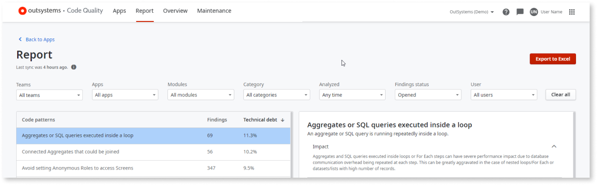
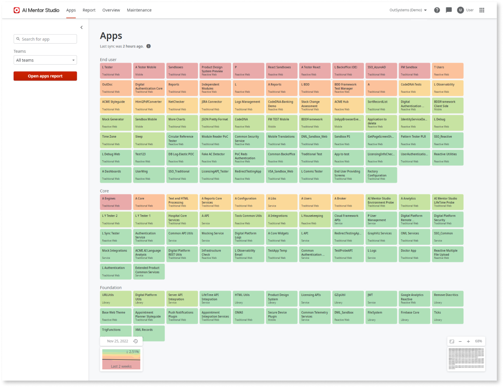
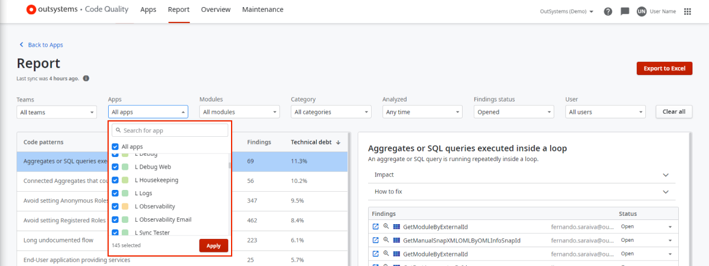

---
tags:
  - Best Practices
  - Mentor
  - Mentor Studio
  - Technical Debt
summary: Code Quality technical debt formula in OutSystems 11 (O11) multiplies findings by pattern weight into a color-coded debt percentage.
locale: en-us
guid: 521CF7BD-3CE7-4448-8DDE-B5A751B08B82
app_type: traditional web apps, mobile apps, reactive web apps
platform-version: o11
figma: https://www.figma.com/file/rEgQrcpdEWiKIORddoVydX/Managing%20the%20Applications%20Lifecycle?node-id=928:724
audience:
  - Front-end developer
  - Developer
  - Architect
outsystems-tools:
  - code quality
coverage-type:
  - understand
  - remember
isautopublish: true
---

# How Code Quality calculates and shows technical debt

AI Mentor Studio is now Code Quality.

This article explains how Code Quality calculates and displays technical debt.  

Technical debt measures the cost of reworking a solution. Technical debt increases each time a developer bypasses code best practices. For example, creating a dependency between two apps adds complexity to future modifications.  

Code Quality uses a color code to help you visualize technical debt. Apps with the lowest technical debt display as pale green. Apps with the highest technical debt display as red.

## Technical debt formula

To translate the technical debt into the color code, the technical debt value must be calculated first. The technical debt value for each module, app, and the overall Factory Application Portfolio is calculated by summing up the number of findings per pattern, taking their defined weight into account. Code Quality uses the following formula to calculate the technical debt value:

Technical debt = &#8721; (#Findings per pattern &#215; pattern weight)

The calculation results in an absolute value that is then compared with defined thresholds to provide the technical debt level represented in a color code and as a percentage.  

For instance, the **Public Entities aren’t read-only** pattern shows a technical debt of 11.3%. This value results from multiplying the 69 findings by the [pattern weight](#pattern-weight) itself. The value is then turned into a percentage, meaning that the **Public Entities aren’t read-only** pattern represents 11.3% of the total technical debt.

### Pattern weight

The weight attributed to each code pattern is determined by an **Impact** level, which describes the foreseen risk for the architecture, maintenance, performance, and security of the factory. The impact level goes from None to Highest, which is then translated into an absolute weight used in the technical debt formula. Code Quality attributes a default impact level to each code pattern, but you can customize this in the **Maintenance** area of Code Quality. For more information, see [how to change the impact level of a code pattern on your technical debt](change-pattern-impact.md).

## How Code Quality shows technical debt

Not all code patterns have the same impact on technical debt. In addition to giving the technical debt in percentage, Code Quality uses the color code to help customers prioritize technical debt in a fast and visual way. The color code allows customers to understand which module or app has more urgency to be tackled.  

### Apps area

Code Quality’s Apps area has a birds-eye view of your factory that shows all the apps with the technical debt level attributed to it during the last analysis. This enables you to understand which app, at a higher level, should be your primary focus. For more information on how to interpret this data, check the articles under [Getting started with Code Quality](how-use.md).

### Findings area

In the Findings area, you see each app’s technical debt level when filtering by app. This helps you focus on the apps that have the highest technical debt.

You can also sort the code patterns list by technical debt to keep the highest technical debt on the top of your list, or by findings number, if you wish to have a more quantitative approach. Always remember the technical debt formula. Having a high number of findings doesn’t mean that a specific pattern contributes more to your technical debt across the factory. The weight of the pattern also [plays a role](#technical-debt-formula).

### Overview area

The Infrastructure Overview dashboard provides a variety of graphics to help you understand your technical debt. For more information on how to interpret the data in the Overview area, go to [Get an overview of the overall technical debt](overview-dashboard.md).
