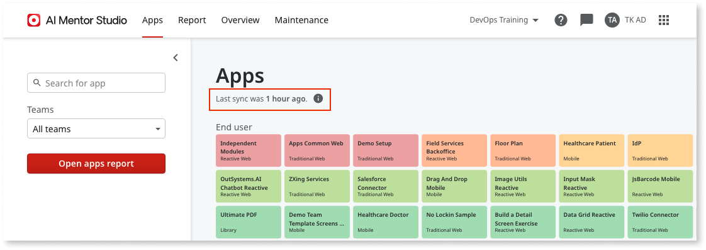

# Troubleshooting

Architecture Dashboard is now AI Mentor Studio.

Ensure that you are using the latest version of the AI Mentor Studio probes and that they are correctly installed. For more information, refer to [How to update the AI Mentor Studio probes](how-update-probes.md).

## Synchronization issues

Synchronization (data sent from AI Mentor Studio Probe to SaaS) occurs every 12 hours.

In AI Mentor Studio, go to the **Apps** tab and check when was the **Last sync**.

If the last sync occurred more than 24 hours ago, go to the **Monitoring** tab of the Service Center of the LifeTime environment (`https://<lifetime_environment>/ServiceCenter`), and check for errors in the AI Mentor StudioLifeTime Probe module named **ArPr_Communitcation**.

Note that the **LifeTime environment** must be able to connect to AI Mentor Studio Web Service available at:`https://aimentorstudio.outsystems.com/Probe_API/rest/Synchronization`.

If the issue persists, open a ticket in the [Support Portal](https://www.outsystems.com/goto/submit-support-case) with all the details that you have and steps followed to troubleshoot.

## Duplicated code findings mismatch  

The number of issues listed in AI Mentor Studio is inconsistent across views. For example, the number of duplicate code instances in the report view differs from the number listed in the detailed view.

This may occur if you change the target environment of the code analysis probe without first deleting data from AI Mentor Studio. Before you change the target environment, contact [technical support](https://success.outsystems.com/Support/Enterprise_Customers/OutSystems_Support/01_Contact_OutSystems_technical_support) to delete existing data. Then follow the [setup procedure](how-setup.md) to configure the new target environment.

## IT User login issues

When attempting to log into AI Mentor Studio using your IT User account, you might get the following error message:

`It was not possible to sign into AI Mentor Studio. Check here for the solutions.`

### Cause

The credentials provided to log in aren't valid, or the user is blocked. The possible reasons are:

* The username doesn't exist

* The password is incorrect

* The user is blocked due to many failed attempts

### Recommended action

* Verify that you used the correct username and password or request an administrator to reset your password.

* With your **LifeTime** administrator, confirm that the username exists.

* Ask your **LifeTime** administrator to unblock your username.

For more information, check also [Protection against brute force attacks](../../security/protection-against-brute-force-attacks.md).
