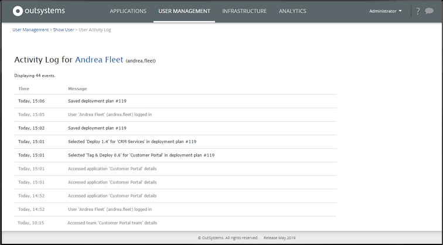
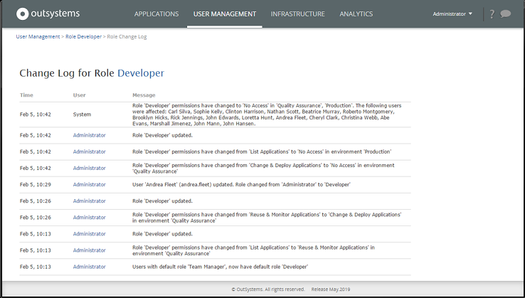
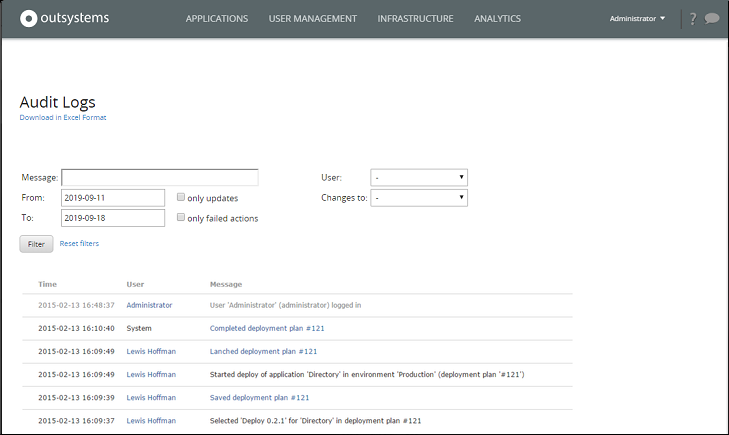

# Monitor Usage with Audit Logs

OutSystems logs every task performed by IT users in the infrastructure management, and keeps an audit log made available to consult. This ensures you have traceability in your infrastructure, and can follow up when problems arise, since no interaction goes unnoticed. 

LifeTime audit logs are never cleaned up, meaning they are retained indefinitely. This allows you to always have access to historical data for compliance and troubleshooting purposes.

IT users have access to the audit log and can check:

* The tasks IT users performed
* All tasks performed to:
    * Applications
    * Deployment Plans
    * Users
    * Teams
    * Roles
    * Environments
    * Infrastructure

## See the Tasks a User has Performed

You can find the audit log for the tasks a user has made in the user details screen.

As an example, let's see the tasks "Andrea Fleet" has done. In your **LifeTime** console (`https://<lifetime_env>/lifetime`), navigate to the **USER MANAGEMENT** tab, choose **USERS**, and select **Andrea Fleet**. There you can find the **View Activity Log** link that displays all tasks made by Andrea.

Granting [developer permissions via Customer Portal](https://www.outsystems.com/tk/redirect?g=5bd7f106-3784-4821-a603-0ad0c0fd8f82) will be audited in LifeTime as performed by the user `Administrator`. This Administrator user is distinct from your own LifeTime or Customer Portal admins. Instead, it's a service user that's used for integrations with OutSystems 11 Cloud, such as Customer Portal.

## Check the Changes Made in the Infrastructure

To help you understand the interactions performed in the infrastructure, you can see the audit logs right where the tasks were made.

As an example, let's see the audit logs related to the "Developer" role. Go to the **USER MANAGEMENT** tab, choose **ROLES**, and then choose the **Developer** role. There you can find the **View Change Log** link that displays all interactions done with this role.

Sometimes it's also useful to see all changes made in the infrastructure, and be able to filter them. For this, go to the **INFRASTRUCTURE** tab, or to the **ENVIRONMENTS** tab in OutSystems Cloud, and click the link **View Audit Logs**.

## Permissions Required to Access the Audit Logs

To access the audit logs of the items above, the IT user needs to have permissions over them:

* The tasks IT users performed – Manage Infrastructure and Users
* All tasks performed to:
    * Applications – List permission level for the specific application
    * Deployment Plans – List permission level in the applications of the deployment plan
    * Users – Manage Infrastructure and Users
    * Teams – Manage Teams and Application Roles for the specific team
    * Roles – Manage Infrastructure and Users
    * Infrastructure – Manage Infrastructure and Users
