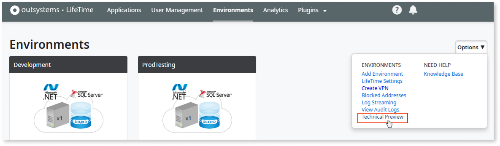
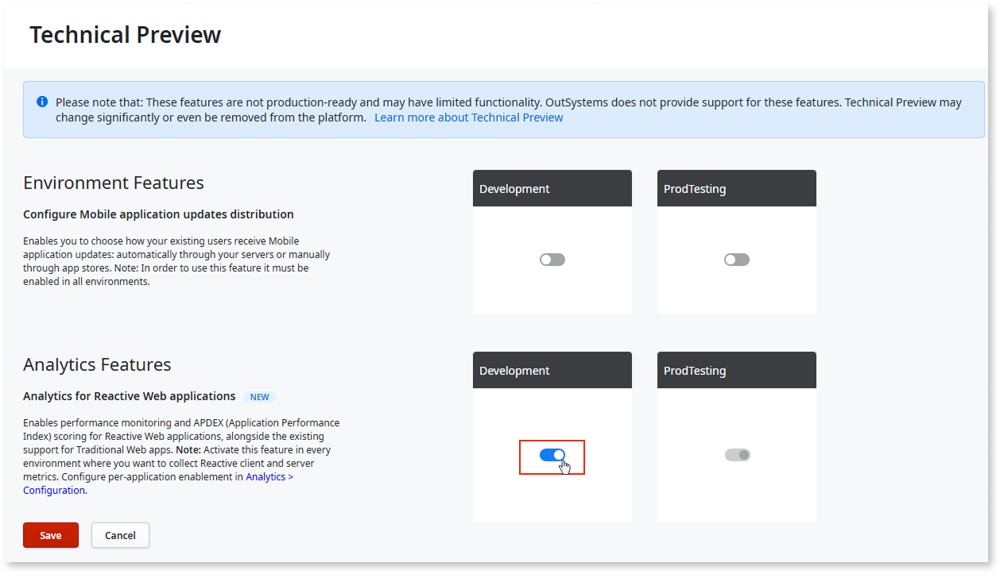
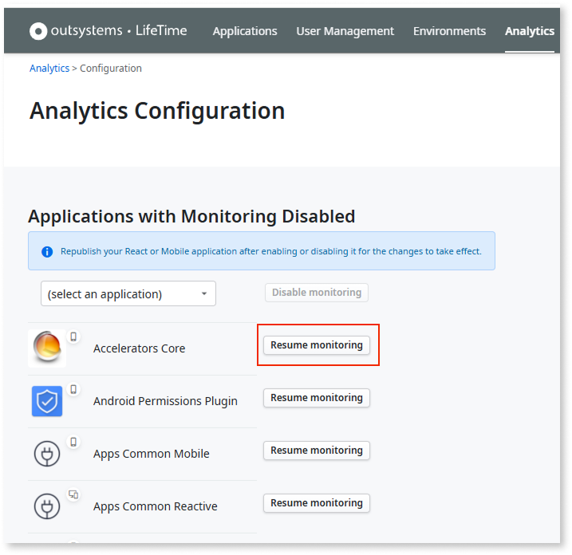

# How to enable performance analytics for Reactive and Mobile apps

**Beta feature.** Behavior and UI may change before general availability. For more information, refer to [Technical Preview Features](https://success.outsystems.com/support/release_notes/technical_preview_features/).

You can enable performance analytics for your Reactive and Mobile apps in LifeTime. This guide covers the prerequisites, enablement steps, configuration, and troubleshooting.

## Prerequisites

Before you enable performance analytics for Reactive and Mobile apps, verify your environment meets all the following requirements:

* You must have the Administrator role in your infrastructure.

* LifeTime version is 11.31.0 or higher.

* Platform Server version is 11.43.0 or higher.

* LifeTime Analytics is enabled in the target environment.

## How to enable performance analytics

To enable performance analytics for Reactive and Mobile apps, follow these steps:

### Step 1: Activate performance analytics

1. In LifeTime, go to **Environments**, select the environment where you want to enable monitoring, and from the **Options** dropdown, select
   **Technical Preview**.

    

1. On the **Technical Preview** page, go to the **Analytics Features** > **Analytics for Reactive Web applications** section, and toggle the switch to **On**.

    

After enabling, your Reactive and Mobile apps appear, but monitoring is disabled by default. You must explicitly enable each app.

### Step 2: Resume monitoring for your apps

To enable monitoring for each app you want to track:

1. Go to **LifeTime** > **Analytics > Configuration**.

1. In the  **Apps with Monitoring Disabled** list, find the Reactive or Mobile app you want to monitor and click **Resume Monitoring**.

    

### Step 3: Republish the app

To activate monitoring by republishing:

1. Deploy or republish the app in the environment.

    LifeTime Analytics immediately begins collecting your app's performance data.

### Step 4: Wait for data synchronization

After you republish, LifeTime Analytics synchronizes with your app's performance data. By default, this synchronization occurs every 15 minutes. Your first metrics typically appear within 15 minutes of the republish.

### Step 5: Verify monitoring is active

After enabling and republishing, confirm that monitoring is working:

1. Go to **LifeTime** > **Analytics**.

1. Locate your Reactive or Mobile app in the **Applications** list and look for recent data points: latency and error rates from the last 15 minutes.

    * If data appears, monitoring is active

    * If data doesn't appear after 30 minutes:

        * Confirm the app is deployed and receiving user traffic (or generate traffic manually).

        * Verify your environment meets the version prerequisites (LifeTime 11.31.0+, Platform Server 11.43.0+).

        * Confirm you completed Steps 3 and 4: resumed monitoring in Analytics Configuration and republished the app.

## Request sampling

By default, LifeTime Analytics uses head-sampling to collect 20% of requests, selected randomly across your app requests. This sampling model is tied to LifeTime environment performance and helps mitigate the potential impact on overall data processing and storage performance. If you need to adjust this, refer to [Adjust request sampling](#adjust-request-sampling).

### Adjust request sampling

Consider your app's traffic volume. Low-volume apps may benefit from a higher sampling rate for more comprehensive data, while high-volume apps can use a lower rate to reduce storage and processing overhead. You configure the sampling parameter per app, allowing you to fine-tune data collection to match your performance and storage requirements.

To change the request sampling rate:

1. Go to Factory Configuration on the environment where the app is running.

1. Access the app's **Frontend Module**.

1. Find the `PerformanceMonitoringReactiveSampleRate` parameter.

1. Modify the value to your desired sampling rate as a percentage.

1. Republish the app in the environment.

## Next steps

Now that monitoring is enabled:

* **Connect to Code Quality:** Refer to [Connect performance analytics to code quality](lifetime-analytics-reactive-apps-cq.md) to integrate your performance data with Code Quality and analyze code patterns related to performance issues.

## Related resources

For more information about monitoring and troubleshooting, refer to the following:

* [Performance analytics for Reactive and Mobile apps](lifetime-analytics-reactive-apps-overview.md):
  Understand performance monitoring for Reactive and Mobile apps.

* [Factory Configuration](../../setup-infra-platform/setup/factory-config.md): Configure application parameters, including request sampling rates.
