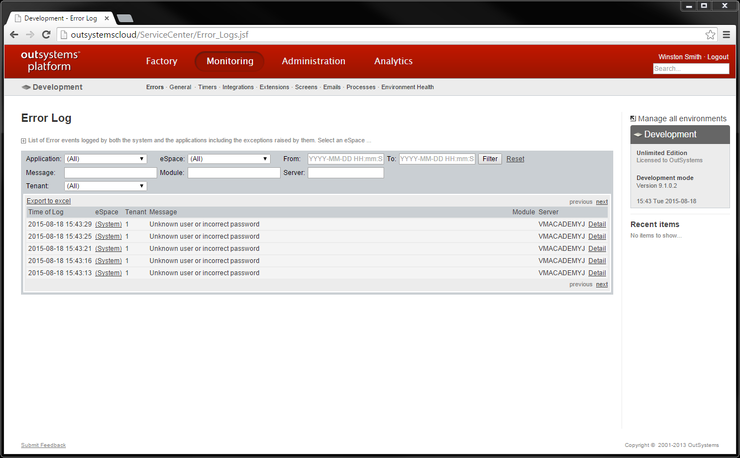
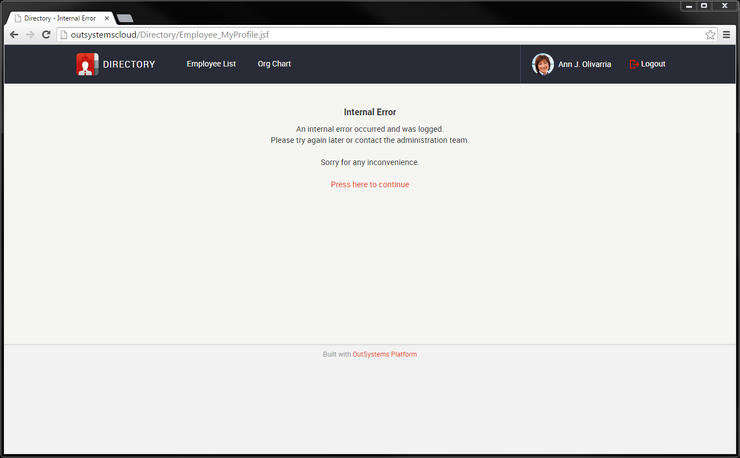
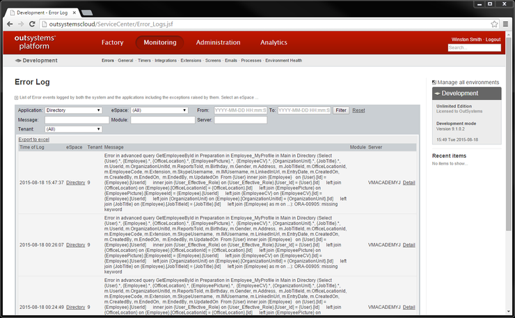
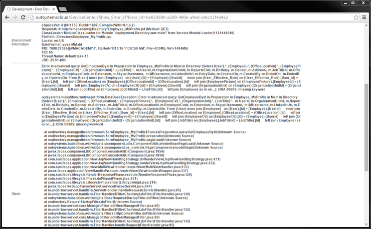

# Troubleshoot Application Errors

OutSystems logs runtime errors that happen in your application, making it easier to troubleshoot them.

You can check error logs in the environment management console (Service Center).

You can filter the error logs by application, module, error message, and more.

## Example - Troubleshoot the Directory App

Customers have been reporting an error in the Directory application, that is preventing them from updating their profile.

Check if there are any errors logged for the Directory app.

1. In the Production environment, open the Service Center management console, and navigate to the **Monitoring** tab.
1. Filter by the 'Directory' application.

It seems that there is a SQL query with errors. Click the **Detail** link to investigate.

From the error log and stack trace, we can see the error is happening in the Directory module, more precisely in the Employee_MyProfile screen. Learn more about the [information logged by the platform.](<http://www.outsystems.com/forums/discussion/7856/anatomy-of-an-outsystems-error-stack/>)

Probably we found the problem.

We can now share this information with the development team, so that they can reproduce the error and fix it. An easy way of sharing this information is by going back to the 'Error Log' screen, and downloading an Excel file with the errors.
