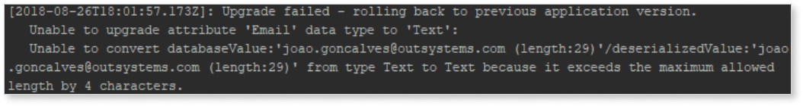
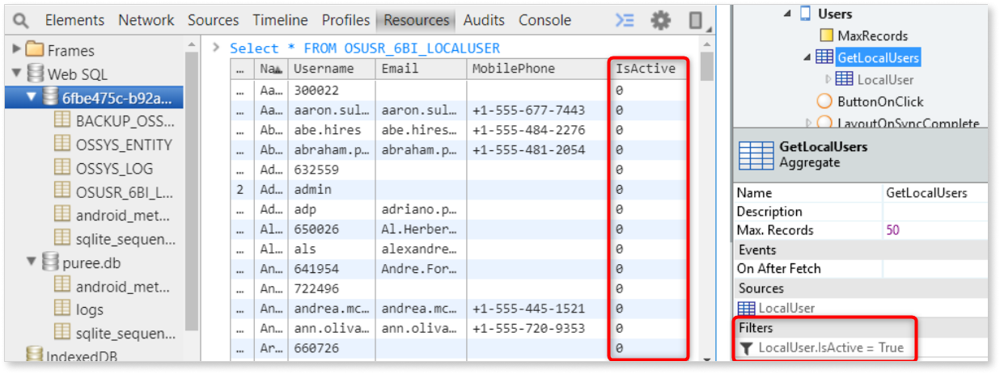
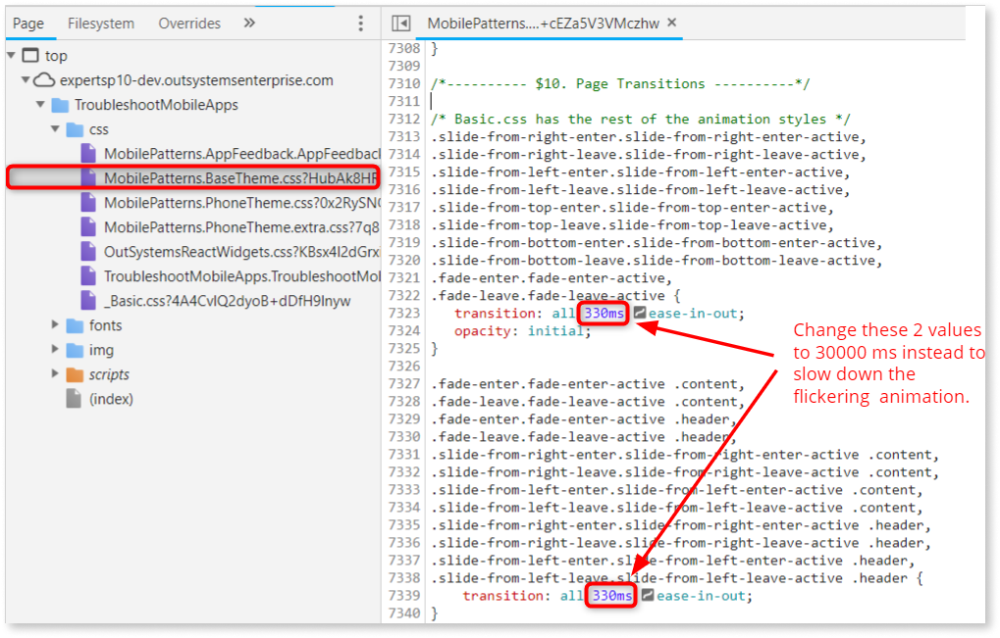
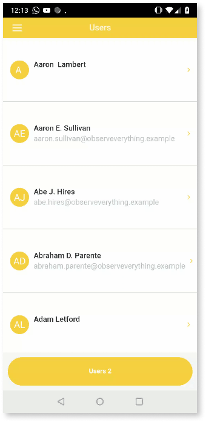
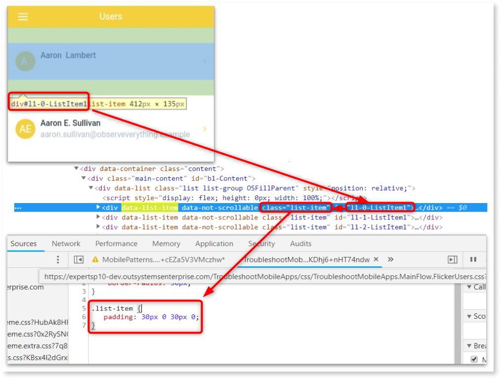
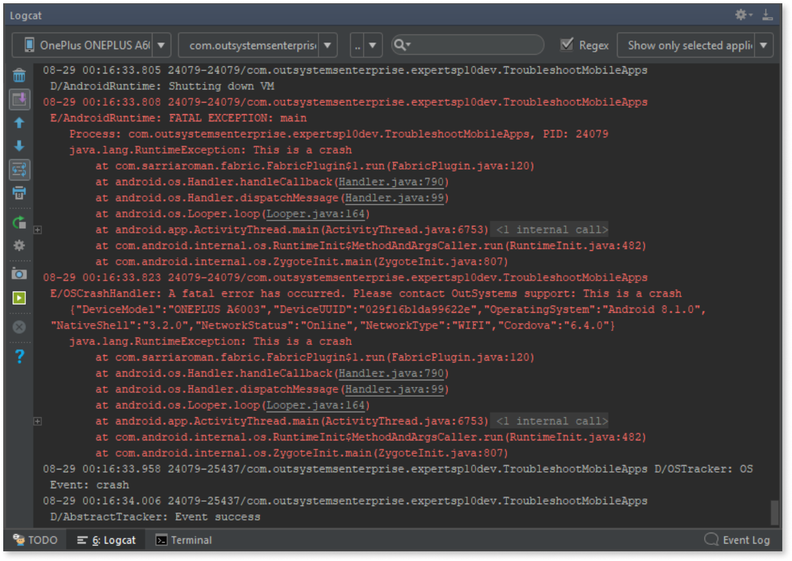
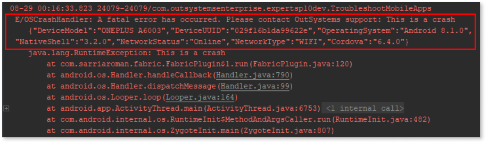
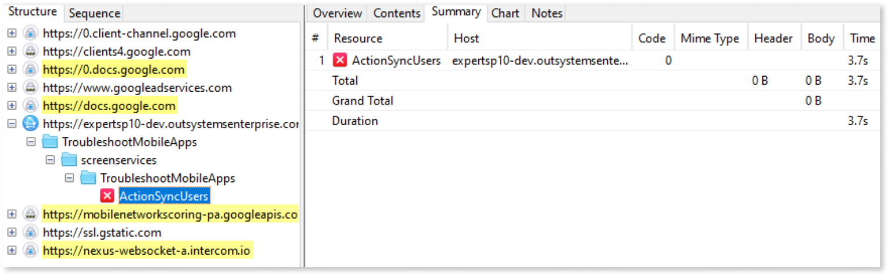
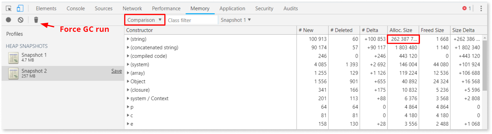

# Mobile app troubleshooting and debugging scenarios examples

In this article, you can find information on a few possible Mobile Application scenarios requiring troubleshooting and debugging. You can find a summary of the most common causes and the suggested Tools and techniques to apply for each one of the scenarios.

## Mobile app fails to upgrade

* **Common causes**

    When there a release of a new version of a Mobile app, a few things happen on the device when that app is upgraded:

    * Download and installation of new JS files, CSS files, and other resources. Any issue with these operations causes the upgrade to fail (for example, if some expected files are missing on the device or resource files aren't available server-side).

    * Execution of SQL scripts on the device to update the database, if the Mobile App uses local storage (this may include changes to Tables or Columns definitions). Any issue encountered during this step also causes the upgrade to fail.

* **Useful Tools & techniques**

    Tools that allow you to review logs are typically the most useful in this situation. The screenshot below shows a log entry indicating that a Column length change caused an error during the upgrade process, as existing data exceeds the new Column length:

    

## Expected data not showing up in the app

* **Common causes**

    * The definition of a Local Aggregate is incorrect (incorrect JOIN type, etc.).

    * There is an issue with the data itself.

    * The synchronization process responsible for updating the data isn't working properly.

* **Useful Tools & techniques**

    * Service Studio debugger: Allows you to examine the output of Aggregates.

    * Stetho Plugin: Allows you to examine the data present in the device local storage and run manual SQL queries on the local storage Tables if needed.

        The screenshot below shows a situation where a SQL query in Stetho shows all records have IsActive set to 0 (False) while the Aggregate executing on the client side has a filter condition set to IsActive = True, which explains why no data shows in the app UI.

        

## Unwanted UI flicker

* **Common causes**

    * JavaScript and Events execution/triggering timing issues.

    * Different CSS directives being applied at various points in time.

    * Changing variables trigger unexpected React UI update at inopportune moments.

* **Useful Tools and techniques**

    * Safari or Chrome Developer Tools typically provide a great starting point to investigate.

Tip: One thing that can be useful is to edit the transition durations in the base CSS file to slow down transitions, which provides a better opportunity for looking at the UI flicker in 'slow motion’:

In this example, as shown in the screenshots that follow:

1. Slowing down the animation allows to see that the list elements seem to ‘shrink’ at the end of the transition.

1. Inspecting the UI gives the ID of a `
` element, which in turns leads to a class name (list-item).

1. It's now visible that the CSS attached to the 'Flow the Screen' is part of 'has a class' definition that changes the padding values, which is the reason for the ‘flicker’!

## Mobile app crashes

* **Common causes**

    * Memory leak leading to memory exhaustion and crash

    * Severe error triggered by native code leading to crash

* **Useful Tools and techniques**

    * Here, logs are going to be a useful source of information. Multiple tools can help access those:

        * The platform IDEs (Android Studio, which includes Logcat, and XCode)

        * Other Tools that allow to review device logs, like macOS Console

        * Service Center for reviewing the error log, which could include log entries generated by the Native App Shell

The screenshot below shows an example of using the Logcat module of Android Studio to realize that a Plugin is causing this application to crash:

Note how the Native App Shell handler generates an additional log message that provides more details, including the network connection type and status, version numbers for Cordova, Native App Shell, and device Operating System, Device Model, and UUID.

If the mobile device was online when the crash occurred, then this log record gets sent to the OS platform and is visible in Service Center:

## Intermittent data loss reported by users

* **Common causes**

    * The communication exception isn't handled properly in client-side code.

    * The synchronization process responsible for updating the data isn't working properly.

* **Useful Tools and techniques**

    Here, if there's a suspiction of a synchronization issue that might occur only under degraded network conditions, a Tool like Charles is useful to simulate an unreliable network and test the Mobile App under these conditions. The screenshot below shows an example of a synchronization action that does fail when the app is running under a simulated degraded network connection:

    

## Abnormal memory consumption reported by users when using the app

* **Common causes**

    * Memory leak that slowly consumes available memory

    * Actions that take a long time to process because of suboptimal business logic or other trying to process too much data in one operation

    * Serialize and deserialize operations on large data sets/objects

* **Useful Tools and techniques**

    Any Tool that allows to profile memory usage as the app is running is helpful in this scenario. Start with the easiest Tool, typically the Developer Tools of Chrome or Safari. In the screenshot below, the Timeline feature of Chrome Developer Tools is used to generate a recording while navigating between a few Screens in the application. The recording clearly shows how allocated memory grows significantly as we move from one Screen to another:

    

    The Memory Tool of Chrome Developer Tools also allows to take snapshots of the memory usage at different points in time, compare snapshots, and force the Garbage Collector to run to help confirm there is a memory leak

    

A typical symptom reported by users of abnormal memory consumption might be that the application gets sluggish as the user keeps interacting with it over an extended period of time.

