# Extending your toolbox

In this article, you can find out about potential additional Tools that can be helpful for specific situations. These Tools are a great addition to the "standard Toolkit" components reviewed in the [suggested standard toolkit](standard-toolkit.md) article.

## Android native app shell inspection from Chrome running on your computer

**Use this Tool/technique** when you need to troubleshoot and debug an Android Mobile App using Chrome on your computer, and you need to go beyond just inspecting the WebView that displays the app. For example, you want to access the Mobile App local storage on the device itself.

As discussed earlier, out-of-the-box the Chrome Developer Tools allow you to inspect some aspects of a Mobile App as it's executing on a device connected to the computer on which Chrome is running. However, this approach only allows you to inspect the WebView that displays your application on the device, so you can't access the device local storage, JS console, etc.

On the Android platform, to get access to the Native App Shell that underlies your OutSystems Mobile app, you can use the [Stetho](https://www.outsystems.com/forge/component-overview/1434/stetho-plugin) Forge Plugin. This Plugin wraps the [Stetho library](http://facebook.github.io/stetho/), which enables the power of the Chrome Developer Tools to be applied to the Native App Shell itself, providing:

* Access to your Mobile app local storage on the device (this is typically the primary use case for using Stetho)

* Network inspection with the full spectrum of Chrome Developer Tools features, including image preview, JSON response helpers, etc.

* Several additional features, like providing a JavaScript Console that allows for execution of JavaScript code that can interact with the application or even the Android SDK (see library documentation for full features set)

Once you have added the Stetho Plugin to your Android Mobile App an additional ‘inspect’ entry shows up, when the app executes on the device connected to your computer running the Chrome Developer Tools. This allows you to inspect the Native App Shell:

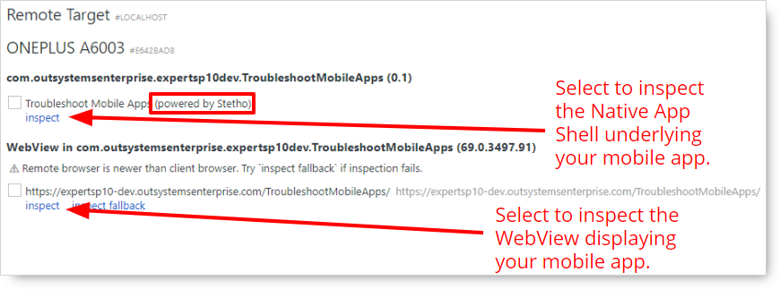

It's important that you don't have Stetho active in your production environment, as it exposes all your data.

## Inspecting network traffic

**Use these Tools/techniques** when you need to look at the details of the network requests generated by your Reactive Web or Mobile Application and the responses sent back to the application.

For example, when you want to check what resources load on first visit to a Reactive Web app, or during the upgrade process of a Mobile App, or even to simulate intermittent or slow network conditions. When you have infrastructures spread over different Geos, consider a [content delivery network (CDN)](https://www.cloudflare.com/learning/cdn/what-is-a-cdn/) to improve the download performance of your applications’ resources.

## Network traffic inspection options

To inspect network traffic in your mobile apps, you can use the following options:

* Use the Chrome or Safari Developer Tools

* Use a network proxy tool:

    * **[HTTP Toolkit](https://httptoolkit.com/)** - Free and open-source tool for Android and iOS, for debugging, testing, and building with HTTP(S). HTTP Toolkit provides one-click mobile app interception for both Android and iOS devices, with features including:
        * Automatic HTTPS interception with zero configuration
        * Full request and response inspection
        * Request breakpoints and editing
        * Mock responses for testing

    * [Mitmweb](https://docs.mitmproxy.org/stable/tools-mitmweb/) network proxy tool, this tool is the best free option but requires the most setup, here are some guides you can follow - [Android](https://medium.com/@williamxyz/monitoring-network-on-android-with-mitmproxy-bfb8722191ee), [iOS](https://www.outsystems.com/forums/discussion/53691/how-to-troubleshoot-network-requests-in-ios-mabs-6-builds/).

    * [Charles](https://www.charlesproxy.com/) web debugging proxy app (Windows, Mac OS, Linux - also available for iOS)

## Simulating degraded network conditions

**Use these Tools/techniques** when you need to simulate degraded network conditions, which can be useful to investigate bugs that seem to occur only intermittently. Chrome Developer Tools allow you to simulate slow networks, while a Tool like Charles also allows you to simulate an unreliable network (dropping packets, etc.).

* The Charles Tool offers [bandwidth throttling & reliability settings](https://www.charlesproxy.com/documentation/proxying/throttling/).

    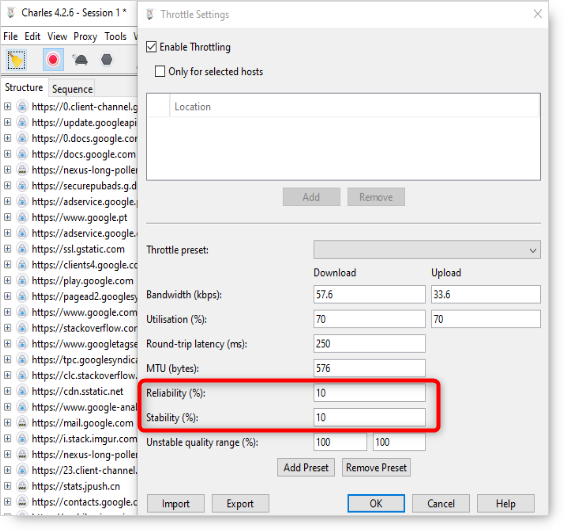

* When inspecting an Android Mobile App via the Chrome Developer Tools:
    1. Connect your device and [start Android debug bridge (ADB)](https://developer.android.com/studio/command-line/adb).
    1. In the ‘Network’ tab, you can change the network profile to use one of the predefined presets, or you can create your own custom network profile:

        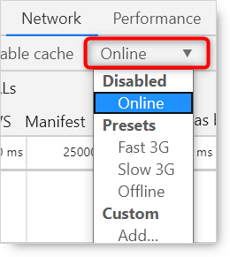

* For iOS Mobile Apps with XCode installed on a Mac, you can enable the developer options on the iOS device. A new option labeled "developer" appears on the settings, providing access to a number of additional features, including a “network link conditioner.” Once enabled, this feature allows you to select from various predefined network profiles, or to create your own custom network profiles:

    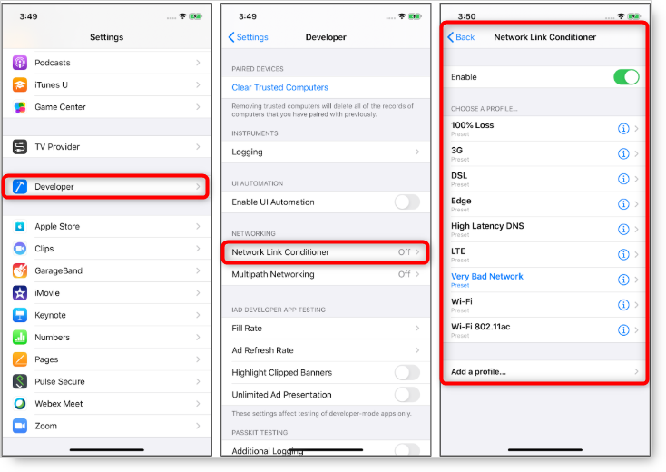

## Debugging iOS mobile apps on Windows

**Use this tool/technique** when you need to troubleshoot an iOS Mobile app, but you only have a Windows machine available and no access to XCode or Safari.

[RemoteDebug iOS Webkit Adapter](https://github.com/RemoteDebug/remotedebug-ios-webkit-adapter) is a protocol adapter that allows Safari and WebViews on iOS to be debugged from tools like VS Code, Chrome DevTools and other tools compatible with the Chrome Debugging Protocol.

The protocol adapter enables a broad range of features, including:

* DOM/CSS editing

* Console access

* Network Tool

* Screencasting

* Etc.

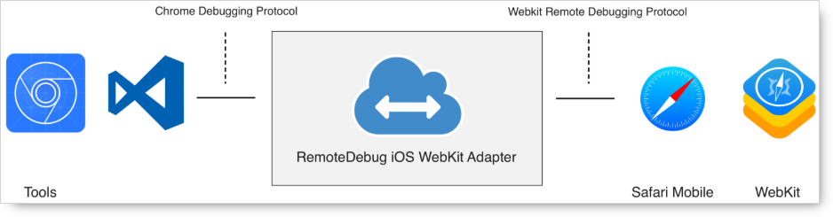

See this [Medium post](https://medium.com/@auchenberg/hello-remotedebug-ios-webkit-adapter-debug-safari-and-ios-webviews-from-anywhere-2a8553df7465) for additional information on this Tool.

## Profiling battery usage on Android

**Use this Tool/technique** when you need to investigate reports of unusually high battery consumption attributed to your Android Mobile Application.

The [Batterystats & Battery Historian](https://developer.android.com/topic/performance/power/setup-battery-historian#how-to) tools can be used on the Android platform in situations where you might need to investigate battery usage.

Batterystats is a Tool included in the Android framework that collects battery data on your device. You can use ADB to dump the collected battery data to your development machine and create a report you can analyze using Battery Historian.

Battery Historian converts the report from Batterystats into an [HTML visualization that you can view in your browser](https://developer.android.com/topic/performance/power/battery-historian).

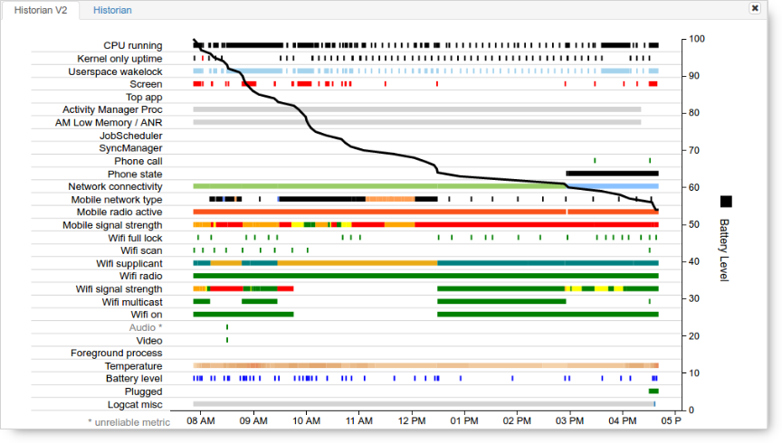

## Inspecting JavaScript console messages on mobile device

**Use this Tool/technique when:** you want to see all Console messages generated by your application JavaScript as it runs, directly on the mobile device. For example, if you are trying to troubleshoot your application by printing the value of certain variables on the console at runtime.

The [Console Log](https://www.outsystems.com/forge/component-overview/1607/console-log-plugin) Forge Plugin allows you to view all your app console messages directly on the device:

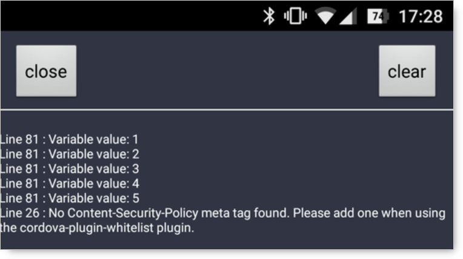

## Debugging Android applications via ADB on wifi

**Use this Tool/technique**  when you need to be able to use ADB to connect to an Android device in debug mode and you would prefer **not** to have to connect to the device with a USB cable.

See this [detailed How-To](https://android.jlelse.eu/wireless-debugging-through-adb-in-android-using-wifi-965f7edd163a). This even allows remote debugging to a device connected to a common VPN.

Note that on some devices you can enable ADB over network directly in the developer options.

Leaving this option enabled creates a security risk, since anyone in the same network can connect to your device in debug mode. Use this technique only when connected to a trusted Wi-Fi network and remember to disable it/shut ADB down when you finish.

## Running an app in a device simulator

**Use this Tool/technique** when you need to debug an app that exhibits unwanted behavior only in a particular device and you don't have that physical device available.

* For Android apps, use the [Android Emulator](https://developer.android.com/studio/run/emulator) feature of [Android Studio](https://developer.android.com/studio):

    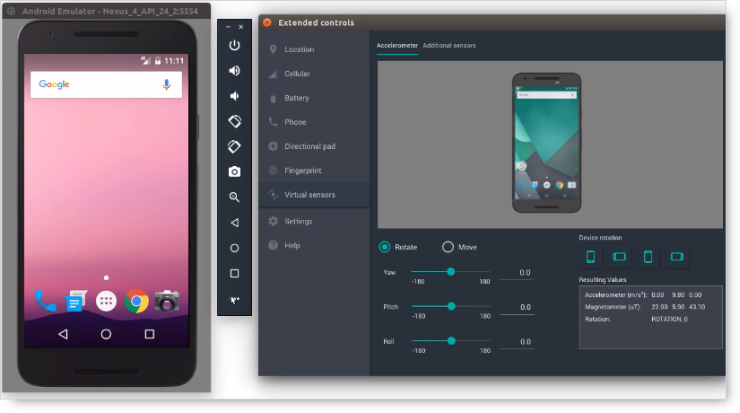

* For iOS apps, use the [Simulators](https://developer.apple.com/documentation/xcode/running_your_app_in_the_simulator_or_on_a_device) feature available in [XCode](https://developer.apple.com/documentation/xcode/):

    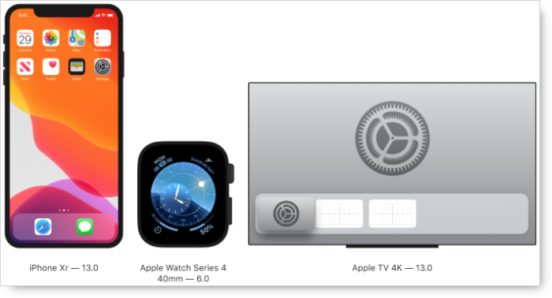

## Advanced logs & memory usage inspection with Android Studio

**Use this Tool/technique** when you need to leverage the full power of Android Studio to examine the logs or memory usage of an Android Mobile app.

* The [Logcat](https://developer.android.com/studio/debug/am-logcat) window in [Android Studio](https://developer.android.com/studio) displays system messages (such as when a garbage collection occurs), and messages that you added to your app with the log class. It displays messages in real time and keeps a history so you can view older messages.

    To display just the information of interest, you can create filters, modify how much information is displayed in messages, set priority levels, display messages produced by app code only, and search the log.

    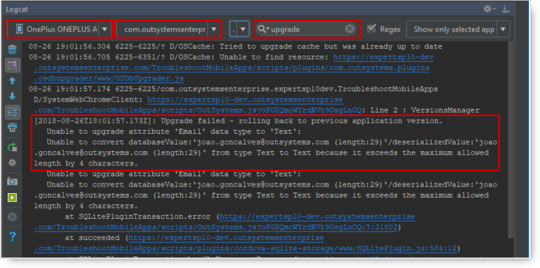

* The [Memory Profiler](https://developer.android.com/studio/profile/memory-profiler) is a component in the Android Profiler that helps you identify memory leaks and memory churn that can lead to stutter, freezes, and even app crashes.

    It shows a realtime graph of your app's memory use and lets you capture a heap dump, force garbage collections, etc.

    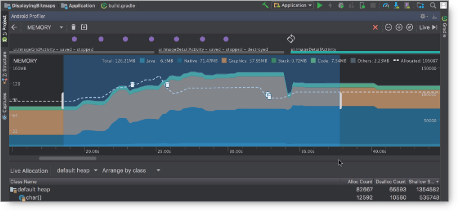

## Advanced logs inspection with macOS console

**Use this Tool/technique** when you need a more powerful Tool to inspect console logs generated by your iOS Mobile App, when it runs connected to your Mac computer, but you don't want or need the full power (and size) of XCode.

Use console to view log messages collected by your computer and other connected devices. These log messages may deal with system events, dialog text, errors, status, and other communications.

If a problem occurs, you may be able to find information about the cause of the problem by viewing either log messages or activities.

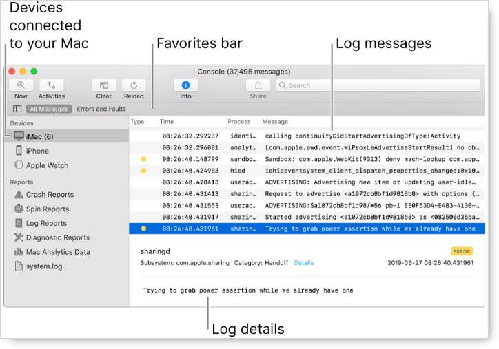

## Custom solution for offline mode mobile app logging

**Use this Tool/technique** when you are building a Mobile App which must provide a complex feature set in offline mode and you want to plan ahead and instrument the app. This way, it can generate and store logs on a device when its offline to support troubleshooting offline behavior.

For complex Mobile Applications that must offer complex features available in offline mode, it could make sense to develop a custom logging feature, based on Client Actions. This way, you can generate log records, dedicated local storage entities to store the log records, and app features to enable/disable offline logging and to upload offline logs once the app is back online.

For more details about how to implement this, see [this section of the Mobile Apps in Trouble](https://youtu.be/urlmoe3t30U?t=1130) OutSystems webinar recording.

## Tips applicable to production builds of mobile apps

**Use this Tool/technique** when you need to debug a production build of a Mobile App.

* For iOS apps, Safari allows the inspection of the production build of an iOS Mobile application.

* For Android, if there is an issue reported for a release build, remember that you can clone the app code base and regenerate a debug build (it allows you to inspect the code using Chrome Dev Tools) using the cloned copy.

    

    Note that you won’t be able to debug it using the Service Studio debugger as you are in an environment set to production mode.

    

## Native troubleshooting and debugging

**Use this Tool/technique** when you need to get into the weeds of the native code generated by the OutSystems MABS to troubleshoot and debug low-level issues.

Sometimes, it might be necessary to get down into the weeds of the code that OutSystems generates [Mobile Apps Build Service](https://success.outsystems.com/Documentation/11/Delivering_Mobile_Apps/Mobile_Apps_Build_Service) (MABS) if it's [versions](https://success.outsystems.com/Support/Release_Notes/Mobile_Apps_Build_Service_Versions) for a specific mobile platform target.
You might need to [troubleshoot the generation of the Mobile App](https://success.outsystems.com/Support/Enterprise_Customers/Troubleshooting/Troubleshooting_the_Mobile_Apps_Generation) itself.

For example, if a Plugin isn't working in the iOS version of your Mobile App, and you can’t figure out why with the Tools and techniques presented so far, you could:

* Use XCode to create a Cordova application that includes just that specific Plugin. Isolating the Plugin into its own Cordova app could help get to the bottom of the issue.

* Take the app source code generated by the MABS and load it into XCode. You can then inspect the app native code in the XCode IDE and can execute the code in a device simulator for further investigation.

This level of troubleshooting is typically significantly more involved, in terms of the setup and specialized knowledge required.

