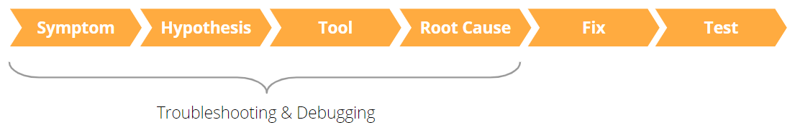

# The troubleshooting, debugging and monitoring process

In this article you can find detailed information on the differences between troubleshooting, debugging, and monitoring. Also, some best practices on how to proceed when you need to troubleshoot or debbug. 

## Definitions

While ‘monitoring’ is a term that seldom strikes discord, ‘troubleshooting’ and ‘debugging’ are sometimes used interchangeably. For the purpose of this article, they're defined as follows:

* **Monitoring** is a set of Tools and processes that aim to observe and keep track of the evolution of user and application activities, system events and abnormalities. Typically, this information is available through reports, visually rich dashboards, and alerts with varying degrees of granularity. 

    Ultimately, these tools allow their users to make decisions regarding improvements of a system’s security, reliability, and performance, or to pinpoint abnormalities in an application’s behavior. These are also critical in understanding how fruitful the improvement/correction activities were. 

    It’s fairly easy to understand that monitoring plays a pivotal role in supporting the troubleshooting and debugging efforts.

    One example of a monitoring activity is analyzing a report that shows information regarding the slowest queries of an application and observing that one in particular is providing a subpar experience to the end users (for example, Screen timeouts). 

    This finding would trigger a troubleshoot/debugging activity that would, eventually, result in a fix. The query would be monitored and the extraction of the same report at a different time would validate that the fix was successful.

* **Troubleshooting** is the set of activities that one goes through to try to identify the root cause of an unexpected and typically undesirable behavior exhibited by a software application.

    Examples of troubleshooting activities include:

    * Researching the possible reason for a slow reactive Web App Screen response to user input, by generating a page/Screen activity recording and examining the recording output in the Timeline tab of the Chrome Developer Tools.
    
    * Investigating why data isn't showing up in a Mobile App by running SQL queries on the local storage in the Application tab of the Chrome Developer Tools.

* **Debugging** is a subset of the troubleshooting activities specifically geared toward the step-by-step examination of the execution of a piece of code, and the related input and output data, typically leading to the modification of a portion of the code, to implement a fix and eliminate the unwanted behavior.

    For example, running the Service Studio debugger and stepping through individual low-code elements while examining the value held by different variables, to understand why an application seems to execute a certain code path in a specific situation, would qualify as debugging activities.

## Best practices

Troubleshooting and debugging are akin to detective work in a sense; they're supported by specialized tools and may require server-side, client-side and mobile-specific investigation. 

Troubleshooting and debugging might look complex, but they're very much exercises that you should approach with a scientific mindset. That being said, a number of factors can make you more effective:

* **Use a methodical approach to isolate the problem.**

    Be selective about testing scenarios most relevant to the issue in investigation, and proceed one step at a time (Example: make a single change to the code or perform a single, targeted test).

* **Collecting information is a cornerstone of troubleshooting and debugging.**
    
    Having access to  monitoring Tools and investing in instrumenting applications ahead of time (for example by building a custom on-device logging component for a Mobile App expected to work in offline mode), can make a significant difference.

* **Collecting metrics/snapshots of the behavior before and after taking any actions.**

    This allows you to effectively measure the evolution of the behavior that prompted the troubleshooting and debugging in the first place.

* **Understanding the underlying technologies (OS Mobile applications leverage [Apache Cordova](https://cordova.apache.org/docs/en/latest/guide/overview/)) is an advantage when investigating complex scenarios.** 

    For example, understanding that Cordova Plugins aren't available when you run your Mobile App directly in Chrome on your computer helps you understand why it's best practice to wrap Plugin calls inside Client Actions that test for Plugin availability and implement a graceful fallback when needed.

* **Knowing what Tools are available to you and picking the best one for the job can save you considerable time and effort.**

* **Following a consistent process helps build good habits and make you more effective.** 

    A recommended high-level process looks like the one depicted in the following diagram:

    

    * Observe the symptoms (or review them from a bug report).

    * Formulate a hypothesis regarding what the most likely root cause might be.

    * Use Tools to generate more information/inspect the application/perform targeted tests.

    * Confirm the root cause or get back to the hypothesis formulation step.

    As the process diagram illustrates, once you have successfully figured out the root cause, you then typically:

    * Implement a fix.

    * Test your changes (including, ideally, running a suite of regression tests).

    * Release your new-and-improved application to the world.

### Post-mortem

As a final recommendation, you might consider adding a post-mortem step to the end of the process described above when applicable. By fixing a bug, you might have learned something new and important, in which case you probably want to help prevent a recurrence of a similar issue by doing one or more of the following:

* Creating or updating documentation/standards used by the development team at your organization for the development of OutSystems applications

* Adding a new Unit Test to your automated Test Suite

* Etc.

These post-mortem step activities, along with other prevention recommendations shared earlier, help keep unwanted bugs away from your code, and allow you to spend more time enjoying the power and productivity brought to you by OutSystems!
