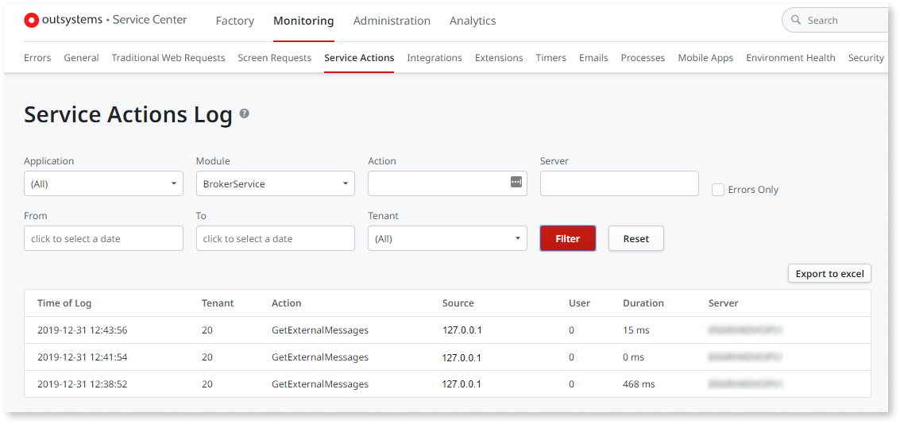
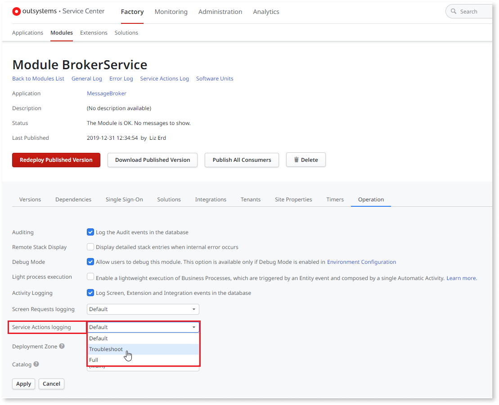

# Troubleshoot Service Actions Using Logs

To troubleshoot Service Actions you may need to check information regarding request errors and you may even need to check the headers or payload of requests.

OutSystems keeps track of all requests to Service Actions; these log entries can be viewed in the **Service Action** section of the **Monitoring** in the Service Center (OutSystems environment management console).

By default OutSystems does not log details about errors, the headers or the payloads of requests to the Service Actions. The default logging detail level reduces the amount of information stored in the environment’s database but makes troubleshooting difficult; you need to [increase the logging level](#how-to-change-the-logging-detail-level-for-service-action) to `Troubleshoot` or `Full`.

Read more on [understanding a Service Action request log](<monitoring-an-environment.md#service-actions-logs>).

Keep the following points in mind while troubleshooting Service Actions:

* Connectivity errors are not logged in Service Actions logs, they must be explicitly captured and handled on the consuming Module and logged as errors on the client code.

* The Request Key (a correlation identifier) is logged to relate all logs from the same top level request, allowing the pinpointing of the origin of a chain of requests.

* Invalid requests and responses due to security validations will raise a Security Exception. To avoid giving potential attackers information that could be used to breach the system, the exception messages for Security Exceptions will not contain detailed information and simply contain “Invalid Request” or “Invalid Response”.

## How to change the logging detail level for Service Action

To change the amount of information that is logged for requests to all Service Action of a given Module, follow these steps:

1. In Service Center console, go to the **Factory** section.
1. In the **Modules** tab, find your module and click the module's name to go to the details page.
1. In the **Operations** tab, set the Service Actions logging level to the desired value (`Default`, `Troubleshoot` or `Full`).    

    

1. Click **Apply**.

The available logging levels for Service Action requests are the following:

`Default`  
:   All requests are logged including some basic information (like the date and time of the request). No details regarding errors, request headers or payloads are logged.

`Troubleshoot`  
:   On top of the information kept by the Default level, error details are also logged. Click on the "Error" link displayed on the right to get more details about the error.

`Full`
:   On top of the information kept by the Troubleshoot level, request headers and payloads are also logged. Click on the displayed "Error" link or, if there's no error, click on the "Details" link to obtain detailed logging information.

Take into account that increasing the logging level implies that:

* More information is logged, increasing the amount of information stored in the environment’s database.

* Input and output parameters values are logged along with the request, thus making any sensitive information present in these parameters available through the environment management console.
