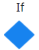

# Developer cheat sheet

This document is a summary of the most common basic tasks a developer new to the OutSystems platform should understand how to do within the IDE (Service Studio).

There is also a downloadable compact PDF of this content:

[OutSystems Developer Cheat Sheet PDF](resources/OutSystems-Developer-Cheat-Sheet.pdf)

## I want to…

### Define custom data structures

Using Service Studio you can easily define custom data structures.

1. From the **Data** tab , right-click the **Structures** folder and select **Add Structure**.

1. Right-click the new structure, select **Add Attributes**, and set its properties (**Data Type**, for example) using the properties panel located in the bottom right.

### Create a screen

There are two methods to create a screen in Service Studio.

#### Method 1

From the **Interface** tab, right-click the **MainFlow** flow in the **UI Flows** folder and select **Add Screen**.

#### Method 2

1. From the **Interface** tab , double-click on the **MainFlow** flow in the **UI Flows** folder.
1. Drag a **Screen** widget from the left Toolbox to create a screen.

### Define a reusable method (OutSystems term: action)

In Service Studio, you can define reusable methods, known as actions. There are two scopes for these actions: module and screen scope.

* **Module scope:**
    * From the **Logic** tab , right-click either the **Client Actions** or **Server Actions** folder and choose **Add Client/Server Action**.
* **Screen scope:**
    * From the **Interface** tab , right-click a screen  and select **Add Client Action**.

After selecting the scope, follow these steps:

1. An action icon will be created: a hollow orange  for client-side actions (compiles to JavaScript) and a solid orange  for server-side actions (compiles to .NET).

    

    Icons can be changed from within the properties panel.

    

1. Right-click on the new client  or server  action to add **Input/Output Parameters** or **Local Variables**.

1. Double-click on the action to define its logic. Drag and drop **Logic** widgets from the Toolbox into the flow and set their properties.

1. To make the action accessible as a function in an [expression](../ref/logic/expressions/intro.md), set the action's **Function** parameter to `Yes`.

### Define variables

#### With method scope

Right-click on the action, click **Add Local Variable**, and set its **Data Type** in the properties panel.

#### With screen scope

From the **Interface** tab, right-click the screen, click **Add Local Variable**, and set its **Data Type** in the properties panel.

#### With session scope (cleared on end user log-out or timeout)

From the **Data** tab, right-click the **Client Variables** folder, click **Add Client Variable**, and set its **Data Type** in the properties panel.

#### With module scope

From the **Data** tab, right-click the **Site Properties** folder, click **Add Site Property**, and set its **Data Type** in the properties panel.

#### Beyond basic data types

In the **Data Type** property of the variable, to define a variable of:

* An **Array/List**:
    * Under **Other**, select **List…** then select the **List** type.
* A temporary **Structure**:
    * Under **Other**, select **Record…** then right-click on the variable and select **Add Attribute** to add other attributes of the record/structure as necessary, defining each attributes's **Data Type** in the properties panel.
* A **Primary Key** of an **Entity**:
    * Under **Entity Identifiers**, select the entity identifier.
* A **Structure** the same as the attributes (row) of an entity:
    * Under **Entities**, select the entity.
* An **existing Structure**, defined under the **Data** tab:
    * Under **Structures**, select the structure.

### Define calculations with operators/operands/functions in an action

#### In a conditional

Using **If** logic widget:

In the properties panel after selecting the **If** widget, double-click on the **Condition** property row to bring up the [Expression Editor](../building-apps/logic/expression-editor.md) and type your expression in the **Expression** field using operands and operators, as well as variables, functions, and scripts in scope as seen in the **Scope** pane (bottom left of Expression Editor).

#### In an assignment

Using **Assign** logic widget:

In the properties panel after selecting the **Assign** widget, select a variable to assign the expression to, then double-click on the **Value** property row to bring up the [Expression Editor](../building-apps/logic/expression-editor.md) and type your expression in the expression field using operands and operators, as well as variables, functions, and scripts in scope as seen in the **Scope** pane (bottom left of Expression Editor).

### Define For Each and While loops in an action

Using **For Each** logic widget:

1. In the properties panel after selecting the **For Each** widget, fill in the **Record List** property, and optionally the **Start Index** and **Maximum Iterations** properties.

1. Drag your mouse from the **For Each** widget (cursor will turn into crosshairs) to drag out the **Cycle** branch to define the one or more logic widgets that will execute in this loop.

1. Complete the loop by dragging from the last logic element back to the **If** widget.

You can create logic to exit the loop early by placing an **If** widget within the flow for the exit condition.

**While** using **If** logic widget:

1. In the properties panel after selecting the **If** widget, fill in the **Condition** property.

1. Drag your mouse from the **If** widget (cursor will turn into crosshairs) to drag out the **True** branch to define the one or more logic widgets that will execute in this loop as long as the If **Condition** property is `True`.

1. Complete the loop by dragging from the last logic element back to the **If** widget.

1. You can swap the while loop to loop while the **If** condition is `False` by right-clicking on the **If** widget, and selecting **Swap connectors**.

You can create logic to exit the loop early by placing an **If** widget within the flow for the exit condition.

### Call an action

If calling from a UI element, first double-click on the UI element to edit the **OnClick** action for that element.

* Drag any reusable action into the action logic flow:

    * From under the current screen in the **Interface** tab.
    * From under the **[Client Actions]** or **Server Actions** folder in the **Logic** tab.
    * **Run Client/Server Action** from the Logic widgets.

### Define database tables and relationships

1. From the **Data** tab , under the **Entities** folder, right-click **Database** for **Server-Side** or **Local Storage** for **Mobile**, select **Add Entity** to define the database table.

1. Right-click the newly created entity, and select **Add Entity Attribute** to define each Entity Attribute (column) in the properties panel.

1. To define a **Foreign Key** column, set its **Data Type** in the properties panel to one of the **Entity Identifiers** OR name the attribute to **EntityName&lt;Id&gt;** where OutSystems will automatically assume it's the foreign key to that entity.

### Define a query (SELECT) from a database visually using aggregates

1. In an action, drag the aggregate widget into the logic flow, then double-click on it to bring up the Agggregate Editor.

1. Drag any entities you need for this query from the **Data** tab onto the Aggregate Editor. Each one will be added to the **Sources** list under the **Sources** tab in the Aggregate Editor, and any relationships will automatically appear under the **Joins** column, which can also be customized. If a join needs to be manually added, click on **Add join**.

1. Add any **Filters** (WHERE) under the **Filters** tab (May say "No Filters") in the Aggregate Editor.

1. Add any **Sorts** (SORT BY) under the **Sorting** tab (May say "No Sorts") in the Aggregate Editor.

### Integrations via REST API

#### Consume a REST API

1. From the **Logic** tab, right-click REST under the **Integrations** folder, click **Consume REST API**, then select "**Add single method**". You can select **Add multiple methods** if you have access to a REST API with Swagger specification and want to [consume multiple methods at once](../integration-with-systems/rest/consume-rest-apis/consume-a-rest-api.md#all-methods).

1. Select the **Method** (GET, POST, PUT, DELETE, PATCH), and paste the **URL**, replacing any parameters in braces (curly brackets).

1. Depending on the method selected, fill in the **Body** tab with sample **Request** and/or **Response** JSON or text/plain example to allow the platform to generate the parameters and structures.

    

    Under the **Test** tab, you can execute a test of the API method (providing any required parameters) and copy the request/response body to the **Body** tab.

    

1. Under the **Headers and Authentication** tab, you can define any Request/Response headers, as well as any REST API authentication requirements.

1. Click **Finish**, and you should see a server action for the REST API you consumed that you can call from other actions.

For advanced pre-processing and post-processing, you can define the **OnBeforeRequest** and **OnAfterResponse** actions that will execute for all REST APIs under the REST API properties.

#### Expose a REST API

1. From the **Logic** tab, right-click REST under the **Integrations** folder, **Expose REST API**, then right-click the newly created REST API and select **Add REST API Method** for each API method you want to define.

1. Defining each API method is the same as defining a reusable method/action as per above instructions. Double-click on the newly created action to edit it, add input/output parameters, local variables, call other actions, etc.

1. For every exposed REST API, the OutSystems Platform will automatically generate Swagger documentation that you can share with other developers (including non-OutSystems) who need to integrate with your exposed REST API. You can access this documentation’s URL by right-clicking on the REST API and selecting **Open Documentation**.

### Data conversions

In an expression, you have access to the functions listed under the **Data Conversion** folder under the **Built-in Functions** folder.

### Retrieve data for screen

#### From aggregate (asynchronously executed SQL query on page load)

From the **Interface** tab, right-click the **Screen**, **Fetch Data from Database** and define the query in the Aggregate Editor (see guidance above).

#### From action (asynchronously executed Method on page load)

1. From the **Interface** tab, right-click the screen, **Fetch Data from Other Sources**.

1. In the newly created data action, select the **Output** parameter and modify the properties (i.e. **Data Type**) as necessary, and define the action logic to retrieve the data to assign to the **Output** parameter.

### Display retrieved data on screen (basic)

#### As an expression

From the **Interface** tab (Elements sub-tab), double-click the screen, and drag any screen's **Local Variable**, data action **Output Variable**, screen entity, or any of their attributes to the screen.

#### In a form element (i.e. input, text area, switch, checkbox, etc):

Select the Form element widget, and configure the Variable property to bind it to in the properties panel (bottom right).

It may require data conversion (see guidance above).
