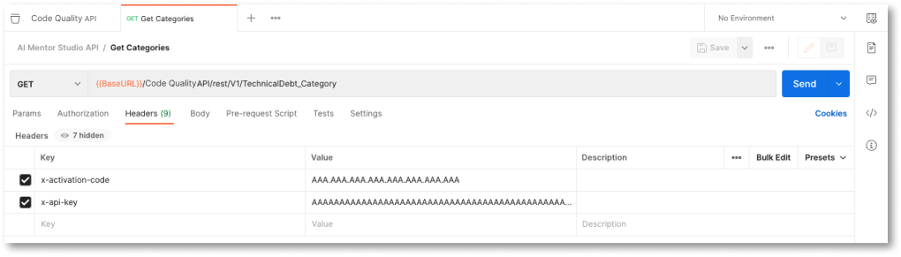
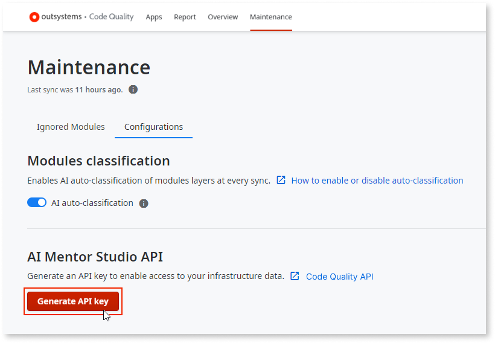
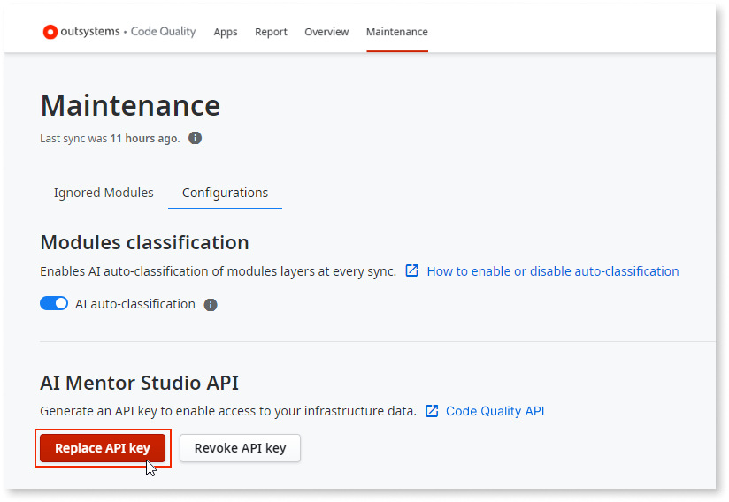
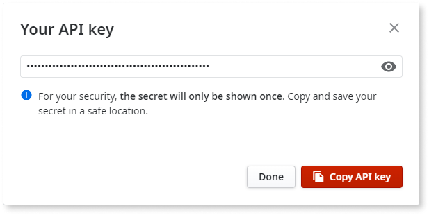
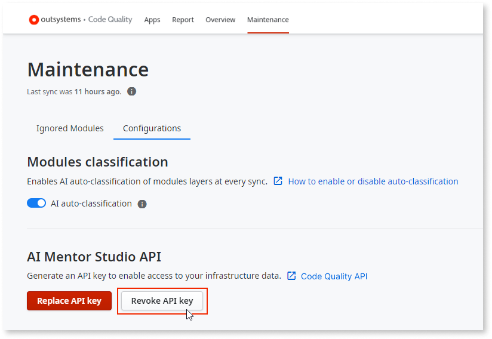
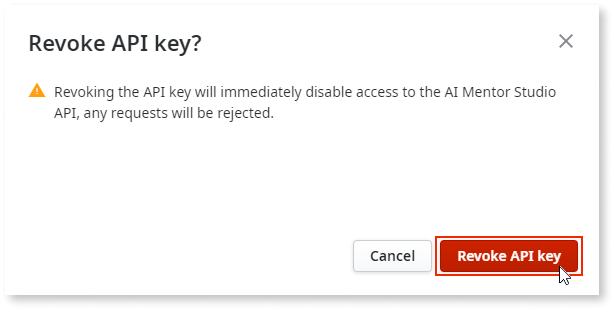

# Code Quality API authentication

The **Code Quality API** uses an API key to authenticate requests. All API requests must be made over a secure connection using HTTPS protocol. Calls made over plain HTTP fail. API requests without authentication also fail.  

Your API key provides access to your Code Quality information, so be sure to keep it secure. Don't share your API key in public areas such as GitHub or client-side code.  

You can generate and manage your API keys using Code Quality’s Maintenance menu.  

For authentication, you must include the following HTTP headers in your requests:

* x-api-key (your API key)

* x-activation-code ([your activation code](https://success.outsystems.com/Support/Enterprise_Customers/Licensing/Manage_and_Upgrade/Find_the_Activation_Code_and_the_Serial_Number))

The following is an example of Postman with both headers in use:

## Security considerations

When using Code Quality REST API, take the following security considerations into account:

* Code Quality doesn't store your API key. Consumer applications must store the API key securely. If a third party gets access to your API key, they have access to your infrastructure’s data.

* All communication between API consumers and the API server must be done over HTTPS.

## Prerequisites

To use the Code Quality API, you must have full control permissions assigned as a default role.

## How to obtain a key {#obtain-key}

To generate your API key, follow these steps:

1. In **Code Quality**, navigate to the **Maintenance** tab and select **Configurations**.

1. In the **Code Quality API** section, click **Generate API key**.

    

1. Copy the API key.  

1. Click **Done**.

    If you close the **Your API key** window without saving the key, there is no way of retrieving it again. If you need to replace your key, see the [How to replace a key](#replace-key) section.

## How to replace a key {#replace-key}

If you lost your API key, or if you have some security issues, you might need to replace your key. Follow these steps:

1. In **Code Quality**, navigate to the **Maintenance** tab and select **Configurations**.

1. In the **Code Quality API** section, click **Replace API key**.

    

    A window warns you that replacing your API Key takes immediate effect.

1. Click **Replace API key** in the popup.

1. Copy the API key. The **Copy API key** button changes to **Copied!** to inform you that you have successfully retrieved the key.

    

    Make sure to save your key in a safe location as it will not be shown again. After you save your key, click **Done**.

    

    

## How to revoke a key

To revoke your API key, follow these steps:

1. In **Code Quality**, navigate to the **Maintenance** tab and select **Configurations**.

1. In the **Code Quality API** section, click **Revoke API key**.

    

    A window warns you that revoking the API key immediately disables access to the Code Quality API, so any requests made after this, will be rejected.

1. Click **Revoke API key**.

    

    Your API key is revoked. To obtain a new one, see the [How to obtain a key](#obtain-key) section.
