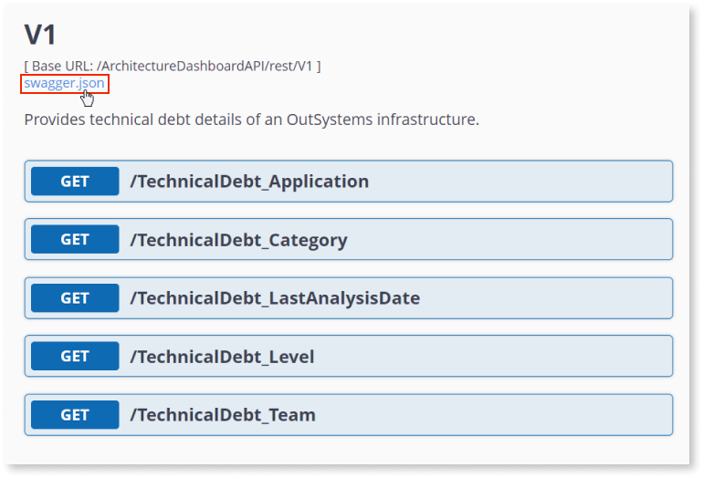

# Architecture Dashboard API

Architecture Dashboard API helps you manage technical debt, allowing you to use its data in third-party tools. This enables you to:

* Integrate technical debt data from [Architecture Dashboard](../../../managing-the-applications-lifecycle/manage-tech-debt/intro.md) with other technical debt and BI tools you already use.

* Use technical debt data as a quality gate of an automated CI/CD pipeline. This ensures that deploys meet a predefined technical debt value.   

Note: New findings are only processed every 12 hours.

To authenticate your API requests, follow the guidelines in the [Architecture Dashboard API authentication](../architecture-dashboard/ad-api-authentication.md) article.

You can access the Swagger file from the [Architecture Dashboard API page](https://architecture.outsystems.com/ArchitectureDashboardAPI/rest/V1/):

<h1>V1</h1>

Base URL: /ArchitectureDashboardAPI/rest/V1,
Version: 1

Provides technical debt details of an OutSystems infrastructure.

Schemes:
https

<h2 id="swagger--summary-no-tags">Summary</h2>
<table class="table table-bordered table-condensed swagger--summary">
<thead>
<tr>
<th>Path</th>
<th>Operation</th>
<th>Description</th>
</tr>
</thead>
<tbody>
<tr>
<td class="swagger--summary-path" rowspan="1">
<a href="#path--TechnicalDebt_Application">/TechnicalDebt_Application</a>
</td>
<td>
<a href="#operation--TechnicalDebt_Application-get">GET</a>
</td>
<td>Retrieves a list of applications and modules, with technical debt information.</td>
</tr>
<tr>
<td class="swagger--summary-path" rowspan="1">
<a href="#path--TechnicalDebt_Category">/TechnicalDebt_Category</a>
</td>
<td>
<a href="#operation--TechnicalDebt_Category-get">GET</a>
</td>
<td>Retrieves the list of pattern categories, to be used as reference in other methods.</td>
</tr>
<tr>
<td class="swagger--summary-path" rowspan="1">
<a href="#path--TechnicalDebt_LastAnalysisDate">/TechnicalDebt_LastAnalysisDate</a>
</td>
<td>
<a href="#operation--TechnicalDebt_LastAnalysisDate-get">GET</a>
</td>
<td>Retrieves the date and time when the last analysis was performed.</td>
</tr>
<tr>
<td class="swagger--summary-path" rowspan="1">
<a href="#path--TechnicalDebt_Level">/TechnicalDebt_Level</a>
</td>
<td>
<a href="#operation--TechnicalDebt_Level-get">GET</a>
</td>
<td>Retrieves the list of technical debt levels, to be used as reference in other methods.</td>
</tr>
<tr>
<td class="swagger--summary-path" rowspan="1">
<a href="#path--TechnicalDebt_Team">/TechnicalDebt_Team</a>
</td>
<td>
<a href="#operation--TechnicalDebt_Team-get">GET</a>
</td>
<td>Retrieves a list of teams and their associated applications, to be used as reference in other methods.</td>
</tr>
</tbody>
</table>

<h2>Paths</h2>

<h3 class="panel-title">GET <strong>/TechnicalDebt_Application</strong></h3>
Tags:
<a href="#tag-V1">V1</a>

<section class="sw-operation-description">

Retrieves a list of applications and modules, with technical debt information.

</section>

<section class="sw-request-params">
<table class="table">
<thead>
<tr>
<th class="sw-param-name"></th>
<th class="sw-param-description"></th>
<th class="sw-param-type"></th>
<th class="sw-param-data-type"></th>
<th class="sw-param-annotation"></th>
</tr>
</thead>
<tbody>
<tr>
<td>
ApplicationGUID
</td>
<td>
Optional filter by application guid.

</td>
<td>query</td>
<td>
string

</td>
<td>
</td>
</tr>
<tr>
<td>
ModuleGUID
</td>
<td>
Optional filter by module guid.

</td>
<td>query</td>
<td>
string

</td>
<td>
</td>
</tr>
<tr>
<td>
Date
</td>
<td>
Optionally request data for a specific date. If absent, the call returns the most recent data available.

</td>
<td>query</td>
<td>
string    (date)

</td>
<td>
</td>
</tr>
<tr>
<td>
Limit
</td>
<td>
Maximum number of applications to return. Defaults to 20. The maximum allowed is 200.

</td>
<td>query</td>
<td>
integer    (int32)

</td>
<td>
</td>
</tr>
<tr>
<td>
Offset
</td>
<td>
Starting position from which to return the results. Defaults to 0.

</td>
<td>query</td>
<td>
integer    (int32)

</td>
<td>
</td>
</tr>
</tbody>
</table>
</section>

<section class="sw-responses">

application/json 

<!-- List of response codes -->
<dl>    

<!-- 200 -->
<dt class="sw-response-200">
200 OK

</dt>
<dd class="sw-response-200">

List of applications and modules, with technical debt information.

<a class="json-schema-ref" href="#/definitions/ApplicationTechnicalDebt">ApplicationTechnicalDebt</a>

                </dd>

<!-- 400 -->
<dt class="sw-response-400">
400 Bad Request

</dt>
<dd class="sw-response-400">

Missing authentication headers, or parameters out of bounds.

<a class="json-schema-ref" href="#/definitions/Exception">Exception</a>

                </dd>

<!-- 401 -->
<dt class="sw-response-401">
401 Unauthorized

</dt>
<dd class="sw-response-401">

Invalid credentials

<a class="json-schema-ref" href="#/definitions/Exception">Exception</a>

                </dd>

<!-- 403 -->
<dt class="sw-response-403">
403 Forbidden

</dt>
<dd class="sw-response-403">

Infrastructure is inactive, or the Architecture Dashboard API feature isn't licensed.

<a class="json-schema-ref" href="#/definitions/Exception">Exception</a>

                </dd>

<!-- 404 -->
<dt class="sw-response-404">
404 Not Found

</dt>
<dd class="sw-response-404">

<ul>
  <li>No data available for the requested date</li>
  <li>No application found with a key matching the Application input parameter</li>
  <li>No module found with a key matching the Module input parameter</li>
</ul>

<a class="json-schema-ref" href="#/definitions/Exception">Exception</a>

                </dd>

<!-- 429 -->
<dt class="sw-response-429">
429 Too many requests

</dt>
<dd class="sw-response-429">

The customer has exceeded their request quota.

<a class="json-schema-ref" href="#/definitions/Exception">Exception</a>

                </dd>

<!-- 500 -->
<dt class="sw-response-500">
500 Internal Server Error

</dt>
<dd class="sw-response-500">

The data analysis for the requested date was unsuccessful; other internal problems (customer should contact OutSystems support if the problem persists).

<a class="json-schema-ref" href="#/definitions/Exception">Exception</a>

                </dd>

<!-- 503 -->
<dt class="sw-response-503">
503 Service Unavailable

</dt>
<dd class="sw-response-503">

The data for the requested date is currently being analyzed. The server includes a Retry-After header in the response.

<a class="json-schema-ref" href="#/definitions/Exception">Exception</a>

                </dd>

</dl>
</section>

<h3 class="panel-title">GET <strong>/TechnicalDebt_Category</strong></h3>
Tags:
<a href="#tag-V1">V1</a>

<section class="sw-operation-description">

Retrieves the list of pattern categories, to be used as reference in other methods.

</section>

<section class="sw-responses">

application/json 

<!-- List of response codes -->
<dl>

<!-- 200 -->
<dt class="sw-response-200">
200 OK

</dt>
<dd class="sw-response-200">

List of categories and the patterns they contain.

<a class="json-schema-ref" href="#/definitions/CategoryTechnicalDebt">CategoryTechnicalDebt</a>

                </dd>

<!-- 400 -->
<dt class="sw-response-400">
400 Bad Request

</dt>
<dd class="sw-response-400">

Missing authentication headers.

<a class="json-schema-ref" href="#/definitions/Exception">Exception</a>

                </dd>

<!-- 401 -->
<dt class="sw-response-401">
401 Unauthorized

</dt>
<dd class="sw-response-401">

Invalid credentials

<a class="json-schema-ref" href="#/definitions/Exception">Exception</a>

                </dd>

<!-- 403 -->
<dt class="sw-response-403">
403 Forbidden

</dt>
<dd class="sw-response-403">

Infrastructure is inactive, or the Architecture Dashboard API feature isn't licensed.

<a class="json-schema-ref" href="#/definitions/Exception">Exception</a>

                </dd>

<!-- 429 -->
<dt class="sw-response-429">
429 Too many requests

</dt>
<dd class="sw-response-429">

The customer has exceeded their request quota.

<a class="json-schema-ref" href="#/definitions/Exception">Exception</a>

                </dd>

<!-- 500 -->
<dt class="sw-response-500">
500 Internal Server Error

</dt>
<dd class="sw-response-500">

Other internal problems (customer should contact OutSystems support if the problem persists).

<a class="json-schema-ref" href="#/definitions/Exception">Exception</a>

                </dd>

</dl>
</section>

<h3 class="panel-title">GET <strong>/TechnicalDebt_LastAnalysisDate</strong></h3>
Tags:
<a href="#tag-V1">V1</a>

<section class="sw-operation-description">

Retrieves the date and time when the last analysis was performed.

</section>

<section class="sw-responses">

application/json 

<!-- List of response codes -->
<dl>

<!-- 200 -->
<dt class="sw-response-200">
200 OK

</dt>
<dd class="sw-response-200">

Infrastructure information, including the last analysis date.

<a class="json-schema-ref" href="#/definitions/InfrastructureInfo">InfrastructureInfo</a>

                </dd>

<!-- 400 -->
<dt class="sw-response-400">
400 Bad Request

</dt>
<dd class="sw-response-400">

Missing authentication headers.

<a class="json-schema-ref" href="#/definitions/Exception">Exception</a>

                </dd>

<!-- 401 -->
<dt class="sw-response-401">
401 Unauthorized

</dt>
<dd class="sw-response-401">

Invalid credentials

<a class="json-schema-ref" href="#/definitions/Exception">Exception</a>

                </dd>

<!-- 403 -->
<dt class="sw-response-403">
403 Forbidden

</dt>
<dd class="sw-response-403">

Infrastructure is inactive, or the Architecture Dashboard API feature isn't licensed.

<a class="json-schema-ref" href="#/definitions/Exception">Exception</a>

                </dd>

<!-- 429 -->
<dt class="sw-response-429">
429 Too many requests

</dt>
<dd class="sw-response-429">

The customer has exceeded their request quota.

<a class="json-schema-ref" href="#/definitions/Exception">Exception</a>

                </dd>

<!-- 500 -->
<dt class="sw-response-500">
500 Internal Server Error

</dt>
<dd class="sw-response-500">

Other internal problems (customer should contact OutSystems support if the problem persists).

<a class="json-schema-ref" href="#/definitions/Exception">Exception</a>

                </dd>

</dl>
</section>

<h3 class="panel-title">GET <strong>/TechnicalDebt_Level</strong></h3>
Tags:
<a href="#tag-V1">V1</a>

<section class="sw-operation-description">

Retrieves the list of technical debt levels, to be used as reference in other methods.

</section>

<section class="sw-responses">

application/json 

<!-- List of response codes -->
<dl>

<!-- 200 -->
<dt class="sw-response-200">
200 OK

</dt>
<dd class="sw-response-200">

List of technical debt levels.

<a class="json-schema-ref" href="#/definitions/TechnicalDebtLevels">TechnicalDebtLevels</a>

                </dd>

<!-- 400 -->
<dt class="sw-response-400">
400 Bad Request

</dt>
<dd class="sw-response-400">

Missing authentication headers.

<a class="json-schema-ref" href="#/definitions/Exception">Exception</a>

                </dd>

<!-- 401 -->
<dt class="sw-response-401">
401 Unauthorized

</dt>
<dd class="sw-response-401">

Invalid credentials

<a class="json-schema-ref" href="#/definitions/Exception">Exception</a>

                </dd>

<!-- 403 -->
<dt class="sw-response-403">
403 Forbidden

</dt>
<dd class="sw-response-403">

Infrastructure is inactive, or the Architecture Dashboard API feature isn't licensed.

<a class="json-schema-ref" href="#/definitions/Exception">Exception</a>

                </dd>

<!-- 429 -->
<dt class="sw-response-429">
429 Too many requests

</dt>
<dd class="sw-response-429">

The customer has exceeded their request quota.

<a class="json-schema-ref" href="#/definitions/Exception">Exception</a>

                </dd>

<!-- 500 -->
<dt class="sw-response-500">
500 Internal Server Error

</dt>
<dd class="sw-response-500">

Other internal problems (customer should contact OutSystems support if the problem persists).

<a class="json-schema-ref" href="#/definitions/Exception">Exception</a>

                </dd>

</dl>
</section>

<h3 class="panel-title">GET <strong>/TechnicalDebt_Team</strong></h3>
Tags:
<a href="#tag-V1">V1</a>

<section class="sw-operation-description">

Retrieves a list of teams and their associated applications, to be used as reference in other methods.

</section>

<section class="sw-request-params">
<table class="table">
<thead>
<tr>
<th class="sw-param-name"></th>
<th class="sw-param-description"></th>
<th class="sw-param-type"></th>
<th class="sw-param-data-type"></th>
<th class="sw-param-annotation"></th>
</tr>
</thead>
<tbody>
<tr>
<td>
Team
</td>
<td>
Optional filter by team external id.

</td>
<td>query</td>
<td>
string

</td>
<td>
</td>
</tr>
</tbody>
</table>
</section>

<section class="sw-responses">

application/json 

<!-- List of response codes -->
<dl>

<!-- 200 -->
<dt class="sw-response-200">
200 OK

</dt>
<dd class="sw-response-200">

List of teams and their associated applications.

<a class="json-schema-ref" href="#/definitions/TeamTechnicalDebt">TeamTechnicalDebt</a>

                </dd>

<!-- 400 -->
<dt class="sw-response-400">
400 Bad Request

</dt>
<dd class="sw-response-400">

Missing authentication headers.

<a class="json-schema-ref" href="#/definitions/Exception">Exception</a>

                </dd>

<!-- 401 -->
<dt class="sw-response-401">
401 Unauthorized

</dt>
<dd class="sw-response-401">

Invalid credentials

<a class="json-schema-ref" href="#/definitions/Exception">Exception</a>

                </dd>

<!-- 403 -->
<dt class="sw-response-403">
403 Forbidden

</dt>
<dd class="sw-response-403">

Infrastructure is inactive, or the Architecture Dashboard API feature isn't licensed.

<a class="json-schema-ref" href="#/definitions/Exception">Exception</a>

                </dd>

<!-- 429 -->
<dt class="sw-response-429">
429 Too many requests

</dt>
<dd class="sw-response-429">

The customer has exceeded their request quota.

<a class="json-schema-ref" href="#/definitions/Exception">Exception</a>

                </dd>

<!-- 500 -->
<dt class="sw-response-500">
500 Internal Server Error

</dt>
<dd class="sw-response-500">

Other internal problems (customer should contact OutSystems support if the problem persists).

<a class="json-schema-ref" href="#/definitions/Exception">Exception</a>

                </dd>

</dl>
</section>

<h2>Schema definitions</h2>

<h3 class="panel-title">ApplicationDetails:

object

</h3>

<section class="json-schema-description">

Application details with its modules and findings.

</section>

<section class="json-schema-properties">
<dl>
<dt data-property-name="GUID">
GUID:

string

</dt>
<dd>

Unique application identifier.

</dd>
<dt data-property-name="Name">
Name:

string

</dt>
<dd>

Application name.

</dd>
<dt data-property-name="LevelGUID">
LevelGUID:

string

</dt>
<dd>

Unique identifier of the application&#39;s technical debt level.

</dd>
<dt data-property-name="Findings">
Findings:

object[]

</dt>
<dd>

Technical debt - list of finding counts per pattern.

<section class="json-schema-array-items">

    <a class="json-schema-ref" href="#/definitions/PatternFinding">PatternFinding</a>

</section>                

</dd>
<dt data-property-name="Modules">
Modules:

object[]

</dt>
<dd>

List of modules and their technical debt.

<section class="json-schema-array-items">

    <a class="json-schema-ref" href="#/definitions/ModuleDetails">ModuleDetails</a>

</section>                

</dd>
</dl>
</section>

        

<h3 class="panel-title">ApplicationTechnicalDebt:

object

</h3>

<section class="json-schema-description">

Applications, modules and their technical debt.

</section>

<section class="json-schema-properties">
<dl>
<dt data-property-name="InfrastructureInfo">
InfrastructureInfo:

    <a class="json-schema-ref" href="#/definitions/InfrastructureInfo">InfrastructureInfo</a>

</dt>
<dd>

</dd>
<dt data-property-name="Applications">
Applications:

object[]

</dt>
<dd>

Applications, modules and their technical debt.

<section class="json-schema-array-items">

    <a class="json-schema-ref" href="#/definitions/ApplicationDetails">ApplicationDetails</a>

</section>                

</dd>
<dt data-property-name="Page">
Page:

    <a class="json-schema-ref" href="#/definitions/Page">Page</a>

</dt>
<dd>

</dd>
</dl>
</section>

        

<h3 class="panel-title">CategoryDetails:

object

</h3>

<section class="json-schema-description">

Category details and its patterns.

</section>

<section class="json-schema-properties">
<dl>
<dt data-property-name="GUID">
GUID:

string

</dt>
<dd>

Unique category identifier.

</dd>
<dt data-property-name="Name">
Name:

string

</dt>
<dd>

Category name.

</dd>
<dt data-property-name="Patterns">
Patterns:

object[]

</dt>
<dd>

List of patterns belonging to this category.

<section class="json-schema-array-items">

    <a class="json-schema-ref" href="#/definitions/PatternDetails">PatternDetails</a>

</section>                

</dd>
</dl>
</section>

        

<h3 class="panel-title">CategoryTechnicalDebt:

object

</h3>

<section class="json-schema-description">

Technical debt categories and their patterns.

</section>

<section class="json-schema-properties">
<dl>
<dt data-property-name="InfrastructureInfo">
InfrastructureInfo:

    <a class="json-schema-ref" href="#/definitions/InfrastructureInfo">InfrastructureInfo</a>

</dt>
<dd>

</dd>
<dt data-property-name="Categories">
Categories:

object[]

</dt>
<dd>

List of categories and their code patterns.

<section class="json-schema-array-items">

    <a class="json-schema-ref" href="#/definitions/CategoryDetails">CategoryDetails</a>

</section>                

</dd>
</dl>
</section>

<h3 class="panel-title">Exception:

object

</h3>

<section class="json-schema-description">

Exception details.

</section>
<section class="json-schema-properties">
<dl>
<dt data-property-name="Errors">
Errors:
string[]

</dt>
<dd>

<section class="json-schema-array-items">
string

<section class="json-schema-description">

Full detail of the error

</section>

</section>                

</dd>
<dt data-property-name="StatusCode">
StatusCode:
integer

500
</dt>
<dd>

Status code raised with the error.

</dd>
</dl>
</section>

<h3 class="panel-title">InfrastructureInfo:

object

</h3>

<section class="json-schema-description">

Infrastructure information.

</section>

<section class="json-schema-properties">
<dl>
<dt data-property-name="ActivationCode">
ActivationCode:

string

</dt>
<dd>

Activation Code.

</dd>
<dt data-property-name="LastAnalyzedOn">
LastAnalyzedOn:

string    (date-time)

</dt>
<dd>

Date and time of the last analysis.

<section class="json-schema-example">
<pre><code class="language-json">&quot;2014-12-31T23:59:59.938Z&quot;</code></pre>

</section>

</dd>
</dl>
</section>

        

<h3 class="panel-title">Level:

object

</h3>

<section class="json-schema-description">

Technical debt level.

</section>

<section class="json-schema-properties">
<dl>
<dt data-property-name="GUID">
GUID:

string

</dt>
<dd>

Unique identifier of the technical debt level.

</dd>
<dt data-property-name="Name">
Name:

string

</dt>
<dd>

Name of technical debt level.

</dd>
</dl>
</section>

        

<h3 class="panel-title">ModuleDetails:

object

</h3>

<section class="json-schema-description">

Module details and its patterns.

</section>

<section class="json-schema-properties">
<dl>
<dt data-property-name="GUID">
GUID:

string

</dt>
<dd>

Unique identifier of the module.

</dd>
<dt data-property-name="Name">
Name:

string

</dt>
<dd>

Module name.

</dd>
<dt data-property-name="LevelGUID">
LevelGUID:

string

</dt>
<dd>

Unique identifier of the module&#39;s technical debt level.

</dd>
<dt data-property-name="Findings">
Findings:

object[]

</dt>
<dd>

Technical debt - list of finding counts per pattern.

<section class="json-schema-array-items">

    <a class="json-schema-ref" href="#/definitions/PatternFinding">PatternFinding</a>

</section>                

</dd>
</dl>
</section>

        

<h3 class="panel-title">Page:

object

</h3>

<section class="json-schema-description">

Pagination information.

</section>

<section class="json-schema-properties">
<dl>
<dt data-property-name="Limit">
Limit:

integer    (int32)

</dt>
<dd>

Maximum number of records returned.

</dd>
<dt data-property-name="Offset">
Offset:

integer    (int32)

</dt>
<dd>

Offset of the first record in this page.

</dd>
<dt data-property-name="NextPageOffset">
NextPageOffset:

integer    (int32)

</dt>
<dd>

Offset of the first record in the next page.

</dd>
<dt data-property-name="TotalResults">
TotalResults:

integer    (int32)

</dt>
<dd>

Total count of results in the result set.

</dd>
<dt data-property-name="TotalPages">
TotalPages:

integer    (int32)

</dt>
<dd>

Total number of pages in the result set.

</dd>
</dl>
</section>

        

<h3 class="panel-title">PatternDetails:

object

</h3>

<section class="json-schema-description">

Code pattern details.

</section>

<section class="json-schema-properties">
<dl>
<dt data-property-name="GUID">
GUID:

string

</dt>
<dd>

Unique pattern identifier.

</dd>
<dt data-property-name="Name">
Name:

string

</dt>
<dd>

Pattern name.

</dd>
</dl>
</section>

        

<h3 class="panel-title">PatternFinding:

object

</h3>

<section class="json-schema-description">

Technical debt of the code pattern.

</section>

<section class="json-schema-properties">
<dl>
<dt data-property-name="CategoryGUID">
CategoryGUID:

string

</dt>
<dd>

Unique identifier of the pattern&#39;s category.

</dd>
<dt data-property-name="PatternGUID">
PatternGUID:

string

</dt>
<dd>

Unique identifier of the pattern.

</dd>
<dt data-property-name="Count">
Count:

integer    (int64)

</dt>
<dd>

Count of findings for the current pattern.

<section class="json-schema-example">
<pre><code class="language-json">1234567891234567</code></pre>

</section>

</dd>
</dl>
</section>

        

<h3 class="panel-title">TeamApplicationInfo:

object

</h3>

<section class="json-schema-description">

Unique application identifier of a team.

</section>

<section class="json-schema-properties">
<dl>
<dt data-property-name="GUID">
GUID:

string

</dt>
<dd>

Unique identifier of the application.

</dd>
</dl>
</section>

        

<h3 class="panel-title">TeamDetails:

object

</h3>

<section class="json-schema-description">

Team details and its applications.

</section>

<section class="json-schema-properties">
<dl>
<dt data-property-name="ExternalId">
ExternalId:

string

</dt>
<dd>

The team&#39;s external id (ID in LifeTime), which acts as a unique identifier.

</dd>
<dt data-property-name="Name">
Name:

string

</dt>
<dd>

The name of the team.

</dd>
<dt data-property-name="Applications">
Applications:

object[]

</dt>
<dd>

List of applications which belong to this team.

<section class="json-schema-array-items">

    <a class="json-schema-ref" href="#/definitions/TeamApplicationInfo">TeamApplicationInfo</a>

</section>                

</dd>
</dl>
</section>

        

<h3 class="panel-title">TeamTechnicalDebt:

object

</h3>

<section class="json-schema-description">

List of teams and their applications.

</section>

<section class="json-schema-properties">
<dl>
<dt data-property-name="InfrastructureInfo">
InfrastructureInfo:

    <a class="json-schema-ref" href="#/definitions/InfrastructureInfo">InfrastructureInfo</a>

</dt>
<dd>

</dd>
<dt data-property-name="Teams">
Teams:

object[]

</dt>
<dd>

List of teams and their applications.

<section class="json-schema-array-items">

    <a class="json-schema-ref" href="#/definitions/TeamDetails">TeamDetails</a>

</section>                

</dd>
</dl>
</section>

        

<h3 class="panel-title">TechnicalDebtLevels:

object

</h3>

<section class="json-schema-description">

List of technical debt levels.

</section>

<section class="json-schema-properties">
<dl>
<dt data-property-name="InfrastructureInfo">
InfrastructureInfo:

    <a class="json-schema-ref" href="#/definitions/InfrastructureInfo">InfrastructureInfo</a>

</dt>
<dd>

</dd>
<dt data-property-name="Levels">
Levels:

object[]

</dt>
<dd>

List of technical debt levels.

<section class="json-schema-array-items">

    <a class="json-schema-ref" href="#/definitions/Level">Level</a>

</section>                

</dd>
</dl>
</section>

