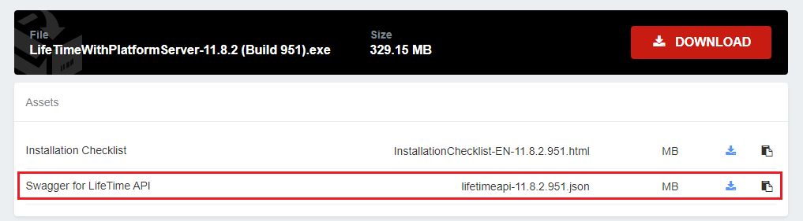

# LifeTime API v2

The Lifetime API allows you to manage applications, modules, environments, deployments, users, teams, and roles of your OutSystems infrastructure.

## Version: v2

The LifeTime API allows you to manage applications, modules, environments, and deployments of your OutSystems infrastructure. Version 2 of the API adds support for deployment zones, users, teams, and roles.

Follow the guidelines presented in [REST API Authentication](<../lifetime-deployment/rest-api-authentication.md>) to authenticate your API requests.

Check [LifeTime API Examples](<../lifetime-deployment/api-use-cases.md>) to learn how to perform common tasks using the LifeTime API.

 

You can download the Swagger file for the LifeTime API v2 in the download page of LifeTime Management Console binaries (available from LifeTime version 11.5.0). Go to the [Downloads area](https://www.outsystems.com/Downloads/search/LifeTime/11/), and select your LifeTime version:

## Summary {#swagger--summary-tags}

The LifeTime API is available through your LifeTime environment, with the API base URL determined by your LifeTime environment's domain. For instance, if your LifeTime address is `example-lt.outsystemsenterprise.com/lifetime`, then the LifeTime API base URL is `example-lt.outsystemsenterprise.com/lifetimeapi/rest/v2`.

You can also find and test [LifeTime API v2 in Postman](https://www.postman.com/outsystems-official). 

Base URL
:    `<lifetime-domain>/lifetimeapi/rest/v2`

Version
:    v2

Scheme
:   https

### /applications

| Endpoint | Description |
|---|---|
| [GET /applications/](#get-applications) | Returns a list of applications that exist in the infrastructure. | 
| [GET /applications/&#123;ApplicationKey&#125;/](#get-applications-applicationkey) | Returns the details of a given application. |
| [GET /applications/&#123;ApplicationKey&#125;/versions/](#get-applications-applicationkey-versions) | Returns a list of versions of a given application. |
| [DELETE /applications/&#123;ApplicationKey&#125;/versions/&#123;VersionKey&#125;/](#delete-applications-applicationkey-versions-versionkey) | Discards an application version, if possible. Running versions, or versions used in Deployments cannot be deleted. |
| [GET /applications/&#123;ApplicationKey&#125;/versions/&#123;VersionKey&#125;/](#get-applications-applicationkey-versions-versionkey) | Returns the details of a given version of the specified application. |
| [GET /applications/&#123;ApplicationKey&#125;/versions/&#123;VersionKey&#125;/content/](#get-applications-applicationkey-versions-versionkey-content) | Returns a link where the binary file for a given application version can be downloaded. The link will expire in 60 minutes. |

### /deployments

|Endpoint|Description|
|---|---|
|[POST /deployments/](#post-deployments)|Creates a deployment to a target environment. An optional list of applications to include in the deployment can be specified. The input is a subset of deployment object.|
|[GET /deployments/](#get-deployments)|Returns a list of deployments ordered by creation date, from newest to oldest.|
|[DELETE /deployments/&#123;DeploymentKey&#125;/](#delete-deployments-deploymentkey)|Discards a deployment, if possible. Only deployments whose state is "saved" can be deleted.|
|[PUT /deployments/&#123;DeploymentKey&#125;/](#put-deployments-deploymentkey)|Updates a given deployment. An optional list of applications to include in the deployment can be specified. The input is a subset of deployment object. Using this method to remove apps from a deployment plan sets their status as Do Nothing, but they still appear in the deployment details. From LifeTime 11.22.0 or later, the apps are removed from the deployment plan. For more information, refer to [Breaking Changes](https://success.outsystems.com/support/release_notes/11/outsystems_11_side_effects_and_breaking_changes/#introduced-in-lifetime-11.22.0).|
|[GET /deployments/&#123;DeploymentKey&#125;/](#get-deployments-deploymentkey)|Returns the details of a given deployment. The returned information contains the included applications and the possible conflicts that can arise from the deployment of the current applications.|
|[POST /deployments/&#123;DeploymentKey&#125;/&#123;Command&#125;/](#post-deployments-deploymentkey-command)|Executes the given command in a specified deployment. The allowed commands are "start", "continue" and "abort".|
|[GET /deployments/&#123;DeploymentKey&#125;/status/](#get-deployments-deploymentkey-status)|Returns the details of a given deployment execution, including the deployment status and messages.|
|[GET /deployments/&#123;DeploymentKey&#125;/getmissingdbmappings/](#get-deployments-deploymentkey-getmissingdbmappings)|Returns the list of extension logical databases that need to be mapped to database connection strings in the destination environment for the deployment to proceed. This endpoint requires LifeTime version 11.21.1, or higher.|
|[POST /deployments/&#123;DeploymentKey&#125;/configuration/](#post-deployments-deploymentkey-configuration)|Maps the database connections for the extensions' logical databases in the deployment specified. This endpoint requires LifeTime version 11.21.1, or higher.|

### /environments

| Endpoint | Description |
|---|---|
| [GET /environments](#get-environments)/ | Lists all the environments in the infrastructure. |
| [POST /environments/](#post-environments) | Registers an environment in LifeTime. This endpoint is available as of LifeTime version 11.11.0. |
| [GET /environments/&#123;EnvironmentKey&#125;/](#get-environments-environmentkey) | Returns the details of a given environment. |
| [DELETE /environments/&#123;EnvironmentKey&#125;/](#delete-environments-environmentkey) | Unregisters an environment from LifeTime. This endpoint is available as of LifeTime version 11.11.0. |
| [GET /environments/&#123;EnvironmentKey&#125;/applications/](#get-environments-environmentkey-applications) | Returns information about the running versions of all applications in a given environment. |
| [POST /environments/&#123;EnvironmentKey&#125;/applications/](#post-applications) | Creates a new application in the environment. This endpoint is available as of LifeTime version 11.5.0. |
| [GET /environments/&#123;EnvironmentKey&#125;/applications/&#123;ApplicationKey&#125;/](#get-environments-environmentkey-applications) | Returns information about the running version of the specified application in a given environment. |
| [GET /environments/&#123;EnvironmentKey&#125;/applications/&#123;ApplicationKey&#125;/content/](#get-environments-environmentkey-applications-applicationkey-content) | Returns a link where the binary file for a given application can be downloaded. The link will expire in 60 minutes. |
| [POST /environments/&#123;EnvironmentKey&#125;/applications/&#123;ApplicationKey&#125;/sourcecodeaccess/](#post-environments-environmentkey-applications-applicationkey-sourcecodeaccess) | Request the creation of the source code package of the application to be downloaded. This endpoint requires LifeTime version 11.21.1 and Platform Server 11.27.0, or higher. |
| [GET /environments/&#123;EnvironmentKey&#125;/applications/&#123;ApplicationKey&#125;/sourcecodeaccess/&#123;PackageKey&#125;/download](#get-environments-environmentkey-applications-applicationkey-sourcecodeaccess-packagekey-download) | Returns a link where the source code package can be downloaded. The link will expire in 60 minutes. This endpoint requires LifeTime version 11.21.1 and Platform Server 11.27.0, or higher. |
| [GET /environments/&#123;EnvironmentKey&#125;/applications/&#123;ApplicationKey&#125;/sourcecodeaccess/&#123;PackageKey&#125;/status/](#get-environments-environmentkey-applications-applicationkey-sourcecodeaccess-packagekey-status) | Returns the details of a given source code packaging execution, including the status and messages. This endpoint requires LifeTime version 11.21.1 and Platform Server 11.27.0, or higher. |
| [POST /environments/&#123;EnvironmentKey&#125;/applications/&#123;ApplicationKey&#125;/versions/](#post-environments-environmentkey-applications-applicationkey-versions) | Creates a new version of the application based on the current running application. |
| [POST /environments/&#123;EnvironmentKey&#125;/modules/&#123;ModuleKey&#125;/sourcecodeaccess/](#post-environments-environmentkey-modules-modulekey-sourcecodeaccess) | Request the creation of the source code package of the module to be downloaded. This endpoint requires LifeTime version 11.21.1 and Platform Server 11.27.0, or higher. |
| [GET /environments/&#123;EnvironmentKey&#125;/modules/&#123;ModuleKey&#125;/sourcecodeaccess/&#123;PackageKey&#125;/download/](#get-environments-environmentkey-modules-modulekey-sourcecodeaccess-packagekey-download) | Returns a link where the module's source code package can be downloaded. The link will expire in 60 minutes. This endpoint requires LifeTime version 11.21.1 and Platform Server 11.27.0, or higher. |
| [GET /environments/&#123;EnvironmentKey&#125;/modules/&#123;ModuleKey&#125;/sourcecodeaccess/&#123;PackageKey&#125;/status/](#get-environments-environmentkey-modules-modulekey-sourcecodeaccess-packagekey-status) | Returns the details of a given module's source code packaging execution, including the status and messages. This endpoint requires LifeTime version 11.21.1 and Platform Server 11.27.0, or higher. |
| [GET /environments/&#123;EnvironmentKey&#125;/deploymentzones/](#get-environments-environmentkey-deploymentzones) | Returns information about the deployment zones available in a given environment. |
| [GET /environments/&#123;EnvironmentKey&#125;/templates/](#get-environments-environmentkey-templates) | Returns information about the templates available in a given environment. This endpoint is available as of LifeTime version 11.5.0. |
| [GET /environments/&#123;EnvironmentKey&#125;/content_security_policies/](#get-environments-environmentkey-content_security_policies) | Returns information about the Content Security Policy in a given environment. This endpoint is available as of LifeTime version 11.10.3. |
| [PUT /environments/&#123;EnvironmentKey&#125;/content_security_policies/](#put-environments-environmentkey-content_security_policies) | Sets the Content Security Policies for a given environment. This endpoint is available as of LifeTime version 11.10.3. |
| [GET /environments/&#123;EnvironmentKey&#125;/dbconnections/](#get-environments-environmentkey-dbconnections) | Returns all the DB connections of a given environment. This endpoint is available as of LifeTime version 11.13.0. |
| [POST /environments/&#123;EnvironmentKey&#125;/dbconnections/](#post-environments-environmentkey-dbconnections) | Creates a new DB connection for an environment. This endpoint is available as of LifeTime version 11.13.0. |
| [GET /environments/&#123;EnvironmentKey&#125;/dbconnections/&#123;DbConnectionName&#125;/](#get-environments-environmentkey-dbconnections-dbconnectionname) | Returns the detail of a DB Connection for a given environment. This endpoint is available as of LifeTime version 11.13.0. |
| [PUT /environments/&#123;EnvironmentKey&#125;/dbconnections/&#123;DbConnectionName&#125;/](#put-environments-environmentkey-dbconnections-dbconnectionname) | Updates a DB connection for an environment. This endpoint is available as of LifeTime version 11.13.0. |
| [DELETE /environments/&#123;EnvironmentKey&#125;/dbconnections/&#123;DbConnectionName&#125;/](#delete-environments-environmentkey-dbconnections-dbconnectionname) | Deletes a DB connection for an environment. This endpoint is available as of LifeTime version 11.13.0. |
| [PUT /environments/&#123;EnvironmentKey&#125;/dbconnections/&#123;DbConnectionName&#125;/rolepermissionlevel/](#put-environments-environmentkey-dbconnections-dbconnectionname-rolepermissionlevel) | Sets the DB connection permission levels for a Role in a given environment. This endpoint is available as of LifeTime version 11.13.0. |
| [DELETE /environments/&#123;EnvironmentKey&#125;/dbconnections/&#123;DbConnectionName&#125;/rolepermissionlevel/](#delete-environments-environmentkey-dbconnections-dbconnectionname-rolepermissionlevel) | Revokes the DB connection permissions for a Role in an environment. This endpoint is available as of LifeTime version 11.13.0. |
| [GET /environments/&#123;EnvironmentKey&#125;/dbconnections/&#123;DbConnectionName&#125;/rolepermissionlevel/&#123;Role&#125;/](#get-environments-environmentkey-dbconnections-dbconnectionname-rolepermissionlevel-role) | Returns the DB connection permission level of a Role for a given environment. This endpoint is available as of LifeTime version 11.13.0. |
| [PUT /environments/&#123;EnvironmentKey&#125;/dbconnections/&#123;DbConnectionName&#125;/userpermissionlevel/](#put-environments-environmentkey-dbconnections-dbconnectionname-userpermissionlevel) | Sets the DB connection permission levels for a User in a given environment. This endpoint is available as of LifeTime version 11.13.0. |
| [DELETE /environments/&#123;EnvironmentKey&#125;/dbconnections/&#123;DbConnectionName&#125;/userpermissionlevel/](#delete-environments-environmentkey-dbconnections-dbconnectionname-userpermissionlevel) | Revokes the DB connection permissions for a User in an environment. This endpoint is available as of LifeTime version 11.13.0. |
| [GET /environments/&#123;EnvironmentKey&#125;/dbconnections/&#123;DbConnectionName&#125;/userpermissionlevel/&#123;Username&#125;/](#get-environments-environmentkey-dbconnections-dbconnectionname-userpermissionlevel-username) | Returns the DB connection permission level of a User for a given environment. This endpoint is available as of LifeTime version 11.13.0. |
| [GET /environments/&#123;EnvironmentKey&#125;/dbconnection/dbproviders/](#get-environments-environmentkey-dbconnection-dbproviders) | Returns the list of providers for all the DB connections in a given environment. This endpoint is available as of LifeTime version 11.13.0. |
| [GET /environments/dbconnection/permissionlevels/](#get-environments-dbconnection-permissionlevels) | Returns the permission levels for the DB connections. This endpoint is available as of LifeTime version 11.13.0. |
| [POST /environments/&#123;EnvironmentKey&#125;/testdbconnection/](#post-environments-environmentkey-dbconnections) | Tests the DB connection. This endpoint is available as of LifeTime version 11.13.0. |
| [GET /environments/blockedipaddresses/](#get-environments-blockedipaddresses) | Gets the IP Addresses blocked login attempts. This endpoint is available as of LifeTime version 11.13.0. |
| [POST /environments/&#123;EnvironmentKey&#125;/deployment/](#post-environments-environmentkey-deployment) | Creates a binary deployment to a target environment. This endpoint is available as of LifeTime version 11.22.0. |
| [DELETE /environments/blockedipaddresses/&#123;IPAddress&#125;/](#delete-environments-blockedipaddresses-ipaddress) | Unblocks a given IP Address. This endpoint is available as of LifeTime version 11.13.0. |
| [POST /environments/&#123;EnvironmentKey&#125;/solution/](#post-environments-environmentkey-solution) | Creates a temporary solution. This endpoint is available as of LifeTime version 11.22.0. |
| [GET /environments/&#123;EnvironmentKey&#125;/solution/&#123;SolutionKey&#125;/](#get-environments-environmentkey-solution-solutionkey) | Download the given solution. This endpoint is available as of LifeTime version 11.22.0. |
| [GET /environments/&#123;EnvironmentKey&#125;/solutionstatus/&#123;SolutionKey&#125;/](#get-environments-environmentkey-solutionstatus-solutionkey)| Returns the status of the solution being created. This endpoint is available as of LifeTime version 11.22.0. |

### /modules

| Endpoint | Description |
|---|---|
| [GET /modules/](#get-modules) | Returns a list of modules that exist in the infrastructure. |
| [GET /modules/&#123;ModuleKey&#125;/](#get-modules-modulekey) | Returns the details of a given module. |
| [GET /modules/&#123;ModuleKey&#125;/versions/](#get-modules-modulekey-versions) | Returns a list of versions of a given module. |
| [GET /modules/&#123;ModuleKey&#125;/versions/&#123;ModuleVersionKey&#125;/](#get-modules-modulekey-versions-moduleversionkey) | Returns the details of a given module version. |

### /roles

Available as of LifeTime version 11.5.0.

| Endpoint | Description |
|---|---|
| [GET /roles/](#get-roles) | Lists all the roles. |
| [POST /roles/](#post-roles) | Creates a role with the specified permissions. |
| [GET /roles/&#123;RoleKey&#125;/](#get-roles-rolekey) | Returns the details of a given role. |
| [PUT /roles/&#123;RoleKey&#125;/](#put-roles-rolekey) | Updates a role with the specified permissions. |
| [DELETE /roles/&#123;RoleKey&#125;/](#delete-roles-rolekey) | Deletes a role. |
| [GET /roles/permissionlevels/](#get-roles-permissionlevels) | Gets available permission levels. |

### /teams

Available as of LifeTime version 11.5.0.

| Endpoint | Description |
|---|---|
| [GET /teams/](#get-teams) | Lists all the teams. |
| [POST /teams/](#post-teams) | Creates a team with the specified details. The operation only creates the team. Users and Applications should be associated using specific endpoints. |
| [GET /teams/&#123;TeamKey&#125;/](#get-teams-teamkey) | Returns the details of a given team. |
| [PUT /teams/&#123;TeamKey&#125;/](#put-teams-teamkey) | Updates a team with the specified details. The operation only affects the Team details. Users and Applications should be associated or dissociated using specific endpoints. |
| [DELETE /teams/&#123;TeamKey&#125;/](#delete-teams-teamkey) | Deletes a team. |
| [POST /teams/&#123;TeamKey&#125;/applications/](#post-teams-teamkey-applications) | Adds the specified application to a given team. The operation adds an existing application to the team. To create a new application, use [POST /environments/&#123;EnvironmentKey&#125;/applications/](#post-environments-environmentkey-applications). |
| [DELETE /teams/&#123;TeamKey&#125;/applications/&#123;ApplicationKey&#125;](#delete-teams-teamkey-applications-applicationkey) | Removes application from the given team. |
| [POST /teams/&#123;TeamKey&#125;/users/](#post-teams-teamkey-users) | Adds a user to a team with a specified role. |
| [DELETE /teams/&#123;TeamKey&#125;/users/&#123;UserKey&#125;/](#delete-teams-teamkey-users-userkey) | Removes a user from the given team. |

### /users

Available as of LifeTime version 11.5.0.

| Endpoint | Description |
|---|---|
| [GET /users/](#get-users) | Lists all the users. By default shows only active users. |
| [POST /users/](#post-users) | Creates a user with the specified details. The operation only creates the user. Teams and Applications should be associated using specific endpoints. |
| [GET /users/&#123;UserKey&#125;/](#get-users-userkey) | Returns the details of a given user. |
| [PUT /users/&#123;UserKey&#125;/](#put-users-userkey) | Updates a user with the specified details. The operation only updates the user details. Teams and Applications should be associated using specific endpoints. |
| [POST /users/&#123;UserKey&#125;/setpassword/](#post-users-userkey-setpassword) | Allows to change a password of a given user. |
| [POST /users/&#123;UserKey&#125;/applications/](#post-users-userkey-applications) | Grants a given role to the given application to the user. |
| [DELETE /users/&#123;UserKey&#125;/applications/&#123;ApplicationKey&#125;/](#delete-users-userkey-applications-applicationkey) | Revokes user's role in application permission. |
| [GET /users/&#123;UserKey&#125;/blockedlogins/](#get-users-userkey-blockedlogins) | Gets the users blocked login attempts. This endpoint is available as of LifeTime version 11.13.0. |
| [DELETE /users/&#123;UserKey&#125;/blockedlogins/](#delete-users-userkey-blockedlogins) | Unblocks a given user. This endpoint is available as of LifeTime version 11.13.0. |

## Endpoints

### /applications/

#### GET { #get-applications }
##### Description:

Returns a list of applications that exist in the infrastructure.

##### Parameters

| Name | Located in | Description | Required | Schema |
| ---- | ---------- | ----------- | -------- | ---- |
| IncludeModules | query | When set to true, the modules are also returned. The default value is false. | No | boolean |
| IncludeEnvStatus | query | When set to true, the application status per environment is also returned. The default value is false. | No | boolean |

##### Responses

| Code | Description | Schema |
| ---- | ----------- | ------ |
| 200 | Applications list successfully retrieved. | [Application](#application) |
| 204 | No applications available in the infrastructure. |  |
| 400 | Failed to retrieve applications because IncludeModules was requested but IncludeEnvStatus was not, or invalid request when listing all applications. | [Exception](#exception) |
| 500 | Failed to list the applications. | [Exception](#exception) |

### /applications/&#123;ApplicationKey&#125;/

#### GET { #get-applications-applicationkey }
##### Description:

Returns the details of a given application.

##### Parameters

| Name | Located in | Description | Required | Schema |
| ---- | ---------- | ----------- | -------- | ---- |
| ApplicationKey | path | The key of the desired application. | Yes | string |
| IncludeModules | query | When set to true, the modules details are also retrieved. The default value is false. | No | boolean |
| IncludeEnvStatus | query | When set to true, the application status per environment is also returned. The default value is false. | No | boolean |

##### Responses

| Code | Description | Schema |
| ---- | ----------- | ------ |
| 200 | An Application record including an AppStatusInEnv sub-list, if requested. | [Application](#application) |
| 400 | Failed to retrieve applications because IncludeModules and IncludeEnvStatus parameters were incorrect. | [Exception](#exception) |
| 403 | Failed listing all applications because user has insufficient permissions. | [Exception](#exception) |
| 404 | Failed getting running applications because one of the environments was not found. | [Exception](#exception) |
| 500 | Failed to retrieve the application. | [Exception](#exception) |

### /applications/&#123;ApplicationKey&#125;/versions/

#### GET { #get-applications-applicationkey-versions }
##### Description:

Returns a list of versions of a given application.

##### Parameters

| Name | Located in | Description | Required | Schema |
| ---- | ---------- | ----------- | -------- | ---- |
| ApplicationKey | path | The key of the desired application. | Yes | string |
| ChangeLogFilter | query | Optional filter. If present, only versions containing this string in the change log will be returned. | No | string |
| MaximumVersionsToReturn | query | The maximum number of versions to return. The default value is 5. | No | integer |

##### Responses

| Code | Description | Schema |
| ---- | ----------- | ------ |
| 200 | Application versions list successfully retrieved. | [ApplicationVersion_v2](#applicationversion_v2) |
| 400 | Invalid request due to invalid max versions to return (less than 0). | [Exception](#exception) |
| 403 | Failed to retrieve the application with key `<ApplicationKey>`. The user does not have the required permissions. | [Exception](#exception) |
| 404 | Failed to retrieve the application with key `<ApplicationKey>`. | [Exception](#exception) |
| 500 | Failed to list the application versions. | [Exception](#exception) |

### /applications/&#123;ApplicationKey&#125;/versions/&#123;VersionKey&#125;/

#### DELETE { #delete-applications-applicationkey-versions-versionkey }
##### Description:

Discards an application version, if possible. Running versions, or versions used in Deployments cannot be deleted.

##### Parameters

| Name | Located in | Description | Required | Schema |
| ---- | ---------- | ----------- | -------- | ---- |
| ApplicationKey | path | The key of the application whose version to be deleted. | Yes | string |
| VersionKey | path | The key of the application version to be deleted. | Yes | string |

##### Responses

| Code | Description | Schema |
| ---- | ----------- | ------ |
| 204 | Application version successfully deleted. |  |
| 403 | Service Account doesn't have permissions to delete the specified application version. | [Exception](#exception) |
| 404 | Application or application version not found. | [Exception](#exception) |
| 500 | Failed to delete application version `<VersionKey>`. | [Exception](#exception) |

#### GET { #get-applications-applicationkey-versions-versionkey }
##### Description:

Returns the details of a given version of the specified application.

##### Parameters

| Name | Located in | Description | Required | Schema |
| ---- | ---------- | ----------- | -------- | ---- |
| ApplicationKey | path | The key of the application whose version is being requested. | Yes | string |
| IncludeModules | query | When set to true, the modules details are also retrieved. The default value is false. | Yes | boolean |
| VersionKey | path | The key of the desired application version. | Yes | string |

##### Responses

| Code | Description | Schema |
| ---- | ----------- | ------ |
| 200 | An ApplicationVersion record. | [ApplicationVersion_v2](#applicationversion_v2) |
| 403 | Failed to retrieve the application with key `<ApplicationKey>`. The user does not have the required permissions. | [Exception](#exception) |
| 404 | Failed to retrieve the application with key `<ApplicationKey>`. | [Exception](#exception) |
| 500 | Failed to retrieve the application version. | [Exception](#exception) |

### /applications/&#123;ApplicationKey&#125;/versions/&#123;VersionKey&#125;/content/

#### GET { #get-applications-applicationkey-versions-versionkey-content}
##### Description:

Returns a link where the binary file for a given application version can be downloaded. The link will expire in 60 minutes.

##### Parameters

| Name | Located in | Description | Required | Schema |
| ---- | ---------- | ----------- | -------- | ---- |
| ApplicationKey | path | The key of the application for which to get the binary file link. | Yes | string |
| VersionKey | path | The key of the application version for which to get the binary file link. | Yes | string |

##### Responses

| Code | Description | Schema |
| ---- | ----------- | ------ |
| 200 | The link for the application binary file. | [DownloadLink](#downloadlink) |
| 204 | No binary available for given keys. |  |
| 400 | The request is invalid for the given keys (Application:`<ApplicationKey>`; ApplicationVersionKey `<ApplicationVersionKey>`). | [Exception](#exception) |
| 403 | User doesn’t have permissions for the given keys (Application:`<ApplicationKey>`; ApplicationVersionKey `<ApplicationVersionKey>`). | [Exception](#exception) |
| 404 | Failed to retrieve the application with key `<ApplicationKey>` or the application version with key `<ApplicationVersionKey>`. | [Exception](#exception) |
| 500 | Failed to download the oap of the application version. | [Exception](#exception) |

### /deployments/

#### POST { #post-deployments }
##### Description:

Creates a deployment to a target environment. An optional list of applications to include in the deployment can be specified. The input is a subset of deployment object.

##### Parameters

| Name | Located in | Description | Required | Schema |
| ---- | ---------- | ----------- | -------- | ---- |
| DeploymentData | body | A Deployment record. | Yes | [ApplicationVersionKeyDeploymentZoneKeyRecordListTextTextTextRecord](#applicationversionkeydeploymentzonekeyrecordlisttexttexttextrecord) |

##### Responses

| Code | Description | Schema |
| ---- | ----------- | ------ |
| 200 | Deployment successfully created. | string |
| 400 | Invalid request. | [Exception](#exception) |
| 403 | Invalid user permissions. | [Exception](#exception) |
| 404 | Source or target environment not found. | [Exception](#exception) |
| 500 | Failed to create deployment from environment `<SourceEnvironmentKey>` to environment `<TargetEnvironmentKey>`. | [Exception](#exception) |

#### GET { #get-deployments }
##### Description:

Returns a list of deployments ordered by creation date, from newest to oldest.

##### Parameters

| Name | Located in | Description | Required | Schema |
| ---- | ---------- | ----------- | -------- | ---- |
| MinDate | query | The minimum creation date of the deployments to return. The default value is 1 week before the current date. | No | date |
| MaxDate | query | The maximum creation date of the deployments to return. The default value is the current date. | No | date |
| TargetEnvironmentKey | query | The key of the target environment to return the deployments from. If the user does not have access to the environment, the list returned will be empty. If no environment key is passed, the list will not be filtered by any target environment. | No | string |

##### Responses

| Code | Description | Schema |
| ---- | ----------- | ------ |
| 200 | Deployments list successfully retrieved. | [ [Deployment_v2](#deployment_v2) ] |
| 204 | There are no deployments created between `<MinDate>` and `<MaxDate>` for environment key `<TargetEnvironmentKey>`. |  |
| 400 | Invalid request for list of deployments created between `<MinDate>` and `<MaxDate>`for environment key `<TargetEnvironmentKey>`. | [Exception](#exception) |
| 403 | User doesn't have access to any environment. | [Exception](#exception) |
| 500 | Failed to list the deployments. | [Exception](#exception) |

### /deployments/&#123;DeploymentKey&#125;/

#### DELETE { #delete-deployments-deploymentkey }
##### Description:

Discards a deployment, if possible. Only deployments whose state is "saved" can be deleted.

##### Parameters

| Name | Located in | Description | Required | Schema |
| ---- | ---------- | ----------- | -------- | ---- |
| DeploymentKey | path | The key of the deployment to delete. | Yes | string |

##### Responses

| Code | Description | Schema |
| ---- | ----------- | ------ |
| 204 | Deployment successfully deleted. |  |
| 400 | Deployment with key `<DeploymentKey>` cannot be deleted | [Exception](#exception) |
| 403 | Service Account doesn't have permissions to the deployment with key `<DeploymentKey>`. | [Exception](#exception) |
| 404 | Deployment with key `<DeploymentKey>` not found. | [Exception](#exception) |
| 500 | Failed to delete deployment `<DeploymentKey>`. | [Exception](#exception) |

#### PUT { #put-deployments-deploymentkey }
##### Description:

Updates a given deployment. An optional list of applications to include in the deployment can be specified. The input is a subset of deployment object.

##### Parameters

| Name | Located in | Description | Required | Schema |
| ---- | ---------- | ----------- | -------- | ---- |
| DeploymentKey | path | The key of the deployment to update. | Yes | string |
| DeploymentData | body | The deployment information to update. | Yes | [ApplicationVersionKeyDeploymentZoneKeyRecordListTextTextTextRecord](#applicationversionkeydeploymentzonekeyrecordlisttexttexttextrecord) |

##### Responses

| Code | Description | Schema |
| ---- | ----------- | ------ |
| 200 | Deployment successfully updated. | [DeploymentData_v2](#deploymentdata_v2) |
| 400 | Invalid request. | [Exception](#exception) |
| 403 | Invalid user permissions. | [Exception](#exception) |
| 404 | Deployment plan not found. | [Exception](#exception) |
| 500 | Failed to update deployment with key `<DeploymentKey>`. | [Exception](#exception) |

#### GET { #get-deployments-deploymentkey }
##### Description:

Returns the details of a given deployment. The returned information contains the included applications and the possible conflicts that can arise from the deployment of the current applications.

##### Parameters

| Name | Located in | Description | Required | Schema |
| ---- | ---------- | ----------- | -------- | ---- |
| DeploymentKey | path | The key of the desired deployment. | Yes | string |

##### Responses

| Code | Description | Schema |
| ---- | ----------- | ------ |
| 200 | Deployment details successfully retrieved. | [ApplicationConflictListTextListDeployment_v2Record](#applicationconflictlisttextlistdeployment_v2record) |
| 403 | User doesn't have permissions to the deployment with key `<DeploymentKey>`. | [Exception](#exception) |
| 404 | Deployment with key `<DeploymentKey>` not found. | [Exception](#exception) |
| 500 | Failed to access the details of deployment with key `<DeploymentKey>`. | [Exception](#exception) |

### /deployments/&#123;DeploymentKey&#125;/&#123;Command&#125;/

#### POST { #post-deployments-deploymentkey-command }
##### Description:

Executes the given command in a specified deployment. The allowed commands are "start", "continue" and "abort".

##### Parameters

| Name | Located in | Description | Required | Schema |
| ---- | ---------- | ----------- | -------- | ---- |
| DeploymentKey | path | The key of the deployment where the command will be executed. | Yes | string |
| Command | path | The command to execute. One of "start", "continue" or "abort".  | Yes | string |
| RedeployOutdated | query | If True, outdated applications in the target environment will be redeployed. | No | boolean |
| IncludeErrorDetails | query | If True, when an error occurs the returned message will contain more details about the error in question. | No | boolean |

##### Responses

| Code | Description | Schema |
| ---- | ----------- | ------ |
| 202 | Command `<Command>` executed successfully for deployment `<DeploymentKey>`. |  |
| 400 | Command `<Command>` can't be executed for deployment `<DeploymentKey>`. | [Exception](#exception) |
| 403 | Service Account doesn't have permissions to the deployment with key `<DeploymentKey>`. | [Exception](#exception) |
| 404 | Deployment with key `<DeploymentKey>` not found, or command not found. | [Exception](#exception) |
| 500 | Failed to execute command `<Command>` for deployment with key `<DeploymentKey>`. | [Exception](#exception) |

### /deployments/&#123;DeploymentKey&#125;/status/

#### GET { #get-deployments-deploymentkey-status}
##### Description:

Returns the details of a given deployment execution, including the deployment status and messages.

##### Parameters

| Name | Located in | Description | Required | Schema |
| ---- | ---------- | ----------- | -------- | ---- |
| DeploymentKey | path | The key of the deployment whose status is being requested. | Yes | string |

##### Responses

| Code | Description | Schema |
| ---- | ----------- | ------ |
| 200 | Deployment status successfully retrieved. | [DeploymentMessageListTextTextRecord](#deploymentmessagelisttexttextrecord) |
| 403 | User doesn't have permissions to the deployment with key `<DeploymentKey>`. | [Exception](#exception) |
| 404 | Deployment with key `<DeploymentKey>` not found. | [Exception](#exception) |
| 500 | Failed to retrieve the status of the deployment with key `<DeploymentKey>`. | [Exception](#exception) |

### /deployments/&#123;DeploymentKey&#125;/getmissingdbmappings/

#### GET { #get-deployments-deploymentkey-getmissingdbmappings}
##### Description:

Returns the list of extension logical databases that need to be mapped to database connection strings in the destination environment for the deployment to proceed. This endpoint requires LifeTime version 11.21.1, or higher.

##### Parameters

| Name | Located in | Description | Required | Schema |
| ---- | ---------- | ----------- | -------- | ---- |
| DeploymentKey | path | The key of the desired deployment. | Yes | string |

##### Responses

| Code | Description | Schema |
| ---- | ----------- | ------ |
| 200 | A list of extensions and logical databases to be mapped. | [REST_LogicalDatabase](#rest_logicaldatabase) |
| 400 | One of the following errors:   - The deployment provided does not exist   - The target environment does not have this capability | [Exception](#exception) |
| 500 | Message describing the error. | [Exception](#exception) |

### /deployments/&#123;DeploymentKey&#125;/configuration/

#### POST { #post-deployments-deploymentkey-configuration}
##### Description:

Maps the database connections for the extensions' logical databases in the deployment specified. This endpoint requires LifeTime version 11.21.1, or higher.

##### Parameters

| Name | Located in | Description | Required | Schema |
| ---- | ---------- | ----------- | -------- | ---- |
| DeploymentKey | path | The key of the desired deployment. | Yes | string |
| DatabaseMapping | body | The mapping for all the database connections of an extension. | Yes | [ExtensionDBFullMapping](#extensiondbfullmapping) |

##### Responses

| Code | Description | Schema |
| ---- | ----------- | ------ |
| 200 | Command `<Command>` executed successfully for deployment `<DeploymentKey>`. |  |
| 400 | One of the following errors:   - The deployment provided is not awaiting for confirmation   - Extension mappings were not provided   - DB mappings were not provided for extension `<ExtensionKey>`   - The extension provided does not exist or is not part of this deployment: `<ExtensionKey>`  - The logical database `<LogicalDatabaseName>` does not exist for this extension    - The database `<DatabaseName>` does not exist for this extension    - The mapping for the following extension was not provided: `<ExtensionKey>`    - The mapping for the following logical database was not provided: `<LogicalDatabase>`   - The target environment does not have this capability | [Exception](#exception) |
| 403 | You don't have permissions to continue with the deployment. | [Exception](#exception) |
| 404 | One of the following errors:   - The requested resource does not exist.   - The deployment provided does not exist  | [Exception](#exception) |
| 500 | There was an internal error when continuing with the deployment. | [Exception](#exception) |

### /environments/

#### POST { #post-environments }
##### Description:

Register the environment in LifeTime.

##### Parameters

| Name | Located in | Description | Required | Schema |
| ---- | ---------- | ----------- | -------- | ---- |
| EnvironmentRegistration | body | An environment record | Yes | [EnvironmentRegistration](#environmentregistration) |

##### Responses

| Code | Description | Schema |
| ---- | ----------- | ------ |
| 201 | Environment registration response | [TextEnvironmentRegistration_UsersListRecord](#textenvironmentregistration_userslistrecord) |
| 400 | Failed to register the environment with key `<EnvironmentKey>` because there are invalid parameters in the request. | [Exception](#exception) |
| 403 | Failed to register the environment with key `<EnvironmentKey>` because of invalid permissions. | [Exception](#exception) |
| 405 | Failed to register the environment with key `<EnvironmentKey>` because the feature is not enabled. | [Exception](#exception) |
| 500 | Failed to register the environment with key `<EnvironmentKey>` because of an internal error. | [Exception](#exception) |

#### GET { #get-environments }
##### Description:

Lists all the environments in the infrastructure.

##### Responses

| Code | Description | Schema |
| ---- | ----------- | ------ |
| 200 | Environments list successfully retrieved. | [ [Environment](#environment) ] |
| 204 | No environments found. |  |
| 500 | Failed to list the environments. | [Exception](#exception) |

### /environments/&#123;EnvironmentKey&#125;

#### DELETE { #delete-environments-environmentkey }
##### Description:

Unregister the environment in LifeTime.

##### Parameters

| Name | Located in | Description | Required | Schema |
| ---- | ---------- | ----------- | -------- | ---- |
| EnvironmentKey | path | An environment key | Yes | string |

##### Responses

| Code | Description | Schema |
| ---- | ----------- | ------ |
| 204 | Environment deleted with success. |  |
| 404 | Failed to unregister the environment with key `<EnvironmentKey>` because because it was not found. | [Exception](#exception) |
| 405 | Failed to unregister the environment with key `<EnvironmentKey>` because the feature is not enabled. | [Exception](#exception) |
| 500 | Failed to unregister environment from LifeTime. | [Exception](#exception) |

### /environments/&#123;EnvironmentKey&#125;/

#### GET { #get-environments-environmentkey }
##### Description:

Returns the details of a given environment.

##### Parameters

| Name | Located in | Description | Required | Schema |
| ---- | ---------- | ----------- | -------- | ---- |
| EnvironmentKey | path | The key of the desired environment. | Yes | string |

##### Responses

| Code | Description | Schema |
| ---- | ----------- | ------ |
| 200 | Environment details successfully retrieved. | [Environment](#environment) |
| 403 | Failed to retrieve the environment with key: `<EnvironmentKey>`. The user does not have the required permissions. | [Exception](#exception) |
| 404 | Failed to retrieve the environment with key: `<EnvironmentKey>`. | [Exception](#exception) |
| 500 | Failed to access the details of environment. | [Exception](#exception) |

### /environments/&#123;EnvironmentKey&#125;/applications/

#### GET { #get-environments-environmentkey-applications }
##### Description:

Returns information about the running versions of all applications in a given environment.

##### Parameters

| Name | Located in | Description | Required | Schema |
| ---- | ---------- | ----------- | -------- | ---- |
| EnvironmentKey | path | The key of the environment whose list of running applications is being requested. | Yes | string |
| IncludeModules | query | When set to true, the modules details are also retrieved. The default value is false. | No | boolean |
| IncludeEnvStatus | query | When set to true, the applications’ status information in the environment is included in the result. The default value is false. | No | boolean |

##### Responses

| Code | Description | Schema |
| ---- | ----------- | ------ |
| 200 | Applications list for the given environment successfully retrieved. | [ [Application](#application) ] |
| 204 | No applications found in environment with key `<EnvironmentKey>`. |  |
| 400 | Failed to retrieve applications published in environment because IncludeModules and IncludeEnvStatus parameters were incorrect, or Invalid request when getting running applications for environment with key `<EnvironmentKey>`. | [Exception](#exception) |
| 403 | Failed to retrieve the running applications for environment with key `<EnvironmentKey>` because user has insufficient permissions. | [Exception](#exception) |
| 404 | Failed to retrieve running applications for environment with key `<EnvironmentKey>` because it was not found. | [Exception](#exception) |

### /environments/&#123;EnvironmentKey&#125;/applications/&#123;ApplicationKey&#125;/

#### GET { #get-environments-environmentkey-applications-applicationkey}
##### Description:

Returns information about the running version of the specified application in a given environment.

##### Parameters

| Name | Located in | Description | Required | Schema |
| ---- | ---------- | ----------- | -------- | ---- |
| EnvironmentKey | path | The key of the environment from which to get the running application details. | Yes | string |
| ApplicationKey | path | The key of the application whose details are being requested. | Yes | string |
| IncludeEnvStatus | query | When set to true, the applications’ status information in the environment is included in the result. The default value is false. | No | boolean |
| IncludeModules | query | When set to true, the modules details are also retrieved. The default value is false. | No | boolean |

##### Responses

| Code | Description | Schema |
| ---- | ----------- | ------ |
| 200 | Application information successfully retrieved. | [Application](#application) |
| 400 | Request asked for Modules but not for Status. | [Exception](#exception) |
| 403 | User doesn’t have permissions for the given keys (EnvironmentKey:`<EnvironmentKey>`; Application:`<ApplicationKey>`). | [Exception](#exception) |
| 404 | Failed to retrieve the environment with key `<EnvironmentKey>` or the application with key `<ApplicationKey>`. | [Exception](#exception) |
| 500 | Failed to access the running version of an application. | [Exception](#exception) |

### /environments/&#123;EnvironmentKey&#125;/applications/&#123;ApplicationKey&#125;/content/

#### GET { #get-environments-environmentkey-applications-applicationkey-content }
##### Description:

Returns a link where the binary file for a given application can be downloaded. The link will expire in 60 minutes. If the requested type of binary file is '.aab', and the application binary file type is '.apk', the download link will get a '.apk' binary file. Otherwise, it will get a '.aab' binary file.

##### Parameters

| Name | Located in | Description | Required | Schema |
| ---- | ---------- | ----------- | -------- | ---- |
| EnvironmentKey | path | The key of the environment from which to get the application binary file link. | Yes | string |
| ApplicationKey | path | The key of the application for which to get the binary file link. | Yes | string |
| Type | query | The type of binary file to return, when applicable. One of "oap", "apk", "aab" or "ipa". | No | string |

##### Responses

| Code | Description | Schema |
| ---- | ----------- | ------ |
| 200 | Binary file download link successfully retrieved. | [DownloadLink](#downloadlink) |
| 204 | No binary available for given type and keys. | [Exception](#exception) |
| 400 | The required type `<Type>` is invalid for given keys (EnvironmentKey:`<EnvironmentKey>`; Application:`<ApplicationKey>`). | [Exception](#exception) |
| 403 | User doesn’t have permissions for the given keys (EnvironmentKey:`<EnvironmentKey>`; Application:`<ApplicationKey>`). | [Exception](#exception) |
| 404 | Failed to retrieve the environment with key `<EnvironmentKey>` or the application with key `<ApplicationKey>`. | [Exception](#exception) |
| 500 | Failed to download `<Type>` of an application. | [Exception](#exception) |

### /environments/&#123;EnvironmentKey&#125;/applications/&#123;ApplicationKey&#125;/sourcecodeaccess/

#### POST { #post-environments-environmentkey-applications-applicationkey-sourcecodeaccess}
##### Description:

Request the creation of the source code package of the application to be downloaded. This endpoint requires LifeTime version 11.21.1 and Platform Server 11.27.0, or higher.

##### Parameters

| Name | Located in | Description | Required | Schema |
| ---- | ---------- | ----------- | -------- | ---- |
| EnvironmentKey | path | The key of the environment from which to get the source code of the application. | Yes | string |
| ApplicationKey | path | The key of the application for which to get the source code. | Yes | string |

##### Responses

| Code | Description | Schema |
| ---- | ----------- | ------ |
| 200 | Operation key identifier, status and operation messages. | [SourceCode_Status](#sourcecode_status) |
| 400 | The required type `<Type>` is invalid for given keys (EnvironmentKey; ApplicationKey). | [Exception](#exception) |
| 403 | User doesn't have permissions for the given keys (EnvironmentKey; ApplicationKey). | [Exception](#exception) |
| 404 | No environment or application found. Please check that the EnvironmentKey and ApplicationKey exist. | [Exception](#exception) |
| 500 | Failed to start the operation to package all the source code files. | [Exception](#exception) |

### /environments/&#123;EnvironmentKey&#125;/applications/&#123;ApplicationKey&#125;/sourcecodeaccess/&#123;PackageKey&#125;/download/

#### GET { #get-environments-environmentkey-applications-applicationkey-sourcecodeaccess-packagekey-download }
##### Description:

Returns a link where the source code package can be downloaded. The link will expire in 60 minutes. This endpoint requires LifeTime version 11.21.1 and Platform Server 11.27.0, or higher.

##### Parameters

| Name | Located in | Description | Required | Schema |
| ---- | ---------- | ----------- | -------- | ---- |
| EnvironmentKey | path | The key of the environment from which to get the source code of the application. | Yes | string |
| ApplicationKey | path | The key of the application for which to get the source code. | Yes | string |
| PackageKey | path | The key of the application&#39;s source code operation. | Yes | string |

##### Responses

| Code | Description | Schema |
| ---- | ----------- | ------ |
| 200 | The link for the application binary file. | [DownloadLink](#downloadlink) |
| 400 | The required type `<Type>` is invalid for given keys (EnvironmentKey; ApplicationKey). | [Exception](#exception) |
| 403 | User doesn't have permissions for the given keys (EnvironmentKey; ApplicationKey). | [Exception](#exception) |
| 404 | No environment or application found. Please check that the EnvironmentKey and ApplicationKey exist. | [Exception](#exception) |
| 500 | Failed to start the operation to package all the source code files. | [Exception](#exception) |

### /environments/&#123;EnvironmentKey&#125;/applications/&#123;ApplicationKey&#125;/sourcecodeaccess/&#123;PackageKey&#125;/status/

#### GET { #get-environments-environmentkey-applications-applicationkey-sourcecodeaccess-packagekey-status }
##### Description:

Returns the details of a given source code packaging execution, including the status and messages. This endpoint requires LifeTime version 11.21.1 and Platform Server 11.27.0, or higher.

##### Parameters

| Name | Located in | Description | Required | Schema |
| ---- | ---------- | ----------- | -------- | ---- |
| EnvironmentKey | path | The key of the environment from which to get the source code of the application. | Yes | string |
| ApplicationKey | path | The key of the application for which to get the source code. | Yes | string |
| PackageKey | path | The key of the application&#39;s source code operation. | Yes | string |

##### Responses

| Code | Description | Schema |
| ---- | ----------- | ------ |
| 200 | Operation key identifier, status and operation messages. | [SourceCode_Status](#sourcecode_status) |
| 400 | The required type 'Type' is invalid for given keys (EnvironmentKey; ApplicationKey). | [Exception](#exception) |
| 403 | User doesn't have permissions for the given keys (EnvironmentKey; ApplicationKey). | [Exception](#exception) |
| 404 | No environment or application found. Please check that the EnvironmentKey and ApplicationKey exist. | [Exception](#exception) |
| 500 | Failed to start the operation to package all the source code files. | [Exception](#exception) |

### /environments/&#123;EnvironmentKey&#125;/applications/&#123;ApplicationKey&#125;/versions/

#### POST { #post-environments-environmentkey-applications-applicationkey-versions }
##### Description:

Creates a new version of the application based on the current running application.

##### Parameters

| Name | Located in | Description | Required | Schema |
| ---- | ---------- | ----------- | -------- | ---- |
| EnvironmentKey | path | The key of the environment from which to get the application. | Yes | string |
| ApplicationKey | path | The key of the application for which to generate a new version. | Yes | string |
| ApplicationVersionCreate | body | A structure holding the new version name for the application and for its native applications, if applicable. | Yes | [ApplicationVersionCreate](#applicationversioncreate) |

##### Responses

| Code | Description | Schema |
| ---- | ----------- | ------ |
| 201 | Application version successfully created. | [TextRecord](#textrecord) |
| 400 | Invalid request. | [Exception](#exception) |
| 403 | Invalid user permissions. | [Exception](#exception) |
| 404 | Environment or application not found. | [Exception](#exception) |
| 500 | Failed to tag an application, or Failed to create a new version for application `<ApplicationName>`. | [Exception](#exception) |

### /environments/&#123;EnvironmentKey&#125;/modules/&#123;ModuleKey&#125;/sourcecodeaccess/

#### POST { #post-environments-environmentkey-modules-modulekey-sourcecodeaccess }
##### Description:

Request the creation of the source code package of the module to be downloaded.

##### Parameters

| Name | Located in | Description | Required | Schema |
| ---- | ---------- | ----------- | -------- | ---- |
| EnvironmentKey | path | The key of the environment from which to get the source code of the module. | Yes | string |
| ModuleKey | path | The key of the module for which to get the source code. | Yes | string |

##### Responses

| Code | Description | Schema |
| ---- | ----------- | ------ |
| 200 | Operation key identifier, status and operation messages. | [SourceCode_Status](#sourcecode_status) |
| 400 | The required type `<Type>` is invalid for given keys (EnvironmentKey; ModuleKey). | [Exception](#exception) |
| 403 | User doesn't have permissions for the given keys (EnvironmentKey; ModuleKey). | [Exception](#exception) |
| 404 | No environment or module found. Please check that the EnvironmentKey and ModuleKey exist. | [Exception](#exception) |
| 500 | Failed to start the operation to package all the source code files. | [Exception](#exception) |

### /environments/&#123;EnvironmentKey&#125;/modules/&#123;ModuleKey&#125;/sourcecodeaccess/&#123;PackageKey&#125;/download/

#### GET { #get-environments-environmentkey-modules-modulekey-sourcecodeaccess-packagekey-download }
##### Description:

Returns a link where the module&#39;s source code package can be downloaded. The link will expire in 60 minutes.

##### Parameters

| Name | Located in | Description | Required | Schema |
| ---- | ---------- | ----------- | -------- | ---- |
| EnvironmentKey | path | The key of the environment from which to get the source code of the module. | Yes | string |
| ModuleKey | path | The key of the module for which to get the source code. | Yes | string |
| PackageKey | path | The key of the module&#39;s source code operation. | Yes | string |

##### Responses

| Code | Description | Schema |
| ---- | ----------- | ------ |
| 200 | The link for the module binary file. | [DownloadLink](#downloadlink) |
| 400 | The required type `<Type>` is invalid for given keys (EnvironmentKey; ModuleKey). | [Exception](#exception) |
| 403 | User doesn't have permissions for the given keys (EnvironmentKey; ModuleKey). | [Exception](#exception) |
| 404 | No environment or module found. Please check that the EnvironmentKey and ModuleKey exist. | [Exception](#exception) |
| 500 | Failed to start the operation to package all the source code files. | [Exception](#exception) |

### /environments/&#123;EnvironmentKey&#125;/modules/&#123;ModuleKey&#125;/sourcecodeaccess/&#123;PackageKey&#125;/status/

#### GET { #get-environments-environmentkey-modules-modulekey-sourcecodeaccess-packagekey-status}
##### Description:

Returns the details of a given module&#39;s source code packaging execution, including the status and messages.

##### Parameters

| Name | Located in | Description | Required | Schema |
| ---- | ---------- | ----------- | -------- | ---- |
| EnvironmentKey | path | The key of the environment from which to get the source code of the module. | Yes | string |
| ModuleKey | path | The key of the module for which to get the source code. | Yes | string |
| PackageKey | path | The key of the module&#39;s source code operation. | Yes | string |

##### Responses

| Code | Description | Schema |
| ---- | ----------- | ------ |
| 200 | Operation key identifier, status and operation messages. | [SourceCode_Status](#sourcecode_status) |
| 400 | The required type `<Type>` is invalid for given keys (EnvironmentKey; ModuleKey). | [Exception](#exception) |
| 403 | User doesn't have permissions for the given keys (EnvironmentKey; ModuleKey). | [Exception](#exception) |
| 404 | No environment or module found. Please check that the EnvironmentKey and ModuleKey exist. | [Exception](#exception) |
| 500 | Failed to start the operation to package all the source code files. | [Exception](#exception) |

### /environments/&#123;EnvironmentKey&#125;/deploymentzones/

#### GET { #get-environments-environmentkey-deploymentzones }
##### Description:

Returns information about the deployment zones available in a given environment.

##### Parameters

| Name | Located in | Description | Required | Schema |
| ---- | ---------- | ----------- | -------- | ---- |
| EnvironmentKey | path | The key of the environment from which to get the running application details. | Yes | string |

##### Responses

| Code | Description | Schema |
| ---- | ----------- | ------ |
| 200 | Deployment zone information successfully retrieved. | [ [DeploymentZone_v2](#deploymentzone_v2) ] |
| 400 | Failed to access the deployment zones of environment. | [Exception](#exception) |
| 403 | Failed to retrieve the deployment zones of environment `<EnvironmentName>` (key: `<EnvironmentKey>`). Error: The user does not have the required permissions, or Feature not Licensed. | [Exception](#exception) |
| 404 | Failed to retrieve the deployment zones of environment with key: `<EnvironmentKey>`. | [Exception](#exception) |
| 500 | Failed to access the deployment zones of environment. | [Exception](#exception) |

### /environments/&#123;EnvironmentKey&#125;/templates/

#### GET { #get-environments-environmentkey-templates }
##### Description:

Returns information about the templates available in a given environment.

##### Parameters

| Name | Located in | Description | Required | Schema |
| ---- | ---------- | ----------- | -------- | ---- |
| EnvironmentKey | path | The key of the environment from which to get the running application details. | Yes | string |

##### Responses

| Code | Description | Schema |
| ---- | ----------- | ------ |
| 200 | Templates list successfully retrieved. | [ [Template](#template) ] |
| 400 | Environment doesn't support list templates. | [Exception](#exception) |
| 403 | User doesn't have permissions. | [Exception](#exception) |
| 404 | Environment not found. | [Exception](#exception) |
| 500 | Internal error raised. | [Exception](#exception) |

### /environments/&#123;EnvironmentKey&#125;/content_security_policies/

#### GET { #get-environments-environmentkey-content_security_policies }
##### Description:

Returns information about the content security policies in a given environment.

##### Parameters

| Name | Located in | Description | Required | Schema |
| ---- | ---------- | ----------- | -------- | ---- |
| EnvironmentKey | path | The key of the environment from which to get the running content security policies. | Yes | string |

##### Responses

| Code | Description | Schema |
| ---- | ----------- | ------ |
| 200 | Content security policies successfully retrieved. | [CSPDirectives](#cspdirectives) |
| 400 | Failed to retrieve content security policies. | [Exception](#exception) |
| 403 | User doesn't have permissions. | [Exception](#exception) |
| 404 | Environment not found. | [Exception](#exception) |
| 500 | Internal error raised. | [Exception](#exception) |

#### PUT { #put-environments-environmentkey-content_security_policies }
##### Description:

Sets the Content Security Policies for a given environment.

##### Parameters

| Name | Located in | Description | Required | Schema |
| ---- | ---------- | ----------- | -------- | ---- |
| EnvironmentKey | path | The key of the environment from which to get the running content security policies. | Yes | string |
| CSPDirectives | body |  | Yes | [CSPDirectives](#cspdirectives) |

##### Responses

| Code | Description | Schema |
| ---- | ----------- | ------ |
| 200 | Content security policies successfully set. | [Environment_CSP_Response](#environment_csp_response) |
| 400 | Failed to retrieve content security policies. | [Exception](#exception) |
| 403 | User doesn't have permissions. | [Exception](#exception) |
| 404 | Environment not found. | [Exception](#exception) |
| 500 | Internal error raised. | [Exception](#exception) |

### /environments/&#123;EnvironmentKey&#125;/dbconnections/

#### GET { #get-environments-environmentkey-dbconnections}
##### Description:

Returns all the DB connections of a given environment.

##### Parameters

| Name | Located in | Description | Required | Schema |
| ---- | ---------- | ----------- | -------- | ---- |
| EnvironmentKey | path | The key of the environment. | Yes | string |

##### Responses

| Code | Description | Schema |
| ---- | ----------- | ------ |
| 200 | The list of DB conenctions for an environment. | [ [DBConnection_Response](#dbconnection_response) ] |
| 400 | Failed to retrieve DB Connections due to missing parameters. | [Exception](#exception) |
| 404 | Failed to retrieve DB Connections due to invalid environment key. | [Exception](#exception) |
| 500 | Failed to retrieve DB Connections due to internal error. | [Exception](#exception) |

#### POST { #post-environments-environmentkey-dbconnections }
##### Description:

Creates a new DB connection for an environment.

##### Parameters

| Name | Located in | Description | Required | Schema |
| ---- | ---------- | ----------- | -------- | ---- |
| DbConnectionData | body | A structure holding the data for the DB connection. | Yes | [DBConnection_Request_POST](#dbconnection_request_post) |
| EnvironmentKey | path | The key of the environment. | Yes | string |

##### Responses

| Code | Description | Schema |
| ---- | ----------- | ------ |
| 201 | DB connection creation response. | [DBConnection_Response](#dbconnection_response) |
| 400 | Failed to create DBConnections due to missing parameters. | [Exception](#exception) |
| 404 | Failed to create DBConnections due to invalid environment key. | [Exception](#exception) |
| 500 | Failed to create DBConnections due to internal error. | [Exception](#exception) |

### /environments/&#123;EnvironmentKey&#125;/dbconnections/&#123;DbConnectionName&#125;/

#### GET { #get-environments-environmentkey-dbconnections-dbconnectionname }
##### Description:

Returns the detail of a DB Connection for a given environment.

##### Parameters

| Name | Located in | Description | Required | Schema |
| ---- | ---------- | ----------- | -------- | ---- |
| EnvironmentKey | path | The key of the environment. | Yes | string |
| DbConnectionName | path | The name of the DB connection. | Yes | string |

##### Responses

| Code | Description | Schema |
| ---- | ----------- | ------ |
| 200 | DB conenctions for an envieonment. | [DBConnection_Response](#dbconnection_response) |
| 400 | Failed to retrieve DBConnection due to missing parameters. | [Exception](#exception) |
| 404 | Failed to retrieve DBConnection due to invalid environment key. | [Exception](#exception) |
| 500 | Failed to retrieve DBConnection due to internal error. | [Exception](#exception) |

#### PUT { #put-environments-environmentkey-dbconnections-dbconnectionname }
##### Description:

Updates a DB connection for an environment.

##### Parameters

| Name | Located in | Description | Required | Schema |
| ---- | ---------- | ----------- | -------- | ---- |
| EnvironmentKey | path | The key of the environment. | Yes | string |
| DbConnectionName | path | The name of the DB connection. | Yes | string |
| DbConnectionNewData | body | A structure holding the data for the DB connection. | Yes | [DBConnection_Request_POST](#dbconnection_request_post) |

##### Responses

| Code | Description | Schema |
| ---- | ----------- | ------ |
| 200 | DB connection updated successfully. |  |
| 400 | Failed to update DBConnection due to missing parameters. | [Exception](#exception) |
| 404 | Failed to update DBConnection due to invalid environment key. | [Exception](#exception) |
| 500 | Failed to update DBConnection due to internal error. | [Exception](#exception) |

#### DELETE { #delete-environments-environmentkey-dbconnections-dbconnectionname}
##### Description:

Deletes a DB connection for an environment.

##### Parameters

| Name | Located in | Description | Required | Schema |
| ---- | ---------- | ----------- | -------- | ---- |
| DbConnectionName | path | The name of the DB connection. | Yes | string |
| EnvironmentKey | path | The key of the environment. | Yes | string |

##### Responses

| Code | Description | Schema |
| ---- | ----------- | ------ |
| 204 | DBConnection deleted successfully. |  |
| 400 | Failed to delete DBConnection due to missing parameters. | [Exception](#exception) |
| 404 | Failed to delete DBConnection due to invalid environment key. | [Exception](#exception) |
| 500 | Failed to delete DBConnection due to internal error. | [Exception](#exception) |

### /environments/&#123;EnvironmentKey&#125;/dbconnections/&#123;DbConnectionName&#125;/rolepermissionlevel/

#### PUT { #put-environments-environmentkey-dbconnections-dbconnectionname-rolepermissionlevel}
##### Description:

Sets the DB connection permission levels for a Role in a given environment.

##### Parameters

| Name | Located in | Description | Required | Schema |
| ---- | ---------- | ----------- | -------- | ---- |
| EnvironmentKey | path | The key of the environment. | Yes | string |
| DbConnectionName | path | The name of the DB connection. | Yes | string |
| RolePermissionLevel | body | The value of the permission level: Full Control, No Access, Read-Only | Yes | [dbconnection_rolepermissionlevel](#dBConnection_RolePermissionLevel) |

##### Responses

| Code | Description | Schema |
| ---- | ----------- | ------ |
| 200 | Permission level setted successfully. |  |
| 400 | Failed to update the permission level due to missing parameters. | [Exception](#exception) |
| 404 | Failed to update the permission level due to invalid environment key. | [Exception](#exception) |
| 500 | Failed to update the permission level due to internal error. | [Exception](#exception) |

#### DELETE { #delete-environments-environmentkey-dbconnections-dbconnectionname-rolepermissionlevel}
##### Description:

Revokes the DB connection permissions for a Role in an environment.

##### Parameters

| Name | Located in | Description | Required | Schema |
| ---- | ---------- | ----------- | -------- | ---- |
| EnvironmentKey | path | The key of the environment. | Yes | string |
| DbConnectionName | path | The name of the DB connection. | Yes | string |
| Role | body | The name of the role. | Yes | [DBConnectionRole](#dbconnectionrole) |

##### Responses

| Code | Description | Schema |
| ---- | ----------- | ------ |
| 200 | Permission level revoked successfully |  |
| 400 | Failed to revoke the permission level due to missing parameters. | [Exception](#exception) |
| 404 | Failed to revoke the permission level due to invalid environment key. | [Exception](#exception) |
| 500 | Failed to revoke the permission level due to internal error. | [Exception](#exception) |

### /environments/&#123;EnvironmentKey&#125;/dbconnections/&#123;DbConnectionName&#125;/rolepermissionlevel/&#123;Role&#125;/

#### GET { #get-environments-environmentkey-dbconnections-dbconnectionname-rolepermissionlevel-Role}
##### Description:

Returns the DB connection permission level of a Role for a given environment.

##### Parameters

| Name | Located in | Description | Required | Schema |
| ---- | ---------- | ----------- | -------- | ---- |
| EnvironmentKey | path | The key of the environment. | Yes | string |
| DbConnectionName | path | The name of the DB connection. | Yes | string |
| Role | path | The name of the role for which the permission levels will be checked. | Yes | string |

##### Responses

| Code | Description | Schema |
| ---- | ----------- | ------ |
| 200 | The permission level for a role. | [DbConnectionPermissionLevel](#dbconnectionpermissionlevel) |
| 400 | Failed to retrieve permission level due to missing parameters. | [Exception](#exception) |
| 404 | Failed to retrieve permission level due to invalid environment key. | [Exception](#exception) |
| 500 | Failed to retrieve permission level due to internal error. | [Exception](#exception) |

### /environments/&#123;EnvironmentKey&#125;/dbconnections/&#123;DbConnectionName&#125;/userpermissionlevel/

#### PUT { #put-environments-environmentkey-dbconnections-dbconnectionname-userpermissionlevel }
##### Description:

Sets the DB connection permission levels for a User in a given environment.

##### Parameters

| Name | Located in | Description | Required | Schema |
| ---- | ---------- | ----------- | -------- | ---- |
| EnvironmentKey | path | The key of the environment. | Yes | string |
| DbConnectionName | path | The name of the DB connection. | Yes | string |
| UserPermissionLevel | body | The value of the permission level: Full Control, No Access, Read-Only | Yes | [dbconnection_userpermissionlevel](#dBConnection_UserPermissionLevel) |

##### Responses

| Code | Description | Schema |
| ---- | ----------- | ------ |
| 200 | Permission level setted successfully. |  |
| 400 | Failed to update the permission level due to missing parameters. | [Exception](#exception) |
| 404 | Failed to update the permission level due to invalid environment key. | [Exception](#exception) |
| 500 | Failed to update the permission level due to internal error. | [Exception](#exception) |

#### DELETE { #delete-environments-environmentkey-dbconnections-dbconnectionname-userpermissionlevel }
##### Description:

Revokes the DB connection permissions for a User in an environment.

##### Parameters

| Name | Located in | Description | Required | Schema |
| ---- | ---------- | ----------- | -------- | ---- |
| EnvironmentKey | path | The key of the environment. | Yes | string |
| DbConnectionName | path | The name of the DB connection. | Yes | string |
| User | body | The The username of the user. | Yes | [DBConnectionUser](#dbconnectionuser) |

##### Responses

| Code | Description | Schema |
| ---- | ----------- | ------ |
| 200 | Permission level revoked successfully |  |
| 400 | Failed to revoke the permission level due to missing parameters. | [Exception](#exception) |
| 404 | Failed to revoke the permission level due to invalid environment key. | [Exception](#exception) |
| 500 | Failed to revoke the permission level due to internal error. | [Exception](#exception) |

### /environments/&#123;EnvironmentKey&#125;/dbconnections/&#123;DbConnectionName&#125;/userpermissionlevel/&#123;Username&#125;/

#### GET { get-environments-environmentkey-dbconnections-dbconnectionname-userpermissionlevel-username }
##### Description:

Returns the DB connection permission level of a User for a given environment.

##### Parameters

| Name | Located in | Description | Required | Schema |
| ---- | ---------- | ----------- | -------- | ---- |
| EnvironmentKey | path | The key of the environment. | Yes | string |
| DbConnectionName | path | The name of the DB connection. | Yes | string |
| Username | path | The username of the user for whom the permission levels will be checked. | Yes | string |

##### Responses

| Code | Description | Schema |
| ---- | ----------- | ------ |
| 200 | The permission level for a user. | [DbConnectionPermissionLevel](#dbconnectionpermissionlevel) |
| 400 | Failed to retrieve permission level due to missing parameters. | [Exception](#exception) |
| 404 | Failed to retrieve permission level due to invalid environment key. | [Exception](#exception) |
| 500 | Failed to retrieve permission level due to internal error. | [Exception](#exception) |

### /environments/&#123;EnvironmentKey&#125;/dbconnection/dbproviders/

#### GET { #get-environments-environmentkey-dbconnection-dbproviders }
##### Description:

Returns the list of providers for all the DB connections in a given environment.

##### Parameters

| Name | Located in | Description | Required | Schema |
| ---- | ---------- | ----------- | -------- | ---- |
| EnvironmentKey | path | The key of the environment. | Yes | string |

##### Responses

| Code | Description | Schema |
| ---- | ----------- | ------ |
| 200 | The list of providers for the environment&#39;s DB connections. | [ [DbProvider](#dbprovider) ] |
| 400 | Failed to retrieve the providers due to missing parameters. | [Exception](#exception) |
| 404 | Failed to retrieve the providers due to invalid environment key. | [Exception](#exception) |
| 500 | Failed to retrieve the providers due to internal error. | [Exception](#exception) |

### /environments/&#123;EnvironmentKey&#125;/deployment/

#### POST { #post-environments-environmentkey-deployment}
##### Description:

Creates a deployment of a binary to a target environment. This deployment won't perform impact analysis. The modules in the binary to deploy must not be IPP protected or the deployment in the target will fail for the IPP protected modules. This endpoint requires LifeTime version 11.22.0 or higher.

##### Parameters

| Name | Located in | Description | Required | Schema |
| ---- | ---------- | ----------- | -------- | ---- |
| EnvironmentKey | path | The key of the target environment | Yes | string |
| StaginBinary | body | The binary file to be deployed | Yes | binary |

##### Responses

| Code | Description | Schema |
| ---- | ----------- | ------ |
| 201 | Deployment successfully created. | string |
| 400 | Invalid request. | [Exception](#exception) |
| 403 | Invalid user permissions. | [Exception](#exception) |
| 404 | Target environment not found. | [Exception](#exception) |
| 500 | Failed to create deployment to environment `<EnvironmentKey>`. | [Exception](#exception) |

### /environments/dbconnection/permissionlevels/

#### GET { #get-environments-dbconnection-permissionlevels }
##### Description:

Returns the permission levels for the DB connections.

##### Responses

| Code | Description | Schema |
| ---- | ----------- | ------ |
| 200 | The list of permission leels for the DB connection. | [ [DbConnectionPermissionLevelRecord](#dbconnectionpermissionlevelrecord) ] |
| 500 | Failed to retrieve permission levels due to internal error. | [Exception](#exception) |

### /environments/&#123;EnvironmentKey&#125;/testdbconnection/

#### POST { #post-environments-environmentkey-testdbconnection}
##### Description:

Tests the DB connection.

##### Parameters

| Name | Located in | Description | Required | Schema |
| ---- | ---------- | ----------- | -------- | ---- |
| EnvironmentKey | path | The key of the environment. | Yes | string |
| DbConnectionData | body | A structure holding the data for the DB connection. | Yes | [DBConnection_Request_POST](#dbconnection_request_post) |

##### Responses

| Code | Description | Schema |
| ---- | ----------- | ------ |
| 200 | DB connection tested successfully. |  |
| 400 | Failed to test DB Connection due to missing parameters. | [Exception](#exception) |
| 404 | Failed to test DB Connection due to invalid environment key. | [Exception](#exception) |
| 500 | Failed to test DB Connection due to internal error. | [Exception](#exception) |

### /environments/blockedipaddresses/

#### GET { #get-environments-blockedipaddresses }
##### Description:

Gets the IP Addresses blocked login attempts.

##### Parameters

| Name | Located in | Description | Required | Schema |
| ---- | ---------- | ----------- | -------- | ---- |
| EnvironmentKey | query | Key for the environment to check, if empty all environments are returned | No | string |

##### Responses

| Code | Description | Schema |
| ---- | ----------- | ------ |
| 200 | A list of login attempts for an IP address. | [ [PlatformLoginAttempt](#platformloginattempt) ] |
| 403 | Failed to retrieve login attempts. | [Exception](#exception) |
| 404 | Failed to retrieve login attempts due to invalid environment key. | [Exception](#exception) |
| 500 | Failed to retrieve login attempts due to internal error. | [Exception](#exception) |
| 501 | Feature not supported. | [Exception](#exception) |

### /environments/blockedipaddresses/&#123;IPAddress&#125;/

#### DELETE { #delete-environments-blockedipaddresses-ipaddress }
##### Description:

Unblocks a given IP Address

##### Parameters

| Name | Located in | Description | Required | Schema |
| ---- | ---------- | ----------- | -------- | ---- |
| IPAddress | path | IP Address to be unblocked. | Yes | string |
| EnvironmentKey | query | Key for the environment to unblock, if empty all environments are unblocked. | No | string |

##### Responses

| Code | Description | Schema |
| ---- | ----------- | ------ |
| 200 | IP Address unblocked successfully. |  |
| 403 | Failed to delete login attempts. | [Exception](#exception) |
| 404 | Failed to delete login attempts due to invalid environment key. | [Exception](#exception) |
| 500 | Failed to delete login attempts due to internal error. | [Exception](#exception) |
| 501 | Feature not supported. | [Exception](#exception) |

### /environments/&#123;EnvironmentKey&#125;/solution

#### POST { #post-environments-environmentkey-solution}
##### Description:

Creates a temporary solution

##### Parameters

| Name | Located in | Description | Required | Schema |
| ---- | ---------- | ----------- | -------- | ---- |
| EnvironmentKey | path | Key for the environment from which the applications are obtained. | Yes | string |
| SolutionDetails | body | A structure holding the solution name, the application keys and a boolean to include or not application references. | Yes | [Solution_Request_POST](#solution_request_post) |

##### Responses

| Code | Description | Schema |
| ---- | ----------- | ------ |
| 200 | Solution created with success. | string |
| 400 | Invalid request due to invalid input paramenters. | [Exception](#exception) |
| 404 | No environment with key was found. | [Exception](#exception) |
| 405 | The requested resource does not exist | [Exception](#exception) |
| 500 | Failed to create a solution. | [Exception](#exception) |

### /environments/&#123;EnvironmentKey&#125;/solution/&#123;SolutionKey}

#### GET { #get-environments-environmentkey-solution-solutionkey }
##### Description:

Download the given solution

##### Parameters

| Name | Located in | Description | Required | Schema |
| ---- | ---------- | ----------- | -------- | ---- |
| EnvironmentKey | path | Key for the environment. | Yes | string |
| SolutionKey | path | Key for the solution to be downloaded. | Yes | string |

##### Responses

| Code | Description | Schema |
| ---- | ----------- | ------ |
| 200 | Solution downloaded with success. | [ [DownloadSolutionLink](#downloadsolutionlink) ] |
| 400 | Invalid request due to invalid input paramenters. | [Exception](#exception) |
| 404 | No environment with key was found. | [Exception](#exception) |
| 405 | The requested resource does not exist | [Exception](#exception) |
| 500 | Failed to download solution key | [Exception](#exception) |

### /environments/&#123;EnvironmentKey&#125;/solutionstatus/&#123;SolutionKey}

#### GET { #get-environments-environmentkey-solutionstatus-solutionkey }
##### Description:

Returns the status of the solution being created.

##### Parameters

| Name | Located in | Description | Required | Schema |
| ---- | ---------- | ----------- | -------- | ---- |
| EnvironmentKey | path | Key for the environment. | Yes | string |
| SolutionKey | path | Key for the solution to be downloaded. | Yes | string |

##### Responses

| Code | Description | Schema |
| ---- | ----------- | ------ |
| 200 | Solution status returned with success. | [ [SolutionStatus](#solutionstatus) ] |
| 400 | Invalid request due to invalid input paramenters. | [Exception](#exception) |
| 404 | No environment with key was found. | [Exception](#exception) |
| 405 | The requested resource does not exist | [Exception](#exception) |
| 500 | Failed to get status for solution key | [Exception](#exception) |

### /modules/

#### GET { #get-modules }
##### Description:

Returns a list of modules that exist in the infrastructure.

##### Parameters

| Name | Located in | Description | Required | Schema |
| ---- | ---------- | ----------- | -------- | ---- |
| IncludeEnvStatus | query | When set to true, the module status per environment is also returned. The default value is false. | No | boolean |

##### Responses

| Code | Description | Schema |
| ---- | ----------- | ------ |
| 200 | Modules list successfully retrieved. | [ [Module](#module) ] |
| 204 | No modules found in the infrastructure. |  |
| 500 | Failed to list modules. | [Exception](#exception) |

### /modules/&#123;ModuleKey&#125;/

#### GET { #get-modules-ModuleKey }
##### Description:

Returns the details of a given module.

##### Parameters

| Name | Located in | Description | Required | Schema |
| ---- | ---------- | ----------- | -------- | ---- |
| ModuleKey | path | Key of the module to list the details from. | Yes | string |
| IncludeEnvStatus | query | Boolean to indicate if status per env should be returned. Default is false | No | boolean |

##### Responses

| Code | Description | Schema |
| ---- | ----------- | ------ |
| 200 | Module details successfully retrieved. | [Module](#module) |
| 403 | Failed to retrieve the module with key: `<ModuleKey>`. The user does not have the required permissions. | [Exception](#exception) |
| 404 | Failed to retrieve the module with key: `<ModuleKey>`. | [Exception](#exception) |
| 500 | Failed to retrieve the module with key `<ModuleKey>` | [Exception](#exception) |

### /modules/&#123;ModuleKey&#125;/versions/

#### GET { #get-modules-modulekey-versions }
##### Description:

Returns a list of versions of a given module.

##### Parameters

| Name | Located in | Description | Required | Schema |
| ---- | ---------- | ----------- | -------- | ---- |
| ModuleKey | path | The module from where to retrieve the versions from. | Yes | string |
| MaximumVersionsToReturn | query | Maximum number of versions to return. Default is 5. | No | integer |

##### Responses

| Code | Description | Schema |
| ---- | ----------- | ------ |
| 200 | List of module versions successfully retrieved. | [ [ModuleVersion_v2](#moduleversion_v2) ] |
| 400 | Invalid request due to invalid max versions to return (less than 0). | [Exception](#exception) |
| 403 | Failed to retrieve the module with key: `<ModuleKey>`. The user does not have the required permissions. | [Exception](#exception) |
| 404 | Failed to retrieve the module with key: `<ModuleKey>`. | [Exception](#exception) |
| 500 | Failed to list module versions. | [Exception](#exception) |

### /modules/&#123;ModuleKey&#125;/versions/&#123;ModuleVersionKey&#125;/

#### GET { #modules-modulekey-versions-moduleversionkey }
##### Description:

Returns the details of a given module version.

##### Parameters

| Name | Located in | Description | Required | Schema |
| ---- | ---------- | ----------- | -------- | ---- |
| ModuleKey | path | The module from where to retrieve the versions from. | Yes | string |
| ModuleVersionKey | path | Key of the module version to return. | Yes | string |

##### Responses

| Code | Description | Schema |
| ---- | ----------- | ------ |
| 200 | Module version details successfully retrieved. | [ModuleVersion_v2](#moduleversion_v2) |
| 403 | Failed to retrieve the module with key: `<ModuleKey>`. The user does not have the required permissions. | [Exception](#exception) |
| 404 | Failed to retrieve the module with key: `<ModuleKey>`, or Failed to retrieve the module version with key: `<ModuleKey>` | [Exception](#exception) |
| 500 | Failed to access the details of a module version. | [Exception](#exception) |

### /roles/

#### GET { #get-roles }
##### Description:

Lists all the roles.

##### Parameters

| Name | Located in | Description | Required | Schema |
| ---- | ---------- | ----------- | -------- | ---- |
| IncludeEnvPermissions | query | Defines if it is to include a list of environment permissions for each role. | No | boolean |

##### Responses

| Code | Description | Schema |
| ---- | ----------- | ------ |
| 200 | List of Roles | [Role](#role) |
| 403 | User has no permissions to retrieve roles list. | [Exception](#exception) |
| 500 | Internal error raised. | [Exception](#exception) |

#### POST { #post-roles }
##### Description:

Creates a role with the specified permissions.

##### Parameters

| Name | Located in | Description | Required | Schema |
| ---- | ---------- | ----------- | -------- | ---- |
| Role | body | The role to be created. | Yes | [Role](#role) |

##### Responses

| Code | Description | Schema |
| ---- | ----------- | ------ |
| 201 | Role created with success. | string |
| 400 | Failed to create role because invalid role name, role is protected, wrong combination of infrastructure and manage teams flags or not defined/wrong permissions for all environments. | [Exception](#exception) |
| 403 | No permissions to create a new role. | [Exception](#exception) |
| 500 | Internal error raised. | [Exception](#exception) |

### /roles/&#123;RoleKey&#125;/

#### GET { #get-roles-RoleKey }
##### Description:

Returns the details of a given role.

##### Parameters

| Name | Located in | Description | Required | Schema |
| ---- | ---------- | ----------- | -------- | ---- |
| RoleKey | path | Role key to retrieve. | Yes | string |
| IncludeEnvPermissions | query | Defines if it is to include a list of environment permissions for role. | No | boolean |

##### Responses

| Code | Description | Schema |
| ---- | ----------- | ------ |
| 200 | Record of Role | [Role](#role) |
| 403 | User doesn't have permissions. | [Exception](#exception) |
| 404 | Role not found. | [Exception](#exception) |
| 500 | Internal error raised. | [Exception](#exception) |

#### PUT { #put-roles-RoleKey }
##### Description:

Updates a role with the specified permissions.

##### Parameters

| Name | Located in | Description | Required | Schema |
| ---- | ---------- | ----------- | -------- | ---- |
| RoleKey | path | Role key to update. | Yes | string |
| Role | body | The role to be update. | Yes | [Role](#role) |

##### Responses

| Code | Description | Schema |
| ---- | ----------- | ------ |
| 200 | Role updated with success. | string |
| 400 | Failed to update role because invalid role name, role is protected, wrong combination of infrastructure and manage teams flags or not defined/wrong permissions for all environments. | [Exception](#exception) |
| 403 | No permissions to update the role. | [Exception](#exception) |
| 404 | Role not found. | [Exception](#exception) |
| 500 | Internal error raised. | [Exception](#exception) |

#### DELETE { #delete-roles-RoleKey }
##### Description:

Deletes a role.

##### Parameters

| Name | Located in | Description | Required | Schema |
| ---- | ---------- | ----------- | -------- | ---- |
| RoleKey | path | Role key to delete. | Yes | string |
| UsersNewRoleKey | query | Indicates the role that should replace the deleted role, for the users that have this role assigned (both as defaullt, application and team role). Needed if there are users with the role assigned. | No | boolean |

##### Responses

| Code | Description | Schema |
| ---- | ----------- | ------ |
| 204 | Role deleted with success. |  |
| 400 | Role can't be deleted because it is reserved. | [Exception](#exception) |
| 403 | No permissions to delete the role. | [Exception](#exception) |
| 404 | Role not found. | [Exception](#exception) |
| 500 | Internal error raised. | [Exception](#exception) |

### /roles/permissionlevels/

#### GET { #get-roles-permissionlevels }
##### Description:

Gets available permission levels.

##### Responses

| Code | Description | Schema |
| ---- | ----------- | ------ |
| 200 | List of permission levels. | [PermissionLevels](#permissionlevels) |
| 403 | No permissions to manage users and roles. | [Exception](#exception) |
| 500 | Internal error. | [Exception](#exception) |

### /teams/

#### GET { #get-teams }
##### Description:

Lists all the teams.

##### Parameters

| Name | Located in | Description | Required | Schema |
| ---- | ---------- | ----------- | -------- | ---- |
| IncludeUsers | query | Defines if it is to include a list of users that belong to the team. | No | boolean |
| IncludeApplications | query | Defines if it is to include a list of applications that belong to the team. | No | boolean |

##### Responses

| Code | Description | Schema |
| ---- | ----------- | ------ |
| 200 | List of teams successfully retrieved. | [ [Team](#team) ] |
| 204 | No teams defined |  |
| 403 | User has no permissions to retrieve teams list. | [Exception](#exception) |
| 500 | Internal error raised. | [Exception](#exception) |

#### POST { #post-teams }
##### Description:

Creates a team with the specified details. The operation only creates the team. Users and Applications should be associated using specific endpoints.

##### Parameters

| Name | Located in | Description | Required | Schema |
| ---- | ---------- | ----------- | -------- | ---- |
| Team | body | The team to be created. | Yes | [Team](#team) |

##### Responses

| Code | Description | Schema |
| ---- | ----------- | ------ |
| 201 | Team created with success. | [Team](#team) |
| 400 | Failed to create team due to invalid team name. | [Exception](#exception) |
| 403 | No permissions to create a new team. | [Exception](#exception) |
| 500 | Internal error raised. | [Exception](#exception) |

### /teams/&#123;TeamKey&#125;/

#### GET { #get-teams-teamkey }
##### Description:

Returns the details of a given team.

##### Parameters

| Name | Located in | Description | Required | Schema |
| ---- | ---------- | ----------- | -------- | ---- |
| TeamKey | path | Team key to retrieve. | Yes | string |
| IncludeUsers | query | Defines if it is to include a list of users that belong to the team. | No | boolean |
| IncludeApplications | query | Defines if it is to include a list of applications that belong to the team. | No | boolean |

##### Responses

| Code | Description | Schema |
| ---- | ----------- | ------ |
| 200 | Record of Team | [Team](#team) |
| 403 | User don't have permissions. | [Exception](#exception) |
| 404 | Team not found. | [Exception](#exception) |
| 500 | Internal error raised. | [Exception](#exception) |

#### PUT { #put-teams-teamkey }
##### Description:

Updates a team with the specified details. The operation only affects the Team details. Users and Applications should be associated or dissociated using specific endpoints.

##### Parameters

| Name | Located in | Description | Required | Schema |
| ---- | ---------- | ----------- | -------- | ---- |
| TeamKey | path | Team key to update. | Yes | string |
| Team | body | The team to be updated. | Yes | [Team](#team) |

##### Responses

| Code | Description | Schema |
| ---- | ----------- | ------ |
| 200 | Team updated with success. | [Team](#team) |
| 400 | Failed to update team due to invalid team name. | [Exception](#exception) |
| 403 | No permissions to update the team. | [Exception](#exception) |
| 404 | Team not found. | [Exception](#exception) |
| 500 | Internal error raised. | [Exception](#exception) |

#### DELETE { #delete-teams-teamkey } 
##### Description:

Deletes a team.

##### Parameters

| Name | Located in | Description | Required | Schema |
| ---- | ---------- | ----------- | -------- | ---- |
| TeamKey | path | Team key to delete. | Yes | string |

##### Responses

| Code | Description | Schema |
| ---- | ----------- | ------ |
| 204 | Team deleted with success. |  |
| 403 | No permissions to delete a team. | [Exception](#exception) |
| 404 | Team not found. | [Exception](#exception) |
| 500 | Internal error raised. | [Exception](#exception) |

### /teams/&#123;TeamKey&#125;/applications/

#### POST { #post-teams-teamkey-applications }
##### Description:

Adds the specified application to a given team.

##### Parameters

| Name | Located in | Description | Required | Schema |
| ---- | ---------- | ----------- | -------- | ---- |
| TeamKey | path | The key of the team where the add the applications. | Yes | string |
| Application | body | The application information to be added. | Yes | [ApplicationShortInfo](#applicationshortinfo) |

##### Responses

| Code | Description | Schema |
| ---- | ----------- | ------ |
| 201 | Application added with success. |  |
| 400 | Failed to add application to team because application doesn't exist. | [Exception](#exception) |
| 403 | No permissions to update the team. | [Exception](#exception) |
| 404 | Team not found. | [Exception](#exception) |
| 500 | Internal error raised. | [Exception](#exception) |

### /teams/&#123;TeamKey&#125;/applications/&#123;ApplicationKey&#125;

#### DELETE { #delete-teams-teamkey-applications-applicationkey }
##### Description:

Removes application from the given team.

##### Parameters

| Name | Located in | Description | Required | Schema |
| ---- | ---------- | ----------- | -------- | ---- |
| TeamKey | path | The team unique identifier. | Yes | string |
| ApplicationKey | path | The application unique identifier. | Yes | string |

##### Responses

| Code | Description | Schema |
| ---- | ----------- | ------ |
| 200 | Application removed with success. |  |
| 400 | Failed to remove application to team because application doesn't exist. | [Exception](#exception) |
| 403 | No permissions to update the team. | [Exception](#exception) |
| 404 | Team or application not found. | [Exception](#exception) |
| 500 | Internal error raised. | [Exception](#exception) |

### /teams/&#123;TeamKey&#125;/users/

#### POST { #post-teams-teamkey-users }
##### Description:

Adds a user to a team with a specified role.

##### Parameters

| Name | Located in | Description | Required | Schema |
| ---- | ---------- | ----------- | -------- | ---- |
| TeamKey | path | The key of the team where the add the user. | Yes | string |
| UserRole | body | The user and role information to be added. | Yes | [UserRoleShortInfo](#userroleshortinfo) |

##### Responses

| Code | Description | Schema |
| ---- | ----------- | ------ |
| 201 | User added with success. |  |
| 400 | Failed to add user to team because user doesn't exist or role doesn't exist. | [Exception](#exception) |
| 403 | No permissions to update the team. | [Exception](#exception) |
| 404 | Team not found. | [Exception](#exception) |
| 500 | Internal error raised. | [Exception](#exception) |

### /teams/&#123;TeamKey&#125;/users/&#123;UserKey&#125;/

#### DELETE { #delete-teams-teamkey-users-userkey }
##### Description:

Removes a user from the given team

##### Parameters

| Name | Located in | Description | Required | Schema |
| ---- | ---------- | ----------- | -------- | ---- |
| TeamKey | path | The key of the team where the remove the user. | Yes | string |
| UserKey | path | The key of the user to be removed. | Yes | string |

##### Responses

| Code | Description | Schema |
| ---- | ----------- | ------ |
| 200 | User removed with success. |  |
| 400 | Failed to remove user from team because user doesn't exist or role doesn't exist. | [Exception](#exception) |
| 403 | No permissions to update the team. | [Exception](#exception) |
| 404 | Team or user not found. | [Exception](#exception) |
| 500 | Internal error raised. | [Exception](#exception) |

### /users/

#### GET { #get-users }
##### Description:

Lists all the users. By default shows only active users.

##### Parameters

| Name | Located in | Description | Required | Schema |
| ---- | ---------- | ----------- | -------- | ---- |
| IncludeInactive | query | Defines if it is to include a list of inactive users. | No | boolean |
| IncludeTeams | query | Defines if it is to include a list of teams that the users belong to. | No | boolean |
| IncludeApplicationRoles | query | Defines if it is to include a list of applications that the users are associated with. | No | boolean |

##### Responses

| Code | Description | Schema |
| ---- | ----------- | ------ |
| 200 | List of users successfully retrieved. | [ [User](#user) ] |
| 204 | No Users defined |  |
| 403 | User has no permissions to retrieve users list. | [Exception](#exception) |
| 500 | Internal error raised. | [Exception](#exception) |

#### POST { #post-users }
##### Description:

Creates a user with the specified details. The operation only creates the user. Teams and Applications should be associated using specific endpoints.

##### Parameters

| Name | Located in | Description | Required | Schema |
| ---- | ---------- | ----------- | -------- | ---- |
| User | body | The user to be created. | Yes | [User](#user) |

##### Responses

| Code | Description | Schema |
| ---- | ----------- | ------ |
| 201 | User created with success. | string |
| 400 | Failed to create user due to invalid username, name or role. | [Exception](#exception) |
| 403 | No permissions to create a new user. | [Exception](#exception) |
| 500 | Internal error raised. | [Exception](#exception) |

### /users/&#123;UserKey&#125;/

#### GET { #get-users-userkey }
##### Description:

Returns the details of a given user.

##### Parameters

| Name | Located in | Description | Required | Schema |
| ---- | ---------- | ----------- | -------- | ---- |
| UserKey | path | User key to retrieve. | Yes | string |
| includeTeams | query | Defines if it is to include a list of teams that the user belong to. | No | boolean |
| includeApplicationRoles | query | Defines if it is to include a list of applications that the user is associated with. | No | boolean |

##### Responses

| Code | Description | Schema |
| ---- | ----------- | ------ |
| 200 | Record of User | [User](#user) |
| 403 | User doesn't have permissions. | [Exception](#exception) |
| 404 | User not found. | [Exception](#exception) |
| 500 | Internal error raised. | [Exception](#exception) |

#### PUT { #put-users-userkey }
##### Description:

Updates a user with the specified details. The operation only updates the user details. Teams and Applications should be associated using specific endpoints.

##### Parameters

| Name | Located in | Description | Required | Schema |
| ---- | ---------- | ----------- | -------- | ---- |
| UserKey | path | User key to update. | Yes | string |
| User | body | The user to be updated. | Yes | [User](#user) |

##### Responses

| Code | Description | Schema |
| ---- | ----------- | ------ |
| 200 | User updated with success. | string |
| 400 | Failed to update user due to invalid username, name or role. | [Exception](#exception) |
| 403 | No permissions to update the user. | [Exception](#exception) |
| 404 | User not found. | [Exception](#exception) |
| 500 | Internal error raised. | [Exception](#exception) |

### /users/&#123;UserKey&#125;/blockedlogins/

#### GET { #get-users-userkey-blockedlogins }
##### Description:

Gets the users blocked login attempts.

##### Parameters

| Name | Located in | Description | Required | Schema |
| ---- | ---------- | ----------- | -------- | ---- |
| UserKey | path | User key to retrieve. | Yes | string |
| EnvironmentKey | query | Key for the environment to check, if empty all environments are returned | No | string |

##### Responses

| Code | Description | Schema |
| ---- | ----------- | ------ |
| 200 | Blocked login attempts retrieved successfully. | [ [PlatformLoginAttempt](#platformloginattempt) ] |
| 403 | Failed to delete login attempts. | [Exception](#exception) |
| 404 | Failed to delete login attempts due to invalid environment key. | [Exception](#exception) |
| 500 | Failed to delete login attempts due to internal error. | [Exception](#exception) |
| 501 | Feature not supported. | [Exception](#exception) |

#### DELETE { #delete-users-userkey-blockedlogins }
##### Description:

Unblocks a given user.

##### Parameters

| Name | Located in | Description | Required | Schema |
| ---- | ---------- | ----------- | -------- | ---- |
| UserKey | path | User key to unblock. | Yes | string |
| EnvironmentKey | query | Key for the environment to unblock, if empty all environments are unblocked. | No | string |
| IpAddress | query | IP Address to unblock the user. All if no IP is passed. | No | string |

##### Responses

| Code | Description | Schema |
| ---- | ----------- | ------ |
| 200 | User unblocked successfully. |  |
| 403 | Failed to delete login attempts. | [Exception](#exception) |
| 404 | Failed to delete login attempts due to invalid environment key. | [Exception](#exception) |
| 500 | Failed to delete login attempts due to internal error. | [Exception](#exception) |
| 501 | Feature not supported. | [Exception](#exception) |

### /users/&#123;UserKey&#125;/setpassword/

#### POST { #post-users-userkey-setpassword }
##### Description:

Allows to change a password of a given user.

##### Parameters

| Name | Located in | Description | Required | Schema |
| ---- | ---------- | ----------- | -------- | ---- |
| UserKey | path | User key to update. | Yes | string |
| Password | body | The new password value. | Yes | [Password](#password) |

##### Responses

| Code | Description | Schema |
| ---- | ----------- | ------ |
| 200 | User password updated with success. |  |
| 400 | Failed to change password because password is invalid. | [Exception](#exception) |
| 403 | No permissions to update the user password. | [Exception](#exception) |
| 404 | User not found. | [Exception](#exception) |
| 405 | Failed to change password because external authentication provider is in use. | [Exception](#exception) |
| 500 | Internal error raised. | [Exception](#exception) |

### /users/&#123;UserKey&#125;/applications/

#### POST { #post-users-userkey-applications }
##### Description:

Grants a given role to the given application to the user.

##### Parameters

| Name | Located in | Description | Required | Schema |
| ---- | ---------- | ----------- | -------- | ---- |
| UserKey | path | User key to grant permissions. | Yes | string |
| ApplicationRole | body | The key of the application and Role to grant permissions. | Yes | [ApplicationRole](#applicationrole) |

##### Responses

| Code | Description | Schema |
| ---- | ----------- | ------ |
| 201 | Permissions granted with success. |  |
| 400 | Failed to add application to user because application or role are invalid. | [Exception](#exception) |
| 403 | No permissions to change User permissions. | [Exception](#exception) |
| 404 | User not found. | [Exception](#exception) |
| 500 | Internal error raised. | [Exception](#exception) |

### /users/&#123;UserKey&#125;/applications/&#123;ApplicationKey&#125;/

#### DELETE { #delete-users-userkey-applications-applicationkey}
##### Description:

Revokes user's role in application permission.

##### Parameters

| Name | Located in | Description | Required | Schema |
| ---- | ---------- | ----------- | -------- | ---- |
| UserKey | path | User key to grant permissions. | Yes | string |
| ApplicationKey | path | The key of the application to grant permissions. | Yes | string |

##### Responses

| Code | Description | Schema |
| ---- | ----------- | ------ |
| 204 | Permissions revoked with success. |  |
| 403 | No permissions to change User permissions. | [Exception](#exception) |
| 404 | User or permission not found. | [Exception](#exception) |
| 500 | Internal error raised. | [Exception](#exception) |

### Structures

#### Application

An application with its details and its status in the environments were it is running.

| Name | Type | Description | Required |
| ---- | ---- | ----------- | -------- |
| Key | string | Application unique identifier. | No |
| Name | string | Name of the application. | Yes |
| Kind | string | Identifies the kind of application. [Mobile\|WebResponsive] | Yes |
| Team | string | The team that owns the application. | No |
| Description | string | Description of the application. | No |
| URLPath | string | Relative URL path of the application, starting from the hostname. | No |
| IconHash | string | Hash of the application icon. Can be used to detect changes in the application icon. | No |
| IconURL | string | The URL for the application icon. | No |
| DetailsURL | string | The URL to access the application details in LifeTime. | No |
| IsSystem | boolean | Indicates if the application is a built-in component of the AgilePlatform (e.g. ServiceCenter, LifeTime, ...). | No |
| AppStatusInEnvs | [ [AppStatusInEnv_v2](#appstatusinenv_v2) ] | Information about the status of the application in each environment it is running. | No |

#### ApplicationShortInfo

A simplification of application structure.

| Name | Type | Description | Required |
| ---- | ---- | ----------- | -------- |
| Key | string | Application unique identifier. | Yes |
| Name | string | Name of the application. | No |

#### ApplicationConflict

A deployment conflict.

| Name | Type | Description | Required |
| ---- | ---- | ----------- | -------- |
| Message | string | Description of the conflict. | No |
| ProducerApplicationOperation | [ApplicationOperation](#applicationoperation) |  | No |
| ConsumerApplicationOperation | [ApplicationOperation](#applicationoperation) |  | No |
| ModuleConflict | [ModuleConflict](#moduleconflict) |  | No |

#### ApplicationConflictListTextListDeployment_v2Record

| Name | Type | Description | Required |
| ---- | ---- | ----------- | -------- |
| Deployment | [Deployment_v2](#deployment_v2) |  | No |
| ApplicationsToDeploy | [ [ApplicationInBinary](#applicationInBinary) ] |  | No |
| ApplicationsToRedeploy | [ string ] |  | No |
| ApplicationConflicts | [ [ApplicationConflict](#applicationConflict) ] |  | No |
| ModulesToDelete | [ [ModuleToDelete](#moduletodelete) ] |  | No |

#### ApplicationInBinary

| Name | Type | Description | Required |
| ---- | ---- | ----------- | -------- |
| ApplicationKey | string |  | No |
| ApplicationName | string |  | No |
| IsNew | boolean |  | No |
| ModulesInBinary | [ [ModulesInBinary](#modulesinbinary) ] |  | No |

#### ApplicationOperation

Operation executed in the deployment over the application.

| Name | Type | Description | Required |
| ---- | ---- | ----------- | -------- |
| ApplicationKey | string | Application unique identifier. | No |
| ApplicationVersionKey | string | Application Version unique identifier. | No |
| DeploymentOperation | string | Label of the operation to be performed. Example: Deploy 1.5. | No |

#### ApplicationOperation_v2

Operation executed in the deployment over the application.

| Name | Type | Description | Required |
| ---- | ---- | ----------- | -------- |
| ApplicationKey | string | Application unique identifier. | No |
| ApplicationVersionKey | string | Application Version unique identifier. | No |
| DeploymentOperation | string | Label of the operation to be performed. Example: Deploy 1.5. | No |
| DeploymentZoneKey | string | Deployment Zone unique identifier | No |

#### ApplicationVersion_v2

Information about a specific version of an application and the versions of its modules.

| Name | Type | Description | Required |
| ---- | ---- | ----------- | -------- |
| Key | string | Application version unique identifier. | Yes |
| ApplicationKey | string | Application unique identifier. | No |
| Version | string | Version of the application. | No |
| ChangeLog | string | Change Log associated to this Application Version. | No |
| CreatedOn | dateTime | When was the Application Version created. | No |
| InUse | boolean | Defines if the Application Version is being used. | No |
| MobileVersions | [ [MobileVersion](#mobileversion) ] | List of mobile versions. | No |
| PrimaryColor | string | The primary color of the application interface. | No |
| NativeHash | string | The native has relative to the mobile platform. | No |
| ModuleVersions | [ [ModuleVersion_v2](#moduleversion_v2) ] | List of module versions. | No |

#### ApplicationVersionCreate

A structure holding the new version name for the application and for its native applications, if applicable.

| Name | Type | Description | Required |
| ---- | ---- | ----------- | -------- |
| ChangeLog | string | Change log of the version to be created. | No |
| Version | string | Version of the application. | No |
| MobileVersions | [ [MobileVersion](#mobileversion) ] | List of mobile versions. | No |
| ModuleVersionKeys | [ string ] | **DEPRECATED** List of module version keys to validate if the current state of the application is still the expected. This parameter was deprecated on LifeTime Feb 2019 Release, there is no need to pass the module version keys. If the module version keys are passed, they will still be validated. | No |

#### ApplicationVersionKeyDeploymentZoneKeyRecordListTextTextTextRecord

| Name | Type | Description | Required |
| ---- | ---- | ----------- | -------- |
| Notes | string |  | Yes |
| SourceEnvironmentKey | string |  | Yes |
| TargetEnvironmentKey | string |  | Yes |
| ApplicationOperations | [ [TextTextRecord](#texttextrecord) ] |  | Yes |

#### AppStatusInEnv_v2

Status of application in a given environment.

| Name | Type | Description | Required |
| ---- | ---- | ----------- | -------- |
| EnvironmentKey | string | Environment unique identifier. | No |
| BaseApplicationVersionKey | string | Base application version unique identifier. If app is not modified in environment, this is the application version deployed. | No |
| IsModified | boolean | True if the application has been changed since the last tag, false otherwise. | No |
| IsModifiedReason | string | Indicates the application status. | No |
| IsModifiedMessage | string | Indicates the application status. | No |
| ConsistencyStatus | string | Indicates the application consistency status. | No |
| ConsistencyStatusMessages | string | Messages regarding the consistency status of the application. | No |
| MobileAppsStatus | [ [MobileAppStatusInEnv](#mobileappstatusinenv) ] | Status of mobile apps in environment. | No |
| ModuleStatusInEnvs | [ [ModuleStatusInEnv](#modulestatusinenv) ] | Status of modules in environment. | No |
| DeploymentZoneKey | string | Deployment Zone unique identifier | No |

#### Deployment_v2

Deployment information with the operations executed.

| Name | Type | Description | Required |
| ---- | ---- | ----------- | -------- |
| Key | string | Deployment unique identifier. | No |
| SourceEnvironmentKey | string | Source environment unique identifier. | No |
| TargetEnvironmentKey | string | Target environment unique identifier. | No |
| DetailsURL | string | The URL to access the deployment plan in LifeTime. | No |
| Notes | string | Deployment notes. | No |
| CreatedOn | dateTime | Date and time when the deployment plan was created. | No |
| CreatedBy | string | Name of the user who created the deployment plan. | No |
| CreatedByUsername | string | Username of the user who created the deployment plan. | No |
| SavedOn | dateTime | The date and time when the deployment plan was saved. | No |
| SavedBy | string | Name of the user who last saved the deployment plan. | No |
| SavedByUsername | string | Username of the user who last saved the deployment plan. | No |
| StartedOn | dateTime | The date and time when the deployment started. | No |
| StartedBy | string | Name of the user who started the deployment. | No |
| StartedByUsername | string | Username of the user who started the deployment. | No |
| AbortedOn | dateTime | The date and time when the deployment was aborted. | No |
| AbortedBy | string | Name of the user who aborted the deployment. | No |
| AbortedByUsername | string | Username of the user who aborted the deployment. | No |
| ApplicationOperations | [ [ApplicationOperation_v2](#applicationoperation_v2) ] | List of Application Operations included in the deployment. | No |

#### DeploymentData_v2

Deployment information with the operations executed.

| Name | Type | Description | Required |
| ---- | ---- | ----------- | -------- |
| Key | string | Deployment unique identifier. | No |
| SourceEnvironmentKey | string | Source environment unique identifier. | No |
| TargetEnvironmentKey | string | Target environment unique identifier. | No |
| Notes | string | Deployment notes. | No |
| CreatedOn | dateTime | Date and time when the deployment plan was created. | No |
| CreatedBy | string | Name of the user who created the deployment plan. | No |
| CreatedByUsername | string | Username of the user who created the deployment plan. | No |
| SavedOn | dateTime | The date and time when the deployment plan was saved. | No |
| SavedBy | string | Name of the user who last saved the deployment plan. | No |
| SavedByUsername | string | Username of the user who last saved the deployment plan. | No |
| StartedOn | dateTime | The date and time when the deployment started. | No |
| StartedBy | string | Name of the user who started the deployment. | No |
| StartedByUsername | string | Username of the user who started the deployment. | No |
| AbortedOn | dateTime | The date and time when the deployment was aborted. | No |
| AbortedBy | string | Name of the user who aborted the deployment. | No |
| AbortedByUsername | string | Username of the user who aborted the deployment. | No |
| ApplicationOperations | [ [TextTextRecord](#texttextrecord) ] | List of Application Operations included in the deployment. | No |

#### DeploymentMessage

Message from a deployment operation log.

| Name | Type | Description | Required |
| ---- | ---- | ----------- | -------- |
| Instant | dateTime | Date and time when the message was logged. | No |
| Message | string | Details of the message. | No |
| Type | string | Type of the message. [Info\|Warning\|Error] | No |

#### DeploymentMessageListTextTextRecord

| Name | Type | Description | Required |
| ---- | ---- | ----------- | -------- |
| DeploymentStatus | string |  | Yes |
| Info | string |  | Yes |
| DeploymentLog | [ [DeploymentMessage](#deploymentmessage) ] |  | Yes |

#### DeploymentTechnology_v2

Deployment Hosting technology of the Deployment Zone.

| Name | Type | Description | Required |
| ---- | ---- | ----------- | -------- |
| Key | string | Deployment Technology unique identifier. | No |
| Name | string | Name of deployment technology | No |

#### DeploymentZone_v2

Deployment Zone of an environment.

| Name | Type | Description | Required |
| ---- | ---- | ----------- | -------- |
| Key | string | Deployment Zone unique identifier. | No |
| Name | string | Name of deployment zone | No |
| IsDefault | boolean | True if the deployment zone is the default one in the environment | No |
| DeploymentTechnology | [DeploymentTechnology_v2](#deploymenttechnology_v2) |  | No |

#### DownloadLink

The link for the application binary file.

| Name | Type | Description | Required |
| ---- | ---- | ----------- | -------- |
| url | string | The link for the application binary file.  | No |
| expires | dateTime | The expiration date and time of the returned link. | No |

#### EnviromentRolePermissions

Pair of Role and permissions

| Name | Type | Description | Required |
| ---- | ---- | ----------- | -------- |
| RoleKey | string | Role Key | No |
| PermissionLevel | integer | Permission Level | No |
| CanCreateApplications | boolean | True, if the role allows to create applications | No |
| CanAddDependenciesToSystem | boolean | True, if the role allows to add dependencies to system | No |

#### Environment

An environment and its information.

| Name | Type | Description | Required |
| ---- | ---- | ----------- | -------- |
| Key | string | Unique identifier of the environment. | No |
| Name | string | Name of the environment. | No |
| OSVersion | string | Platform Server version. [X.X.X.X] | No |
| Order | integer | The order of the environment as registered in Lifetime. | No |
| DetailsURL | string | The URL to access the environment details in LifeTime. | No |
| HostName | string | Hostname of the environment as registered. | No |
| UseHTTPS | boolean | Indicates if connections to the environment are made using HTTPS. | No |
| EnvironmentType | string | Indicates the type of the environment. [Development | Test | Production] | No |
| NumberOfFrontEnds | integer | Number of front-end servers in the environment. | No |
| ApplicationServerType | string | Stack of the application server. [.NET | JAVA] | No |
| ApplicationServer | string | Application server in use. [IIS | JBoss | WebLogic] | No |
| DatabaseProvider | string | Type of database provider. [SqlServer | Oracle] | No |
| IsCloudEnvironment | boolean | Indicates if the environment is running on a cloud service. | No |

#### EnvironmentRegistration

Environment information needed to registration process

| Name | Type | Description | Required |
| ---- | ---- | ----------- | -------- |
| EnvironmentName | string | Name that identifies the environment in LifeTime. | Yes |
| EnvironmentAddress | string | Address that LifeTime will use to connect with the environment | Yes |
| ServiceCenterUsername | string | Username of a Service Center user with administrator privileges | Yes |
| ServiceCenterPassword | string | Password of a Service Center user with administrator privileges | Yes |
| LifeTimeAddress | string | Address that the environment will use to communicate with LifeTime | Yes |
| EnvironmentPosition | integer | The staging position order of the environment in Lifetime | Yes |
| OverridePreviousLifetime | boolean | If true, the environment registration will overrides the previous LifeTime of the environment (when the environment is already registered in another LifeTime) | No |
| EnvironmentRolePermissions | [ [EnviromentRolePermissions](#enviromentrolepermissions) ] | List of roles and permissions | No |

#### EnvironmentPermission

Definition of Environment Permissions

| Name | Type | Description | Required |
| ---- | ---- | ----------- | -------- |
| environmentKey | string | Key of the environment that refers to the permission. | No |
| environmentName | string | Name of the environment that refers to the permission. | No |
| level | integer | Level of permission. | No |
| levelLabel | string | Short description of the permission level. | No |
| createApplications | boolean | Allows to create new applications. | No |
| addDependenciesToSystem | boolean | Allows to add depedencies to System application. | No |

#### EnvironmentRegistration_Users

List of imported users

| Name | Type | Description | Required |
| ---- | ---- | ----------- | -------- |
| Username | string | Username of an IT user. | Yes |
| Name | string | Name of an IT user. | Yes |
| Email | string | Email of an IT user. | Yes |

#### Exception

| Name | Type | Description | Required |
| ---- | ---- | ----------- | -------- |
| Errors | [ string ] |  | No |
| StatusCode | integer | Status code raised with the error. | No |

#### MobileAppStatusInEnv

Status of mobile application in a given environment.

| Name | Type | Description | Required |
| ---- | ---- | ----------- | -------- |
| EnvironmentKey | string | Environment unique identifier. | No |
| NativePlatform | string | Name of native platform. [Android\|iOS] | No |
| VersionNumber | string | The version number, like for example 1.5.4, of the native build. It is used to be able to map the version to the version in the Andoid or iOS store. | No |
| HasBinaryAvailable | boolean | True if the binary of the application is available for the current configuration. | No |
| IsConfigured | boolean | True if the application is configured. | No |
| IsConfigurationChanged | boolean | True if the configuration of the Mobile Application has changed in the environment. | No |
| IsModified | boolean | True if the Native Hash of the Mobile Application does not match the one in the AppVersionNativeBuild baseline. | No |

#### MobileVersion

A mobile version and its information.

| Name | Type | Description | Required |
| ---- | ---- | ----------- | -------- |
| NativePlatform | string | Name of native platform. [Android\|iOS] | No |
| VersionNumber | string | The version number, like for example 1.5.4, of the native build. It is used to be able to map the version to the version in the Andoid or iOS store. | No |
| VersionDescription | string | The description of the mobile version. | No |

#### Module

Module information and the status in the environments where the modules are running.

| Name | Type | Description | Required |
| ---- | ---- | ----------- | -------- |
| Key | string | Module unique identifier. | No |
| Name | string | Name of the module. | No |
| Description | string | Description of the module. | No |
| Kind | string | Module type (eSpace or Extension). | No |
| ModuleStatusInEnv | [ [ModuleStatusInEnv](#modulestatusinenv) ] | Status of the module in environments | No |

#### ModulesInBinary

| Name | Type | Description | Required |
| ---- | ---- | ----------- | -------- |
| ModuleKey | string | Module unique identifier. | No |
| ModuleName | string | Name of the module. | No |
| IsNew | boolean |  | No |

#### ModuleToDelete

Simple Module information.

| Name | Type | Description | Required |
| ---- | ---- | ----------- | -------- |
| Key | string | Module unique identifier. | No |
| Name | string | Name of the module. | No |
| Description | string | Description of the module. | No |

#### ModuleConflict

A module conflict.

| Name | Type | Description | Required |
| ---- | ---- | ----------- | -------- |
| ProducerModuleKey | string | Producer Module unique identifier. | No |
| ConsumerModuleKey | string | Consumer Module unique identifier. | No |
| TotalRequiredElements | integer | Total number of required elements. | No |
| ConflictType | string | Type of conflict. [Producer Module Missing\|Producer Element Missing\|Producer Element Incompatible\|Consumer Module Outdated\|Newer Producer Module Available\|IncompatiblePlatformServer\|ConsumerModuleMoved\|ProducerModuleMoved\|NameColision] | No |

#### ModuleStatusInEnv

Status of module in a given environment.

| Name | Type | Description | Required |
| ---- | ---- | ----------- | -------- |
| ApplicationKey | string | Application unique identifier. | No |
| EnvironmentKey | string | Environment unique identifier. | No |
| ModuleVersionKey | string | Module version unique identifier. | No |
| ConsistencyStatus | string | Indicates the module consistency status. | No |
| ConsistencyStatusMessages | string | Messages regarding the consistency status of the module. | No |

#### ModuleVersion_v2

A module version and its information.

| Name | Type | Description | Required |
| ---- | ---- | ----------- | -------- |
| Key | string | Module version unique identifier. | No |
| ModuleKey | string | Module unique identifier. | No |
| CreatedOn | dateTime | Date and time of the module version creation. | No |
| CreatedBy | string | Name of the user that created the version. | No |
| CreatedByUsername | string | Username of the user that created the version. | No |
| GeneralHash | string | Non-unique hash of the module version. Can be used to validate if two module versions have semantic differences. | No |
| DirectUpgradeFromHash | string | If this module version is the result of a direct upgrade of another version, then this field contains the key of that version | No |

#### PermissionLevels

| Name | Type | Description | Required |
| ---- | ---- | ----------- | -------- |
| level | integer | Value that identifies the permission level. | No |
| levelLabel | string | Short description of the permission level. | No |
| description | string | Full description of the permission level. | No |

#### PlatformLoginAttempt

Login attempts information.

| Name | Type | Description | Required |
| ---- | ---- | ----------- | -------- |
| userId | integer |  | No |
| username | string |  | No |
| success | boolean |  | No |
| instant | dateTime |  | No |
| ipAddress | string |  | No |
| usernameFailureCount | integer |  | No |
| originAddressFailureCount | integer |  | No |
| userAgent | string |  | No |
| visitor | string |  | No |
| requestKey | string |  | No |
| result | string |  | No |
| environmentId | integer |  | No |
| environmentName | string |  | No |

#### Role

Full definition of a role.

| Name | Type | Description | Required |
| ---- | ---- | ----------- | -------- |
| key | string | Identifier of a role. | No |
| name | string | Name of a role | No |
| manageInfrastructure | boolean | Allows manage the infrastructure. | No |
| manageTeams | boolean | Allows to manage teams and roles. | No |
| environmentPermissions | [ [EnvironmentPermission](#environmentpermission) ] | Definition of permission levels per environment. | No |

#### Team

Definition of a team

| Name | Type | Description | Required |
| ---- | ---- | ----------- | -------- |
| key | string |  | No |
| name | string |  | No |
| description | string |  | No |
| users | [ [UserRole](#userRole) ] |  | No |
| applications | [ [ApplicationShortInfo](#applicationshortinfo) ] |  | No |

#### CSPDirectives

| Name | Type | Description | Required |
| ---- | ---- | ----------- | -------- |
| BaseUri | [CSPDirective](#cspdirective) |  | No |
| ChildSrc | [CSPDirective](#cspdirective) |  | No |
| ConnectSrc | [CSPDirective](#cspdirective) |  | No |
| DefaultSrc | [CSPDirective](#cspdirective) |  | No |
| FontSrc | [CSPDirective](#cspdirective) |  | No |
| ImgSrc | [CSPDirective](#cspdirective) |  | No |
| MediaSrc | [CSPDirective](#cspdirective) |  | No |
| ObjectSrc | [CSPDirective](#cspdirective) |  | No |
| PluginTypes | [CSPDirective](#cspdirective) |  | No |
| ScriptSrc | [CSPDirective](#cspdirective) |  | No |
| StyleSrc | [CSPDirective](#cspdirective) |  | No |
| FrameAncestors | [CSPDirective](#cspdirective) |  | No |
| ReportTo | [CSPDirective](#cspdirective) |  | No |
| Other | [CSPDirective](#cspdirective) |  | No |

#### CSPDirective

CSP Directives for an application

| Name | Type | Description | Required |
| ---- | ---- | ----------- | -------- |
| CSPDirectiveId | integer |  | No |
| Value | string |  | No |
| IsSetForEnv | boolean |  | No |

#### Environment_CSP_Response

Structure to hold environment CSP settings

| Name | Type | Description | Required |
| ---- | ---- | ----------- | -------- |
| Success | boolean |  | No |
| EnvironmentKey | string |  | No |
| ErrorDirectives | [ string ] |  | No |
| ErrorMessage | string |  | No |
| NeedsRecompilation | boolean |  | No |
| AddedDataDirectives | [ string ] |  | No |
| AddedSelfDirectives | [ string ] |  | No |
| AddedInternalDirectives | [ string ] |  | No |
| AddedGapDirectives | [ string ] |  | No |

#### DBConnection_Request_POST

Body of the request to create a new DB connection.

| Name | Type | Description | Required |
| ---- | ---- | ----------- | -------- |
| dbConnectionName | string | The name of the DB connection. | No |
| providerKey | string | The key of the provider for the DB connection. | No |
| description | string | The description of the DB connection. | No |
| dbUsername | string | The username for the DB connection. | No |
| dbPassword | string | The password for the DB connection. | No |
| dbConfigParams | string | DB connection configuration parameters. Configuration parameters must be separated by a semi-colon ‘;’. | No |

#### DBConnection_Response

Body of the responde of the Get, List and Create methods for a DB Connection.

| Name | Type | Description | Required |
| ---- | ---- | ----------- | -------- |
| dbConnectionName | string | The name of the DB connection. | No |
| description | string | The description of the DB connection. | No |
| providerName | string | The name of the provider for the DB connection. | No |
| isAdvancedConfiguration | boolean | Boolean to define if it is an advance configuration for the DB connection. true when DB configuration parameters are set in the request. | No |
| databaseConfiguration | string | The DB configuration values whens etting an advanced configuration. | No |

#### DBConnection_RolePermissionLevel

Structure that holds the data to manipulate the permission level for DB connections for a role.

| Name | Type | Description | Required |
| ---- | ---- | ----------- | -------- |
| role | string | Role name. | No |
| permissionLevel | integer | Identifier of the permission level. Permission levels: Full Control, No Access, Read-Only | No |

#### DBConnection_UserPermissionLevel

Structure that holds the data to manipulate the permission level for DB connections for a user.

| Name | Type | Description | Required |
| ---- | ---- | ----------- | -------- |
| username | string | Username of the user. | No |
| permissionLevel | integer | Identifier of the permission level. Permission levels: Full Control, No Access, Read-Only | No |

#### DbConnectionPermissionLevel

Structure that holds the data to manipulate the permission level for DB connections

| Name | Type | Description | Required |
| ---- | ---- | ----------- | -------- |
| Id | integer |  | Yes |
| Label | string | The label of the environment permission level. | Yes |
| ShortLabel | string | A shorter label of the permission permission. | No |
| Description | string | The full description of the permission level. | No |
| Level | integer | An integer representing the permission level. | Yes |

#### DbConnectionPermissionLevelRecord

Structure that holds DBConnectionPermissionLevel records.

| Name | Type | Description | Required |
| ---- | ---- | ----------- | -------- |
| DbConnectionPermissionLevel | [DbConnectionPermissionLevel](#dbconnectionpermissionlevel) |  | No |

#### DBConnectionRole

Structure that describes a Role for a DBConnection

| Name | Type | Description | Required |
| ---- | ---- | ----------- | -------- |
| role | string | Role name of the role. | No |

#### DBConnectionUser

Structure that describes a User for a DBConnection

| Name | Type | Description | Required |
| ---- | ---- | ----------- | -------- |
| username | string | Username of the user. | No |

#### DbProvider

Structure that describes a DB Provider

| Name | Type | Description | Required |
| ---- | ---- | ----------- | -------- |
| DisplayName | string |  | No |
| ProviderKey | string |  | No |

#### Template

Template of an environment.

| Name | Type | Description | Required |
| ---- | ---- | ----------- | -------- |
| Key | string | Template unique identifier. | No |
| Name | string | Name of template. | No |
| Description | string | Description of template. | No |
| ApplicationKind | string | Type of the application [Web|Mobile|Service|Reactive]. | No |

#### TextEnvironmentRegistration_UsersListRecord

| Name | Type | Description | Required |
| ---- | ---- | ----------- | -------- |
| EnvironmentKey | string |  | No |
| ImportedUsers | [ [EnvironmentRegistration_Users](#environmentregistration_users) ] |  | No |

#### TextRecord

| Name | Type | Description | Required |
| ---- | ---- | ----------- | -------- |
| ApplicationVersionKey | string | The key of the newly created application version. | Yes |

#### TextRecord2

| Name | Type | Description | Required |
| ---- | ---- | ----------- | -------- |
| ApplicationKey | string |  | No |

#### TextTextRecord

| Name | Type | Description | Required |
| ---- | ---- | ----------- | -------- |
| ApplicationVersionKey | string |  | Yes |
| DeploymentZoneKey | string |  | Yes |

#### User

Definition of a user. Also includes the teams to which the user belongs and the roles in specific applications.

| Name | Type | Description | Required |
| ---- | ---- | ----------- | -------- |
| Key | string | readonly | No |
| Username | string |  | No |
| Name | string |  | No |
| Email | string |  | No |
| IsActive | boolean |  | No |
| RoleKey | string |  | No |
| RoleName | string | readonly | No |
| ApplicationRoles | [ [ApplicationRole](#applicationrole) ] |  | No |
| Teams | [ [TeamRole](#teamrole) ] |  | No |

#### UserRole

Pair User and Role information.

| Name | Type | Description | Required |
| ---- | ---- | ----------- | -------- |
| UserKey | string |  | No |
| Name | string |  | No |
| Username | string |  | No |
| RoleKey | string |  | No |
| RoleName | string |  | No |

#### TeamRole

Pair Team and Role information.

| Name | Type | Description | Required |
| ---- | ---- | ----------- | -------- |
| TeamKey | string |  | No |
| TeamName | string |  | No |
| RoleKey | string |  | No |
| RoleName | string |  | No |

#### UserRoleShortInfo

Pair User Key and Role Key minimal information.

| Name | Type | Description | Required |
| ---- | ---- | ----------- | -------- |
| userKey | string |  | No |
| roleKey | string |  | No |

#### ApplicationRole

Represents a set of an application and a role.

| Name | Type | Description | Required |
| ---- | ---- | ----------- | -------- |
| applicationKey | string |  | No |
| applicationName | string |  | No |
| roleKey | string |  | No |
| roleName | string |  | No |

#### NewApplication

| Name | Type | Description | Required |
| ---- | ---- | ----------- | -------- |
| TemplateKey | string |  | Yes |
| TeamKey | string |  | Yes |
| Name | string |  | Yes |
| Description | string |  | No |
| Color | string |  | Yes |

#### Password

Definition of a password.

| Name | Type | Description | Required |
| ---- | ---- | ----------- | -------- |
| password | string | Password value. | No |

#### SourceCode_Status

| Name | Type | Description | Required |
| ---- | ---- | ----------- | -------- |
| PackageKey | string |  | No |
| Status | string |  | No |
| Messages | [ [Platform_HEMessage](#platform_hemessage) ] |  | No |

#### Solution_Request_POST

A structure holding the solution name, the application keys and a boolean to include or not application references.

| Name | Type | Description | Required |
| ---- | ---- | ----------- | -------- |
| SolutionName | string | Name for the solution to be created. | No |
| ApplicationKeys | [string] | List of application keys. | Yes |
| IncludeReferences | boolean | True to include references. | No |

#### ApplicationKeys

Keys for the applications.

| Name | Type | Description | Required |
| ---- | ---- | ----------- | -------- |
| ApplicationKey | string | Key for the application. | No |

#### DownloadSolutionLink

A structure holding the download url and the expiration date.

| Name | Type | Description | Required |
| ---- | ---- | ----------- | -------- |
| Url | string | Url to download the solution. | No |
| ExpiresAt | dateTime | The expiration date and time of the returned link. | No |

#### SolutionStatus

A structure holding the solution status and its reason.

| Name | Type | Description | Required |
| ---- | ---- | ----------- | -------- |
| Status | string | Solution status. | No |
| StatusReason | string | Status reason. | No |

#### Platform_HEMessage

| Name | Type | Description | Required |
| ---- | ---- | ----------- | -------- |
| Id | string |  | No |
| Message | string |  | No |
| Detail | string |  | No |
| HelpRef | long |  | No |
| ExtraInfo | string |  | No |
| Type | string |  | No |
| Submitable | boolean |  | No |

#### REST_LogicalDatabase

Combination of extension and logical database to be mapped.

| Name | Type | Description | Required |
| ---- | ---- | ----------- | -------- |
| ExtensionKey | string | Extension unique identifier. | No |
| ExtensionName | string | Extension name. | No |
| LogicalDatabase | string | Name of the database connection that needs to be mapped. | No |

#### ExtensionDBMapping

The mapping of the origin and destination database connections.

| Name | Type | Description | Required |
| ---- | ---- | ----------- | -------- |
| DatabaseName | string | The name of the connection as it stands in the destination environment. | No |
| LogicalDatabaseName | string | The name of the unmapped database connection. | No |

#### ExtensionDBFullMapping

The mapping to database connections for all the logical databases of an extension.

| Name | Type | Description | Required |
| ---- | ---- | ----------- | -------- |
| ExtensionKey | string | Extension unique identifier. | No |
| DBMapping | [ [ExtensionDBMapping](#extensiondbmapping) ] |  | No |
