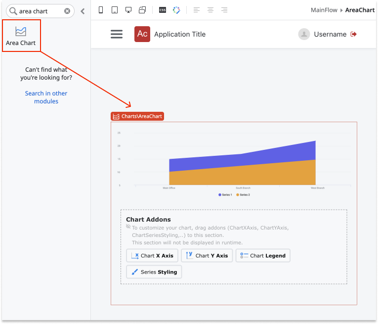
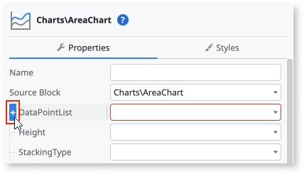
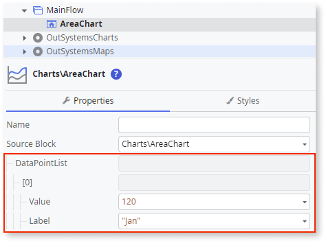
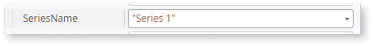
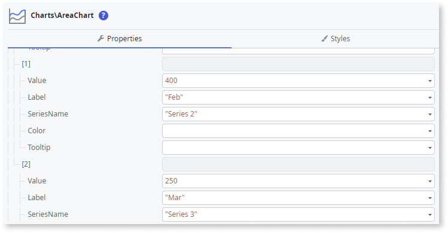
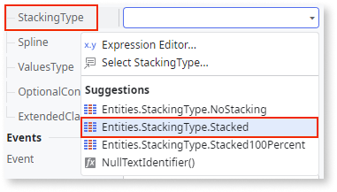
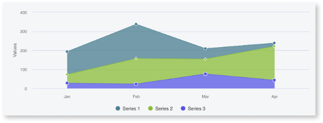

---
tags:
summary: Learn how to create a simple Area Chart with Staked Series in OutSystems.
locale: en-us
guid: BA3C3E2A-BFD3-454E-B527-00AAE44DEA8F
app_type: traditional web apps, mobile apps, reactive web apps
platform-version: o11
---

# Area Chart

This example shows how you can create a simple Area Chart with a Stacked Series.

1. From the Toolbox, drag the **Area Chart** widget to the Screen.

    

1. On the **Properties** tab, click **[+]** to expand the **DataPointList** property.

    

1. Click **+[0]** and set the **Label** and **Value** properties using [fixed data](chart-data-v2.md#populate-your-chart-with-fixed-data) or [variable data](chart-data-v2.md#populate-your-chart-with-variable-data). 

    This example uses fixed data. These properties define the first data point. Each data point corresponds to a point on the area chart. 

    

1. Set the **SeriesName** property.

    

1. To add more data points, repeat steps 2 and 3.

    

1. To enable the Stacked Series, set the **StackingType** property to **Entities.StackingType.Stacked**.

    

After following these steps, you can publish your module:

