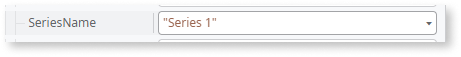
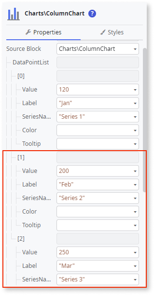

# Column Chart

This example shows how to create a simple Column Chart with data labels.

1. From the Toolbox, drag the **Column Chart** widget to the Screen.

    

1. On the **Properties** tab, click **[+]** to expand the **DataPointList** property.

    

1. Click **+[0]** and set the **Label** and **Value** properties using [fixed data](chart-data-v2.md#populate-your-chart-with-fixed-data) or [variable data](chart-data-v2.md#populate-your-chart-with-variable-data).

    This example uses fixed data. These properties define the first data point. Each data point corresponds to a point on the column chart.

    

1. Set the **SeriesName** property.

    

1. To add more data points, repeat steps 2 and 3.

    

1. To show the values of each data point, click on the **SeriesStyling** in the **AddOns** placeholder, and on the **Properties** tab, set the **ShowDataPointValues** property to **True**.

    Since the **SeriesName** property was not set, this property will be applied to all series.

    

After following these steps, you can publish your module:

