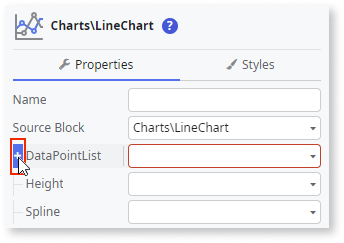
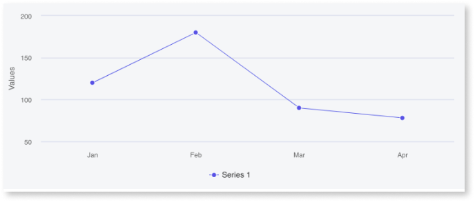
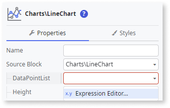
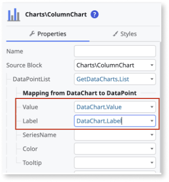
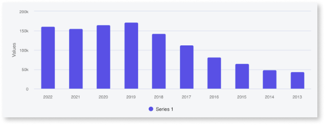
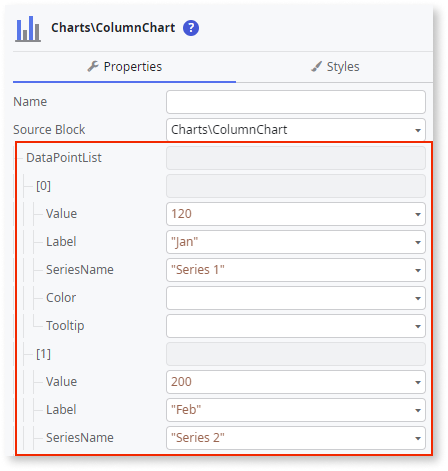
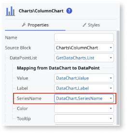
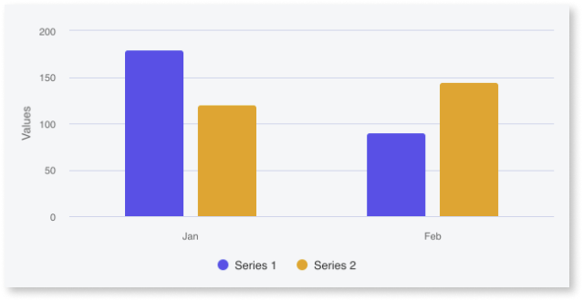

---
tags:
summary: Learn how to populate your charts with fixed and variable data.
locale: en-us
guid: 5891D247-9954-4FF7-A2EB-2888EC827A54
app_type: traditional web apps, mobile apps, reactive web apps
platform-version: o11
---

# Data

Learn how to populate your chart with data. To add data to your chart you must input **DataPoint** labels and values for the **DataPointList** property.

There are two different ways to add data to the **DataPointList** property: **Fixed data** and **Variable data**.

## Populate your chart with fixed data{#populate-your-chart-with-fixed-data} 

1. From the Toolbox, drag a Chart to the Screen. 

    This example uses the Line Chart.

    

1. On the **Properties** tab, click **[+]** to expand the **DataPointList** property.  

    

1. To create a list with one data point, click **+[0]** and set the **Label** and **Value** properties.
    
    These properties define the first data point of the chart. Each data point corresponds to a point on the chart. Optionally, you can also set the **SeriesName**, **Tooltip**, and **Color** for the data points.

    

1. To add more data points, repeat steps 2 and 3.

After following these steps, you can publish your module.

## Populate your chart with variable data{#populate-your-chart-with-variable-data} 

Before you start, make sure you have a List of data points to use in your chart. Each data point must include a label and a numerical value.

1. From the Toolbox, drag a Chart to the Screen.

    This example uses the Column Chart.

    

1. On the **Properties** tab, set the **DataPointList** property to a List containing the data points for the chart.

    

1. Map the **Value** and the **Label** of the **DataPointList** to the attributes from the List containing the data points for the chart.

    Optionally, you can also set **DataSeriesName**, **Tooltip**, and **Color** for the data points.

    

After following these steps, you can publish your module. 

## Create a chart with multiple series

To create a Chart with multiple series, follow one of the previous procedures and set the **SeriesName** property for the data points.

After following these steps, you can publish your module. 

