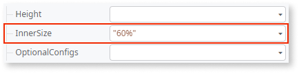

---
tags:
summary: Learn how to create a Donut Chart in OutSystems 11 (O11) using the Donut Chart widget and customizing data points and chart properties.
locale: en-us
guid: 728922B7-1DEF-4E55-AB59-7641DAA85C21
app_type: traditional web apps, mobile apps, reactive web apps
platform-version: o11
figma: https://www.figma.com/file/eFWRZ0nZhm5J5ibmKMak49/Reference?node-id=2538:4910
---

# Donut Chart

This example shows how you can create a simple Donut Chart.

1. From the Toolbox, drag the **Donut Chart** widget to the Screen.

    

1. On the **Properties** tab, click **[+]** to expand the **DataPointList** property.

    

1. Click **+[0]** and set the **Label** and **Value** properties using [fixed data](chart-data-v2.md#populate-your-chart-with-fixed-data) or [variable data](chart-data-v2.md#populate-your-chart-with-variable-data). 

    This example uses fixed data. These properties define the first data point. Each data point corresponds to a slice on the donut chart. 

    

1. To add more data points, repeat steps 2 and 3.
    
    

1. To customize the inner size of the Donut Chart, set the value of the **InnerSize** property. 

    In this example, the **InnerSize** property is set to 60% (by default, the **InnerSize** property is 50%).

    

After following these steps, you can publish your module:

