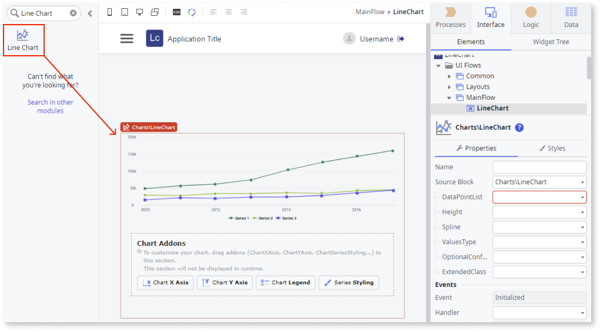

# Line Chart

This example shows how you can create a simple Line Chart with a Spline line and custom markers.

1. From the Toolbox, drag the **Line Chart** widget to the Screen.

    

1. On the **Properties** tab, click **[+]** to expand the **DataPointList** property.

    

1. Click **+[0]** and set the **Label** and **Value** properties using [fixed data](chart-data-v2.md#populate-your-chart-with-fixed-data) or [variable data](chart-data-v2.md#populate-your-chart-with-variable-data). 

    This example uses fixed data. These properties define the first data point. Each data point corresponds to a point on the line chart. 

    

1. Set the **SeriesName** property.

    

1. To add more data points, repeat steps 2 and 3.

    

1. To enable the Spline Line, set the **Spline** property to **True**.

    

1. To customize a Series, click on the **SeriesStyling** in the **AddOns** placeholder, and on the **Properties** tab, set the **SeriesName** property to the Series you want to customize (in this case, **Series 1**).

    

1. Expand the **Marker** property and set the extra configurations to customize the marker.

    

After following these steps, you can publish your module:

