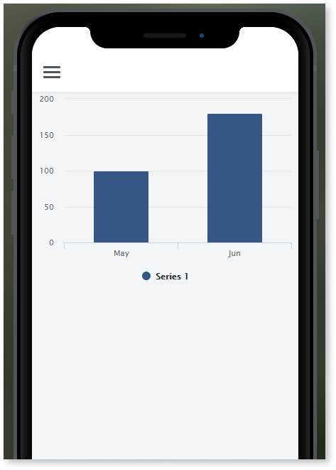
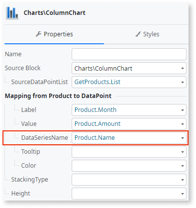
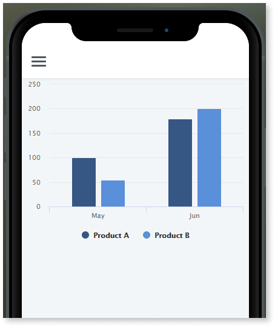

---
tags:
summary: Explore how to create column and bar charts in OutSystems 11 (O11) using fixed or variable data points and multiple series.
locale: en-us
guid: 7115204b-9a1e-42f8-87f8-d1d771608667
app_type: traditional web apps, mobile apps, reactive web apps
platform-version: o11
figma: https://www.figma.com/file/eFWRZ0nZhm5J5ibmKMak49/Reference?node-id=609:478
---
# Create Column and Bar Charts

Learn how to create a simple Column or Bar chart in OutSystems.
If you are creating your first chart, start with [a Column Chart with a fixed number of columns](#create-a-column-or-bar-chart-with-a-fixed-number-of-columns-or-bars)

## Create a Column or Bar Chart with a fixed number of columns or bars

1. Drag a **Column Chart** or **Bar Chart** from the Toolbox to the Screen.

    

1. On the Property pane of the chart, click **+** to the left of **SourceDataPointList** to create a list with one data point.

    

    Each data point corresponds to one column or bar of the chart.

1. Click **+** to the left of data point **\[0\]** and set the **Label** and **Value** properties to define the first data point. 
  
    
    

    Optionally, you can also set **DataSeriesName**, **Tooltip** and **Color** for the [data points](../auto/charts-api.final.md#Structure_DataPoint).

1. To add another data point, repeat steps **.2** and **.3**.

    

After publishing your module you can check your chart by opening the screen in browser or device:

## Create a Column or Bar Chart with a variable number of columns or bars

Before you start, make sure your List of data points is ready to be used in your chart: each data point must include a label and a numerical value.

To create a Column or Bar Chart with a variable number of columns or bars follow these steps:

1. Drag a **Column Chart** or **Bar Chart** from the Toolbox to the Screen.

    
    
1. On the Property pane of the chart, set the **SourceDataPointList** property to a List containing the data points for the chart.

    

1. Map the **Label** and **Value** of the **SourceDataPointList** to the correct Attributes from the List containing the data points for the chart.

    
    
    Optionally, you can also set **DataSeriesName**, **Tooltip** and **Color** for the [data points](../auto/charts-api.final.md#Structure_DataPoint).

After publishing your module you can check your chart by opening the screen in browser or device.

## Create a Column or Bar Chart with multiple series

To create a Column or Bar Chart with multiple series follow one of the previous procedures and set the **DataSeriesName** property for the data points.

After publishing your module you can check your chart by opening the screen in browser or device:

