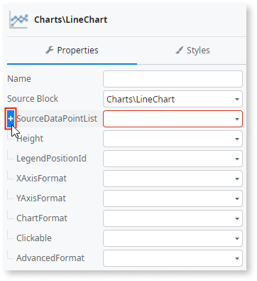
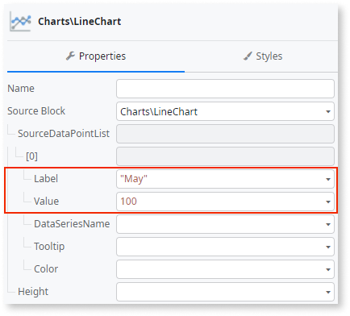
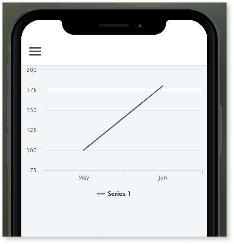
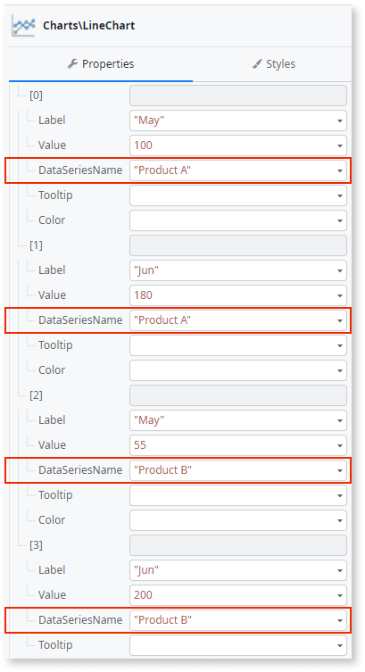

# Create Line and Area Charts

Learn how to create a simple Line or Area chart in OutSystems.  
If you are creating your first chart, start with [a Line Chart with a fixed number of data points](#create-a-line-or-area-chart-with-a-fixed-number-of-data-points)

## Create a Line or Area Chart with a fixed number of data points

1. Drag a **Line Chart** or **Area Chart** from the Toolbox to the Screen.

    

1. On the Property pane of the chart, click **+** to the left of **SourceDataPointList** to create a list with one data point.

    

1. Click **+** to the left of data point **\[0\]** and set the **Label** and **Value** properties to define the first data point. 
  
    
    

    Optionally, you can also set **DataSeriesName**, **Tooltip** and **Color** for the [data points](../auto/charts-api.final.md#Structure_DataPoint).

1. To add another data point, repeat steps **2** and **3**.

    

After publishing your module you can check your chart by opening the screen in browser or device:

## Create a Line or Area Chart with a variable number of data points

Before you start, make sure your list of data points is ready to be used in your chart. In the example below, an entity has been created that includes rows for a label and a numerical value.

To create a Line or Area Chart with a variable number of data points follow these steps:

1. Drag a **Line Chart** or **Area Chart** from the Toolbox to the Screen.

    
    
1. On the Property pane of the chart, set the **SourceDataPointList** property to a List containing the data points for the chart.

    

1. Map the **Label** and **Value** of the **SourceDataPointList** to the correct Attributes from the List containing the data points for the chart.

    
    
    Optionally, you can also set **DataSeriesName**, **Tooltip** and **Color** for the [data points](../auto/charts-api.final.md#Structure_DataPoint).

After publishing your module you can check your chart by opening the screen in browser or device.

## Create a Line or Area Chart with multiple series

To create a Line or Area Chart with multiple series follow one of the previous procedures and set the **DataSeriesName** property for the data points.

After publishing your module you can check your chart by opening the screen in browser or device:

