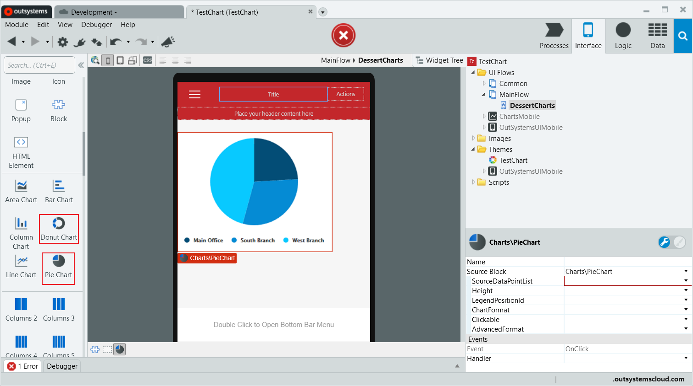
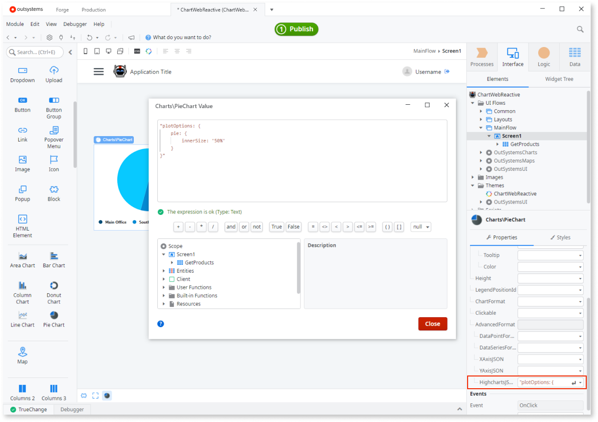

---
tags:
summary: Learn how to create a simple Pie or Donut chart in OutSystems.
locale: en-us
guid: a5d2d3bd-c18c-4828-b099-a0ce4980fe1e
app_type: traditional web apps, mobile apps, reactive web apps
---
# Create Pie and Donut Charts

Learn how to create a simple Pie or Donut chart in OutSystems.  
If you are creating your first chart, start with [a Pie Chart with a fixed number of slices](#create-a-pie-chart-with-a-fixed-number-of-slices).

## Create a Pie or Donut Chart with a fixed number of slices

To create a Pie or Donut Chart with a fixed number of slices follow these steps:

1. In **Mobile** applications, drag a **Pie Chart** or **Donut Chart** from the Toolbox to the Screen.  
    In **Web** applications, drag a **Pie Chart** from the Toolbox to the Screen, even if you want to create a Donut Chart. At the end of the procedure [Convert the Pie Chart to a Donut Chart in a Web application](#convert-a-pie-chart-to-a-donut-chart-in-a-web-application)

    

1. On the properties of the chart, click **+** to the left of **SourceDataPointList** to create a list with one data point.

    

    Each data point corresponds to one slice of the pie or donut chart.

1. Click **+** to the left of data point **\[0\]** and set the **Label** and **Value** properties of the data point.
  
    
    

    Optionally, you can also set a **Tooltip** and a **Color** for the [data point](../auto/charts-api.final.md#Structure_DataPoint).  
    Tip: These properties can be set to values that change at runtime, like an Attribute from the List of an Aggregate.

1. To add another data point, repeat steps **2.** and **3.**.

    

After publishing your module you can check your chart by opening the screen in browser or device:

## Create a Pie or Donut Chart with a variable number of slices

Before you start, make sure your List of data points is ready to be used in your chart: each data point must include a label and a numerical value.

To create a Pie or Donut Chart with a variable number of slices follow these steps:

1. In **Mobile** applications, drag a **Pie Chart** or **Donut Chart** from the Toolbox to the Screen.  
    In **Web** applications, drag a **Pie Chart** from the Toolbox to the Screen, even if you want to create a Donut Chart. At the end of the procedure [Convert the Pie Chart to a Donut Chart in a Web application](#convert-a-pie-chart-to-a-donut-chart-in-a-web-application)

    
    
1. On the properties of the chart, set the **SourceDataPointList** to a List containing the data points for the chart.

    

1. Map the **Label** and **Value** of the **SourceDataPointList** to the correct Attributes from the List containing the data points for the chart.

    

After publishing your module you can check your chart by opening the screen in browser or device.

## Convert a Pie Chart to a Donut Chart in a Web application

To convert a Pie Cart to a Donut Chart in a Web application:

* On the properties of the Pie Chart, click the **+** to the left of **AdvancedFormat** and add the following JSON snippet to the **HighChartsJSON** property:

        "plotOptions: {
            pie: {
                innerSize: '50%'
            }
        }"

    

After publishing your module you can check your chart by opening the screen in browser or device.
