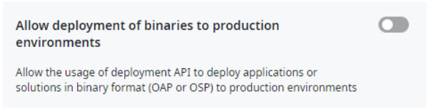

# Publish an app across infrastructures using the LifeTime API

With built-in download and publish capabilities, you can easily move app or solution files from your source environment to your target environment, even across different infrastructures. This facilitates continuous deployment at scale and strengthens governance within the Center of Excellence (CoE).

<div class="info" markdown="1">

To publish an app across infrastructures using the LifeTime API you need LifeTime version 11.22.0, or higher.

</div>

Follow the API calls outlined below:

1. Get the binary file from the source environment
    * [ Get the binary file (.oap) for an app](#get-the-binary-file-oap-from-the-source-environment)
        1. Get the `source environment key` (only necessary if you still need to get this information).
        1. Get the `application key` (only necessary if you still need to get this information).
        1. Request the link to download the binary file.
        1. Download the requested application's binary file (.oap).
    * [Get the binary file (.osp) for a solution](#get-the-binary-file-osp-for-a-solution)
        1. Get the `source environment key`(only necessary if you still need to get this information).
        1. Get the list of application keys (only necessary if you still need to get this information).
        1. Create a solution with the list of application keys.
        1. Get the status of the solution package.
        1. Request the link to download the binary file.
        1. Download the requested solution's binary file (.osp).
1. [Publish the binary file to your target environment within a different infrastructure.](#publish-the-binary-file-to-your-target-environment-within-a-different-infrastructure)
    1. Get the `target environment key` (only necessary if you still need to get this information).
    1. Create a new deployment with a binary file.
    1. Get the created deployment details` and check its state.
    1. Start the created deployment.
    1. Get the deployment execution status to know when the execution finishes. A terminal deployment status is one of the following - needs_user_intervention, aborted, finished_successful, finished_with_warnings, finished_with_errors.

#### Important notes

For the use-case of publishing apps from one infrastructure to another, consider the following:

* The target environment must be registered in a LifeTime. Scenarios with stand-alone (without a LifeTime) environments are not supported.
* The modules of apps being published must be free of Intelectual Property Protection (IPP). Modules that are IPP protected will fail to publish in the target infrastructure.
* Deployments created through this API do not perform impact analyses. Executing such deployment plans is similar to a solution published directly through the Service Center.
* Deployment plans created via the LifeTime API will be shown in the LifeTime interface as read-only.
* While publishing apps directly to production environments is possible, this option is disabled by default. This scenario can be enabled by changing the following setting, which can be found on [LifeTime settings.](https://hostname/lifetime/Settings.aspx)



The following are example API calls (requests and responses) for each step.

## Get the binary file (.oap) from the source environment

### Get the source environment key

Start by calling the API method that returns all the available environments on the infrastructure to determine the source environment key (this step is only necessary if  you don't have this information already).

Request: `GET /lifetimeapi/rest/v2/environments/`

Response body:

```javascript
[
    {
        "Key": "f3582e43-43c7-4bb4-8cbb-d9f6cbcbd35e",
        "Name": "Development",
        "OSVersion": "11.26.0",
        "Order": 0,
        "HostName": "dev-env.company.com",
        "UseHTTPS": true,
        "EnvironmentType": "Development",
        "NumberOfFrontEnds": 1,
        "ApplicationServerType": ".NET",
        "ApplicationServer": "IIS",
        "DatabaseProvider": "SQLServer",
        "IsCloudEnvironment": false
    },
    {
        "Key": "849515f2-b4ff-4aca-a9d6-9407bea655f4",
        "Name": "Production",
        "OSVersion": "11.26.0",
        "Order": 1,
        "HostName": "prd-env-1.company.com",
        "UseHTTPS": true,
        "EnvironmentType": "Production",
        "NumberOfFrontEnds": 1,
        "ApplicationServerType": ".NET",
        "ApplicationServer": "IIS",
        "DatabaseProvider": "SQLServer",
        "IsCloudEnvironment": false
    }
]
```

### Get the application key

Call the API method that returns all the available apps in the environment to find the application key:

Request: `GET /lifetimeapi/rest/v2/environments/{EnvironmentKey}/applications/`

After replacing the `{EnvironmentKey}` placeholder with the correct key, you get the following final URL:

Request: `GET /lifetimeapi/rest/v2/environments/f3582e43-43c7-4bb4-8cbb-d9f6cbcbd35e/applications/`

Response body:

```javascript
[
    {...},
    {
        "Key": "8c9101e2-5ed7-4f20-96a0-e23b435be4d1",
        "Name": "Google Maps Web",
        "Kind": "WebResponsive",
        "Team": "",
        "Description": "Google Maps Web is a Google Maps Javascript V3 API component for Traditional Web apps, providing Web Blocks and Actions to add interactive maps, markers and directions, along with event driven functionality.",
        "URLPath": "/",
        "IconHash": "IconHashe8d7b76d-6b91-11a5-3b8f-b78c356a7271",
        "IconURL": "/LifeTimeSDK/ApplicationIcon.aspx?ApplicationKey=8c9101e2-5ed7-4f20-96a0-e23b435be4d1",
        "IsSystem": false,
        "AppStatusInEnvs": []
    },
    {...}
]
```
Please note that the app modules must not be IPP protected. IPP protected modules will fail to publish successfully when targeting an environment of a different infrastructure.

### Request the link to download the app’s binary file 

Call the API method that returns the link to download the app's binary (.oap file).

Request: `GET /lifetimeapi/rest/v2/environments/{EnvironmentKey}/applications/{ApplicationKey}/content`

After replacing the `{EnvironmentKey}` and `{ApplicationKey}` placeholders with the correct keys, you get the following final URL:

Request: `GET /lifetimeapi/rest/v2/environments/f3582e43-43c7-4bb4-8cbb-d9f6cbcbd35e/applications/8c9101e2-5ed7-4f20-96a0-e23b435be4d1/content`

Response body:

```javascript
{
    "url": "https://lt-env.company.net/lifetimeapi/rest/v2/downloads/0933c71c-5759-4d7e-8ae0-148e23c82462",
    "expires": "2024-06-02T17:31:16Z"
}
```

### Download the binary file (.oap)

Using the URL from the last request, you can get the binary file you'll deploy to the target infrastructure.

## Get the binary file (.osp) for a solution

### Get the source environment key

Start by calling the API method that returns all the available environments on the infrastructure to determine the source environment key (this step is only necessary if  you don't have this information already).

Request: `GET /lifetimeapi/rest/v2/environments/`

Response body:

```javascript
[
    {
        "Key": "f3582e43-43c7-4bb4-8cbb-d9f6cbcbd35e",
        "Name": "Development",
        "OSVersion": "11.26.0",
        "Order": 0,
        "HostName": "dev-env.example.com",
        "UseHTTPS": true,
        "EnvironmentType": "Development",
        "NumberOfFrontEnds": 1,
        "ApplicationServerType": ".NET",
        "ApplicationServer": "IIS",
        "DatabaseProvider": "SQLServer",
        "IsCloudEnvironment": false
    },
    {
        "Key": "849515f2-b4ff-4aca-a9d6-9407bea655f4",
        "Name": "Production",
        "OSVersion": "11.26.0",
        "Order": 1,
        "HostName": "prd-env-1.example.com",
        "UseHTTPS": true,
        "EnvironmentType": "Production",
        "NumberOfFrontEnds": 1,
        "ApplicationServerType": ".NET",
        "ApplicationServer": "IIS",
        "DatabaseProvider": "SQLServer",
        "IsCloudEnvironment": false
    }
]
```

### Get the list of application keys

Call the API method that returns all the available apps in the environment to find the application keys:

Request: `GET /lifetimeapi/rest/v2/environments/{EnvironmentKey}/applications/`

After replacing the `{EnvironmentKey}` placeholder with the correct key, you  get the following final URL:

Request: `GET /lifetimeapi/rest/v2/environments/f3582e43-43c7-4bb4-8cbb-d9f6cbcbd35e/applications/`

Response body:

```javascript
[
    {...},
    {
        "Key": "8c9101e2-5ed7-4f20-96a0-e23b435be4d1",
        "Name": "Google Maps Web",
        "Kind": "WebResponsive",
        "Team": "",
        "Description": "Google Maps Web is a Google Maps Javascript V3 API component for Traditional Web apps, providing Web Blocks and Actions to add interactive maps, markers and directions, along with event driven functionality.",
        "URLPath": "/",
        "IconHash": "IconHashe8d7b76d-6b91-11a5-3b8f-b78c356a7271",
        "IconURL": "/LifeTimeSDK/ApplicationIcon.aspx?ApplicationKey=8c9101e2-5ed7-4f20-96a0-e23b435be4d1",
        "IsSystem": false,
        "AppStatusInEnvs": []
    },
    {...}
]
```

Please note that the app modules must not be IPP protected. IPP protected modules will fail to publish successfully when targeting an environment of a different infrastructure.

### Create a solution with the list of application keys

Call the API method that creates a solution with a list of apps:

Request: `POST /lifetimeapi/rest/v2/environments/{EnvironmentKey}/solution`

After replacing the `{EnvironmentKey}` placeholder with the correct key, you get the following final URL:

Request: `POST /lifetimeapi/rest/v2/environments/f3582e43-43c7-4bb4-8cbb-d9f6cbcbd35e/solution`

Request body:

```javascript
{
    "SolutionName": "TestSolution",
    "ApplicationKeys": [
        "a1467f95-1634-41a9-85e1-1ea777a23ae7",
        "05306b6c-743a-4b38-b2ab-ea76cee3ca77",
        "9deec899-41b7-40a1-9e0c-d6055a87653a"
    ],
    "IncludeReferences": "True"
}
```

If the operation is successful, the response body contains the solution key. 

Response body: `Ae1ef38a-f4cf-47be-b1c3-5df4417a1b94`

### Get the status of the solution package

Call the API method that returns the status of the solution package:

Request: `GET /lifetimeapi/rest/v2/environments/{EnvironmentKey}/solutionstatus/{SolutionKey}`

After replacing the `{EnvironmentKey}` and `{SolutionKey}` placeholders with the correct keys, you get the following final URL:

Request: `GET /lifetimeapi/rest/v2/environments/f3582e43-43c7-4bb4-8cbb-d9f6cbcbd35e/solutionstatus/Ae1ef38a-f4cf-47be-b1c3-5df4417a1b94`

If the operation is successful, the response body contains the actual status of the solution and the status reason (when the solution status is aborted), which can be:
- Gathering Dependencies: The process is calculating all the dependencies for the solution.
- Getting Binaries: The process is getting the binaries for each module included in the solution.
- Generating Meta Model: Building the solution package manifest.
- Generating Solution: Creating the solution file.
- Completed: This is the final step. It indicates that the solution is completed and is ready for download.
- Aborted: This is a final step. It indicates that there was a problem generating the solution.


Response body:

```javascript
{
    "Status": "Completed",
    "StatusReason": ""
}
```

### Request the link to download the solution’s binary file 

Call the API method that returns the link to download the solution's binary (.osp file).

Request: `GET /lifetimeapi/rest/v2/environments/{EnvironmentKey}/solution/{SolutionKey}`

After replacing the `{EnvironmentKey}` and `{SolutionKey}` placeholders with the correct keys, you get the following final URL:

Request: `GET /lifetimeapi/rest/v2/environments/f3582e43-43c7-4bb4-8cbb-d9f6cbcbd35e/solution/Ae1ef38a-f4cf-47be-b1c3-5df4417a1b94`

If the status of the solution is different from Completed, it will return a 400 HTTP Status Code.

Response body:

```javascript
{
    "url": "https://lt-env.company.net/lifetimeapi/rest/v2/downloads/ec455658-b80d-4602-a6be-0fe1de1772ef",
    "expires": "2024-06-02T17:31:16Z"
}
```

### Download the binary file (.osp)

Using the URL obtained from the last request, you can get the binary file that you'll deploy to the target infrastructure.

## Publish the binary file to your target environment within a different infrastructure

### Get the target environment key

Call the API method that returns all the available environments on the infrastructure to determine the target environment key (this step is only necessary if  you don't have this information already).

### Create deployment with a binary file

Invoke the API method to create a new deployment. You must provide the target environment key as well as the binary file of the app/solution that you want to deploy in the request body. The file must be an OAP (OutSystems Application Package) or and OSP (OutSystem Solution Package) file.

`POST /lifetimeapi/rest/v2/environments/{EnvironmentKey}/deployment/`

After replacing the `{EnvironmentKey}` placeholder with the correct key, you get the following final URL:

Request: `POST /lifetimeapi/rest/v2/environments/7709a06f-e76f-4a88-b008-c72e77878a5c/deployment/`

The request `body` must have the `binary content` in binary.

If the operation is successful, the response body contains the deployment key of the new deployment.

Response body: `16e9ad8a-9afa-46f8-8e3d-34f3b3e6d2cd`

### Get deployment details and check its state

Invoke the API method to get more detail about the created deployment, checking if OutSystems detected any conflicts: `GET /lifetimeapi/rest/v2/deployments/{DeploymentKey}/`

After replacing the `{DeploymentKey}` placeholder with the correct key, you get the following final URL:

Request: `GET /lifetimeapi/rest/v2/deployments/16e9ad8a-9afa-46f8-8e3d-34f3b3e6d2cd/`

Response body:

```javascript
{
    "Deployment": {
        "Key": "16e9ad8a-9afa-46f8-8e3d-34f3b3e6d2cd",
        "SourceEnvironmentKey": "",
        "TargetEnvironmentKey": "7709a06f-e76f-4a88-b008-c72e77878a5c",
        "Notes": "",
        "CreatedOn": "2024-03-05T10:25:23Z",
        "CreatedBy": "LT API Account",
        "CreatedByUsername": "lt_api_account",
        "SavedOn": "2024-03-05T10:25:23Z",
        "SavedBy": "LT API Account",
        "SavedByUsername": "lt_api_account",
        "StartedOn": "1900-01-01T00:00:00",
        "StartedBy": "",
        "StartedByUsername": "",
        "AbortedOn": "1900-01-01T00:00:00",
        "AbortedBy": "",
        "AbortedByUsername": "",
        "ApplicationOperations": []
    },
    "ApplicationsToDeploy": [
        {
            "ApplicationKey": "8c9101e2-5ed7-4f20-96a0-e23b435be4d1",
            "ApplicationName": "Google Maps Web",
            "IsNew": true
        }
    ],
    "ApplicationsToRedeploy": [],
    "ApplicationConflicts": [],
    "ModulesToDelete": []
}
```

### Start the created deployment

Start the deployment execution by calling the following API method using  the start command:

`POST /lifetimeapi/rest/v2/deployments/{DeploymentKey}/{Command}/`

Adapting the template above to our example:

Request: `POST /lifetimeapi/rest/v2/deployments/16e9ad8a-9afa-46f8-8e3d-34f3b3e6d2cd/start/`

If the start command is successful, OutSystems  returns a 202 Accepted HTTP status code, with an empty response body.

### Check deployment execution status

Use the following API method to determine the execution status of the previously issued start command:

`GET /lifetimeapi/rest/v2/deployments/{DeploymentKey}/status/`

Adapting the template above to our example:

`GET /lifetimeapi/rest/v2/deployments/16e9ad8a-9afa-46f8-8e3d-34f3b3e6d2cd/status/`

Response body:

```javascript
{
    "DeploymentStatus": "finished_successful",
    "Info": "",
    "DeploymentLog": [
        {
            "Instant": "2024-04-05T10:30:27.177Z",
            "Message": "Uploaded solution pack file from disk"
        },
        {
            "Instant": "2024-04-05T10:30:30.197Z",
            "Message": "Applying Deployment Zones configurations in Development Environment"
        },
        {...},
        {
            "Instant": "2024-04-05T10:31:14.4Z",
            "Message": "Synchronizing data with 'Development' environment."
        },
        {
            "Instant": "2024-04-05T10:31:19Z",
            "Message": "Deploy completed"
        }
    ]
}

```

When the deployment status is `finished_successful`, you know that the app deployment has finished successfully.

If you get an intermediate deployment status, such as `running` in the response, you must keep polling the status of the deployment execution (by repeating the API method call) until the execution reaches a terminal deployment status, either a successful or an unsuccessful one.
