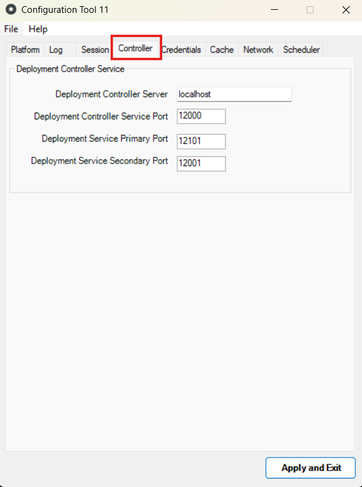

# Controller tab

In the **Controller** tab you define how front-end servers and the deployment controller server communicate.

| Configuration | Description | Default value |
| -------------- | -------------- | --------------- |
| Deployment Controller Server | The hostname or IP address of the deployment controller server. | `localhost` |
| Deployment Controller Service Port | Port used by the Deployment Controller Service, in the Deployment Controller Server. | `12000` |
| Deployment Service Primary Port | Primary port used by the Deployment Service, in the Front-end Servers. | `12101` |
| Deployment Service Secondary Port | Secondary port used by the Deployment Service, in the Front-end Servers. | `12001` |
