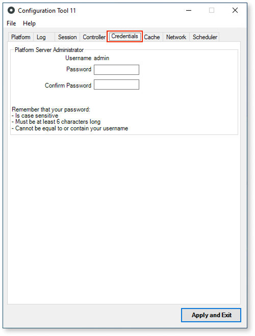

# Credentials tab

The **Credentials** tab allows you to define or reset the password of the Platform Server admin user.

## Platform server administrator section

Define the password for the admin user of Platform Server in the **Password** and **Confirm Password** fields.

The values of the two fields must match and they must fulfill the password rules outlined in Configuration Tool's user interface.

After pressing **Apply and Exit**, the Configuration Tool updates the password in the database.
