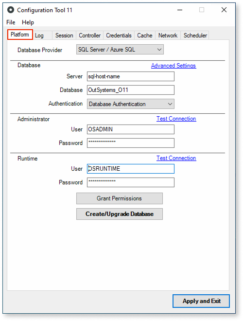

# Platform tab

The **Platform** tab allows you to configure the database used by the platform. It includes configurations for the database, users, and timeouts.

Set the **Database Provider** property with the database you wish to use for OutSystems installation.

