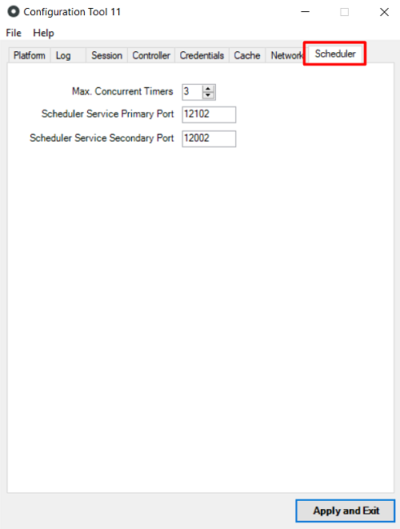

# Scheduler tab

The **Scheduler** tab allows you to configure the OutSystems Scheduler Service.

Configuration | Description | Default value  
---|---|---  
Max. Concurrent Timers | Maximum number of Timers (asynchronous jobs) that can be executed at the same time in each Front-end Server. | `3`  
Scheduler Service Primary Port | The primary port the scheduler service listens to. | `12102`
Scheduler Service Secondary Port | The secondary port the scheduler service listens to. | `12002`
